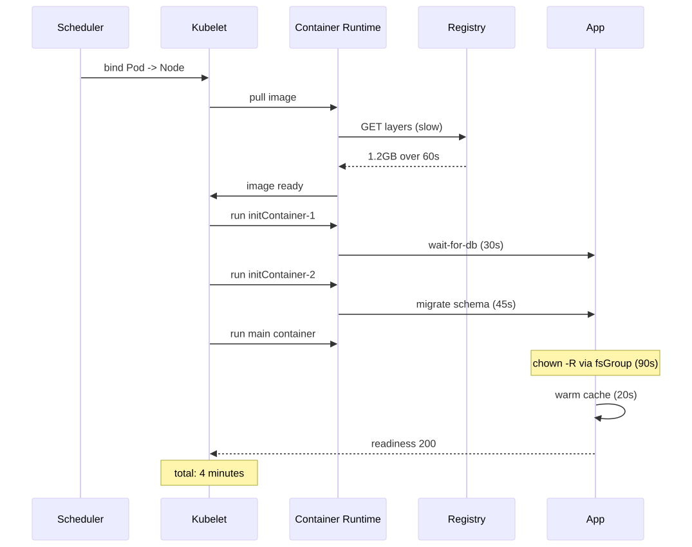
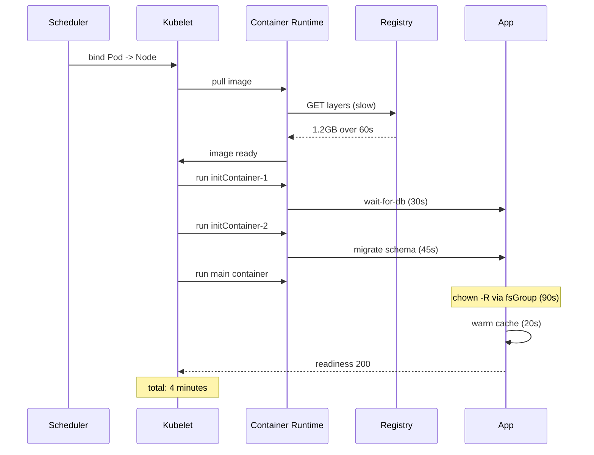

# Slow Pod Startup

> **Symptom**
> Pod takes 90+ seconds to reach `Ready`, blocking deploys, scale-outs, and rollouts. Sometimes minutes. Sometimes the deploy controller declares it `ProgressDeadlineExceeded`.

Pod startup is a 4-stage relay: **schedule → image pull → init containers → main container ready**. Slowness in any stage compounds.

---

## Reproduce

```bash
kubectl run slow --image=nginx:latest --image-pull-policy=Always
# Trace start-to-ready
kubectl get pod slow -w --output-watch-events
# Time each phase
kubectl describe pod slow | grep -E 'Scheduled|Pulled|Created|Started|Ready'
```

The Events block reveals where the seconds went.

---

## Diagnose — 5 candidate root causes

### 1. Image pull is slow

```bash
kubectl describe pod <p> | grep -E 'Pulling|Pulled'
# "Pulled in 1m24s"
crictl images | grep <image>      # on the node
docker pull <image>               # time it manually
```

Causes: large image, cold node cache, slow registry, no `imagePullPolicy: IfNotPresent`, throttled by Docker Hub.

### 2. Init containers serialise

```bash
kubectl get pod <p> -o jsonpath='{.spec.initContainers[*].name}'
kubectl logs <p> -c <init-container>
```

Init containers run **strictly sequentially**. One slow init = main container blocked. Common offender: `wait-for-db` loop with 30s sleeps.

### 3. `securityContext` heavy file ops

```bash
kubectl get pod <p> -o yaml | grep -A5 securityContext
```

`fsGroup: 1000` triggers `chown -R` on every mounted volume. On a 10GB PVC with 10M files this can take **minutes**. Use `fsGroupChangePolicy: OnRootMismatch` (k8s 1.23+).

### 4. Slow scheduling

```bash
kubectl get events --field-selector reason=FailedScheduling
kubectl describe pod <p> | grep -A20 Events
```

No node fits → scheduler retries with backoff. Causes: nodeSelector/affinity too strict, taints, resource requests > any node, PVC zone mismatch.

### 5. Slow readiness probe

```bash
kubectl get pod <p> -o yaml | grep -A8 readinessProbe
```

`initialDelaySeconds: 60` literally adds 60s. Or app waits for warm cache, JIT compile, schema migrations.

---

## Resolve

| Cause | Fix |
|-------|-----|
| Slow image pull | Multi-stage builds, `distroless`, image registry cache (Harbor/ECR replication), `imagePullPolicy: IfNotPresent`, pre-pull via DaemonSet. |
| Init serialisation | Collapse inits, run dependency checks in main container with retry, parallelise where possible. |
| `fsGroup` chown | `fsGroupChangePolicy: OnRootMismatch`; or build the image with correct UIDs. |
| Slow scheduling | Reduce affinity strictness, fix taints, scale up node group, use Cluster Autoscaler. |
| Slow readiness | `startupProbe` decoupled from liveness; lower `initialDelaySeconds`; warm caches in background. |

### Image size example

```dockerfile
# BAD - 1.2GB
FROM node:20
COPY . .
RUN npm install
CMD ["node","server.js"]

# GOOD - 180MB, ~5x faster pull
FROM node:20-alpine AS build
COPY package*.json .
RUN npm ci --omit=dev
COPY . .

FROM gcr.io/distroless/nodejs20
COPY --from=build /node_modules /node_modules
COPY --from=build /app /app
CMD ["server.js"]
```

### startupProbe vs liveness

```yaml
startupProbe:
  httpGet: { path: /healthz, port: 8080 }
  failureThreshold: 30
  periodSeconds: 10        # 30 * 10s = 5 min budget
livenessProbe:
  httpGet: { path: /healthz, port: 8080 }
  periodSeconds: 10
  failureThreshold: 3      # only kicks in AFTER startupProbe succeeds
```

---

## Prevent

1. **Image budget < 250MB.** CI enforce.
2. **Pre-pull on node bootstrap.** DaemonSet pulls common base images at node-up.
3. **No init containers without timeout.** Bound them.
4. **Avoid `fsGroup` on large RWX volumes.** Use init container that chowns selectively.
5. **Track p95 pod-ready latency.** Alert > 60s.
6. **`progressDeadlineSeconds: 600` on Deployments.** Forces fail-fast.

---

## Failure-mode sequence

<!-- mermaid:rendered -->
<p align="center"></p>

<details><summary>Mermaid source</summary>



</details>

---

> [!IMPORTANT]
> **Common interview Qs**
> - "Pod takes 5 minutes to be ready. How do you find which phase is slow?"
> - "What does `fsGroup` actually do at pod start? Why is it slow?"
> - "Init containers — sequential or parallel?"
> - "Difference between `startupProbe` and `livenessProbe`?"
> - "Image pull is slow. Five things you can do."
> - "What is `progressDeadlineSeconds`?"
> - "Pod stuck in Pending. What do you check?"
