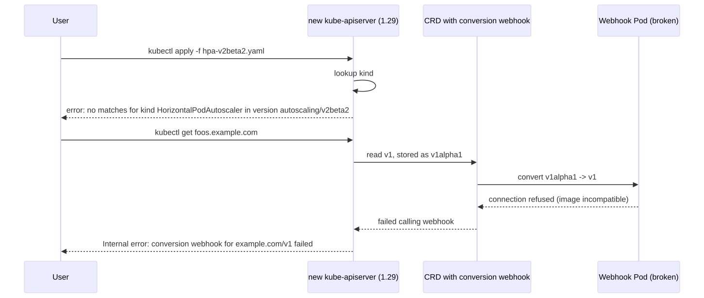
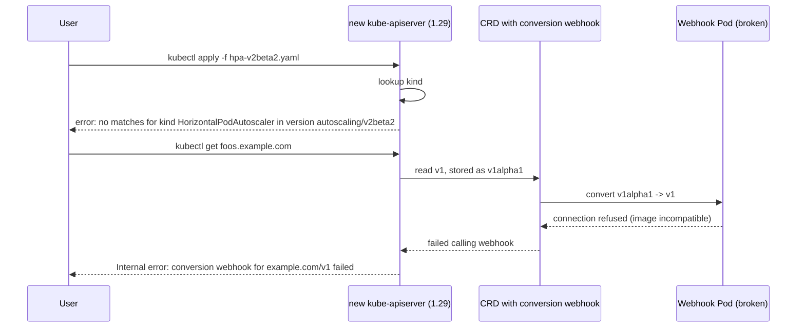

# Upgrade Broke Everything

> **Symptom**
> You upgraded the cluster from 1.27 → 1.29. Now: `kubectl get ingresses` returns `no matches for kind`. Half your operators crash with `unknown field` errors. A custom admission webhook silently strips fields it doesn't understand. Workloads that were green yesterday are red today.

Cluster upgrades are the **highest-blast-radius routine operation** you do. The breakages are almost always one of three classes: **version skew**, **deprecated APIs**, or **conversion webhooks**.

---

## Reproduce (lab)

```bash
# Create cluster on 1.27 with a v1beta1 resource that's removed in 1.29
kind create cluster --image kindest/node:v1.27.3
kubectl apply -f - <<EOF
apiVersion: policy/v1beta1
kind: PodSecurityPolicy
metadata: { name: legacy }
spec: { privileged: false }
EOF
# Now upgrade to 1.29 (PSP removed in 1.25)
# kubectl apply on the same manifest fails with no matches for kind
```

---

## Diagnose — 5 candidate root causes

### 1. Version skew policy violation

```bash
kubectl version --short
kubectl get nodes -o wide       # check kubelet versions
```

Supported skew (k8s docs):

| Component | Allowed skew vs API server |
|-----------|---------------------------|
| kube-apiserver (HA) | ±1 minor between instances |
| kubelet | up to 3 minors **older** (1.30) |
| kube-proxy | same as kubelet |
| controller-manager / scheduler | 1 minor older |
| kubectl | ±1 minor |

Skipping minors (1.27 → 1.29 directly on control plane) **violates skew** and breaks controllers.

### 2. Deprecated API removed

```bash
# Pluto: scan manifests for deprecated APIs
pluto detect-files -d ./manifests/

# Or live cluster:
kubectl get --raw /metrics | grep apiserver_requested_deprecated_apis
```

Common removals:
- `extensions/v1beta1 Ingress` → removed in 1.22
- `policy/v1beta1 PodSecurityPolicy` → removed in 1.25
- `autoscaling/v2beta2 HPA` → removed in 1.26
- `flowcontrol.apiserver.k8s.io/v1beta1` → removed in 1.29

After upgrade, manifests using removed APIs return `no matches for kind`. Existing resources may be auto-converted by storage migration; new applies fail.

### 3. Conversion webhook for CRDs is down

```bash
kubectl get crd -o json | jq '.items[] | select(.spec.conversion.strategy=="Webhook") | .metadata.name'
kubectl get apiservice | grep -i False
kubectl describe apiservice <name>
```

CRDs with multiple stored versions need a conversion webhook. If the webhook pod is broken (image incompatible with new k8s, RBAC changed), every read/write of that CRD returns `failed calling webhook`.

### 4. Operator/controller using deprecated client-go API

```bash
kubectl logs -n <ns> <operator-pod> | grep -E 'unknown field|the server could not find|no kind'
```

Operator was built against an older client-go. Newer API server changed a field name or removed an alpha feature. Operator crash-loops.

### 5. Admission webhook misbehaving on new resource shapes

```bash
kubectl get validatingwebhookconfiguration
kubectl get mutatingwebhookconfiguration
# any with old caBundle, deprecated admissionReviewVersions: [v1beta1]?
```

Webhooks declaring only `admissionReviewVersions: ["v1beta1"]` break in 1.22+ which only sends v1.

---

## Resolve

### Pre-upgrade

```bash
# 1. Audit deprecated APIs IN USE
pluto detect-helm
pluto detect-files -d ./manifests/

# 2. Check live API usage from metrics
kubectl get --raw /metrics \
  | grep apiserver_requested_deprecated_apis \
  | grep -v ' 0$'

# 3. Check operator compatibility matrix
helm list -A | xargs -L1 helm get metadata
# verify each chart supports target k8s version

# 4. Read the upstream changelog
# https://github.com/kubernetes/kubernetes/blob/master/CHANGELOG/CHANGELOG-1.29.md
```

### During upgrade

```bash
# kubeadm: one minor at a time. NEVER skip.
kubeadm upgrade plan
kubeadm upgrade apply v1.28.x

# Drain, upgrade kubelet on each node
kubectl drain <node> --ignore-daemonsets --delete-emptydir-data
apt-get install -y kubelet=1.28.x-00 kubectl=1.28.x-00
systemctl restart kubelet
kubectl uncordon <node>

# Then rinse, repeat for 1.29
```

### Post-upgrade

```bash
# Verify
kubectl get nodes -o wide                # all on new version
kubectl get apiservice                   # all True
kubectl get crd -o json | jq '.items[].status.storedVersions'

# Migrate any deprecated stored versions
kubectl get <resource> -A -o yaml | sed 's@apiVersion: extensions/v1beta1@apiVersion: networking.k8s.io/v1@' | kubectl apply -f -
```

### Emergency rollback

`kubeadm` does not officially support downgrade. Restore etcd from snapshot:

```bash
etcdctl snapshot restore /backup/etcd.snap --name cp1 \
  --initial-cluster cp1=https://10.0.0.1:2380 \
  --initial-advertise-peer-urls https://10.0.0.1:2380 \
  --data-dir /var/lib/etcd-restored
# Repoint etcd static pod to /var/lib/etcd-restored, restart
# Re-install kubelet/kubeadm to old version on all CP nodes
```

---

## Prevent

1. **Stage the upgrade.** dev → staging → prod, with at least 1 week soak.
2. **Pluto in CI.** Block PRs introducing deprecated APIs.
3. **Track deprecated API usage as a metric.** Alert if any client is still calling them, with the user-agent.
4. **One minor at a time.** No skipping. Even when AKS/EKS lets you.
5. **Pin operator versions to the cluster version.** Use compatibility matrices.
6. **PDBs everywhere** so node drain doesn't kill availability.
7. **Etcd backup IMMEDIATELY before upgrade.** Verify restore works in a test env.
8. **`storageVersionHash` migration job.** Re-write all CRD instances to current storage version before deprecating an old one.
9. **Read CHANGELOG-X.Y.md end to end.** Especially "Urgent Upgrade Notes."
10. **Test webhooks in a kind cluster on the target version** before promoting.

---

## Failure-mode sequence

<!-- mermaid:rendered -->
<p align="center"></p>

<details><summary>Mermaid source</summary>



</details>

---

> [!IMPORTANT]
> **Common interview Qs**
> - "What's the version skew policy between kubelet and API server?"
> - "Can you skip a minor when upgrading kubeadm clusters?"
> - "How do you find which clients are using deprecated APIs?"
> - "What is a conversion webhook? When do you need one?"
> - "How do you roll back a botched cluster upgrade?"
> - "Tool to scan manifests for deprecated APIs?" (Pluto)
> - "What removed in 1.22, 1.25, 1.26, 1.29?" (Ingress v1beta1, PSP, HPA v2beta2, FlowControl v1beta1)
> - "Order of upgrade: control plane or workers first?" (Control plane.)
> - "What does `storedVersions` on a CRD mean?"
