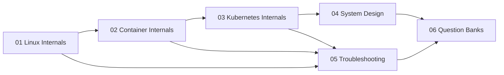

# 09 — Interview Prep (Senior DevOps / SRE / Platform Engineer)

> The "you must understand WHY, not just HOW" layer. Designed for FAANG-level platform / SRE / DevOps interviews.

## How to use this folder

1. **Foundations first** — Linux & container internals are the substrate. If you can't explain cgroups v2, you can't explain Kubernetes resource limits.
2. **Then Kubernetes internals** — once you know the substrate, the control-plane mechanics make sense.
3. **System design** — practice the 6-step framework on every problem; never start drawing boxes before clarifying requirements.
4. **Troubleshooting** — these are the "tell me about a time…" raw material. Memorize the diagnostic sequences.
5. **Question banks** — last 2 weeks before interview, drill these daily.

## Topic Map

## Folder Index

| # | Topic | What you learn |
|---|-------|----------------|
| 01 | Linux Internals | cgroups, namespaces, OOM, networking stack, systemd |
| 02 | Container Internals | runc/containerd, OCI, overlayfs, BuildKit, LSMs |
| 03 | Kubernetes Internals | control loop, scheduler, API server, etcd, CNI/CSI |
| 04 | System Design | 6 reference designs (PaaS, multi-region, secrets, observability, CI/CD, mesh) |
| 05 | Troubleshooting | 12 production-grade scenarios with diagnostic sessions |
| 06 | Questions Bank | 300+ Q&A across Linux/Docker/K8s/Helm/observability/security/Terraform/behavioral |

## Interview-day cheat rules

- **Always restate the question** before answering. Buys time and confirms scope.
- **Drive with mental models**, not memorized facts. Interviewers probe depth.
- **For "design X"** — clarify scope (functional + non-functional), then capacity, then API, then HLD, then deep dive, then tradeoffs.
- **For "debug X"** — narrate hypothesis tree, never just commands. "I'd suspect A or B; to differentiate I'd run …".
- **It's OK to say "I don't know, here's how I'd find out"** — that demonstrates seniority.

## Sources

- [kernel.org docs](https://www.kernel.org/doc/html/latest/)
- [Kubernetes blog](https://kubernetes.io/blog/)
- [etcd docs](https://etcd.io/docs/)
- [CNCF whitepapers](https://www.cncf.io/reports/)
- [Google SRE books](https://sre.google/books/)
