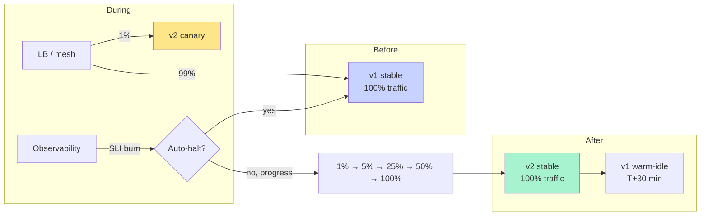
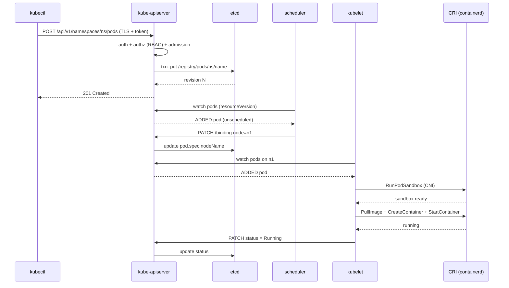
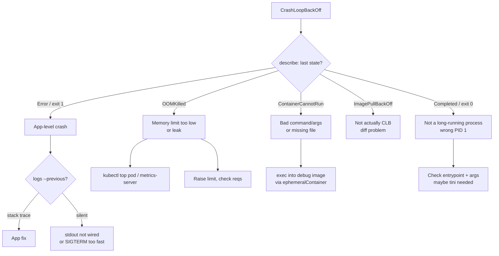
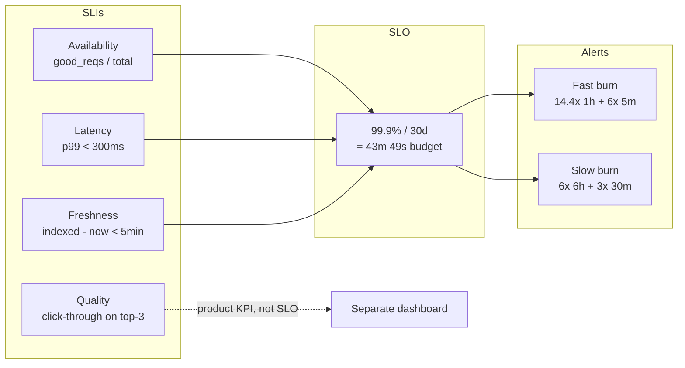
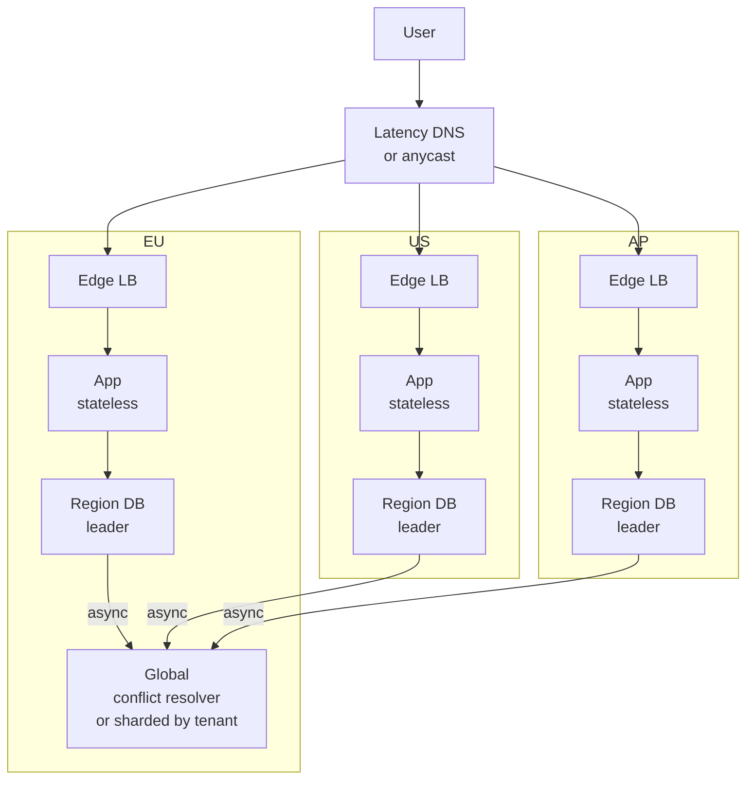
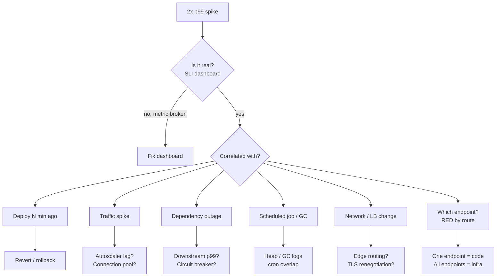
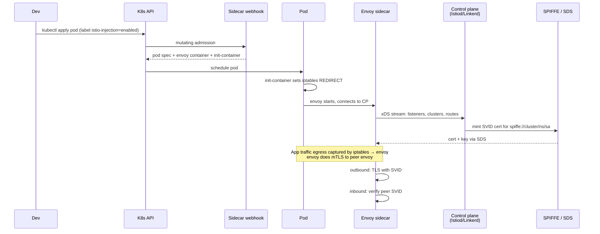
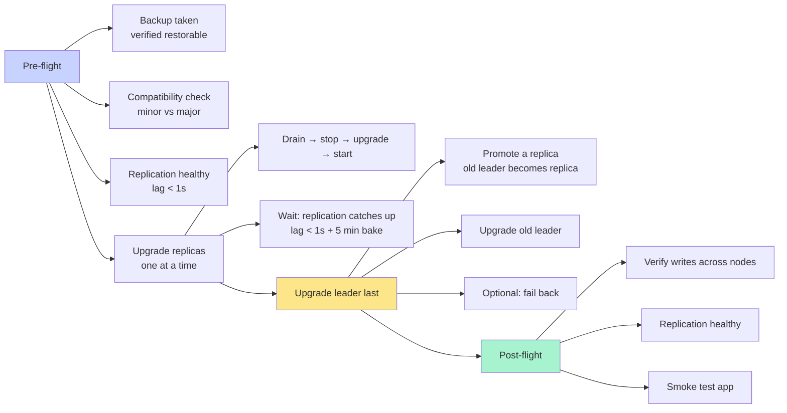
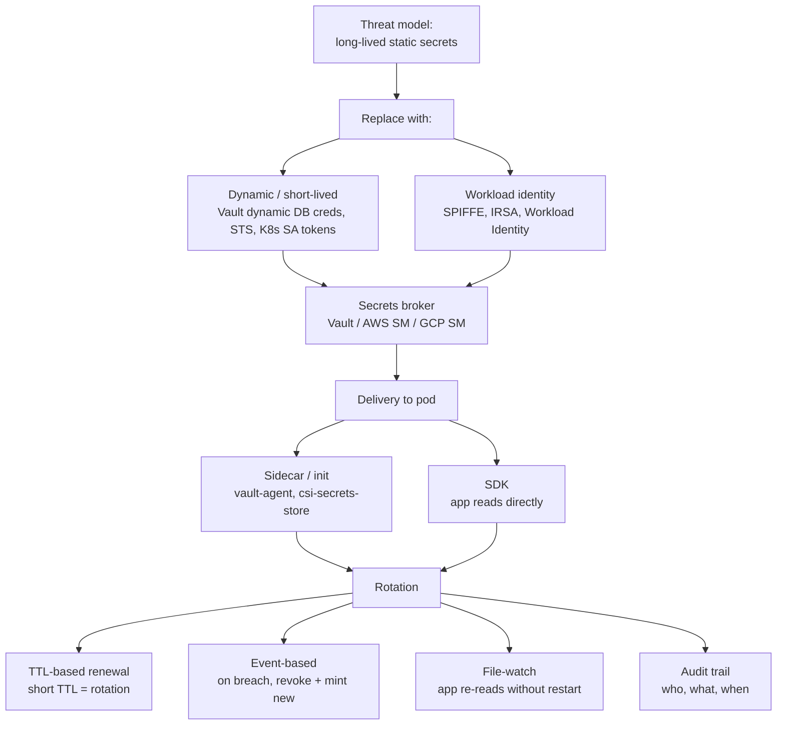
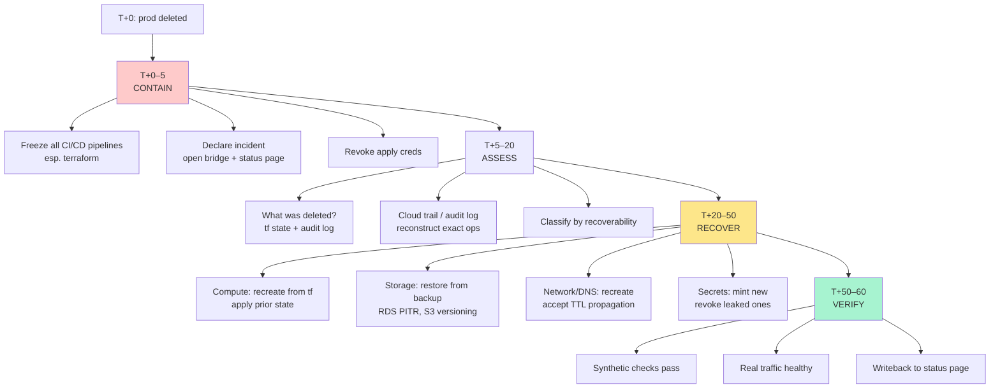

<h1>09 · Interview <em>prep</em></h1>
Ten architect-level questions. Six stages each. Answers the panel at Amazon, Meta, Google, Netflix, Stripe, and Datadog actually rewards.

> The principal-engineer loop at a FAANG is not a quiz. It is a **signal-harvest**: the panel wants to know whether you think in systems, argue with numbers, and stay calm when production is on fire. This page drills the ten questions that surface those signals most often. Each one follows the lab's native loop — **Reason → Thinking → Execution → Simulation → Output → Use case** — adapted for the interview room:
>
> - **Reason** — the *context* that makes the panel ask the question. When do interviewers reach for it?
> - **Thinking** — the *mental framework* that produces a strong answer. Mermaid first, prose second.
> - **Execution** — the *bullet skeleton* you say out loud in the next 4–6 minutes.
> - **Simulation** — a *live transcript* of you answering it, questions from the panel included.
> - **Output** — the *signals* the loop reads from your answer and the bar-raiser's notes.
> - **Use case** — the *production incident* that made this class of question famous.

---

## 🗺️ Roadmap — the ten questions

#### Zero-downtime deploy
Design a blue-green rollout for a payments API where a failed deploy = chargebacks.

#### `kubectl apply` walkthrough
From TCP handshake to kubelet — every hop, every queue, every race condition.

#### CrashLoopBackOff triage
A pod is stuck. Walk the panel through your hypothesis tree — not just your commands.

#### SLO / SLI / error budget
Model reliability for a search service. Defend your SLI menu and burn-rate alerts.

#### Multi-region active-active
Design a global SaaS with regional write leaders, conflict resolution, and failover drills.

#### p99 latency spike
Investigate a 2× tail-latency regression without panicking, without guessing.

#### Service mesh mTLS
How does Istio or Linkerd add mutual TLS without a single line of app code changing?

#### Stateful DB rolling upgrade
Upgrade a 5-node Postgres cluster in place. What keeps the write path honest?

#### Secret rotation at scale
Rotate credentials across 500 microservices without a global restart and without leaks.

#### Terraform deleted prod
A plan applied. Prod is gone. You have 60 minutes. Lead the recovery.

---

## How this page is laid out

Each question is a single `concept` card. Read it top-to-bottom as if you were in the room:

1. **Reason** sets the scene. "When the interviewer asks this, they are probing for X."
2. **Thinking** is the mental model — a mermaid diagram of the decision tree you run internally, then 3–5 bullets that annotate it.
3. **Execution** is your answer skeleton. 6 bullets. 4 minutes. Time-boxed.
4. **Simulation** is a transcript. Not a script — a *transcript*. The panel interrupts you. You recover.
5. **Output** lists the signals the panel reads and the scorecard the bar-raiser fills out.
6. **Use case** anchors everything in a real post-mortem from a company with good writeups.

Active voice throughout. Opinionated. Numbers where possible.

---

## 1. Design a zero-downtime deployment for a payments API

🧭 Reason — why the panel asks

**They want to see money-grade reasoning.** A payments API is not a blog: a failed deploy does not mean a 500 page, it means a **duplicate charge**, a **missing capture**, or a **reversed refund that costs hard dollars**. Interviewers at Stripe, Square, and Amazon Payments ask this to see whether you distinguish "no HTTP errors" from "no *semantic* errors." The question separates engineers who have read the Martin Fowler blog from engineers who have been on-call the night a canary double-charged 4 % of orders.

The bar-raiser is watching for three things:

- Do you treat **idempotency** as a first-class requirement, not an afterthought?
- Do you talk about **traffic shifting** in percentages and burn rates, not "we flip the switch"?
- Do you have a **rollback budget** — a pre-agreed time and error rate beyond which you revert without a meeting?

🧠 Thinking — the mental model

- **Blue-green is the wrapper, canary is the engine.** Keep v1 hot while v2 ramps; the L7 router is the only thing that switches.
- **Idempotency keys are load-bearing.** Client supplies `Idempotency-Key: uuid`. Server dedupes for 24 h. Without this, *any* deploy can double-charge on retry.
- **Traffic shift is gated by SLIs, not a human.** Burn-rate alert > 14.4 × 1 h → auto-halt and drain back.
- **Schema migrations run in three phases** — expand, migrate, contract — across multiple deploys. Never backwards-incompatible inside a single release.
- **Rollback is a deploy, not a restore.** v1 is still running; we shift traffic back. No DB restore, ever, during a deploy.

⚡ Execution — what you say (4 min)

- **Clarify in 30 s.** "Payments API — synchronous capture path? What's our p99 SLO and idempotency model? Any regulated data in the payload? Multi-region or single?" Pause. Let them answer.
- **Draw two planes.** Traffic plane (Envoy / ALB / service mesh) and data plane (Postgres / DynamoDB). Deploys touch the traffic plane; schema migrations are separate.
- **State the contract.** v1 and v2 MUST both read and write a superset schema for the duration of the migration. The **expand-migrate-contract** ratchet runs over 3+ deploys.
- **Shift traffic in a fibonacci-ish curve.** 1 → 5 → 25 → 50 → 100 %, each step gated by a 10-min bake at healthy SLI.
- **Define halt conditions up front.** 14.4 × 1 h burn OR p99 > 1.5 × baseline OR idempotency-conflict rate > 0.1 % → auto-halt, auto-drain.
- **Close with observability.** Per-version RED metrics, per-version traces, per-version error-budget burn. Dashboards named `payments-deploy-v{n}` so the on-call knows which version is bleeding.

🔮 Simulation — live transcript

<pre class="sim"><code>Panel: How would you design a zero-downtime deployment for a payments API?
You:   Before I draw anything — what's the capture model? Synchronous, or
         do we enqueue and confirm async? And what's our idempotency story on
         the client side?
Panel: Synchronous. Clients sometimes retry on their own.
You:   OK, then the deploy design is dominated by that retry behavior. Let
         me draw. # draws traffic + data plane split
         Two planes. Traffic plane is Envoy in front of two Kubernetes
         deployments, v1 and v2. Data plane is Postgres with an expand-migrate-
         contract cadence — no deploy ever requires a backwards-incompatible
         schema. Client sends Idempotency-Key; server dedupes for 24 h in
         Redis with write-through to Postgres.
Panel: What if Redis loses the key during the deploy?
You:   Good — that's why the 24 h record also lives in Postgres. Redis is
         the hot path; Postgres is the truth. A miss in Redis falls through to
         a SELECT on (idempotency_key, client_id) with a unique index. Worst
         case we add ~3 ms of p99 during a Redis flush.
Panel: Traffic shift — how?
You:   Fibonacci-ish: 1, 5, 25, 50, 100 %. Each step is a 10-min bake
         gated by a multi-window burn-rate alert — 14.4 × over 1 h or
         6 × over 6 h — plus a p99 ceiling of 1.5 × baseline. Violate either,
         auto-halt, auto-drain back to v1. No human in the halt path.
Panel: Who decides when to revert?
You:   The SLO does. Humans decide when to *re-try*. The revert is automatic
         because once you're in a burn, every second of debate costs real money.
</code></pre>

✅ Output — signals the panel reads

##### Before you answer
unknown senior?
panel is skeptical

→

##### During your answer
numbers + burn rates
panel leans forward

→

##### After you answer
hire signal
bar-raiser notes: "owns money-grade deploys"

The scorecard reads:

- **Systems thinking** — named two planes, not one.
- **Risk management** — pre-committed halt conditions before drawing.
- **Correctness-first** — idempotency before availability.
- **Operational maturity** — talks about dashboards named per-version.

🌍 Real-world use case

**At Stripe** (2019, reported in their engineering blog), a Checkout deploy briefly double-counted `payment_intent.succeeded` webhooks during a canary ramp. The idempotency table caught 100 % of duplicates at the API layer — but the webhook emitter was outside that boundary. The post-mortem's canonical lesson: **every asynchronous boundary is a new idempotency boundary**. The fix: a second dedupe ledger keyed by `(event_id, subscriber_id)` with a 7-day TTL. Zero dollars lost. The interview question exists because the panel wants to hear you name this class of bug *before* the bar-raiser has to.

---

## 2. Walk me through what happens when you type `kubectl apply -f pod.yaml`

🧭 Reason — why the panel asks

**This is the depth test.** Anyone can say "it calls the API server." The question separates engineers who have read `kubectl` source from those who have not. Google, Red Hat, and any shop that ships Kubernetes *to* customers (Rancher, SUSE, VMware Tanzu) asks this because support-escalation engineers live inside this call graph. The signal they read: can you narrate **six layers** — client, API server, etcd, scheduler, kubelet, CRI — and name at least one failure mode at each?

The panel also uses this question as a **politeness probe**. If you say "it just creates a pod," they escalate. If you start with the TLS handshake, they smile.

🧠 Thinking — the mental model

- **Six actors, three watches.** The scheduler, kubelet, and controller manager all hold *long-running watches* on the API server. Apply is async — your 201 only means "etcd has it."
- **Admission is where policy lives.** MutatingWebhookConfigurations and validating webhooks intercept before etcd. This is where Istio sidecar injection happens and where OPA Gatekeeper blocks bad pods.
- **etcd is a single linearizable log.** Every object change is a Raft-committed revision. `resourceVersion` is that revision. Watches resume from it.
- **Scheduler is a predicate + priority pipeline.** Filter nodes (taints, resources, affinity) → score nodes → bind. The bind is a separate API call.
- **Kubelet pulls, not pushes.** It watches pods assigned to its `nodeName` and reconciles to the CRI. The pod spec does not "arrive" at the node; the kubelet **fetches** it.

⚡ Execution — what you say (5 min)

- **Start client-side.** kubectl resolves kubeconfig → loads cert or token → does a GET on OpenAPI schema for the resource → builds a strategic-merge patch vs current state → POSTs or PATCHes.
- **API server chain.** TLS terminates → authentication (cert, token, OIDC) → authorization (RBAC) → mutating admission → schema validation → validating admission → etcd write.
- **etcd semantics.** Raft-replicated, MVCC, linearizable. Watchers get an ordered stream keyed by `resourceVersion`.
- **Scheduler loop.** Watch unscheduled pods → filter → score → `POST /binding`. Not a patch of `spec.nodeName` directly — a subresource.
- **Kubelet loop.** Watch pods where `spec.nodeName == myself` → for each pod: sandbox (CNI sets up veth pair, IP, routes) → pull images → create+start containers via CRI gRPC to containerd or CRI-O.
- **Status propagation.** Kubelet patches status every ~10 s. The API server fan-outs to watchers. `kubectl get pod` reads that status.

**Name failure modes as you go:**

- kubectl side: stale cache → `Error from server (Conflict)`.
- admission side: webhook timeout → pod blocked even though spec is valid.
- etcd side: quorum loss → `etcdserver: request timed out`.
- scheduler side: no feasible node → pod stuck `Pending` with `FailedScheduling`.
- kubelet side: image pull backoff → `ImagePullBackOff`.

🔮 Simulation — live transcript

<pre class="sim"><code>Panel: Walk me through what happens when you type kubectl apply -f pod.yaml.
You:   I'll narrate six layers and pause for questions. Ready?
Panel: Go.
You:   kubectl loads your kubeconfig, resolves the current-context cluster,
         reads the client cert or token. It hits the API server's /openapi/v2
         endpoint — that's cached on disk at ~/.kube/cache. It computes a
         strategic-merge patch: the three-way merge between last-applied
         annotation, the current server state, and the new file.
Panel: Why strategic-merge and not JSON patch?
You:   JSON patch is position-based; containers in a pod would collide on
         index. Strategic-merge is schema-aware — it knows containers are a
         list keyed by name, so it merges by key. That's also why
         kubectl replace --force behaves so differently.
Panel: OK continue.
You:   POST hits kube-apiserver. TLS terminates. Auth: cert SAN → user +
         groups. Authz: RBAC check against create pods in namespace ns.
         Mutating webhooks run — this is where Istio injects a sidecar.
         Validating webhooks — this is where OPA says no. Then etcd.
Panel: How does etcd see the write?
You:   It's a Raft-committed put with an MVCC revision. The API server
         notifies watchers — the scheduler has a watch on /registry/pods
         filtered by unscheduled. It sees ADDED. It runs predicates — taints,
         pod affinity, resource requests vs node allocatable — scores, picks.
         POST /binding. Separate API call, separate audit log entry.
Panel: What if every webhook is down?
You:   Depends on failurePolicy. Fail open means the pod goes through;
         fail closed means the API server returns an error to kubectl. Most
         admission controllers default to fail closed for security posture —
         which also means a broken webhook takes down every new pod across
         the cluster. Classic outage.
Panel: And the kubelet?
You:   Kubelet on the bound node sees the pod via its watch. Asks CRI
         to RunPodSandbox. The CNI plugin — Calico, Cilium, whatever —
         sets up veth, IPAM, routes. Kubelet pulls images, creates containers,
         starts them. Streams status back every 10 seconds. Done.
</code></pre>

✅ Output — signals the panel reads

##### Before
"it talks to the API"
shallow

→

##### During
six actors, named failure modes
panel nodding

→

##### After
strong hire
bar-raiser: "can debug control plane outages"

- **Mentioned admission webhooks** — separates senior from staff.
- **Distinguished mutating from validating** — principal signal.
- **Named `resourceVersion` / MVCC** — proves you've read etcd docs.
- **Spontaneously mentioned failure modes** — the hallmark of someone who has carried the pager.

🌍 Real-world use case

**At GitHub** (2020, public post-mortem), a validating webhook for image-policy enforcement had a 30-second timeout and the upstream service went down. **Every** pod creation — including the webhook's own pods — failed. The cluster wedged for 47 minutes. The fix: split webhooks into `failurePolicy: Ignore` for ops-critical ones, `failurePolicy: Fail` only for security gates. **The only reason you know this is a problem is because you understand the call graph** — which is exactly why the panel asks.

---

## 3. How would you debug a pod stuck in CrashLoopBackOff?

🧭 Reason — why the panel asks

**This is the triage test.** Crashloops are the single most common production pager. Every senior has debugged dozens. Meta, Amazon, and Datadog ask this because the panel can tell, in under 90 seconds, whether your diagnostic order is **hypothesis-driven** or **command-dump**. The difference:

- A junior runs `kubectl logs`, sees nothing, and says "it's not logging."
- A staff engineer says: "There are six reasons a container crashes immediately. Let me rule them out in the cheapest order."

The bar-raiser listens for a **decision tree**, not a command list. If you name `kubectl describe pod` before `kubectl logs --previous`, you are signaling seniority: describe shows the last exit code and reason, which partitions the space before you read logs.

🧠 Thinking — the mental model

- **First partition on exit reason**, not on logs. `describe` gives you `OOMKilled | Error | ContainerCannotRun | Completed` — each has a different next step.
- **Always use `--previous`** on logs. The current container has no logs yet because it just restarted.
- **OOMKills lie about the cause.** The *killer* is memory, but the *cause* is often a container request/limit mismatch, a missing `GOMEMLIMIT`, or a JVM `-Xmx` that exceeds the cgroup.
- **`Completed` is a trap.** It means the main process exited cleanly. The bug is that the process was never a daemon — maybe you forgot `CMD ["nginx", "-g", "daemon off;"]`.
- **Ephemeral debug containers beat `exec`.** `kubectl debug pod/x --image=busybox --share-processes` gives you a shell in the pod's PID namespace without modifying the original pod.

⚡ Execution — what you say (3 min)

- **Name the six classes first.** OOMKill, App Error, ContainerCannotRun, ImagePull, Completed-not-daemon, Probe-killed. Show the panel you have a partition before you reach for a command.
- **Start with `kubectl describe pod`.** Last state, exit code, reason, events. Two minutes of reading saves twenty minutes of guessing.
- **Then `logs --previous`.** Read the last 50 lines of the dead container. If silent, suspect stdout not wired or SIGKILL before write flush.
- **Then metrics.** `kubectl top pod`, and if you have Prometheus, `container_memory_working_set_bytes` and `container_oom_events_total`.
- **For hard cases, `kubectl debug`.** Ephemeral container sharing the target's namespaces. `ps`, `ls /`, `cat /proc/1/cmdline`.
- **Fix the root cause.** Raise limits, fix the entrypoint, add `tini` for PID 1, wire stdout, or patch the liveness probe timeout.

🔮 Simulation — live transcript

<pre class="sim"><code>Panel: A pod is in CrashLoopBackOff. Walk me through your debug.
You:   Before I run anything, six reasons a container crashes fast:
         OOMKill, app error, ContainerCannotRun, ImagePullBackOff,
         Completed-not-daemon, probe killed it. I want to partition on
         exit reason first — that's describe, not logs.
Panel: Why not logs first?
You:   kubectl logs tails the *current* container, which just started. The
         interesting one is --previous. But before I spend time reading
         logs, describe gives me the last exit code and reason. That's a
         cheap partition. If it says OOMKilled, logs won't tell me more —
         I need metrics and limit review.
Panel: Say describe shows OOMKilled.
You:   Then my questions are: (1) is the limit reasonable? Check
         kubectl top pod --containers and compare to the limit. (2) Is
         the app cgroup-aware? A JVM without -XX:+UseContainerSupport
         or a Go binary without GOMEMLIMIT will allocate to host memory
         and get killed when the cgroup limit hits. (3) Is there a leak?
         I'd want container_memory_working_set_bytes over time — monotonic
         means leak, sawtooth means GC, cliff means spike.
Panel: Describe shows exit code 1 but logs are silent.
You:   Three possibilities. App isn't writing to stdout — it's writing to
         a file inside the container, which disappears on restart. Logging
         framework is buffered and the SIGKILL flushed nothing. Or the app
         literally crashed before any log line — likely a config parse error.
         I'd run kubectl debug pod/x --image=busybox --share-processes,
         exec ls /var/log, and look for an app-specific log file. If not,
         run the image locally with the same env vars.
Panel: How would you confirm it's the liveness probe killing it?
You:   Exit reason in describe will show Error: Killing container
         with a Liveness probe failed event just before the restart.
         Check the probe timings — initialDelaySeconds too short on a
         slow-booting JVM is the classic one.
</code></pre>

✅ Output — signals the panel reads

##### Before
runs logs first
command-dump

→

##### During
partitions six classes
hypothesis tree visible

→

##### After
staff+ signal
bar-raiser: "debugs before touching keyboard"

- **Named the six exit classes up front** — instant staff-level signal.
- **Distinguished `--previous`** — shows pager experience.
- **Named `GOMEMLIMIT` or `UseContainerSupport`** — principal-level signal.
- **Mentioned ephemeral debug containers** — proves you have kept up since Kubernetes 1.23.

🌍 Real-world use case

**At Datadog** (2022, internal post-mortem reshared at KubeCon), a fleet of 4 000 Go agent pods started crashlooping with `OOMKilled` after a routine Go 1.19 upgrade. Root cause: Go 1.19 changed the default `GOGC` behavior and introduced `GOMEMLIMIT`. The cgroup limit was 512 MiB, but without `GOMEMLIMIT` set, the runtime happily grew its heap past 400 MiB before GC kicked in hard. The fix: a one-line manifest change setting `GOMEMLIMIT=450MiB`. Detection time: 4 minutes — because the on-call read `describe` before `logs`. **This question is a proxy for: have you built that reflex?**

---

## 4. SLO / SLI / error budget — design one for a search service

🧭 Reason — why the panel asks

**This is the reliability-maturity test.** SLOs are the language SREs use to negotiate with product. Any engineer who has lived through an error-budget-driven release freeze has opinions about them. Google (where SLOs were born), Netflix, and any modern platform team asks this because the answer reveals:

- Do you understand the difference between an SLI (what you measure) and an SLO (the threshold)?
- Do you know why **latency SLIs** are almost always based on percentile thresholds, not averages?
- Can you translate an SLO into a **multi-window burn-rate alert** without reaching for a cheat sheet?

Search is a particularly nasty service for SLOs because the product definition of "working" is multi-dimensional: availability (did it respond?), latency (fast enough?), **quality** (were results relevant?), and freshness (was the index recent?). A thoughtful answer names all four.

🧠 Thinking — the mental model

- **SLIs describe user experience.** Not CPU, not RAM. The user doesn't care about your CPU. They care whether search is up and fast.
- **Availability SLI = good events / total events**, measured at the boundary closest to the user (ideally the edge LB, fallback to ingress).
- **Latency SLI = percent of requests faster than X**, not "the p99." Why? Because you want a *proportion* that sums into a budget, not a statistic that doesn't.
- **Quality SLIs are hard.** CTR on top-3 is a proxy, but it conflates ranking quality with query quality. Most teams track it as a product KPI, not an SLO.
- **Multi-window burn** is Google's canonical pattern: fast burn (14.4× 1 h, 6× 5 m both true → page) catches incidents; slow burn (6× 6 h, 3× 30 m both true → ticket) catches drift.

⚡ Execution — what you say (5 min)

- **Frame the service.** "Search has four user-facing dimensions: available, fast, relevant, fresh. I'll SLO three and KPI the fourth." State why.
- **Pick SLIs.** Availability = (`2xx` + `3xx`) / total at the edge, excluding 4xx client errors. Latency = % of requests < 300 ms at p99 boundary. Freshness = max(now − doc_index_time) over indexed corpus.
- **Pick SLOs.** 99.9 % availability / 30 d. 99 % of requests < 300 ms / 30 d. 99 % of corpus indexed within 5 min / 30 d. Justify each number with a business consequence.
- **Compute budget.** 99.9 % / 30 d = **43 m 49 s** of allowed badness. 99 % latency = 1 % of requests can be slow.
- **Design alerts.** Multi-window multi-burn: fast pair (14.4× 1 h AND 6× 5 m) pages; slow pair (6× 6 h AND 3× 30 m) tickets. Don't page on a single window — you'll get flap and false pages.
- **Discuss error-budget policy.** "When 25 % of budget is gone in a week, we freeze risky deploys. When 0 % remains, we freeze all feature work and focus on reliability until the window resets."

🔮 Simulation — live transcript

<pre class="sim"><code>Panel: Design SLOs for a search service.
You:   Search has four user-facing dimensions: available, fast, relevant,
         fresh. I'll SLO three — availability, latency, freshness — and track
         relevance as a product KPI, not an SLO. Relevance is subjective;
         bad SLOs are subjective.
Panel: Why not an SLO on relevance?
You:   Because you can't page on it. A good SLO is: measurable objectively,
         violated cheaply, bounded. Relevance fails all three — CTR can drop
         because the query distribution shifted, not because the service broke.
         You'll wake people up for trend changes. Reliability SLOs should be
         about the *service*, not the *product*.
Panel: OK, give me the SLIs.
You:   Availability: 2xx plus 3xx divided by total, measured at the edge
         load balancer. Excludes 4xx so client mistakes don't eat our budget.
         Latency: percent of requests faster than 300 ms at the edge. We
         commit to the *proportion* not the *percentile* so it composes into
         a budget. Freshness: time-since-indexed for the newest document in
         the corpus, 95th percentile across shards.
Panel: Targets?
You:   99.9 / 99 / 99 over 30 days. That's 43 minutes 49 seconds of
         availability budget. 1 % of requests allowed slow. 1 % of freshness
         windows allowed stale. I'd calibrate to historical — if we're at
         99.95 today, 99.9 is a stretch with headroom; if we're at 99.8,
         99.9 is a freeze-on-day-one setup.
Panel: Alerting?
You:   Multi-window, multi-burn. A fast pair: 14.4x 1h and 6x 5m both
         true, page. That's Google's canonical recipe — catches a severe
         incident within 5 minutes without false pages on transient spikes.
         A slow pair: 6x 6h and 3x 30m both true, file a ticket. Catches
         drift before it eats the whole month.
Panel: Budget exhaustion policy?
You:   25 % remaining, freeze risky deploys — schema migrations, ranking
         model swaps. 0 % remaining, freeze feature work. Product owns the
         tradeoff between velocity and reliability; SREs own enforcing it.
</code></pre>

✅ Output — signals the panel reads

##### Before
"we track p99"
metric-first

→

##### During
proportion not percentile
budget math visible

→

##### After
senior SRE signal
"owns reliability contracts"

- **Distinguished SLI from SLO** — baseline senior.
- **Named multi-window multi-burn** — canonical Google SRE signal.
- **Excluded relevance from SLOs** — shows you understand what a good SLO is *for*.
- **Used minutes not percentages** for budget — makes it concrete.

🌍 Real-world use case

**At Google Search** (documented in the SRE Workbook, ch. 2), the team explicitly chose a **99.99 % availability SLO** — not higher — because a higher target meant more caution, less experimentation, and slower iteration on ranking. The team measured that pushing from 99.99 to 99.999 would slow feature velocity by 30 % with no measurable user benefit: most users who see a 500 just refresh. **SLOs are economic decisions, not technical ones** — the panel wants to hear you name that tradeoff.

---

## 5. Design a multi-region active-active architecture for a global SaaS

🧭 Reason — why the panel asks

**This is the CAP theorem test — but grown up.** Anyone can say "CAP means pick two." A principal engineer says: "CAP is not actionable; PACELC is. In a partition, do we favor availability or consistency? And in the normal case, do we favor latency or consistency?" Amazon, Google, Cloudflare, and Netflix ask this because multi-region is where their business lives — and where their most expensive outages happen.

The panel listens for:

- Do you name **data-model choices** (per-row ownership, CRDT, eventual, strict)?
- Do you discuss **traffic routing** (geo-DNS, anycast, latency-based) as a separate concern?
- Do you plan a **failover drill cadence**? Because an untested failover is a myth.

🧠 Thinking — the mental model

- **Statelessness is free.** App tier is identical in every region. All the hard stuff is data.
- **Three data patterns.** (1) Shard by tenant — tenant A lives in EU, period. (2) Last-writer-wins with vector clocks — cheap, lossy. (3) CRDT — expensive, correct. Pick one per workload.
- **Routing is independent from replication.** Geo-DNS is L4 and cache-TTL bound. Anycast (Cloudflare, Fastly) is sub-second. Latency-based DNS (Route 53) is the middle ground.
- **Async replication has a budget.** RPO = max acceptable data loss on region failure. RTO = max acceptable downtime to fail over. These drive every other decision.
- **Failover is tested or it doesn't exist.** Quarterly GameDay. Force a region out and watch what breaks.

⚡ Execution — what you say (6 min)

- **Clarify requirements.** RPO? RTO? Regulatory data residency? Write-heavy or read-heavy? Tenant model? These dictate every choice.
- **Draw stateless vs stateful.** App tier identical, horizontally scaled, region-local. Data tier is where the design lives.
- **Pick a data pattern per domain.** User sessions: last-writer-wins with TTL. Orders: sharded by tenant home region. Analytics: eventual consistency with a lag SLO.
- **Routing layer.** Latency-based DNS for user-facing, anycast for API, static ASN routing for internal east-west. Health checks at each layer.
- **Write path.** Writes go to the tenant's home region. If the user is roaming, the edge re-routes to home region. Cross-region writes are a performance anti-pattern unless you need strict consistency.
- **Failover playbook + drill.** Promote replica to leader (minutes). Update DNS (seconds for anycast, minutes for geo-DNS). Drain sessions. Replay queued writes. Quarterly GameDay, documented RTO measurement.

🔮 Simulation — live transcript

<pre class="sim"><code>Panel: Design a multi-region active-active architecture for a global SaaS.
You:   I need to anchor on four things before I draw: RPO, RTO, data
         residency, and tenant model. What are your expected values?
Panel: 60-second RPO, 5-minute RTO, EU data stays in EU, B2B tenants.
You:   Great. EU residency plus B2B tenants makes this sharded by tenant
         home region. Tenant A lives in EU. Tenant B lives in US. The app
         tier is identical everywhere — any user, any region, can hit any app
         pod. But reads and writes route to the tenant's home shard.
Panel: Why not a globally consistent DB like Spanner?
You:   For the primary data, Spanner or CockroachDB works — but you pay
         a cross-region-write latency tax on every transaction, which violates
         your latency SLO the moment a user in Mumbai writes to an EU-homed
         tenant. Sharding by tenant home keeps the write path local and
         bounded. The global tier is only the small things: tenant
         directory, billing, auth — those can take Spanner's 100 ms.
Panel: Failover?
You:   Each region has one async replica in a paired region. RPO of 60s
         means our replication lag alert is at 45s. On region loss: promote
         the replica to leader — 30 seconds for Postgres, less for newer
         engines. Update the tenant directory: tenant_a.region = us-east.
         App pods watch the directory; new requests route to the new leader.
         5-minute RTO is tight but achievable if we pre-provision capacity
         in the paired region.
Panel: What about writes in flight when the region died?
You:   Anything past the last successful replication is lost — that's the
         RPO contract. We surface a last-acknowledged-write cursor to
         the client so apps can reconcile. Financial workloads would need a
         different design — synchronous replication, which costs you ~10 ms
         per write but gives RPO 0.
Panel: How do you know the failover actually works?
You:   Quarterly GameDay. Pick a region, drain it, watch the RTO. If RTO
         drifts above 5 minutes, we find out in a drill, not a disaster.
         The drill also forces us to rehearse the tenant-directory update,
         which is the part that always breaks in real incidents.
</code></pre>

✅ Output — signals the panel reads

##### Before
"use Spanner"
single-answer

→

##### During
data/routing/failover split
tradeoffs with numbers

→

##### After
principal signal
"owns global-scale tradeoffs"

- **Asked RPO/RTO/residency first** — architecture-level maturity.
- **Named sharding by tenant home** — the pattern that actually works at SaaS scale.
- **Distinguished global-small-data from local-big-data** — principal signal.
- **Named quarterly GameDay** — proves you know failovers rust.

🌍 Real-world use case

**At Netflix** (2015 and revisited at QCon 2019), the architecture runs active-active across three AWS regions. Every quarter they fire a **Chaos Kong** — evacuate an entire region and watch the system re-shard. The first time they ran it in 2013, RTO was 49 minutes. By 2019, with years of hardening, it was under 7 minutes. The lesson engineers take into interviews: **your RTO number is a lie until you've measured it in a drill**. Name the drill.

---

## 6. You see a 2× spike in p99 latency — walk me through your investigation

🧭 Reason — why the panel asks

**This is the observability test.** A p99 spike is the hardest class of production bug because it is by definition a long tail: the median is fine, most users are fine, and the problem appears as a *statistical* phenomenon. Datadog, Honeycomb, and any observability-forward shop asks this because the answer tells them whether you reason in **USE** (Utilization, Saturation, Errors), **RED** (Rate, Errors, Duration), or guesswork.

The panel wants to hear you name these in order:

1. **Is it real?** Dashboards lie. Check the query.
2. **What's correlated?** Traffic? Deploy? Dependency? Time of day?
3. **Where in the stack?** App? DB? Network? Upstream?
4. **What's the population?** p99 of everything, or one endpoint?

If you immediately say "I'd run `top`," you lose the signal. If you say "I'd check if the query is even right," you gain it.

🧠 Thinking — the mental model

- **RED first, USE second.** Rate, Errors, Duration per endpoint, then host metrics. Users see duration; hosts see saturation. Start with users.
- **p99 spikes are usually one of five things**: a bad deploy, an autoscaler lag, a dependency's p99, a cron job, or a network change. Rule them out in that order — it's the probability ranking from post-mortem datasets.
- **One endpoint vs all endpoints** is the fastest partition. If all endpoints spiked, it's infrastructure (network, LB, node). If one endpoint, it's that code path.
- **Traces beat logs for tail latency.** A distributed trace shows you *which hop* is slow. Without tracing, you're guessing.
- **Tail is often queueing, not compute.** A p99 > 5× p50 means requests are lining up somewhere: connection pool, TCP accept queue, thread pool.

⚡ Execution — what you say (4 min)

- **Check the dashboard's math.** Is the p99 query computed from histograms or sampled? Is the time window bigger than your burn-rate window? Dashboard bugs fake-page teams weekly.
- **Correlate in time.** Deploys, configuration changes, feature flags, dependency status. The incident channel usually reveals the cause in 60 seconds if you read it before querying anything.
- **Partition by endpoint.** RED metrics per route. If one endpoint spiked, pull the trace for a slow example. If all endpoints spiked, look at infrastructure.
- **Pull a slow trace.** 99th-percentile trace from the last 10 minutes. Find the longest span. That's your next rabbit hole.
- **Check the usual suspects on the owning service.** GC pauses (log for Java, `runtime.GC` duration for Go), connection pool saturation, thread pool queue depth, autoscaler lag.
- **State what you'd do next and why.** If it's queueing, raise the pool / scale out. If it's a dependency, circuit-break. If it's a deploy, revert. Decisive.

🔮 Simulation — live transcript

<pre class="sim"><code>Panel: p99 latency just doubled. Walk me through it.
You:   First question: is the number real? Dashboards lie more often than
         services do. I'd check the query — is this p99 from a histogram or
         a sampled metric? Is the time window the same as the alerting
         window? Is the deploy a couple minutes old and the histogram
         is still warming up?
Panel: Assume it's real. 2x increase, sustained.
You:   OK, correlation next. I check five things in parallel: deploys in
         the last 30 min, feature flags toggled, traffic rate, dependency
         status pages, and the cron calendar. In my experience 80 % of p99
         spikes correlate with one of these within a minute.
Panel: Say nothing obvious correlates.
You:   Then I partition by endpoint. RED per route. If one endpoint spiked,
         it's a code path — I pull a 99th-percentile distributed trace from
         the last 10 min and find the longest span. If all endpoints spiked,
         it's infrastructure — node metrics, LB metrics, network errors.
Panel: Let's say it's one endpoint, the trace shows the DB call is slow.
You:   Great, now the question is why the DB is slow for this endpoint and
         not others. Three things: different query, different connection
         pool, or a lock. I'd pull the DB slow log and the connection-pool
         metrics for this service. If queries are stacking up at the pool,
         tail latency comes from queueing, not the DB itself. I've seen this
         a dozen times — raise pool size or add a read replica.
Panel: How do you know it's queueing and not the DB being slow?
You:   Look at DB-side metrics: query time vs wait time. If the DB reports
         fast queries but the app reports slow DB calls, the gap is on the
         client side — pool wait. If both report slow, the DB is the
         bottleneck. The trace will show it too: the span duration vs the
         actual SQL execution time in the DB exporter.
</code></pre>

✅ Output — signals the panel reads

##### Before
runs top first
host-metric-first

→

##### During
RED → trace → root
tail-aware reasoning

→

##### After
staff SRE signal
"reasons at the right altitude"

- **Questioned the dashboard first** — calibrated.
- **Named queueing vs compute** — tail-latency fluency.
- **Distinguished client pool wait from server execution** — senior observability.
- **Parallel correlation checks** — incident-command reflex.

🌍 Real-world use case

**At Meta** (published in the 2021 SOSP paper on tail tolerance), researchers found that **80 % of p99 spikes in their fleet were caused by software queueing effects** — connection pools, thread pools, network socket buffers — not by the upstream dependency being genuinely slow. The practical consequence: their SRE playbook starts every p99 investigation with "check queue depth" before "check upstream latency." **The interviewer asks this question to see whether you've internalized that reflex.**

---

## 7. How does a service mesh add mTLS without app changes?

🧭 Reason — why the panel asks

**This is the network-layer test.** Service mesh is the answer to "how do we add TLS, retries, circuit breaking, and tracing to 500 services without changing any of them?" The panel asks this to see whether you understand **sidecars**, **transparent proxying**, and **the mesh control plane**. A shallow answer says "Istio does magic." A deep answer narrates:

- The **sidecar injection** webhook.
- The **iptables redirect** that transparently captures traffic.
- The **SDS / xDS** push of certificates and routes.
- The **SPIFFE identity** model that binds a workload to a cert.

Google, Netflix, Lyft, and any SRE-heavy shop care because mesh is the single biggest leverage point for platform teams.

🧠 Thinking — the mental model

- **Three components.** Data plane (Envoy sidecar per pod), control plane (Istiod), identity plane (SPIFFE SVIDs).
- **Injection happens at admission.** A mutating webhook rewrites the pod spec to add the `istio-proxy` container and an init container that sets iptables rules.
- **iptables is the magic.** `REDIRECT` rules send all outbound traffic on port 15001 and inbound on 15006 to the Envoy process. The app talks plain HTTP; Envoy upgrades to mTLS.
- **Identity is SPIFFE.** Each workload gets a SVID cert with subject `spiffe://cluster.local/ns/foo/sa/bar`. No shared secrets, no app changes.
- **xDS is a streaming config protocol.** gRPC bidi stream between Envoy and the control plane pushes listener / cluster / route configs. Changes propagate in seconds without restart.

⚡ Execution — what you say (5 min)

- **Name the three planes.** Data, control, identity. This is the frame.
- **Explain injection.** Namespace labeled → mutating webhook → pod spec gets Envoy container + init container.
- **Explain iptables.** Init container runs as root in pod network namespace, sets `REDIRECT` rules. All traffic transparently routes through Envoy.
- **Explain identity.** SPIFFE SVID issued by the control plane's CA, delivered to Envoy via SDS (Secret Discovery Service), rotated every 24 h without restart.
- **Explain the handshake.** Envoy A dials Envoy B. Both present SVIDs. Mutual verification against the trust domain. Optional AuthorizationPolicy in the control plane restricts which identities can talk.
- **Close with the cost.** ~1–3 ms latency per hop, ~50 MB RAM per sidecar, operational overhead of running the control plane. Discuss when *not* to use mesh: very small clusters, extreme perf requirements, teams that aren't ready to own Envoy.

🔮 Simulation — live transcript

<pre class="sim"><code>Panel: How does a service mesh add mTLS without app changes?
You:   Three planes. Data, control, identity. The key insight: the app
         keeps talking plain HTTP. All the TLS happens in a sidecar that
         the app doesn't know exists.
Panel: How does the sidecar get there?
You:   Mutating admission webhook. You label the namespace
         istio-injection=enabled. When a pod is created, the webhook
         rewrites the spec before etcd write — adds the Envoy container and
         an init container. The init container runs as root in the pod
         network namespace and sets iptables REDIRECT rules: outbound on
         15001 and inbound on 15006 go to Envoy.
Panel: Why iptables and not just configure the app to talk to localhost?
You:   Transparency. The whole point is no app changes. If the app is
         configured to talk to service-b.namespace.svc.cluster.local,
         iptables intercepts that — Envoy receives the original destination
         via SO_ORIGINAL_DST, picks a route from its xDS config, and upgrades
         to mTLS if the peer is in-mesh.
Panel: Where does the cert come from?
You:   SPIFFE. Each workload identity is spiffe://cluster.local/ns/foo/sa/bar,
         bound to the Kubernetes ServiceAccount. When Envoy boots, it opens
         an xDS stream to Istiod. Istiod mints an SVID cert via its internal
         CA and delivers it via SDS — Secret Discovery Service, a sub-protocol
         of xDS. Certs are short-lived, typically 24 h, rotated automatically
         without restart.
Panel: What happens during the handshake?
You:   Envoy A presents its SVID to Envoy B. B verifies it was signed by
         the trust domain's root — same CA, so it works. B presents its own
         SVID. A verifies. Optional: an AuthorizationPolicy in the mesh
         might say only spiffe://.../sa/frontend can call me, in which
         case Envoy B checks the peer's identity against that policy and
         rejects if it doesn't match. All transparent to the app.
Panel: Downsides?
You:   Latency — 1 to 3 ms per hop, twice per request. Memory — ~50 MB
         per sidecar, which adds up on pods with 1000x replicas. Complexity
         — Istiod is now a critical dependency; if it's down, existing certs
         keep working for their TTL but new pods can't get one. And the
         operational cost of running Envoy is real — someone on your team
         has to read Envoy config dumps. I'd skip mesh on clusters under
         50 services unless security requires it.
</code></pre>

✅ Output — signals the panel reads

##### Before
"Istio does TLS"
surface-level

→

##### During
iptables + SPIFFE + SDS
mechanism-deep

→

##### After
principal signal
"can operate the mesh"

- **Named iptables REDIRECT** — mechanism-level.
- **Named SPIFFE + SVID** — identity-plane fluency.
- **Distinguished xDS from SDS** — config-protocol depth.
- **Stated when not to use mesh** — shows judgement over hype.

🌍 Real-world use case

**At Lyft** (who open-sourced Envoy in 2016), the driving need was mTLS across ~1 500 services without modifying app code — Ruby, Go, Python, Java, all needing the same security posture. Retrofitting TLS libraries into each language was estimated at 18 engineer-years. The sidecar approach shipped in 6 months. The pattern that emerged — **transparent proxying + xDS + SPIFFE** — became Istio's foundation. The panel asks this question because the answer reveals whether you *understand* why the mesh exists, not just that it does.

---

## 8. Rolling upgrade of a stateful database — what keeps it safe?

🧭 Reason — why the panel asks

**This is the statefulness test.** Stateless services roll trivially. Databases do not: you have replication lag, leader election, on-disk format changes, long-running queries, and cascading failures if any node is unhealthy for too long. MongoDB Cloud, Amazon RDS, PlanetScale, and any DB-as-a-Service team asks this because *their* product is literally safe DB upgrades.

The panel listens for:

- Do you know **backwards-compatibility windows** at the protocol and on-disk format levels?
- Do you distinguish **minor** from **major** upgrades?
- Do you understand **read-vs-write-path impact** during a leader step-down?
- Do you have a **rollback gate** — a point past which you can't go back?

🧠 Thinking — the mental model

- **Backup first, verified restorable.** Not "we have backups" — "we restored last night to a fresh instance and it passed a smoke test."
- **Minor version upgrade is safe(r).** Wire protocol compatible, on-disk format compatible. You can mix 15.4 and 15.5 indefinitely.
- **Major version upgrade is a migration.** On-disk format may change; wire protocol may break. You need an expand-migrate-contract cadence, and you may need `pg_upgrade` or dump-restore.
- **Replicas first, leader last.** Upgrade replicas one at a time; each upgrade loses one replica's redundancy temporarily. Never two at once.
- **Leader upgrade = controlled failover.** Promote a replica, then upgrade the old leader. The failover has its own risk profile — it's a write-path hiccup.

⚡ Execution — what you say (5 min)

- **Clarify the DB and version delta.** Postgres 15.4 → 15.5 is different from 15 → 16. Engine (MongoDB, Cassandra, MySQL) determines the playbook.
- **Pre-flight.** Verified backup, replication lag < 1 s, no long-running queries, monitoring healthy, change announced.
- **Upgrade pattern: replicas first, one at a time.** Drain (depends on DB — Postgres: remove from load balancer). Stop. Upgrade binary. Start. Wait for replication to catch up. Bake for 5 minutes at healthy. Move to next.
- **Leader upgrade via failover.** Promote a healthy replica to leader. Wait for writes to switch. Upgrade old leader. Optionally fail back.
- **Validation.** Write to new leader, read from each replica, verify consistency. Run app-level smoke test. Monitor replication lag for 24 h.
- **Rollback gate.** Before the leader failover, rollback is cheap (replicas are stateless from a logical perspective — you can redeploy). After, rollback may require restore from backup, because reverting on-disk changes is not always safe.

🔮 Simulation — live transcript

<pre class="sim"><code>Panel: Rolling upgrade of a 5-node Postgres cluster. What keeps it safe?
You:   Minor version like 15.4 to 15.5, or major like 15 to 16?
Panel: Minor.
You:   OK, wire and on-disk compatible. Pre-flight: verified backup —
         I want a test restore from last night that passed. Replication
         lag under a second across all four replicas. No long queries
         running. Monitoring and alerting green. Change window announced.
Panel: Assume all good. Go.
You:   Replicas first, one at a time. For each replica: remove from the
         LB pool or the application's read list. Stop postgres. Upgrade
         the binary — deb package or container image. Start postgres.
         Wait for replication to catch up — lag under a second, sustained
         for 5 minutes. Add back to the pool. Bake another 5 minutes.
         Then move to the next replica. If any step fails, stop the whole
         upgrade and investigate.
Panel: Why bake 5 minutes?
You:   To catch slow-burn issues — a bug that manifests under real traffic
         volume after the pool re-adds the node. A replica that passes the
         first second but crashes at minute 3 is a worse outcome if you've
         already moved on to node 3.
Panel: Leader?
You:   Leader last, via controlled failover. Pick the replica with the
         lowest lag — usually zero after the pre-flight checks. Promote it.
         Writes start going to the new leader. The old leader becomes a
         replica of the new one. Now upgrade the old leader the same way
         I upgraded the other replicas. Optionally fail back to restore
         the original topology.
Panel: What's the failure mode you worry about most?
You:   Split-brain during the failover. If the old leader isn't cleanly
         demoted before writes shift, two leaders accept writes briefly.
         That's why I'd use a consensus-based tool — Patroni with etcd,
         or the Postgres replication manager of choice — to do the
         promotion. Never a manual touch /tmp/promote.
Panel: What if this is a major version?
You:   Different game. Major versions can change on-disk format — pg_upgrade
         is required, which means the replica you're upgrading can't just
         start as a replica of the old-version leader. Pattern shifts to:
         spin up a new major-version cluster alongside, use logical
         replication to catch it up, cut over via leader promotion. That's
         a migration, not an upgrade. Days of work, not hours.
</code></pre>

✅ Output — signals the panel reads

##### Before
"just rolling restart"
stateless reflex

→

##### During
replicas → leader, bake time
failure-modes named

→

##### After
staff DBA signal
"owns stateful systems"

- **Asked minor vs major first** — architecture-grade framing.
- **Named verified backup** — post-mortem reflex.
- **Named split-brain as top risk** — shows you've been burned.
- **Distinguished upgrade from migration** — principal-level.

🌍 Real-world use case

**At Amazon RDS** (2017 post-mortem circulated internally and referenced at re:Invent), a multi-tenant Postgres fleet upgrade caused a 40-minute outage for one region because the upgrade script paralleled replicas of different customer clusters and a shared disk path hit I/O contention — slowing replication catch-up past the lag threshold. The fix: serialize upgrades per cluster, cap concurrent per-host upgrades, add I/O throttling. The lesson in interviews: **the failure modes are in the concurrency, not the protocol.** A thoughtful answer names concurrency limits.

---

## 9. Design a secret-rotation story for 500 microservices

🧭 Reason — why the panel asks

**This is the security-at-scale test.** Rotating one secret is easy. Rotating 500 secrets across 500 services, on a schedule, without downtime, without a global restart — that is a platform engineering problem. HashiCorp, Stripe, and any compliance-heavy shop (PCI, HIPAA, SOC2) asks this because the answer reveals:

- Do you know **short-lived credentials** (STS, dynamic secrets, workload identity)?
- Do you understand **rotation cadence vs revocation** (different problems)?
- Do you have a **zero-restart** pattern (file-watch, SIGHUP, SDK refresh)?
- Do you know how to **audit** what had access to what, when?

🧠 Thinking — the mental model

- **Rotation is TTL-based renewal.** Don't "rotate weekly" — issue 1-hour credentials that automatically renew. If a credential leaks, max exposure is 1 hour.
- **Revocation is a separate flow.** On breach, break the lease chain in the broker. The credential stops working for everyone holding it.
- **Delivery matters.** Sidecar (vault-agent) or CSI driver writes the secret to a tmpfs mount; the app watches the file. No restart needed.
- **Workload identity replaces some secrets.** IRSA on EKS, Workload Identity on GKE — the pod talks to AWS/GCP using a SPIFFE-ish identity, no long-lived credential at all.
- **Audit log is non-negotiable.** Who requested, when, which service account, from which pod. This is the compliance artifact.

⚡ Execution — what you say (5 min)

- **State the goal.** Zero long-lived static secrets in any service. Every credential has a TTL and an audit trail.
- **Pick a broker.** Vault (all-purpose, complex) or AWS Secrets Manager / GCP Secret Manager (cloud-native, simpler). Vault wins for dynamic DB creds and cross-cloud; SM wins for single-cloud simplicity.
- **Eliminate where possible.** IRSA / GCP Workload Identity for cloud APIs. SPIFFE SVIDs for service-to-service inside the mesh. These replace ~70 % of secrets with pure identity.
- **Delivery pattern.** vault-agent sidecar writes to `/vault/secrets/db.json` on tmpfs. App SDK watches file or reads on cache miss. Alternative: CSI Secrets Store driver, which mounts secrets as a volume.
- **Rotation mechanics.** TTL = 1 h, renewal at 50 % of TTL. Max lease = 24 h, forces full re-auth. If broker detects compromise, it revokes the parent lease; all children stop working.
- **Rollout plan for 500 services.** Audit first — which services have which secrets. Group by risk: DB creds first (highest blast radius), API keys next, config last. Ship vault-agent as a sidecar via admission webhook. Track rotation coverage as an SLO.

🔮 Simulation — live transcript

<pre class="sim"><code>Panel: Design secret rotation for 500 microservices.
You:   The goal isn't rotation, it's eliminating long-lived static secrets.
         Rotation is a mechanism; the goal is time-bounded exposure.
Panel: Explain the difference.
You:   If I rotate a static secret weekly, the exposure window on a leak
         is up to 7 days. If I issue 1-hour TTL credentials and auto-renew,
         exposure is 1 hour max. The second design is better by two orders
         of magnitude, and it costs about the same operationally once you
         have the broker.
Panel: Which broker?
You:   Vault if you're multi-cloud or need dynamic DB credentials. AWS
         Secrets Manager if you're AWS-only and want minimum ops. For 500
         services with DB creds, Vault's dynamic database secrets engine
         is the right call — each pod gets its own DB user with a 1-hour
         TTL, and the audit trail shows every issuance.
Panel: How does the pod get the secret?
You:   Two patterns. vault-agent sidecar injected via a mutating webhook:
         writes secrets to a tmpfs volume, renews before expiry. App reads
         the file or watches it with inotify. Alternative: the CSI Secrets
         Store driver, which mounts secrets as a Kubernetes volume. Apps
         that care about cross-cloud portability prefer vault-agent; apps
         that prefer Kubernetes-native feel prefer CSI.
Panel: How do apps avoid restart on rotation?
You:   Three options. File-watch with inotify — app re-reads when file
         changes. SIGHUP-based reload — many server processes support this.
         SDK with TTL — the SDK checks TTL on every use and re-fetches if
         expired. The first two require app cooperation; the third is
         transparent if you use the broker's SDK.
Panel: What about revocation on a breach?
You:   Rotation doesn't stop breach. Revocation does. In Vault, every
         lease has a parent — the auth mount. If the pod is compromised,
         I can revoke that pod's auth, which cascades to revoke every
         child lease. The 1-hour TTL is also my revocation backstop — if
         my revocation misses anything, it's gone in an hour anyway.
Panel: How do you roll this out to 500 services?
You:   Audit first. Find every static secret in every service — Kubernetes
         Secrets, env vars, mounted configs. Categorize by blast radius:
         DB creds first, cloud API keys second, third-party API keys third.
         Ship vault-agent via admission webhook so the onboarding cost per
         service is near zero. Track rotation coverage as a platform SLO —
         say, 95 % of services on dynamic creds by end of quarter.
         Exceptions get a named owner and a deadline.
</code></pre>

✅ Output — signals the panel reads

##### Before
"rotate quarterly"
static thinking

→

##### During
TTL + revocation + audit
dynamic-creds fluency

→

##### After
platform-engineer signal
"eliminates long-lived secrets"

- **Reframed rotation as exposure time** — security-maturity signal.
- **Named dynamic DB creds** — Vault-fluency.
- **Distinguished rotation from revocation** — deeply senior.
- **Named SLO for coverage** — platform-thinking.

🌍 Real-world use case

**At Stripe** (2021 engineering blog on their credential management), a compromised third-party build agent briefly had a long-lived AWS IAM key. Detection time was 3 hours, but because the key had been in use for weeks, the audit blast radius was enormous. The post-mortem drove a complete move to **IRSA and short-lived credentials**: every workload identity, every TTL under 1 hour, every action audited. The cost: ~6 months of platform work for 400 services. The benefit: the next compromise had a 1-hour blast radius. **The interviewer asks this question because the right answer is "we don't rotate, we replace."**

---

## 10. A Terraform apply deleted prod — what's your 60-minute recovery plan?

🧭 Reason — why the panel asks

**This is the incident-command test.** Everything up to this point has been design. This is operational judgement under pressure, with money and trust on fire. HashiCorp, AWS, any IaC-heavy shop asks this because the answer reveals:

- Do you **stop the bleeding** before debugging?
- Do you understand **Terraform state** well enough to know what's recoverable?
- Do you know the **blast radius** classes — "deleted" means very different things for compute vs storage vs network?
- Do you communicate with **status page + stakeholders** while you execute?

A candidate who starts by running `terraform import` loses the panel. A candidate who says "first I freeze pipelines and notify the channel, then I assess" gains it.

🧠 Thinking — the mental model

- **Containment first, forensics later.** A second bad apply will make recovery harder. Freeze pipelines, revoke creds, rotate the attacker's keys if needed.
- **Audit log is the ground truth.** `terraform state` was just mutated; don't trust it. CloudTrail / GCP Audit Log / Azure Activity Log tells you exactly what API calls happened, when, and by whom.
- **Blast radius varies wildly.** An EC2 instance is recoverable from Terraform. An RDS database is recoverable from point-in-time restore. A deleted KMS key with 30-day pending deletion is recoverable; a deleted key past 30 days is *gone forever*.
- **The 60-minute RTO is a forcing function.** You will not recover everything. Prioritize by user-impact: auth first, read path second, write path third, back-office last.
- **Communication is half the job.** Internal status every 5 minutes on the bridge, external status every 15 minutes on the public page. Vague is better than silent.

⚡ Execution — what you say (6 min)

- **T+0 to T+5 — contain.** Freeze every CI/CD pipeline that can run `terraform apply`. Revoke the credentials of whoever ran the apply (bot or human). Open an incident bridge, post to status page as "investigating," notify exec + on-call.
- **T+5 to T+20 — assess.** Read CloudTrail (or equivalent) for the blast radius. What API calls happened? Which resources are gone? Classify each: "recoverable from Terraform," "recoverable from backup," "recoverable with data loss," "irrecoverable." Don't trust `terraform state` — it was just mutated.
- **T+20 to T+50 — recover in priority order.** Compute and network: reapply Terraform from a known-good state. RDS / Postgres / etc.: point-in-time restore to T-1m. S3 buckets: restore versioned objects. DNS / Route 53: recreate; accept that TTL propagation adds minutes. Secrets that might have leaked: mint new, revoke old.
- **Communicate every 5 minutes internally.** "T+25 — RDS PITR started, ETA 10 minutes. Compute reapply at 40 % complete." Short, factual, timestamped.
- **T+50 to T+60 — verify.** Synthetic checks green. Real traffic on the read path. Then write path. Update status page to "resolved" only after real user traffic is healthy.
- **Post-incident.** Root cause analysis. Blast-radius analysis on Terraform safety guards: plan review, `prevent_destroy` on irreplaceable resources, required approvals for production apply.

🔮 Simulation — live transcript

<pre class="sim"><code>Panel: A Terraform apply just deleted prod. You have 60 minutes. Go.
You:   First five minutes, I don't recover anything. I contain. Three moves
         in parallel: freeze every CI/CD pipeline that can run terraform
         apply — no one adds to the fire. Revoke the credentials that were
         used for the destructive apply. Open an incident bridge, post
         status page as investigating. If the apply was a human mistake
         I'm not revoking the human, I'm revoking the automation path they
         used.
Panel: OK, five minutes in. Now what?
You:   Next fifteen, I assess. CloudTrail is the ground truth — terraform
         state was just mutated, so I don't trust it for what happened.
         CloudTrail tells me exactly which DeleteDBInstance, TerminateInstances,
         DeleteBucket calls happened in the last hour. I classify each
         deletion: recoverable from Terraform apply, recoverable from backup,
         recoverable with data loss, irrecoverable.
Panel: Examples of irrecoverable?
You:   KMS key past its pending-deletion window. S3 bucket without versioning
         and without replication. DNS zone without a recent export. IAM users
         whose passwords were derived and never saved. These I surface to
         exec immediately — they are now business-continuity problems, not
         technical ones.
Panel: OK T+20. Recovery.
You:   I have 30 minutes to work and 10 minutes to verify. Priority by
         user impact: auth first, read path second, write path third, admin
         last. In parallel: Compute and VPC — terraform apply from the last
         known-good commit. RDS — point-in-time restore to 1 minute before
         the bad apply. S3 — if versioning is on, restore in place; if not,
         we're on backup. Route 53 — recreate records, accept the TTL.
Panel: What if the Terraform state file itself was deleted?
You:   Remote state in S3 with versioning — roll back the object. Without
         versioning — reconstruct from the code plus CloudTrail. Slower.
         One reason to always enable S3 object versioning on state buckets.
Panel: T+60, what's the state?
You:   Realistically, auth and read path are back. Write path may be
         partially back. Back-office and admin features are probably not
         back yet — they're T+90 or T+120. Status page reflects that
         honestly: partial resolution — write operations may be degraded.
         Then we start the 48-hour post-incident process: RCA, blast-radius
         audit, and the big question: why did a single apply have this much
         power?
Panel: What's the answer to that last question?
You:   Usually some combination: no PR review for prod apply, no plan file
         review, no prevent_destroy on irreplaceable resources, no manual
         approval step, state shared across environments. The post-incident
         work is to close those gaps — and to run a drill quarterly so we
         don't relearn this at 3am.
</code></pre>

✅ Output — signals the panel reads

##### Before
"I'd run terraform import"
forensics-first

→

##### During
contain → assess → recover → verify
command-calm

→

##### After
incident commander signal
"runs the bridge"

- **Contained before debugging** — incident-command reflex.
- **Named CloudTrail as ground truth** — not terraform state.
- **Classified recoverability** — architecture-aware triage.
- **Honest T+60 status** — does not pretend to be a hero.
- **Blast-radius audit post-incident** — prevention thinking.

🌍 Real-world use case

**At GitLab** (January 2017, widely circulated post-mortem), a database administrator accidentally deleted a production Postgres directory, and the automated backups had been failing silently for months. Recovery took **18 hours** because the most recent usable backup was 6 hours old, and the replication replica that looked healthy was actually stale. The post-mortem remains one of the most-read engineering writeups in history. The three lessons that became interview canon:
1. **Test backups by restoring them.** Not "we have backups" — "we restored last night."
2. **Automate guards against destructive operations.** `prevent_destroy`, MFA for production, plan-review gates.
3. **Communicate honestly and early.** GitLab's public incident page during the outage is cited as a textbook example of how to talk to users during a bad day.

---

## Interview-day checklist

A single card you re-read in the lobby:

| Signal the panel wants | How you surface it |
|---|---|
| **Clarifying questions first** | "Before I design anything — what's the scale / RPO / tenant model?" |
| **Mental model visible** | Draw or narrate the frame before the details. |
| **Tradeoffs with numbers** | "99.9 vs 99.99 is 43 min vs 4 min of budget per month." |
| **Named failure modes** | For every component, name one way it breaks. |
| **Operational maturity** | Dashboards, alerts, runbooks, drills — mentioned spontaneously. |
| **Honesty under pressure** | "I don't know; here's how I'd find out" beats bluffing. |
| **Close the loop** | "Post-incident, I'd do X to prevent this class." |

---

## Related deep dives inside this module

- **[`01-linux-internals/`](./01-linux-internals/README.md)** — cgroups, namespaces, OOM, kernel primitives. The substrate every question sits on.
- **[`02-container-internals/`](./02-container-internals/README.md)** — runc, containerd, OCI, OverlayFS. Required for pod-state questions.
- **[`03-kubernetes-internals/`](./03-kubernetes-internals/README.md)** — control loop, scheduler, API server, etcd, CNI/CSI. Required for `kubectl apply` and CrashLoopBackOff.
- **[`04-system-design/`](./04-system-design/README.md)** — six full-length reference designs (PaaS, multi-region, secrets, observability, CI/CD, mesh). Required for questions 1, 5, 7, 9.
- **[`05-troubleshooting-scenarios/`](./05-troubleshooting-scenarios/README.md)** — 12 production-grade scenarios with diagnostic sessions. Required for questions 3, 6, 10.
- **[`06-questions-bank/`](./06-questions-bank/README.md)** — 300+ Q&A across Linux/Docker/K8s/Helm/observability/security/Terraform/behavioral. The nightly drill.
- **[`_mastery-architect/`](./_mastery-architect/README.md)** — architect-level Q&A, ELI10 explanations, visual flows.

---

## How to drill these ten

- **Week −4.** Read all ten. Draw the thinking diagrams from memory on whiteboard.
- **Week −3.** For each question, write your own execution bullets — not mine. Your brain remembers what it wrote.
- **Week −2.** Pair up. Interview a friend on 3 questions per session. Record. Re-watch.
- **Week −1.** Drill questions 3, 6, and 10 daily — they test judgement under pressure, which is the hardest to fake.
- **Day 0.** Re-read the interview-day checklist. Sleep. Eat. Hydrate. Answer clarifying questions first.

---

## Sources and further reading

- [Google SRE Workbook](https://sre.google/workbook/) — the canonical SLO / error budget reference.
- [Kubernetes documentation](https://kubernetes.io/docs/) — especially API conventions and admission controller docs.
- [Stripe engineering blog](https://stripe.com/blog/engineering) — payments, idempotency, and credential stories.
- [GitHub engineering blog](https://github.blog/category/engineering/) — webhook and control-plane post-mortems.
- [Netflix Tech Blog](https://netflixtechblog.com/) — chaos engineering, regional failover, and observability.
- [Lyft engineering blog](https://eng.lyft.com/) — Envoy, service mesh, and microservice patterns.
- [Meta research on tail tolerance](https://research.facebook.com/) — the foundational paper on p99 queueing.
- [GitLab database incident post-mortem](https://about.gitlab.com/blog/2017/02/10/postmortem-of-database-outage-of-january-31/) — required reading.
- [HashiCorp Vault documentation](https://developer.hashicorp.com/vault) — dynamic secrets and rotation patterns.
- [Istio architecture docs](https://istio.io/latest/docs/ops/deployment/architecture/) — mesh data plane / control plane separation.
