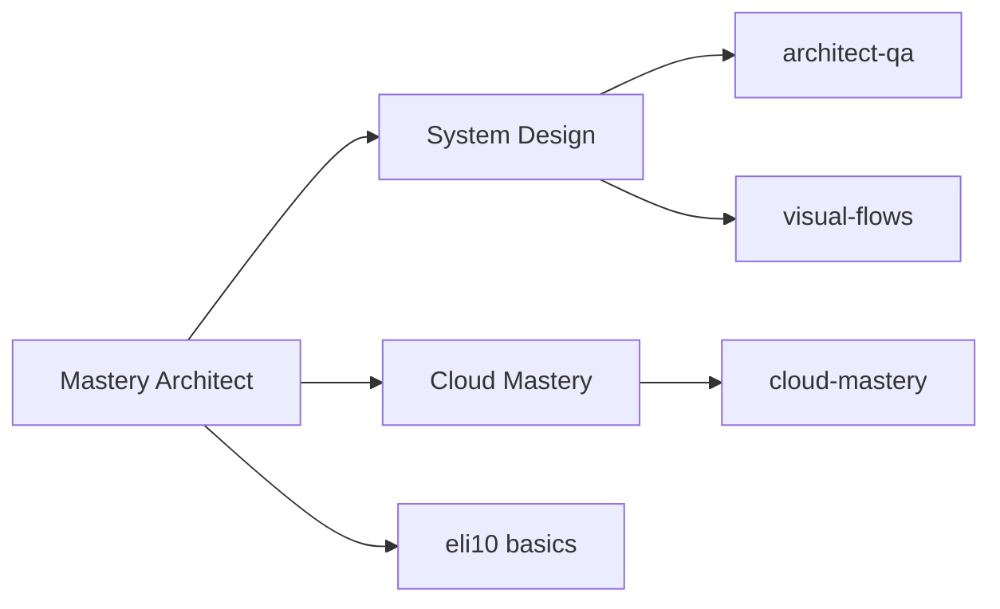
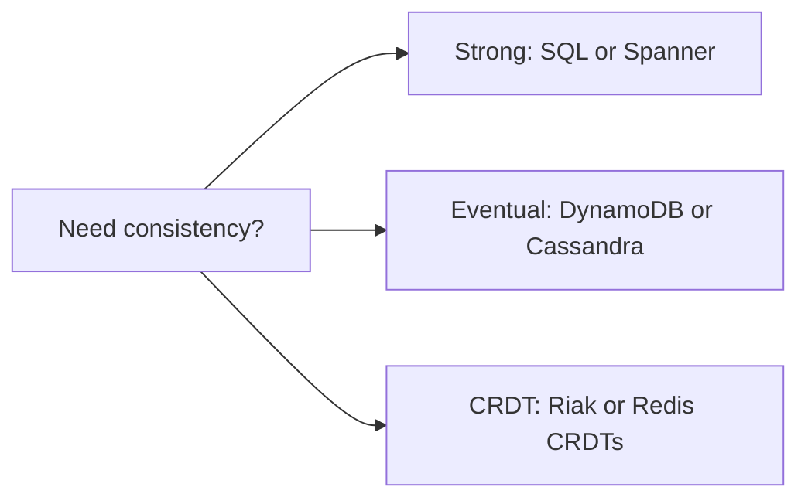
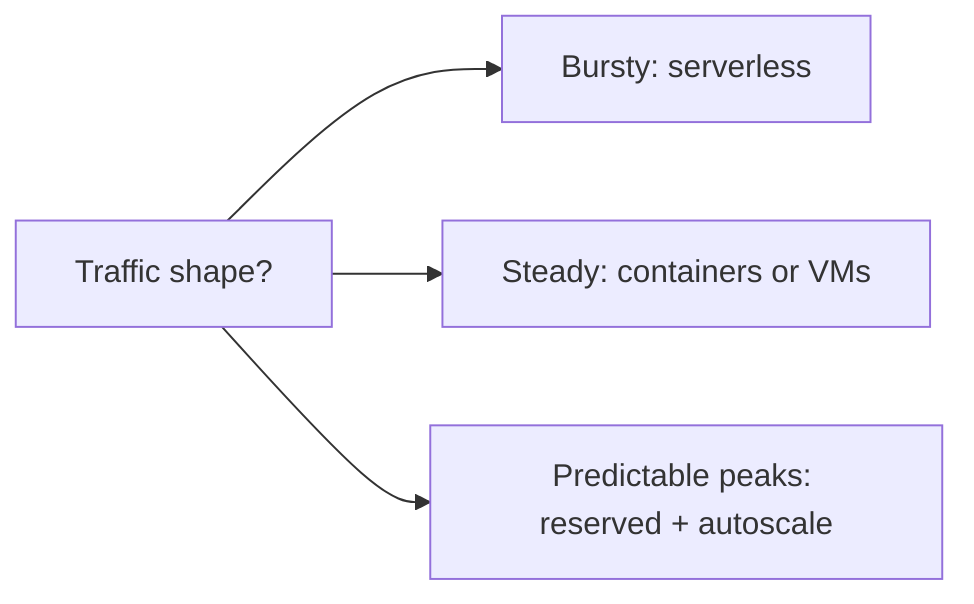
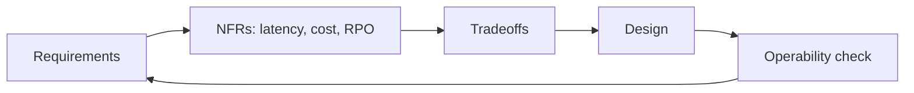

# Mastery Architect — System Design and Cloud Architecture

A focused mastery folder for senior architect interview prep covering distributed systems,
multi-region cloud patterns, capacity math, and platform engineering at scale.

## Index

| File | Topic | Audience |
|------|-------|----------|
| `architect-qa.md` | 60+ deep architect Q&A: multi-region, leader election, idempotency, CRDTs, capacity, blast radius | Staff/Principal |
| `eli10.md` | Distributed concepts explained for 10-year-olds with analogies + diagrams | All levels |
| `visual-flows.md` | 12 mermaid flowcharts for core patterns: retry, saga, CQRS, ES, rate limit, bulkhead | All levels |
| `cloud-mastery.md` | 40+ Q&A on AWS/GCP/Azure VPC, IAM, multi-account, serverless, Well-Architected | Cloud architects |

## Org Chart

## How to Use

1. **Foundations first** — read `eli10.md` to anchor mental models in plain analogies.
2. **Visual recall** — skim `visual-flows.md` before any whiteboard interview; redraw 3 from memory.
3. **Depth pass** — `architect-qa.md` for distributed-systems interviews (Staff/Principal level).
4. **Cloud breadth** — `cloud-mastery.md` for cloud architect / SA roles (AWS/GCP/Azure parity).

## Reading Plan (5 days)

| Day | File | Time |
|-----|------|------|
| 1 | eli10.md | 45 min |
| 2 | visual-flows.md | 60 min |
| 3 | architect-qa.md (Q1-30) | 90 min |
| 4 | architect-qa.md (Q31-60) | 90 min |
| 5 | cloud-mastery.md | 120 min |

## Core Themes

- **Resilience over availability** — 99.999% sounds good until correlated failure
- **Idempotency is non-negotiable** at-least-once delivery is the world we live in
- **Blast radius** is a design output, not an accident
- **Cost is a non-functional requirement** — design with $/req in mind
- **Operability** — if on-call hates it, it will fail at 3am
- **Change management** — most outages are self-inflicted via deploys/config

## Quick-Reference Decision Matrix

## Anti-Patterns Catalog

| Anti-Pattern | Why It Hurts |
|--------------|--------------|
| Distributed monolith | All the pain of distributed, none of the isolation |
| Shared database across services | Coupling at the worst layer |
| Sync chains across regions | Latency multiplies, fate sharing |
| No idempotency keys | Duplicate billing, double-shipped orders |
| One giant Kubernetes cluster | Blast radius = entire company |
| Trusting wall-clock for ordering | Clock skew breaks invariants |
| Retry without backoff+jitter | Thundering herd takes you down |
| Caching without invalidation plan | Stale data forever |

## Capacity Cheat Sheet

| Item | Rule of Thumb |
|------|---------------|
| 1 RPS sustained | ~86k req/day |
| 1k RPS | ~86M req/day, ~2.6B/month |
| Disk IOPS (SSD) | 10k-100k per device |
| HDD IOPS | ~150 |
| Cross-region RTT | 60-200 ms typical |
| Same-AZ RTT | < 1 ms |
| Memory access | ~100 ns |
| SSD random read | ~100 us |
| Network round trip same DC | ~500 us |

## Critical Rules (Top 10)

1. Design for failure first; happy-path is the easy part.
2. Every external call has timeout, retry budget, and circuit breaker.
3. Idempotency keys on all mutating endpoints.
4. Multi-region is a quarterly DR drill, not a slide deck.
5. SLOs drive engineering effort; SLA is a contract.
6. Budget error budget — burn it on changes, not surprises.
7. Cost per transaction is an architectural metric.
8. One service per database table boundary or you bought a monolith.
9. Async > sync for cross-domain calls.
10. Observability before features — you cannot fix what you cannot see.

## Glossary (Quick)

- **RPO**: data loss tolerance (e.g. 5 min)
- **RTO**: recovery time tolerance (e.g. 15 min)
- **MTTR**: mean time to recover
- **MTBF**: mean time between failures
- **SLI/SLO/SLA**: indicator/objective/agreement
- **Quorum**: majority required to agree
- **CAP**: Consistency, Availability, Partition-tolerance (pick 2 under partition)
- **PACELC**: extension — Else (no partition): Latency vs Consistency

## Architect Mindset

The loop never closes — every design decision feeds back into requirements clarification.

## Interview Tips (Architect Loop)

- Always restate the problem and constraints before drawing.
- Ask about scale: RPS, data size, read/write ratio, latency budget.
- Sketch the happy path, then 3 failure modes.
- Quantify: napkin-math storage, throughput, $/month.
- Discuss day-2: deploys, on-call, cost, migration.
- Trade-offs explicit: "I chose X over Y because…".
- End with: "What did I miss?" — invites collaboration.

## Related Files in Repo

- `../04-system-design/` — system design problems
- `../05-troubleshooting-scenarios/` — production incident scenarios
- `../06-questions-bank/` — broader interview Q bank

## Maintenance

- Update quarterly with new patterns and anti-patterns from real incidents.
- Add new diagrams when whiteboard sessions reveal recurring confusions.
- Cull anything not asked about in 12 months.
