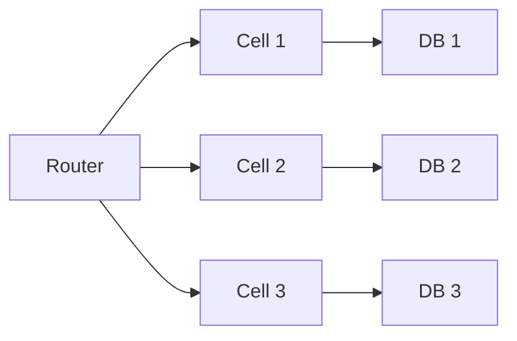
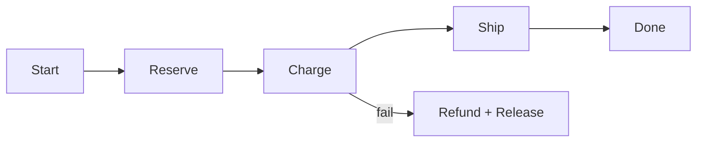

# Architect Q&A — 60+ Senior Distributed Systems Questions

Deep questions for Staff/Principal-level interviews. Each entry: question, sharp answer, follow-ups.

---

## Section A — Multi-Region Active-Active

### Q1. What does true active-active multi-region actually mean?
Both regions serve writes simultaneously without one being a hot standby. Requires either
(a) conflict-free data structures, (b) per-region sharding of write authority, or
(c) consensus across regions paying latency cost.

### Q2. Most common active-active failure mode?
Split-brain on writes after a partition. Both regions accept conflicting writes;
reconciliation requires either CRDTs, last-writer-wins (data loss), or human triage.

### Q3. How do you partition write authority by region?
Hash users to "home regions". User U writes only to home; reads can be local with
async replication. Failover changes home-region assignment in a control plane.

### Q4. RTO vs RPO trade-off in active-active?
Active-active gets near-zero RTO but RPO depends on replication lag (sync vs async).
Sync replication = strong consistency + latency penalty. Async = lower latency + RPO > 0.

### Q5. When should you NOT go multi-region?
If per-user latency is fine from one region, regulatory data residency is single-region,
and DR drills can hit < 1 hour RTO. Multi-region triples cost and quadruples complexity.

### Q6. How do you test multi-region?
Quarterly region-out game day: black-hole one region for 30 min, validate failover,
data integrity, alerting. If you don't drill, you don't have it.

---

## Section B — Leader Election

### Q7. Why elect a leader at all?
To serialize a critical operation (sequence numbers, schema migrations, scheduler).
Avoids coordination on every write while keeping a single source of truth.

### Q8. Three correct ways to elect a leader?
(1) Raft/Paxos within a cluster. (2) ZooKeeper/etcd ephemeral nodes. (3) Database row
with lease + TTL. Never DIY with timeouts and "first to write wins".

### Q9. What's the lease lifetime trade-off?
Short lease = fast failover, more renewal traffic, more false leader changes.
Long lease = slower failover, longer outage if leader dies. Typical: 5-30 sec.

### Q10. How do you prevent two-leader scenarios (fencing)?
Monotonic fencing token issued by the lock service; downstream systems reject
operations carrying tokens older than the highest seen. Stops zombie leaders.

### Q11. What if leader sees split-brain and continues serving?
Leader must self-fence: lose lease renewal → stop serving immediately. Heartbeats
to lock service are non-negotiable; assume any pause means you lost lease.

### Q12. Leader election in geo-distributed systems?
Cross-region consensus is slow (200ms RTT). Better: region-local leaders with
global coordination only for cross-region invariants.

---

## Section C — Idempotent Message Processing

### Q13. Why is idempotency mandatory?
At-least-once delivery is the default in every queue (Kafka, SQS, RabbitMQ).
Network blips → redeliveries. Without idempotency, every retry corrupts state.

### Q14. Three idempotency strategies?
(1) Idempotency key + dedup table. (2) Conditional writes (if-not-exists, version match).
(3) Natural idempotency (set state to X, not increment by 1).

### Q15. How long do you keep idempotency keys?
Longer than max retry window + clock skew. Typical: 24h-7d. Use TTL store
(DynamoDB TTL, Redis EXPIRE) so you don't drown in dedup data.

### Q16. Exactly-once semantics — real or myth?
Real, but only end-to-end with effort. Kafka EOS = transactional producer + idempotent
consumer + transactional sink. Cross-system EOS = saga or 2PC. Not free, not magic.

### Q17. Side-effects (email, payment) idempotency?
Wrap the side-effect with an idempotency table commit in the same transaction as
the side-effect's local effect. For payments, use Stripe's `Idempotency-Key` header.

### Q18. Ordering guarantees in idempotent processing?
Per-key ordering via partitioning (Kafka partition by user ID). Global ordering = single
partition = no scale. Most domains tolerate per-key ordering only.

---

## Section D — CRDT vs Strong Consistency

### Q19. When CRDT?
Multi-master writes that must converge without coordination: shopping cart,
collaborative editor, presence, counters across regions.

### Q20. CRDT trade-off?
You pay in metadata size and "weird" semantics: deleted-then-re-added items resurrect
in some CRDTs; counters can over-count under specific failure orderings.

### Q21. Strong consistency cost?
Latency = quorum RTT + leader election overhead. Throughput capped by leader.
Required for: financial ledgers, unique constraints, anything with invariants.

### Q22. Hybrid: which parts strong, which eventual?
Strong: identity, money, inventory deduction. Eventual: profile, preferences,
recommendations, social graph. Map data to consistency requirement, not vice versa.

### Q23. CRDT for counters — pitfalls?
G-Counter only goes up; PN-Counter for inc/dec but harder to reason about under
partition. For exact financial counts, do not use CRDT — use a ledger with replay.

### Q24. Causal consistency — middle ground?
Vector clocks track happens-before. Cheaper than strong, stronger than eventual.
Good for collaborative apps where causality matters but global order doesn't.

---

## Section E — Capacity Planning Math

### Q25. Estimate storage for 100M users, 1KB profile, 5 years growth at 20%/yr?
Year 5 users = 100M * 1.2^5 = ~249M. 249M * 1KB = 249 GB. Add indexes ~3x = ~750 GB.
Add replicas (3x) = ~2.25 TB. Add backups (7d daily) = ~16 TB cold storage.

### Q26. Estimate RPS for 50M DAU, avg 20 actions/day, 80% in 8h peak?
50M * 20 = 1B actions/day. Peak = 0.8 * 1B / (8 * 3600) = ~28k RPS.
Burst factor 3x = ~84k peak RPS. Provision for burst.

### Q27. Bandwidth for 1M concurrent video viewers @ 5 Mbps?
1M * 5 Mbps = 5 Tbps. Way above any single CDN POP. Distribute via CDN with
edge caching; origin sees aggregated unique requests, not per-viewer.

### Q28. Database connection pool sizing?
Little's Law: pool_size = throughput * latency. 1k QPS * 50ms = 50 connections.
Add headroom 2x = 100. Watch for connection limits on DB (Postgres ~500 default).

### Q29. Cache size for 95% hit rate on Zipfian access?
Cache top ~5% of keys handles ~80% of traffic (80/20). For 95% hit, cache top 20%.
For 1B keys with 1KB values, that's 200 GB — probably need tiered cache.

### Q30. Cost back-of-envelope?
Compute: $0.05/vCPU-hr * 24 * 30 = $36/vCPU/month.
Storage: S3 $0.023/GB-month, EBS $0.10/GB-month.
Egress: $0.09/GB cross-region. Cross-region egress dominates surprise bills.

---

## Section F — Blast Radius Design

### Q31. What is blast radius?
Maximum scope of impact when a single component fails. A bad deploy taking down
one shard ≠ taking down the whole region. Design caps the blast.

### Q32. How to reduce blast radius for a multi-tenant service?
Cell-based architecture: tenants sharded into cells of N tenants each. Cell failure
impacts N, not all. Cells are independent: own DB, own deploys, own queues.

### Q33. Deploy blast radius?
Deploy to one cell first, soak, then waves of cells. A bad deploy hits one cell
worth of customers, not 100%. Combine with automatic rollback on SLO burn.

### Q34. Config change blast radius?
Treat config as code: gradual rollout, kill switch, observability per change.
Most outages come from config, not code — apply same rigor.

### Q35. Database blast radius?
Per-tenant or per-shard databases mean a corruption/lock event is isolated.
Shared DB = single fault domain across tenants.

### Q36. Network blast radius?
Per-cell VPC subnets or accounts. A misrouted security group can't cross cells.
AWS multi-account with SCPs is the strongest network isolation.

---

## Section G — Fault Domains

### Q37. Define fault domain.
A set of resources that fail together. Rack, AZ, region, account, control plane.
Spread workloads across fault domains so no single one breaks > X% of capacity.

### Q38. Common fault-domain mistakes?
(1) All replicas in one AZ. (2) Active-passive across regions but failover untested.
(3) Shared control plane (one IAM, one DNS, one CI). (4) Same provider for all DR.

### Q39. Control-plane vs data-plane fault domains?
Data plane should keep serving even if control plane is down. Cache config, embed
defaults, fail-static. Most cloud providers do this; your services should too.

### Q40. How many fault domains do I need?
Capacity_per_domain * (N - failed) >= peak_demand. For N=3 and 1 failure: each domain
sized for peak/2. For N=4: each for peak/3. Trade redundancy cost for resilience.

### Q41. Cross-fault-domain dependencies?
Audit them. A "regional" service that calls a global control plane has a hidden
single point of failure. Map all dependencies as part of design review.

---

## Section H — Deploy Lanes

### Q42. What is a deploy lane?
A pipeline that deploys to a subset of fleet (cell, region, persona) before others.
Lanes serialize risk; a regression in lane 1 never reaches lane 5.

### Q43. Canary vs blue-green vs rolling vs cell-based?
Canary: small % of traffic. Blue-green: instant cutover, easy rollback, 2x cost.
Rolling: in-place per instance, no extra cost, slower rollback. Cell: per-tenant
group; combines isolation + gradual exposure.

### Q44. Auto-rollback signals?
SLO burn rate (fast burn = 14.4x in 1h triggers rollback), error rate spike,
latency p99 above threshold, downstream alert. Rollback should be one-button.

### Q45. Database migrations in lanes?
Schema changes are forward-compatible (expand-then-contract pattern). New code
works against old schema; deploy code → migrate → deploy code that uses new schema.

### Q46. Feature flags vs deploy lanes?
Deploy lanes deploy code; flags toggle behavior. Combined: deploy dark, then ramp
flag per cell. Decouples deploy risk from feature risk.

---

## Section I — Change Management at Scale

### Q47. Why most outages are change-induced?
~70% of incidents trace to a recent deploy or config change. Stable systems break
when humans change them. Discipline change cadence and you cut MTBF dramatically.

### Q48. Change advisory boards — useful?
For high-risk changes (network, IAM, data migrations) yes. For app deploys, no —
slows down iteration. Tier changes by risk; board only on high-tier.

### Q49. Freeze windows?
Risk windows (Black Friday, end of quarter): full code freeze except security.
Reduces compounding incidents during high-revenue periods.

### Q50. Reverting vs rolling forward?
Default to revert. Roll forward only if revert is impossible (data migration).
Time-to-recover beats elegant fix; investigate after revert restores service.

### Q51. Change failure rate (CFR) — DORA metric?
% of deploys causing prod incident. Elite teams < 5%, low performers 60%+.
Track per service; high CFR signals missing tests or coupled architecture.

---

## Section J — On-Call Sustainability

### Q52. What makes on-call sustainable?
< 2 actionable pages per shift, runbooks for top 10 alerts, clear escalation,
post-incident actions tracked, rotation respects timezones.

### Q53. Page volume KPI?
Median pages per on-call shift. > 5 = burnout territory. > 10 = quit risk.
Reduce by deleting noisy alerts and fixing root causes of repeat pages.

### Q54. Alert fatigue — root cause?
Alerts on causes (CPU > 80%) instead of symptoms (user-facing latency).
Alert on SLO burn, not metrics. Page only when human action required.

### Q55. Follow-the-sun vs single-region on-call?
Follow-the-sun: lower individual burden, requires runbook discipline + handoff
process. Single region: easier coordination, brutal nights. Pick by team size.

### Q56. Runbook quality test?
A new hire can resolve a known incident in < 15 min using only the runbook.
If not, rewrite. Stale runbooks are worse than none — false confidence.

---

## Section K — Platform Engineering KPIs

### Q57. Top 5 platform KPIs?
(1) Lead time for change. (2) Deploy frequency. (3) MTTR. (4) Change failure rate.
(5) Developer NPS / time-to-first-deploy for new service.

### Q58. Self-service maturity?
Level 1: tickets. Level 2: portal with approvals. Level 3: API/CLI self-service.
Level 4: declarative GitOps. Aim for 4; not all paths get there.

### Q59. Golden path vs golden cage?
Golden path: opinionated easy way that handles 80% of needs; teams can deviate.
Cage: forced compliance, no escape hatch — kills innovation.

### Q60. How to measure platform value?
Engineer-hours saved per month vs platform-team cost. Adoption rate (services on
platform / total). Time-to-recover platform incidents (you're now critical infra).

### Q61. Platform funding model?
Centrally funded — never charge back per call early. Once mature, optional showback
helps teams understand cost. Mandatory chargeback creates perverse incentives.

### Q62. When platform team becomes a bottleneck?
Approval queues > 1 day, ticket SLA missed, teams building shadow platforms.
Fix by automating approvals, decentralizing ownership, expanding self-service.

---

## Section L — Synthesis & Mixed

### Q63. Cap a runaway query in production?
Query timeout at app + DB. pg_stat_activity + pg_cancel_backend(pid). Long term:
RLS or per-tenant connection limits, query plan caching, kill long-runners by SLO.

### Q64. Hot partition in Kafka?
Repartition by composite key (userid + bucket). Add more partitions (only future
data benefits). Producer-side load shedding for the hot key. Identify upstream cause.

### Q65. Designing for 10x growth — what bends first?
Database writes (single leader). Hot keys in cache. Egress bandwidth. On-call.
Plan: shard early, async-ify, add CDN, hire ahead of load.

### Q66. Migrate from monolith — strangler fig?
Front the monolith with a router. New endpoints land in new service.
Migrate one endpoint at a time, dual-write during cutover, retire old code.
Years not weeks; stay disciplined.

### Q67. Most common architecture mistake at $500M ARR companies?
Distributed monolith — services share a DB, deploy in lockstep, fail together.
All cost of microservices, none of the benefit. Decouple data first.

### Q68. Backpressure end-to-end?
Every async hop has bounded queue + reject policy. Drop oldest, drop newest,
or shed by priority. Without backpressure, slow consumer = OOM somewhere upstream.

---

## Quick Diagram — Cell-Based Isolation

## Quick Diagram — Saga Compensation

