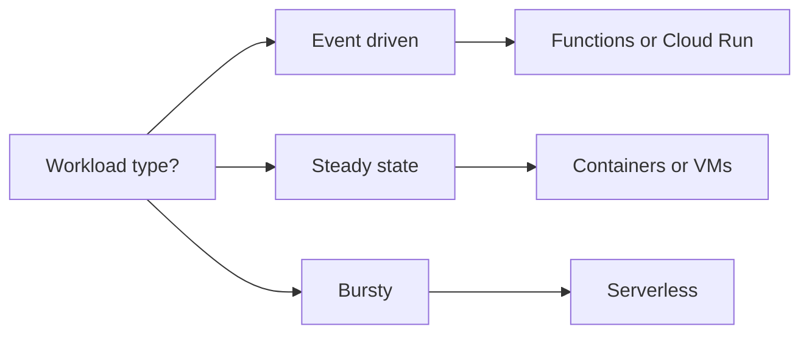
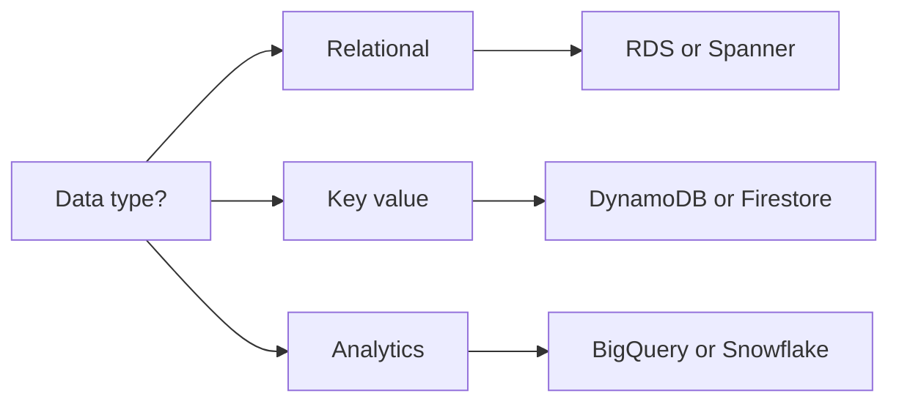

# Cloud Mastery — 40+ Q&A on AWS, GCP, and Azure Patterns

Architectural Q&A spanning the three major clouds. Cross-cloud parity included where relevant.

---

## Section A — VPC and Network Design

### Q1. Three-tier VPC layout — what subnets do you create?
Public (ALB, NAT gateway, bastion), private app (compute, no internet egress except via NAT), private data (DB, no NAT). One subnet per AZ per tier = 9 subnets minimum across 3 AZs.

### Q2. Why /20 over /24 for VPC subnets?
A /24 = 256 addresses, ~250 usable (cloud reserves 5). EKS pods can burn through that fast (one IP per pod with VPC CNI). /20 = 4096 addresses; future-proofs for pod density.

### Q3. NAT gateway vs NAT instance?
NAT gateway: managed, scales to 45 Gbps, $0.045/hr + $0.045/GB. NAT instance: cheap but you operate it, single point of failure unless HA-pair. Default to NAT gateway in production.

### Q4. VPC peering vs Transit Gateway?
Peering: 1:1, no transitive routing, simple, free between VPCs (pay for cross-AZ traffic). TGW: hub-and-spoke, transitive, supports thousands of VPCs, $0.05/hr/attachment + $0.02/GB. TGW for >5 VPCs.

### Q5. Cross-region VPC connectivity options?
TGW peering (regional TGWs peered), VPC peering across regions, AWS Cloud WAN (newer, simpler for many regions), or VPN/Direct Connect over private backbone.

### Q6. GCP equivalent of TGW?
Shared VPC + Network Connectivity Center (hub-spoke). GCP global VPCs simplify multi-region inside one VPC (unique to GCP — AWS/Azure are regional).

### Q7. Azure equivalent?
Virtual WAN (hub-and-spoke at scale) or VNet peering (pairwise). Azure VNets are also regional like AWS.

### Q8. What's an egress-only Internet Gateway?
IPv6-only outbound; blocks inbound. AWS-specific. For IPv4 you need NAT GW. GCP/Azure handle similarly with default-deny inbound on private subnets.

### Q9. PrivateLink / Private Service Connect / Private Endpoint?
Three names for same idea: connect to managed services (S3, BigQuery, Storage Account) via private IPs in your VPC. Avoids public internet, satisfies compliance, often cheaper egress.

### Q10. Pitfall: VPC endpoint costs?
Interface endpoints (PrivateLink) cost $0.01/hr/AZ + $0.01/GB. Multiplied across services and AZs, can exceed NAT GW cost. Gateway endpoints (S3, DynamoDB only) are free — use those first.

---

## Section B — IAM and Least-Privilege

### Q11. AWS IAM principals?
Users (humans, long-lived creds), roles (assumable, temporary creds), service-linked roles (managed by AWS), federated identities (SSO/OIDC). Prefer roles + federation; ban IAM users in prod.

### Q12. GCP IAM model differences?
GCP uses service accounts (not roles). Permissions granted via predefined or custom roles bound to principals at project, folder, or org level. Workload Identity = OIDC for GKE workloads.

### Q13. Azure RBAC model?
Scope (mgmt group → subscription → RG → resource), role definitions (built-in or custom), assignments. Azure AD identities. Managed Identities = service-account equivalent.

### Q14. Least privilege how — practically?
Start from CloudTrail / Cloud Audit Logs / Activity Log. Generate policy from actual API calls (AWS Access Analyzer, GCP Policy Analyzer). Deny by default; allow per-action; review quarterly.

### Q15. AWS SCPs vs IAM policies?
SCPs (Service Control Policies) attach at OU/account level, set the ceiling — even root can't exceed. IAM policies grant within the ceiling. Use SCPs for guardrails (e.g., "no us-east-1 outside DR account").

### Q16. GCP Org Policies?
Constraint-based: deny VM external IPs, require uniform bucket access, restrict allowed regions. Hierarchical inheritance. Equivalent strength to SCPs.

### Q17. Cross-account access pattern?
Principal in account A assumes a role in account B via STS:AssumeRole. Trust policy on B specifies who can assume. ExternalID for third-party access (deputy confused problem).

### Q18. Secrets — where?
AWS Secrets Manager (rotation), GCP Secret Manager, Azure Key Vault. Never in env vars, code, or container images. Mount via CSI driver or fetch at startup. Rotate quarterly minimum.

---

## Section C — Multi-Account / Multi-Project / Multi-Subscription

### Q19. AWS Organizations baseline structure?
Mgmt account (consolidated billing, no workloads), Security OU (audit, log archive), Workload OUs by environment (dev, stage, prod) and/or business unit. Control Tower automates baseline.

### Q20. Why one account per environment?
Hard isolation: blast radius capped, IAM boundaries clear, billing per environment, easy to delete. Single-account "we'll use tags" inevitably leaks.

### Q21. GCP equivalent — projects and folders?
Org → Folders (e.g., dept) → Projects (one per env per service). Project = primary isolation boundary. Hundreds of projects normal at scale.

### Q22. Azure subscriptions vs management groups?
Subscriptions = billing + RBAC boundary. Management groups = hierarchical org. Mirror your AWS OU structure with mgmt groups + subscriptions per env.

### Q23. Centralized logging across accounts?
AWS: CloudTrail org trail → central S3 bucket in log-archive account. GCP: aggregated sink at org level → BigQuery. Azure: Log Analytics workspace at hub.

### Q24. Cross-account networking — best practice?
Centralized network account owns TGW, shared VPC endpoints, central egress. Workload accounts attach to TGW. Reduces NAT/endpoint costs and simplifies governance.

---

## Section D — Serverless vs Containers

### Q25. When Lambda over ECS/EKS?
Bursty/sporadic workload (< 25% utilization), event-driven (S3, SQS, EventBridge), no long-running connections, cold-start tolerable. Cost crossover ~250ms * X requests/month vs 1 container.

### Q26. When containers over Lambda?
Sustained traffic, > 15 min jobs, custom runtimes, websocket servers, ML inference with GPU, predictable cost at scale, multi-process needs.

### Q27. Lambda cold start — mitigations?
Provisioned concurrency (defeats the cost model for low traffic), SnapStart for Java, smaller packages, init outside handler, ARM (Graviton) faster cold start. Or stop fighting and use Fargate.

### Q28. GCP Cloud Run vs Cloud Functions?
Cloud Functions = single-purpose, event-driven, smaller package. Cloud Run = container, scales to zero, websockets supported, longer timeout (60 min). Cloud Run is the modern default.

### Q29. Azure Functions vs Container Apps?
Functions = event-driven serverless. Container Apps = managed Kubernetes-light with KEDA scaling. Container Apps is closer to Cloud Run; AKS for full K8s.

### Q30. Step Functions / Workflows / Logic Apps — when?
Orchestrating multi-step workflows with retry, branching, human approval. Saves you writing state machine code. Pricier per state transition; use for low-volume, complex flows.

---

## Section E — Cost Optimization

### Q31. Top 5 AWS cost levers?
Savings Plans / Reserved Instances (1-3 year commit), Spot for stateless workloads (90% off), right-sizing (CloudWatch + Compute Optimizer), S3 Intelligent-Tiering, gp3 over gp2 EBS (20% cheaper, faster).

### Q32. Cross-region egress trap?
$0.02/GB AWS, $0.08-0.12/GB cross-continent. A chatty service replicating logs to a central account in another region can dominate the bill. Aggregate locally, ship summaries.

### Q33. NAT gateway data transfer cost?
$0.045/GB through NAT. A pull-image-on-every-restart anti-pattern costs more in NAT than ECR pulls themselves. Use VPC endpoints (free for S3/ECR gateway endpoints).

### Q34. GCP cost-optimization patterns?
Committed Use Discounts (CUDs), preemptible/Spot VMs, regional persistent disks, BigQuery flat-rate vs on-demand, lifecycle policies on GCS, sustained-use discounts (automatic).

### Q35. Azure cost levers?
Reserved Instances, Azure Hybrid Benefit (BYOL Windows/SQL), Spot VMs, Cosmos autoscale RU/s, lifecycle on Storage, Cost Management + Advisor recommendations.

### Q36. Showback vs chargeback?
Showback: visibility, no penalty (early stage). Chargeback: actual billing to teams (mature). Tag everything (cost center, env, owner) — untagged spend is mystery spend.

### Q37. Right-sizing approach?
Trailing 30-day utilization. Resize when sustained < 40% CPU/memory. Cloud-native tooling: AWS Compute Optimizer, GCP Recommender, Azure Advisor. Reduce 30%, monitor 1 week, repeat.

### Q38. Common surprise bill cause?
(1) NAT egress from container pulls. (2) Cross-AZ data transfer in chatty microservices. (3) Idle Load Balancers (~$20/mo each, multiplied). (4) Snapshots never deleted. (5) Forgotten dev env left running.

---

## Section F — Well-Architected Pillars

### Q39. AWS Well-Architected — six pillars?
Operational Excellence, Security, Reliability, Performance Efficiency, Cost Optimization, Sustainability. Use the Well-Architected Tool to self-assess; quarterly review.

### Q40. GCP Architecture Framework pillars?
System design, Operational excellence, Security/privacy/compliance, Reliability, Cost optimization, Performance optimization. Almost identical to AWS.

### Q41. Azure Well-Architected Framework?
Cost, Operational Excellence, Performance Efficiency, Reliability, Security. Five pillars; same intent. Azure Advisor cross-references.

### Q42. Top reliability tenet across all three?
Design for failure: multi-AZ minimum, multi-region for tier-1, automated failover tested in drills, RPO/RTO defined per workload, chaos engineering discipline.

### Q43. Top security tenet?
Identity at the perimeter (zero-trust), least privilege, encrypt in transit + at rest, log everything to immutable storage, automated detection (GuardDuty, SCC, Defender).

### Q44. Sustainability — real or marketing?
Real: measure carbon (AWS Customer Carbon, GCP Carbon Footprint, Azure Emissions), pick low-carbon regions (Iowa, Frankfurt, Sweden), schedule batch in low-carbon hours, right-size relentlessly.

---

## Section G — Specific Service Patterns

### Q45. S3 bucket — security baseline?
Block Public Access org-wide, encryption with KMS CMK, bucket policy enforcing TLS, versioning + MFA delete for critical, Object Lock for compliance, access logs to separate bucket.

### Q46. RDS HA architecture?
Multi-AZ deployment (sync standby in another AZ), read replicas in same/other regions, automated backups + PITR, parameter group tuned, performance insights enabled.

### Q47. DynamoDB partition key design?
High cardinality, evenly accessed. Avoid hot keys (timestamp prefix bad). Use composite keys (PK = userid, SK = timestamp). Use adaptive capacity but don't rely on it.

### Q48. GCP Spanner vs BigQuery?
Spanner = transactional, global SQL, strong consistency, $$$. BigQuery = analytical, columnar, serverless, cheap. Spanner for OLTP at planetary scale; BQ for analytics.

### Q49. Azure Cosmos DB — consistency models?
Five levels: Strong, Bounded Staleness, Session (default), Consistent Prefix, Eventual. Pick the weakest that meets requirement; cheaper and faster.

### Q50. CloudFront / Cloud CDN / Azure Front Door — common patterns?
Edge cache static, origin shield to reduce origin load, signed URLs for private content, Lambda@Edge / Cloud Run / Front Door rules for header manipulation, WAF integration.

---

## Section H — Container and Kubernetes

### Q51. EKS vs GKE vs AKS — biggest difference?
GKE Autopilot is most managed (no node ops). EKS = most flexible, weakest defaults. AKS = best Windows + Active Directory integration. All converge on the K8s API.

### Q52. Pod IP exhaustion — common in AWS?
VPC CNI assigns ENI IPs to pods. /24 subnet = 250 IPs = ~200 pods per node. Use prefix delegation, larger subnets, or custom CNI (Calico).

### Q53. Cluster autoscaling — cost trap?
Karpenter (AWS) provisions right-sized nodes per pod requests. Without it, you over-provision. Set conservative pod requests, use Karpenter to consolidate, scale down empty nodes fast.

### Q54. Multi-region K8s — yes or no?
Federation is mostly dead. Better: independent clusters per region, GitOps push same manifests, global load balancer routes. Don't try to "one cluster across regions".

### Q55. Pod security baseline?
Non-root user, read-only root FS, drop all capabilities, NetworkPolicy default-deny, PodSecurity admission `restricted` profile, resource limits always set, image scanning in CI.

---

## Section I — Disaster Recovery

### Q56. Four DR strategies (AWS terminology)?
Backup & Restore (cheapest, RTO hours), Pilot Light (minimal infra running, RTO 10s of minutes), Warm Standby (scaled-down full env, RTO minutes), Multi-Site Active-Active (RTO seconds).

### Q57. RPO vs RTO — how to choose?
Driven by business impact. Banking transactions: RPO seconds, RTO minutes. Marketing site: RPO hours, RTO hours. Each tier has cost; do not over-engineer tier-3 systems.

### Q58. DR drill cadence?
Quarterly minimum for tier-1, annually for tier-2. Untested DR is documented hope. Drill includes: failover, validate, fail back, write postmortem.

### Q59. Backup pitfalls?
Backups in same region as data (region failure = no backups). Backups never restore-tested. Encryption keys lost = data lost. Retention misaligned with compliance (GDPR).

### Q60. Multi-cloud DR — worth it?
Rarely. Adds complexity for theoretical resilience to a multi-decade-rare provider failure. Better: multi-region + disciplined backups. Multi-cloud only if compliance mandates or data sovereignty.

---

## Cross-Cloud Service Mapping

| Need | AWS | GCP | Azure |
|------|-----|-----|-------|
| Object storage | S3 | GCS | Blob Storage |
| Managed K8s | EKS | GKE | AKS |
| Serverless functions | Lambda | Cloud Functions | Functions |
| Container serverless | App Runner / Fargate | Cloud Run | Container Apps |
| Managed SQL | RDS / Aurora | Cloud SQL / Spanner | SQL DB / Cosmos |
| NoSQL | DynamoDB | Firestore / Bigtable | Cosmos DB |
| Event bus | EventBridge | Eventarc / Pub/Sub | Event Grid |
| Queue | SQS | Pub/Sub | Service Bus |
| Streaming | Kinesis / MSK | Pub/Sub / Dataflow | Event Hubs |
| Secrets | Secrets Manager | Secret Manager | Key Vault |
| CDN | CloudFront | Cloud CDN | Front Door / CDN |
| Identity | IAM + IAM IdC | Cloud IAM | Entra ID + RBAC |
| Org guardrails | SCP + Control Tower | Org Policy | Mgmt Groups + Policy |

## Decision Frameworks

<!-- mermaid:rendered -->

Mermaid source

<!-- mermaid:rendered -->

Mermaid source

## Anti-Patterns (Cloud Edition)

| Anti-Pattern | Cost / Risk |
|--------------|-------------|
| Public S3 bucket "by accident" | Data breach |
| IAM user with admin in prod | Credential leak = takeover |
| Single region for tier-1 | Region outage = business outage |
| No tagging | No cost attribution, mystery bill |
| Snapshots never expired | Slow storage growth, surprise bill |
| Cross-region chatty calls | Egress dominates compute cost |
| One giant cluster, all tenants | Blast radius = whole business |
| Manual click-ops in prod | Audit gap, no rollback |
| Plain-text secrets in env vars | Leaked in logs/dumps |
| LB per microservice | $20/mo x 100 services = $24k/yr |

## 12-Step Cloud Architecture Review

1. Map every account/project/subscription.
2. Diagram VPC/VNet/Networks with fault domains.
3. Inventory IAM principals, roles, key bindings.
4. List all data stores: type, region, encryption, backup.
5. Identify tier-1 workloads and their RPO/RTO.
6. Map cross-region/cross-cloud dependencies.
7. Audit security baseline (encryption, public exposure).
8. Cost report by account/service, top 10 spenders.
9. Tag coverage and untagged spend.
10. DR drill last-completed dates per workload.
11. On-call coverage and runbook coverage.
12. Open compliance gaps (SOC2, HIPAA, PCI as relevant).

## Closing Notes

Cloud architecture is mostly about **trade-offs and discipline**, not magic services. The
companies that win on cloud have boring architecture, ruthless tagging, drilled DR, and
tight cost reviews. The ones that lose chase shiny services and pay 3x for it.

Pick one cloud as primary, get deep, learn the others by mapping equivalents.
