# ELI10 — Distributed Systems for 10-Year-Olds

Each concept has: simple analogy, real meaning, mermaid diagram, sample command/snippet.

---

## 1. Replication

**Analogy:** Every kid in the classroom has their own copy of the homework sheet.
If one kid loses theirs, the others still have it. The teacher can ask any kid for the answer.

**Real:** Data is copied across multiple servers (called replicas). If one server dies,
others still have the data. Reads can hit any replica for speed.

<!-- mermaid:rendered -->
<p align="center"></p>

<details><summary>Mermaid source</summary>

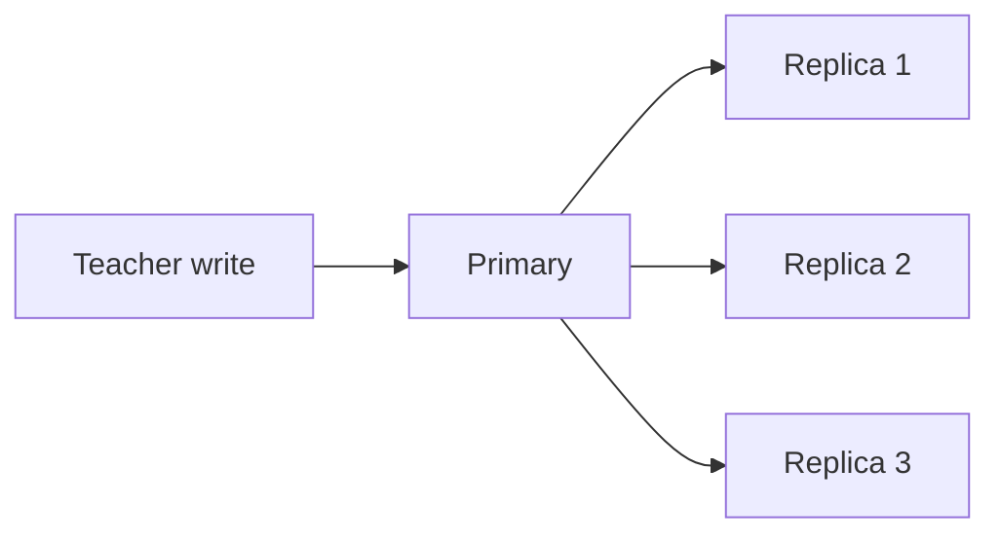

</details>

**Snippet:**
```bash
# Postgres streaming replication setup (primary side)
echo "wal_level = replica" >> postgresql.conf
echo "max_wal_senders = 5" >> postgresql.conf
```

---

## 2. Sharding

**Analogy:** Every kid only carries part of the toy collection home. Sara has all the dolls,
Sam has all the cars, Lin has all the puzzles. To find a toy, you ask the right kid.

**Real:** Data is split (sharded) across servers based on a key. Each server only stores its
slice. To find data, the router computes which shard to ask.

<!-- mermaid:rendered -->
<p align="center"></p>

<details><summary>Mermaid source</summary>

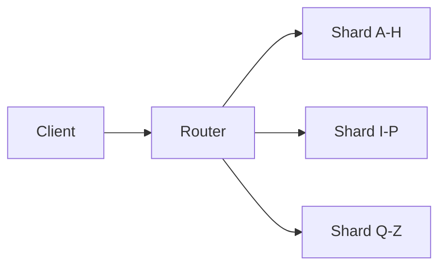

</details>

**Snippet:**
```python
def shard_for(user_id, num_shards=4):
    return hash(user_id) % num_shards
```

---

## 3. Eventual Consistency

**Analogy:** When the principal makes an announcement, every classroom hears it within a few
minutes — not all at the exact same second. Eventually everyone knows.

**Real:** A change made on one server takes a tiny bit of time to spread to the others.
For a moment, different servers may show different answers. Eventually they all agree.

<!-- mermaid:rendered -->
<p align="center"></p>

<details><summary>Mermaid source</summary>

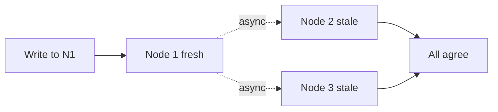

</details>

**Snippet:**
```bash
# DynamoDB eventually consistent read default
aws dynamodb get-item --table users --key '{"id":{"S":"u1"}}'
# strongly consistent read costs more
aws dynamodb get-item --table users --key '{"id":{"S":"u1"}}' --consistent-read
```

---

## 4. Quorum

**Analogy:** Class wants to pick a snack. With 5 kids, you need at least 3 to vote yes for it
to count. Majority wins. Even if 2 kids are absent, the vote is still valid.

**Real:** A quorum is the minimum number of nodes that must agree before an operation is
considered done. For 5 nodes, quorum = 3 (majority). Survives 2 failures.

<!-- mermaid:rendered -->
<p align="center"></p>

<details><summary>Mermaid source</summary>

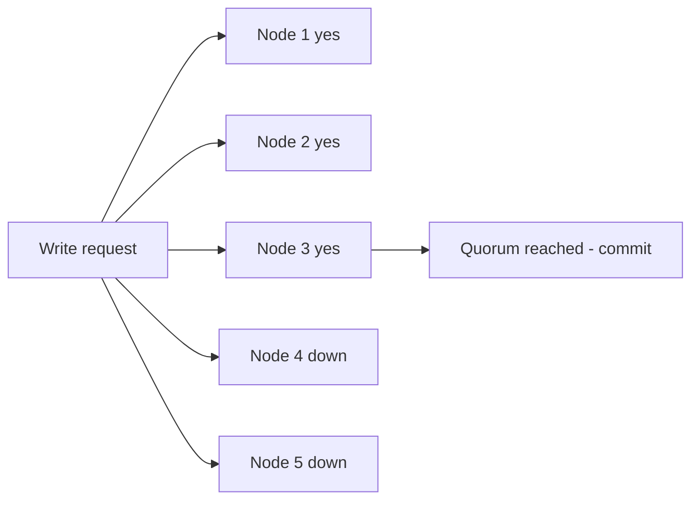

</details>

**Snippet:**
```yaml
# etcd cluster of 5 - tolerates 2 failures
# quorum = (5/2) + 1 = 3
etcd --initial-cluster=n1=...,n2=...,n3=...,n4=...,n5=...
```

---

## 5. Circuit Breaker

**Analogy:** If the slide on the playground is broken, kids stop trying it for a while.
Every 5 minutes one kid checks if it's fixed. If yes, everyone uses it again.

**Real:** When a downstream service keeps failing, the client stops calling it for a cooldown
period. Saves resources and gives the broken thing time to recover. Periodically retries.

<!-- mermaid:rendered -->
<p align="center"></p>

<details><summary>Mermaid source</summary>

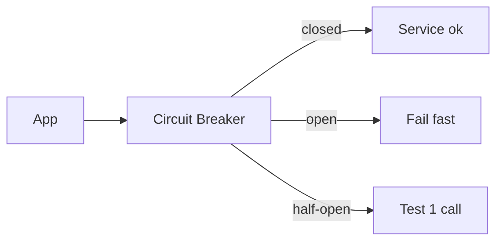

</details>

**Snippet:**
```python
from pybreaker import CircuitBreaker
cb = CircuitBreaker(fail_max=5, reset_timeout=30)

@cb
def call_payment_api():
    return requests.post("https://pay/charge")
```

---

## 6. Leader Election

**Analogy:** In a relay race, only one kid is the team captain at a time. The captain
decides who runs which leg. If the captain leaves, the team votes for a new captain.

**Real:** In a cluster, one node is chosen to be the leader (handles all writes or makes
decisions). If the leader dies, the others run an election to pick a new one.

<!-- mermaid:rendered -->
<p align="center"></p>

<details><summary>Mermaid source</summary>

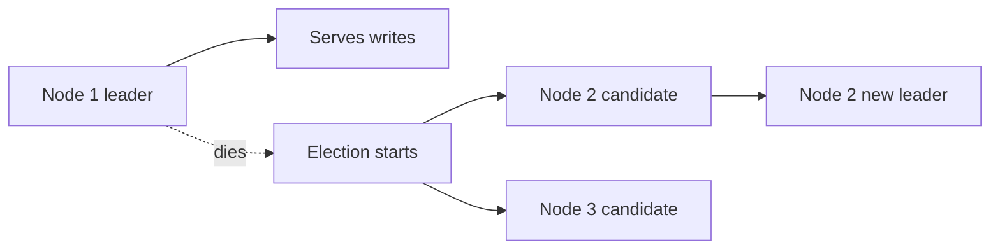

</details>

**Snippet:**
```bash
# kubectl shows leader election in kube-controller-manager
kubectl get lease -n kube-system kube-controller-manager -o yaml
```

---

## 7. Load Balancing

**Analogy:** When 30 kids show up to the ice cream truck, the worker waves them into 3 lines
so each line stays short. No one line gets all the kids.

**Real:** A load balancer spreads incoming requests across multiple servers so no single
server gets overwhelmed. Common strategies: round-robin, least-connections, hash-based.

<!-- mermaid:rendered -->
<p align="center"></p>

<details><summary>Mermaid source</summary>

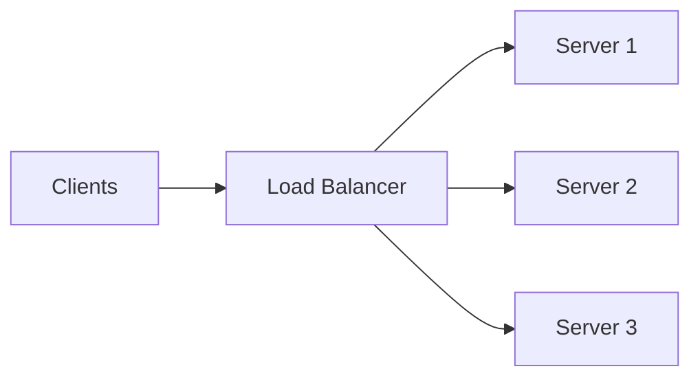

</details>

**Snippet:**
```nginx
upstream backend {
    least_conn;
    server app1:8080;
    server app2:8080;
    server app3:8080;
}
```

---

## 8. Caching

**Analogy:** You keep your favorite snack in your desk drawer instead of walking to the
kitchen every time. Faster to grab from the drawer (cache) than the kitchen (database).

**Real:** Frequently-read data is stored close to the consumer (in memory) so we don't
have to hit the slow database every time. Cache hit = fast; cache miss = fetch and store.

<!-- mermaid:rendered -->
<p align="center"></p>

<details><summary>Mermaid source</summary>

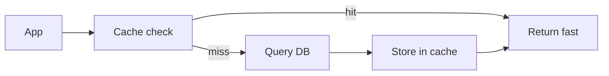

</details>

**Snippet:**
```python
import redis
r = redis.Redis()
val = r.get("user:42")
if not val:
    val = db.fetch_user(42)
    r.setex("user:42", 300, val)
```

---

## 9. Message Queue

**Analogy:** When you give the lunch lady your order, she writes it on a ticket and puts it
in a line. Cooks pick up tickets one at a time and make the food. You don't wait at the counter.

**Real:** Producers send messages to a queue. Consumers pick them up and process them
asynchronously. Decouples sender from receiver; smooths bursts.

<!-- mermaid:rendered -->
<p align="center"></p>

<details><summary>Mermaid source</summary>

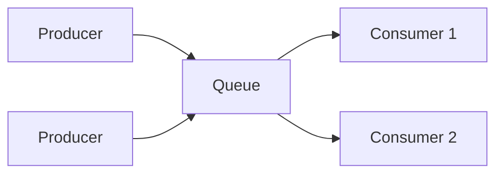

</details>

**Snippet:**
```bash
# RabbitMQ basic publish
rabbitmqadmin publish exchange=amq.default routing_key=orders payload="order123"
```

---

## 10. Rate Limiting

**Analogy:** The cafeteria gives each kid 2 cookies max. If you ask for a 3rd, the lunch
lady says "no, come back tomorrow". Stops one greedy kid eating all the cookies.

**Real:** Limit how many requests a client can make per time window. Protects the system
from abuse and noisy neighbors. Common: token bucket, leaky bucket, fixed window.

<!-- mermaid:rendered -->
<p align="center"></p>

<details><summary>Mermaid source</summary>

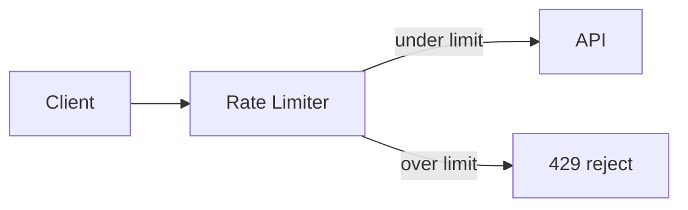

</details>

**Snippet:**
```python
# nginx rate limit
# limit_req_zone $binary_remote_addr zone=api:10m rate=10r/s;
# location /api { limit_req zone=api burst=20 nodelay; }
```

---

## 11. CDN

**Analogy:** Instead of one ice cream truck for the whole town, there are little freezers in
every neighborhood. Closer = faster ice cream. The factory only makes new flavors.

**Real:** A Content Delivery Network caches static content at edge locations close to users.
Origin server only handles cache misses and dynamic content.

<!-- mermaid:rendered -->
<p align="center"></p>

<details><summary>Mermaid source</summary>

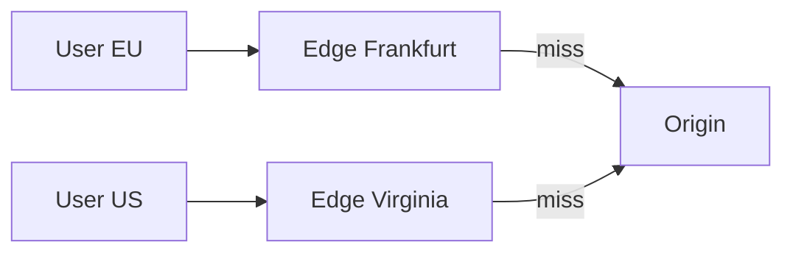

</details>

**Snippet:**
```bash
# CloudFront cache headers from origin
Cache-Control: public, max-age=86400, s-maxage=31536000
```

---

## 12. Retry with Backoff

**Analogy:** If you knock on the door and no one answers, you wait a minute and knock again.
Then 2 minutes. Then 4. You don't keep banging — you give them time to come.

**Real:** When a request fails, retry after a delay that grows (exponential backoff) plus
randomness (jitter) to avoid all clients retrying at the same instant.

<!-- mermaid:rendered -->
<p align="center"></p>

<details><summary>Mermaid source</summary>

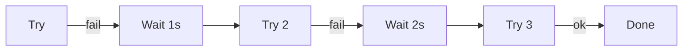

</details>

**Snippet:**
```python
import time, random
for i in range(5):
    try: return call_api()
    except: time.sleep((2 ** i) + random.random())
```

---

## 13. Heartbeat

**Analogy:** Every minute the teacher says "raise your hand if you're here". If a kid
doesn't raise their hand for 3 minutes, the teacher marks them absent.

**Real:** Nodes periodically send "I'm alive" signals to a coordinator. Missing N consecutive
heartbeats marks the node as dead and triggers failover.

<!-- mermaid:rendered -->
<p align="center"></p>

<details><summary>Mermaid source</summary>

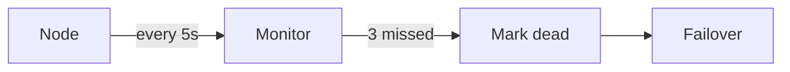

</details>

**Snippet:**
```bash
# Kubernetes liveness probe
livenessProbe:
  httpGet: { path: /health, port: 8080 }
  periodSeconds: 5
  failureThreshold: 3
```

---

## 14. Idempotency

**Analogy:** Pressing the elevator button 5 times doesn't make the elevator come 5 times.
The button only registers once. Same outcome whether you press it once or many.

**Real:** An operation is idempotent if doing it multiple times has the same effect as
doing it once. Critical for retries — without it, retries cause duplicates.

<!-- mermaid:rendered -->
<p align="center"></p>

<details><summary>Mermaid source</summary>

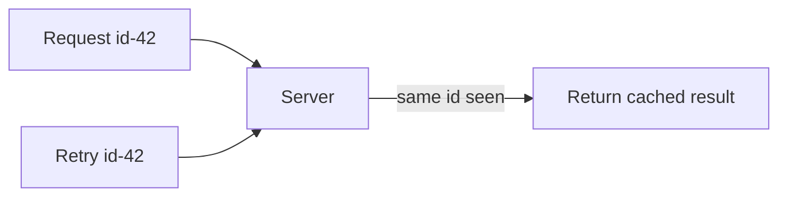

</details>

**Snippet:**
```bash
# Stripe idempotency key
curl -X POST https://api.stripe.com/v1/charges \
  -H "Idempotency-Key: order-12345" \
  -d amount=2000
```

---

## 15. Sharding vs Replication (Together)

**Analogy:** Class splits into 3 reading groups (sharding). Each group has 3 kids who all
read the same chapter (replication). Group A reads ch.1, group B ch.2, group C ch.3.

**Real:** Real systems combine both: shard for horizontal scale, replicate each shard
for fault tolerance. A 9-node cluster might have 3 shards x 3 replicas.

<!-- mermaid:rendered -->
<p align="center"></p>

<details><summary>Mermaid source</summary>

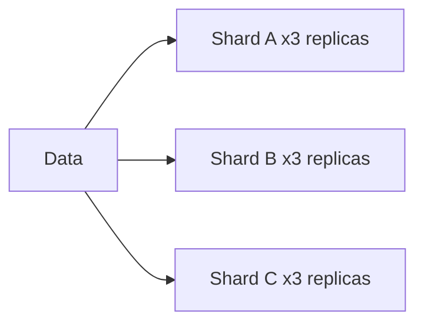

</details>

**Snippet:**
```yaml
# MongoDB sharded replica set summary
shardA: { primary: a1, secondary: [a2, a3] }
shardB: { primary: b1, secondary: [b2, b3] }
shardC: { primary: c1, secondary: [c2, c3] }
```

---

## Summary Table

| Concept | Kid Analogy | When to Use |
|---------|-------------|-------------|
| Replication | Everyone has homework copy | Survive node loss |
| Sharding | Each kid carries some toys | Scale horizontally |
| Eventual Consistency | Announcement spreads in minutes | Tolerate slight staleness |
| Quorum | Class majority vote | Decide under failure |
| Circuit Breaker | Skip broken slide | Protect from cascading failure |
| Leader Election | Team captain | Single source of truth |
| Load Balancer | Lines at ice cream truck | Spread traffic |
| Cache | Snacks in desk | Speed up frequent reads |
| Queue | Lunch ticket line | Decouple producer/consumer |
| Rate Limit | Max 2 cookies | Stop abuse |
| CDN | Local freezers | Reduce latency globally |
| Retry+Backoff | Knock and wait | Handle transient failures |
| Heartbeat | Teacher attendance | Detect dead nodes |
| Idempotency | Elevator button | Safe retries |
