# Visual Flows — 12 Mermaid Diagrams

Whiteboard-ready diagrams for core distributed-system patterns. Redraw 3 from memory before any system design interview.

---

## 1. Multi-Region Edge → App → DB Request Flow

User requests routed to nearest region; cross-region only on home-region miss.

<!-- mermaid:rendered -->


Mermaid source

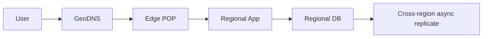

**Notes:** Edge terminates TLS. App reads local DB. Writes either go to home region or replicate via async stream. RTT user-to-edge < 50ms, edge-to-app < 10ms.

---

## 2. Retry With Exponential Backoff and Jitter

Failed requests are retried with growing delays plus random jitter to avoid thundering herds.

<!-- mermaid:rendered -->

Mermaid source

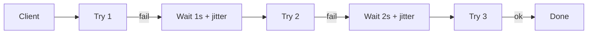

**Notes:** Cap at max retries (5) and max delay (30s). Jitter = random 0..backoff. Without jitter, all clients retry in lockstep and re-DDoS the dependency.

---

## 3. Saga (Compensation-Based Transaction)

Distributed transaction without 2PC: each step has a compensating action on failure.

<!-- mermaid:rendered -->


Mermaid source

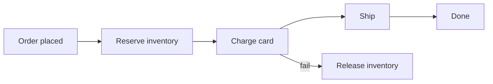

**Notes:** Compensations must be idempotent. State machine tracks step. Saga orchestrator coordinates; alternative is choreography (each service emits events).

---

## 4. CQRS (Command Query Responsibility Segregation)

Writes go through commands; reads served from optimized read models.

<!-- mermaid:rendered -->


Mermaid source

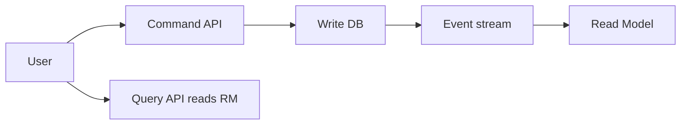

**Notes:** Read model can denormalize, materialize, or join. Eventual consistency between command and query. Used heavily with event sourcing.

---

## 5. Event Sourcing

Store every state change as an append-only event log; rebuild state by replay.

<!-- mermaid:rendered -->

Mermaid source

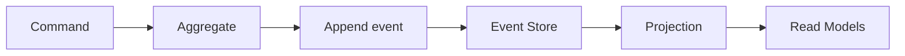

**Notes:** Snapshots speed up replay for hot aggregates. Versioning events is forever-painful — design event schemas carefully. Audit log free.

---

## 6. Rate Limiting (Token Bucket)

Each client has a bucket of tokens; each request consumes one; bucket refills at fixed rate.

<!-- mermaid:rendered -->


Mermaid source

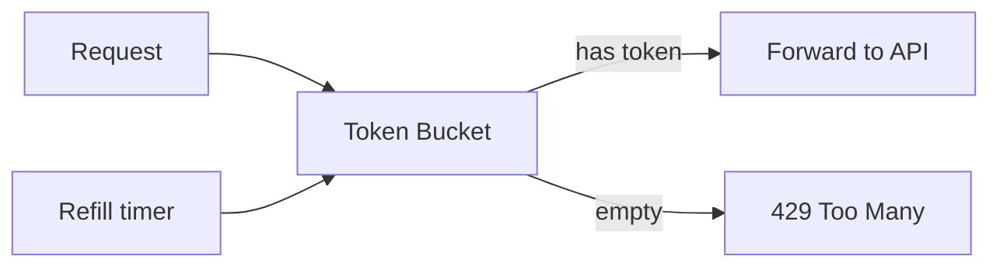

**Notes:** Bucket size = burst tolerance. Refill rate = sustained limit. Distributed implementations use Redis with Lua scripts for atomicity.

---

## 7. Bulkhead (Resource Isolation)

Partition resources so one slow dependency cannot exhaust all threads/connections.

<!-- mermaid:rendered -->


Mermaid source

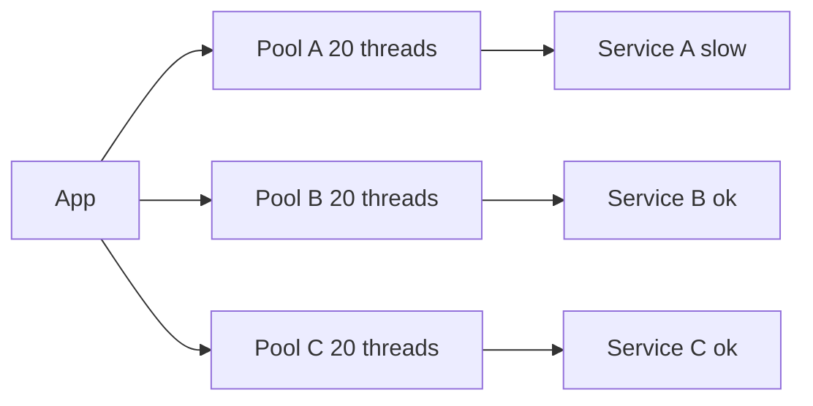

**Notes:** A's slowness only saturates pool A. B and C keep serving. Without bulkheads, all 60 threads block on A. Hystrix/Resilience4j patterns.

---

## 8. Cache Stampede Prevention

When a hot key expires, only one fetch goes to the DB; others wait.

<!-- mermaid:rendered -->


Mermaid source

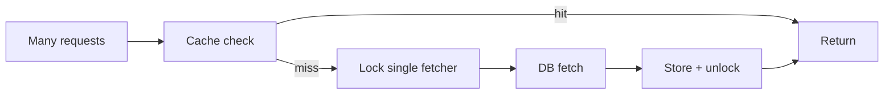

**Notes:** Use distributed lock (Redis SETNX) or "request coalescing" / singleflight pattern. Alternative: probabilistic early refresh before TTL expires.

---

## 9. Pub/Sub Fan-Out

One event published; many independent consumers process it asynchronously.

<!-- mermaid:rendered -->


Mermaid source

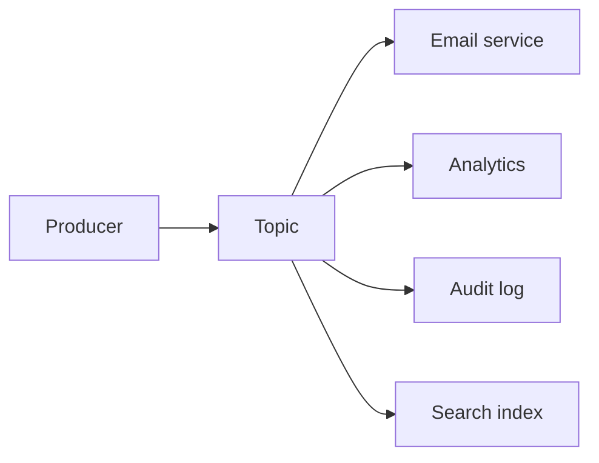

**Notes:** Each consumer has own offset; failures isolated. Add new consumers without touching producer. Backpressure handled per consumer queue.

---

## 10. Circuit Breaker State Machine

Three states: closed (normal), open (failing fast), half-open (probing recovery).

<!-- mermaid:rendered -->


Mermaid source

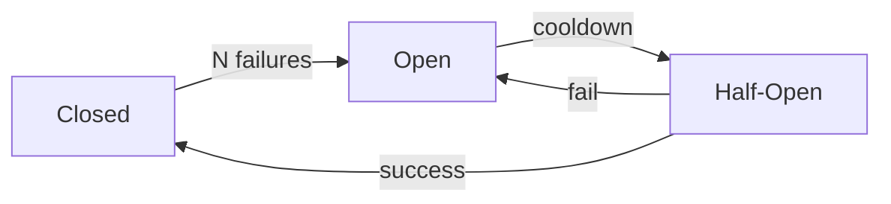

**Notes:** Closed = pass-through. Open = reject immediately, no call. Half-open = let one through to test. Failure threshold tunable per dependency.

---

## 11. Read-Through Cache

App always reads from cache; cache pulls from DB on miss.

<!-- mermaid:rendered -->


Mermaid source

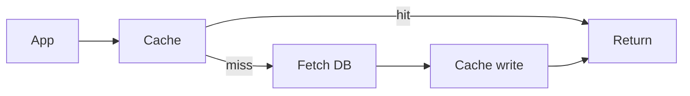

**Notes:** Simpler than cache-aside (app handles miss). Variants: write-through (DB on write), write-behind (async DB write). TTL or LRU eviction.

---

## 12. Outbox Pattern (Reliable Event Publishing)

Write business state and event in same transaction; relay publishes events from outbox.

<!-- mermaid:rendered -->


Mermaid source

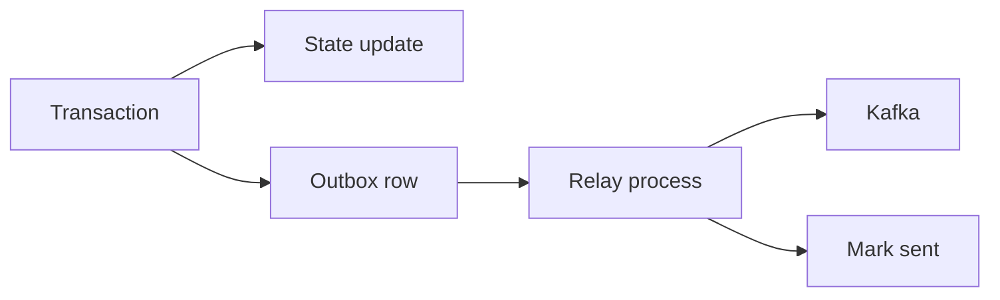

**Notes:** Solves dual-write problem (DB + Kafka can't be atomic). Relay is at-least-once → consumers must be idempotent. Debezium CDC is a common relay.

---

## Pattern Selection Cheatsheet

| Need | Pattern |
|------|---------|
| Cross-service transaction | Saga |
| Reliable event publish | Outbox |
| Slow dependency isolation | Bulkhead |
| Failing dependency | Circuit Breaker |
| Read scale | Cache + Read Replicas |
| Write scale | Sharding + CQRS |
| Audit trail / replay | Event Sourcing |
| Spike protection | Rate Limit + Backpressure |
| Burst smoothing | Queue |
| Latency to global users | CDN + Multi-Region |

---

## Composite Flow — End-to-End Order

How patterns compose for a real user order. (Simplified to 6 nodes.)

<!-- mermaid:rendered -->

Mermaid source

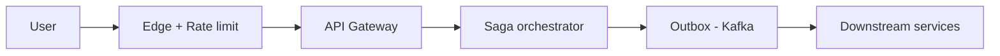

---

## Failure-Mode Drawing

When asked "what happens if X breaks?", draw the X with a red mark and trace the impact.

<!-- mermaid:rendered -->


Mermaid source

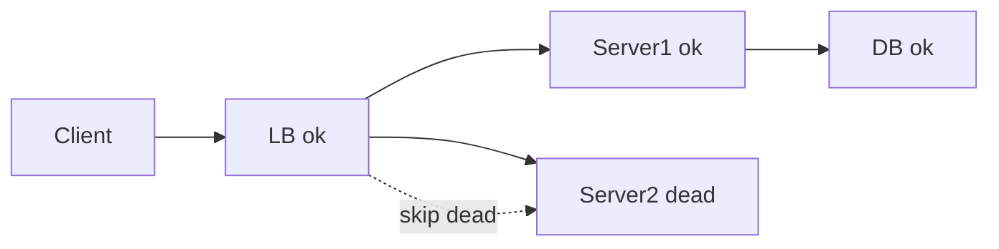

**Drawing rules:**
- Use `dead`, `slow`, `partition` labels on nodes.
- Draw the affected request path; what does the user experience?
- Then draw the recovery path: health check fails, LB removes, traffic shifts.

---

## Tips for Whiteboard Sessions

1. Always start with one box for the user, one for the system. Then expand.
2. Label arrows with protocol + sync/async (e.g. "HTTP sync", "Kafka async").
3. Mark fault domains explicitly (AZ1, AZ2, region boundaries).
4. After happy path, ask interviewer "want me to draw failure modes?"
5. Keep diagrams to ≤ 6 nodes per view; use sub-diagrams for depth.
6. Use the same node names across diagrams so the audience tracks state.
