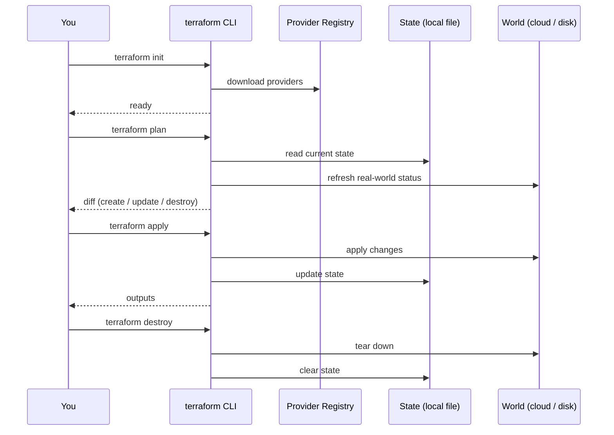

# 02 — Hello, Terraform

Your first lab. **No cloud credentials needed** — we'll generate a random pet name and write it to a local file.

## Files
- `main.tf` — uses `random` + `local_file` providers.

## The five commands you'll run forever



## Run it
```bash
cd 02-hello-world
terraform init       # downloads random + local providers
terraform plan       # shows: 2 to add
terraform apply      # type 'yes'
cat hello.txt        # → "Hello from <random-pet-name>"
terraform destroy    # type 'yes'
```

## What gets created
1. A `random_pet` resource (e.g. `clever-otter`).
2. A `local_file` resource that writes `hello.txt` on disk.

## What you'll see on disk after apply
```
.terraform/                      ← provider plugins (don't commit)
.terraform.lock.hcl              ← provider version lockfile (DO commit)
hello.txt                        ← the file we created
terraform.tfstate                ← current state (DON'T commit)
terraform.tfstate.backup         ← previous state
```

See [walkthrough.md](walkthrough.md) for a line-by-line explanation.
