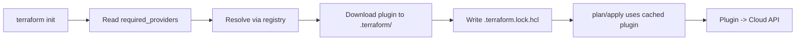

# 04 — Providers

A **provider** is a plugin that talks to an API (AWS, GCP, Kubernetes, GitHub, Datadog, even your local filesystem). Providers define **resource types** and **data sources**.

## Provider registry
- Public: <https://registry.terraform.io>
- OpenTofu mirror: <https://search.opentofu.org>
- You can also host private providers (Terraform Cloud, Artifactory, etc.).

## `required_providers`

```hcl
terraform {
  required_version = ">= 1.5.0"

  required_providers {
    aws = {
      source  = "hashicorp/aws"     # registry namespace/name
      version = "~> 5.0"            # version constraint
    }
    google = {
      source  = "hashicorp/google"
      version = "~> 5.0"
    }
    kubernetes = {
      source  = "hashicorp/kubernetes"
      version = "~> 2.30"
    }
  }
}
```

## Version constraint operators
| Operator | Meaning | Example |
|---|---|---|
| `=` | Exact | `= 5.20.0` |
| `!=` | Exclude | `!= 5.19.0` |
| `>=`, `<=`, `>`, `<` | Comparison | `>= 5.0.0` |
| `~>` | Pessimistic — last component may bump | `~> 5.0` = `>= 5.0, < 6.0`; `~> 5.20.0` = `>= 5.20.0, < 5.21.0` |

**Best practice:** pin the major version with `~>` (e.g. `~> 5.0`) and rely on `.terraform.lock.hcl` for exact reproducibility.

## Provider configuration

```hcl
provider "aws" {
  region = "eu-west-1"
}
```

Auth comes from env vars / shared config files / IAM roles — **never hardcode credentials in `.tf` files**.

## Multiple providers via `alias`
Use the same provider with different configs (multi-region, multi-account):

```hcl
provider "aws" {
  region = "eu-west-1"
}

provider "aws" {
  alias  = "us"
  region = "us-east-1"
}

resource "aws_s3_bucket" "eu_logs" {
  bucket = "eu-logs"
  # uses default provider
}

resource "aws_s3_bucket" "us_logs" {
  provider = aws.us
  bucket   = "us-logs"
}
```

## Mermaid: provider resolution flow



## Lockfile (`.terraform.lock.hcl`)
- Records the exact provider version + checksum used.
- **Commit it.** Ensures CI and teammates use the same plugin.
- Update with `terraform init -upgrade`.

## Useful first-party providers (no cloud creds)
| Provider | Use |
|---|---|
| `hashicorp/random` | Random strings, IDs, passwords |
| `hashicorp/local` | Read/write local files |
| `hashicorp/null` | `null_resource` for orchestration / `local-exec` |
| `hashicorp/time` | Sleeps, timestamps, rotating values |
| `hashicorp/tls` | Generate self-signed certs / private keys |
| `hashicorp/http` | HTTP GET as a data source |
