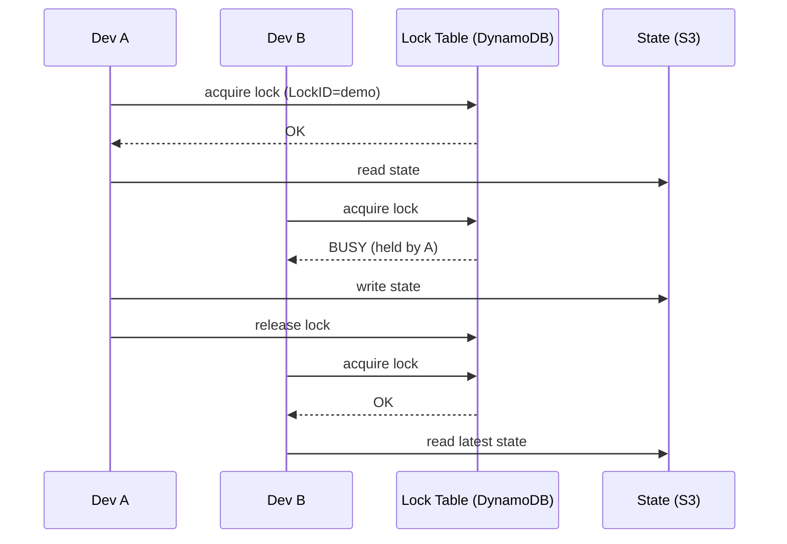

# 06 — State

Terraform's **state** maps your config to real-world resources. It's a JSON file (`terraform.tfstate`) that records "resource `aws_s3_bucket.demo` corresponds to AWS bucket ID `xyz`, with these attributes".

> Without state, Terraform has no way to know what it created last time → it would either re-create everything or do nothing.

## Local vs remote state

| | Local | Remote |
|---|---|---|
| Where | `terraform.tfstate` on your laptop | S3 / GCS / Azure Blob / Terraform Cloud |
| Multi-user | ❌ conflicts | ✅ shared |
| Locking | ❌ | ✅ (DynamoDB / native) |
| Secrets exposure | On every dev's laptop | Encrypted at rest |
| Production-ready | No | **Yes — always use remote state in prod** |

## State locking — why it matters



Without locking, two `apply`s in parallel can corrupt state.

## Backend types

| Backend | Locking via | Notes |
|---|---|---|
| `local` | OS file lock | Default. Single user only. |
| `s3` | DynamoDB table | Most common in AWS shops. |
| `gcs` | Native (GCS object versioning + lock) | Most common in GCP. |
| `azurerm` | Native (blob lease) | Azure Storage Account. |
| `remote` (Terraform Cloud) | TFC service | Free tier exists; nicest UX. |
| `http` | HTTP API | GitLab managed state, etc. |

## Example: S3 + DynamoDB
See [backend-s3.tf](backend-s3.tf). One-time setup (chicken-and-egg — create the bucket and table outside TF, or with a bootstrap config that uses local state):
```bash
aws s3 mb s3://my-tf-state-prod --region eu-west-1
aws s3api put-bucket-versioning --bucket my-tf-state-prod \
  --versioning-configuration Status=Enabled
aws dynamodb create-table --table-name tf-locks \
  --attribute-definitions AttributeName=LockID,AttributeType=S \
  --key-schema AttributeName=LockID,KeyType=HASH \
  --billing-mode PAY_PER_REQUEST --region eu-west-1
```

## Migrating local → remote
```bash
# 1. Add backend block to your config
# 2. Re-init; TF detects the change and offers to copy
terraform init -migrate-state
```

## State surgery — when things go wrong

| Command | Purpose |
|---|---|
| `terraform state list` | List all tracked resources. |
| `terraform state show <addr>` | Inspect attributes. |
| `terraform state mv <src> <dst>` | Rename without destroy/recreate (e.g. after refactoring). |
| `terraform state rm <addr>` | Forget a resource (does NOT delete it in cloud). |
| `terraform import <addr> <id>` | Bring an existing cloud resource under TF management. |
| `terraform refresh` | Sync state with reality (no changes applied). |
| `terraform state pull` | Dump remote state to stdout. |
| `terraform state push` | Upload edited state (dangerous!). |

## Golden rules
1. **Never** edit `terraform.tfstate` by hand.
2. **Always** back it up before surgery (`terraform state pull > backup.tfstate`).
3. **Never** commit state to git — it contains plaintext secrets.
4. **Always** enable state locking in production.
5. **Always** enable bucket versioning on the state backend (point-in-time recovery).
