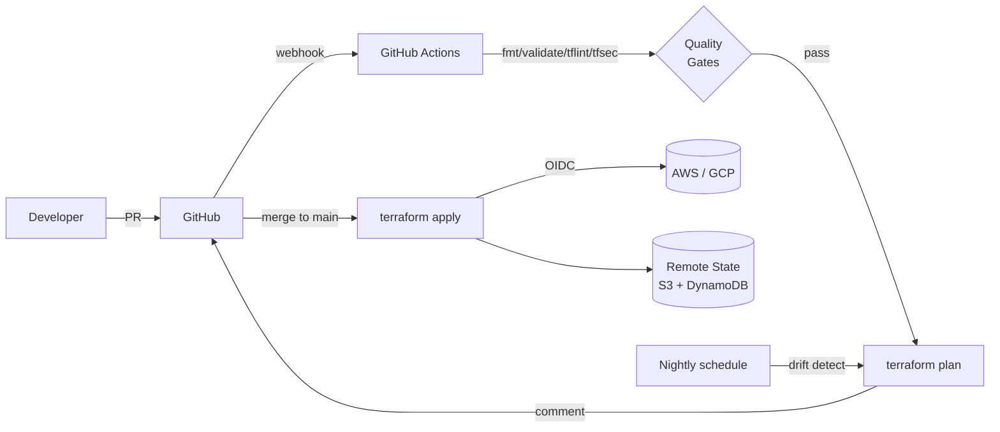

# 14 — Production Best Practices

A condensed list of patterns that separate "works on my laptop" from "runs the company".

## 1. Code organization
- **One stack per logical boundary.** Network, data, app — separate state files. Faster plans, smaller blast radius.
- **Modules for repetition, not abstraction.** Don't wrap a single resource. Do wrap a logical group used 3+ times.
- **`envs/{dev,staging,prod}/`** layout > workspaces for prod.
- **Pin versions** of TF, providers, and modules. Always.
- **Commit `.terraform.lock.hcl`.** Never commit `.terraform/` or `*.tfstate*`.

## 2. State
- **Remote backend with locking.** S3+DynamoDB / GCS / Azure Blob / TFC.
- **Versioning enabled** on the backend bucket → point-in-time recovery.
- **Encryption at rest** (KMS / native).
- **Restrict access** to state — it contains secrets.
- **Backup before surgery** (`terraform state pull > backup.tfstate`).

## 3. Secrets
- **Never** hardcode in `.tf` or commit `.tfvars` files.
- Use `sensitive = true` on variables and outputs.
- Pull secrets at apply time from Vault, AWS Secrets Manager, GCP Secret Manager (via `data` sources).
- In CI: GitHub Actions secrets / OIDC short-lived tokens.

## 4. Variables
- **Validate inputs** with `validation { ... }` blocks.
- Use `object()` types instead of many flat variables — easier to extend.
- Use `default_tags` (AWS) / `labels` (GCP) at the provider level.

## 5. Lifecycle rules
```hcl
resource "aws_db_instance" "main" {
  # ...
  lifecycle {
    prevent_destroy       = true
    create_before_destroy = true
    ignore_changes        = [password]
  }
}
```
| Rule | Purpose |
|---|---|
| `prevent_destroy` | Hard guard against `terraform destroy` deleting prod data. |
| `create_before_destroy` | Zero-downtime replacement (new resource up before old goes down). |
| `ignore_changes` | TF won't try to fix drift on listed attrs (e.g. AMI auto-updates, password rotated externally). |

## 6. Data sources > hardcoded IDs
```hcl
data "aws_ami" "ubuntu" {
  most_recent = true
  owners      = ["099720109477"]
  filter {
    name   = "name"
    values = ["ubuntu/images/hvm-ssd/ubuntu-jammy-22.04-amd64-server-*"]
  }
}

resource "aws_instance" "app" {
  ami = data.aws_ami.ubuntu.id
}
```

## 7. Quality gates (every PR)
```
fmt -check → validate → tflint → tfsec/checkov → plan
```

## 8. Apply discipline
- Always review the plan before apply.
- Use `terraform apply tfplan` (saved plan) — apply what was reviewed.
- Prefer `-target` only for emergencies — it's a footgun.
- Never `-auto-approve` in prod from a human's terminal.

## 9. Drift detection
Run `terraform plan` on a schedule. Non-zero diff = someone clicked in the console.

## 10. Documentation
- `terraform-docs` auto-generates module READMEs from variable / output blocks.
```bash
brew install terraform-docs
terraform-docs markdown table . > README.md
```

## .gitignore template
```
# Local .terraform directories
**/.terraform/*

# .tfstate files
*.tfstate
*.tfstate.*

# Crash log files
crash.log
crash.*.log

# Sensitive variable files
*.tfvars
*.tfvars.json
!*.tfvars.example
!*.auto.tfvars.example

# CLI plan output
tfplan
*.tfplan

# Override files
override.tf
override.tf.json
*_override.tf
*_override.tf.json

# Ignore CLI configuration files
.terraformrc
terraform.rc
```

## Mermaid: production reference architecture


