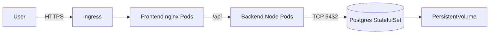

# Project 02 — Three-Tier App on Kubernetes (Helm)

Frontend (React/nginx) + Backend (Node/Express) + Postgres database, packaged as a Helm chart.

## What you'll build



See [`architecture.md`](./architecture.md) for a deeper diagram.

## Prerequisites
- Helm 3.12+ — see [`../../06-helm/`](../../06-helm/)
- A K8s cluster with a default StorageClass (`kubectl get sc`)
- Optional: `ingress-nginx` for external access — see [`../../03-kubernetes-core/05-ingress/`](../../03-kubernetes-core/)

## Step 1 — Inspect the chart

```bash
cd 02-three-tier-app/helm/three-tier
helm lint .
helm template demo . | less
```

## Step 2 — Install

```bash
kubectl create namespace proj02
helm -n proj02 install demo ./helm/three-tier \
  --set postgres.password='ChangeMe123!' \
  --set ingress.host=app.local \
  --wait --timeout 5m
```

## Step 3 — Verify

```bash
kubectl -n proj02 get pods,svc,statefulset,ingress
kubectl -n proj02 wait --for=condition=ready pod -l tier=backend --timeout=120s

# Port-forward (no ingress required)
kubectl -n proj02 port-forward svc/demo-frontend 8080:80 &
curl -s http://localhost:8080/ | head -5
curl -s http://localhost:8080/api/health   # -> {"status":"ok"}
curl -s http://localhost:8080/api/users    # -> []  (empty until seeded)
```

## Step 4 — Test data persistence

```bash
# Insert a user via backend
curl -sX POST http://localhost:8080/api/users \
  -H 'content-type: application/json' \
  -d '{"name":"alice"}'

# Restart the postgres pod to confirm PV survives
kubectl -n proj02 delete pod demo-postgres-0
kubectl -n proj02 wait --for=condition=ready pod demo-postgres-0 --timeout=120s

curl -s http://localhost:8080/api/users   # alice should still be there
```

## Cleanup

```bash
helm -n proj02 uninstall demo
kubectl -n proj02 delete pvc -l app.kubernetes.io/name=three-tier
kubectl delete namespace proj02
```

## What you learned
- Helm chart structure (Chart.yaml, values.yaml, templates)
- StatefulSet vs Deployment, when to use each
- Service-to-service DNS (`demo-postgres.proj02.svc.cluster.local`)
- Secret management with Helm `--set`
- Persistent volume reclaim behavior

## Stretch goals
- Replace plaintext password with External Secrets Operator + AWS Secrets Manager
- Add HPA on backend based on RPS (custom metrics) — see [`../../04-kubernetes-strategies/02-autoscaling/`](../../04-kubernetes-strategies/)
- Bundle as an OCI chart and push to GHCR (`helm push`)
- Add Bitnami postgres dependency in `Chart.yaml` instead of inline StatefulSet
