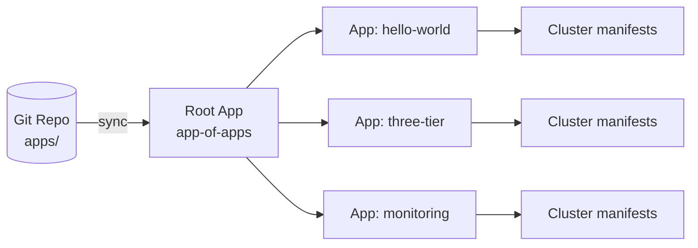

# Project 03 — GitOps with ArgoCD

Install ArgoCD, configure the **app-of-apps** pattern, and manage everything declaratively from Git.

## What you'll build



## Prerequisites
- Working K8s cluster
- `kubectl` access
- A Git repo you can push to (GitHub/GitLab) — the manifests in `apps/` reference it
- Project 01 deployed at least once (we'll ArgoCD-ify it)

## Step 1 — Install ArgoCD

See [`argocd-install.md`](./argocd-install.md) for the full install. Quick version:

```bash
kubectl create namespace argocd
kubectl apply -n argocd -f https://raw.githubusercontent.com/argoproj/argo-cd/v2.12.4/manifests/install.yaml
kubectl -n argocd wait --for=condition=available deploy/argocd-server --timeout=300s

# Get the initial admin password
kubectl -n argocd get secret argocd-initial-admin-secret \
  -o jsonpath="{.data.password}" | base64 -d; echo

# UI access
kubectl -n argocd port-forward svc/argocd-server 8080:443 &
# Open https://localhost:8080  (user: admin)
```

## Step 2 — Fork & edit the root app

Edit `apps/root-app.yaml`:
- Replace `https://github.com/YOUR-USER/YOUR-REPO.git`
- Replace `path:` to point at `10-projects/03-gitops-with-argocd/apps`

Push to your repo, then:

```bash
kubectl apply -f apps/root-app.yaml
```

ArgoCD now watches the `apps/` directory and creates an `Application` for every YAML it finds.

## Step 3 — Verify

```bash
kubectl -n argocd get applications
# NAME          SYNC STATUS   HEALTH STATUS
# root-app      Synced        Healthy
# hello-world   Synced        Healthy
```

In the UI you'll see the **app of apps** tree. Edit `k8s/deployment.yaml` in Git, push, and watch ArgoCD reconcile within ~3 minutes (or click **Sync**).

## Step 4 — Test self-heal

```bash
# Manually mutate a managed resource
kubectl -n proj01 scale deploy hello-world --replicas=10

# ArgoCD will detect drift; with selfHeal=true it reverts to 2
kubectl -n argocd get application hello-world -o jsonpath='{.status.sync.status}'
```

## Cleanup

```bash
kubectl -n argocd delete application root-app
kubectl delete namespace argocd
```

## What you learned
- App-of-apps pattern (one Application creates N child Applications)
- Sync policies: `automated`, `prune`, `selfHeal`
- Drift detection and reconciliation
- Difference between **Source of Truth** (Git) and cluster state

## Stretch goals
- Use ApplicationSets to template per-environment apps
- Add SSO (GitHub OAuth) to ArgoCD
- Encrypt secrets in Git with SOPS / Sealed Secrets
- Promote between envs with a PR-based pipeline (kustomize overlays)

## Related
- CI side that pushes manifest updates: [`../04-ci-cd-pipeline/`](../04-ci-cd-pipeline/)
- See [`../../04-kubernetes-strategies/03-progressive-delivery/`](../../04-kubernetes-strategies/) for canary/blue-green via Argo Rollouts
