# Bash Foundations — Examples 1–15

> Every production script starts with the same three-line incantation. These 15 examples build the muscle memory you need to write scripts that don't break at 3 AM.


---

## Example 1 — `set -euo pipefail` { #example-1 }

<span class="level beginner">Beginner</span>

<div class="concept" markdown>

<span class="stage reason">Reason</span>
**Without this, bash scripts silently eat errors.** A failed command returns a non-zero exit code that bash happily ignores by default. In production, this means a script can silently skip a critical step — like creating a directory — and continue as if nothing happened, corrupting data or leaving infrastructure in an inconsistent state.

<span class="stage thinking">Thinking</span>
**Mental model: three independent safety switches.**

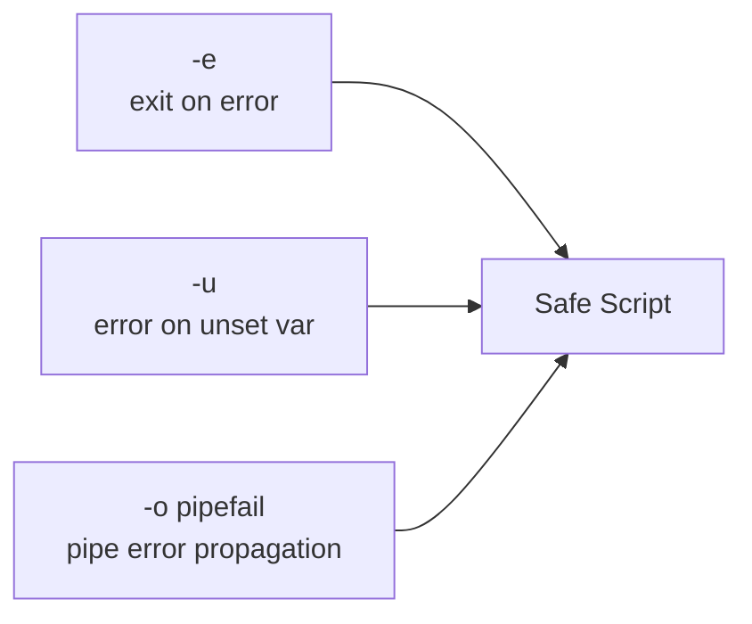

- `-e` (`errexit`): exit immediately when any command returns non-zero
- `-u` (`nounset`): treat unset variables as errors — catches typos like `$DIIR`
- `-o pipefail`: the exit code of a pipeline is the rightmost non-zero exit, not just the last command

<span class="stage execution">Execution</span>
**Run it yourself.**

```bash
#!/usr/bin/env bash
# Save as /tmp/safe-demo.sh and run: bash /tmp/safe-demo.sh

set -euo pipefail

echo "--- Test 1: pipefail ---"
# Without pipefail: 'false | true' returns 0 (true wins)
# With pipefail:    'false | true' returns 1 (false propagates)
false | true && echo "pipe succeeded (bad)" || echo "pipe failed (good)"

echo "--- Test 2: nounset ---"
DEFINED="hello"
echo "Defined: ${DEFINED}"
# Uncomment to see the error:
# echo "Undefined: ${TYPO_VAR}"

echo "--- Test 3: errexit ---"
# This command will fail and the script will exit immediately
# ls /nonexistent-path-xyz
echo "All tests passed"
```

<span class="stage simulation">Simulation — what you'll see</span>

<pre class="sim"><code><span class="prompt">$</span> bash /tmp/safe-demo.sh
--- Test 1: pipefail ---
pipe failed (good)
--- Test 2: nounset ---
Defined: hello
--- Test 3: errexit ---
All tests passed
</code></pre>

<span class="stage output">Output — state change</span>

<div class="flow" markdown>
<div class="state before" markdown>
##### Before
<span class="diff-del">Silent failures, undefined vars return empty string, pipe errors ignored</span>
</div>
<div class="arrow">→</div>
<div class="state after" markdown>
##### After
<span class="diff-add">Any error terminates the script immediately with a clear exit code</span>
</div>
</div>

<span class="stage usecase">Real-world use-case</span>

<div class="usecase-card" markdown>
**Scenario:** CI/CD deploy script at a fintech company — the Docker build step fails silently, the push step is skipped, but the Kubernetes rollout step runs against the old image. `set -euo pipefail` would have stopped at the failed build.  
**Pain removed:** Silent partial deployments that corrupt production state.  
**Production pattern:** `#!/usr/bin/env bash` then `set -euo pipefail` on line 2 — always together, no exceptions.
</div>

</div>

---

## Example 2 — Variables, Quoting, Word Splitting { #example-2 }

<span class="level beginner">Beginner</span>

<div class="concept" markdown>

<span class="stage reason">Reason</span>
**Unquoted variables are the #1 source of bash bugs.** When a variable contains spaces or special characters, bash performs word splitting and glob expansion on it — turning `$file` containing `my file.txt` into two separate arguments `my` and `file.txt`. This breaks commands in ways that are hard to debug.

<span class="stage thinking">Thinking</span>
**Mental model: double quotes suppress word splitting and glob expansion.**

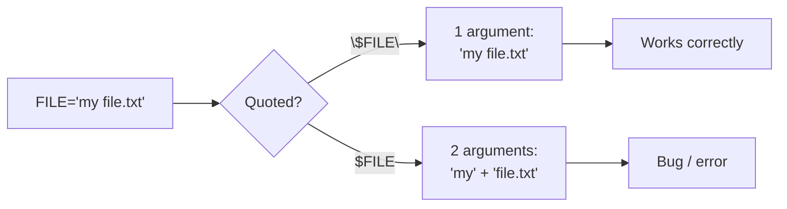

Key rules:
- Always quote: `"$var"`, `"$@"`, `"${array[@]}"`
- Never quote arrays in `for`: `for f in "${files[@]}"` (correct)
- Single quotes: literal string, no expansion at all
- `${var:-default}` — use default if var is unset/empty

<span class="stage execution">Execution</span>
**Run it yourself.**

```bash
#!/usr/bin/env bash
set -euo pipefail

# Create a file with a space in its name
TMPDIR_DEMO=$(mktemp -d)
touch "${TMPDIR_DEMO}/my file.txt"

echo "=== Word splitting demo ==="
FILE="${TMPDIR_DEMO}/my file.txt"

# WRONG: word splitting breaks ls
echo "Unquoted (wrong):"
ls ${FILE} 2>&1 || true   # Will fail: 'my' and 'file.txt' are two args

# CORRECT: quoted
echo "Quoted (correct):"
ls "${FILE}"

echo "=== Array iteration ==="
declare -a SERVERS=("web-01" "web-02" "db-01")
for server in "${SERVERS[@]}"; do
    echo "  Checking: ${server}"
done

echo "=== Default values ==="
TIMEOUT="${DEPLOY_TIMEOUT:-30}"
echo "Timeout: ${TIMEOUT}s"

echo "=== String operations ==="
PATH_VAR="/var/log/app/error.log"
echo "Dirname:   ${PATH_VAR%/*}"       # Remove from last /
echo "Basename:  ${PATH_VAR##*/}"      # Remove up to last /
echo "Extension: ${PATH_VAR##*.}"      # Remove up to last .

# Cleanup
rm -rf "${TMPDIR_DEMO}"
```

<span class="stage simulation">Simulation — what you'll see</span>

<pre class="sim"><code><span class="prompt">$</span> bash /tmp/quoting-demo.sh
=== Word splitting demo ===
Unquoted (wrong):
ls: my: No such file or directory
ls: file.txt: No such file or directory
Quoted (correct):
/tmp/tmp.XYZ/my file.txt

=== Array iteration ===
  Checking: web-01
  Checking: web-02
  Checking: db-01

=== Default values ===
Timeout: 30s

=== String operations ===
Dirname:   /var/log/app
Basename:  error.log
Extension: log
</code></pre>

<span class="stage output">Output — state change</span>

<div class="flow" markdown>
<div class="state before" markdown>
##### Before
<span class="diff-del">Unquoted vars with spaces silently pass wrong arguments to commands</span>
</div>
<div class="arrow">→</div>
<div class="state after" markdown>
##### After
<span class="diff-add">All variables quoted, arrays iterated safely, defaults handled via parameter expansion</span>
</div>
</div>

<span class="stage usecase">Real-world use-case</span>

<div class="usecase-card" markdown>
**Scenario:** Backup script copies log files from `/var/log/app name/` — unquoted `$LOG_DIR` causes `cp` to fail on every server with spaces in the path.  
**Pain removed:** Silent backup failures on servers with non-standard naming conventions.  
**Production pattern:** `cp -r "${LOG_DIR}/." "${BACKUP_DIR}/"` — always quote, always.
</div>

</div>

---

## Example 3 — Conditionals: `[[ ]]` vs `[ ]` vs `(( ))` { #example-3 }

<span class="level beginner">Beginner</span>

<div class="concept" markdown>

<span class="stage reason">Reason</span>
**Using the wrong conditional bracket type causes subtle bugs and security issues.** `[ ]` is the POSIX `test` command — it performs word splitting, can't handle regex, and has quoting edge cases. `[[ ]]` is a bash built-in that's safer, faster, and more powerful. `(( ))` is for arithmetic — using `[ ]` for math is a common beginner mistake.

<span class="stage thinking">Thinking</span>
**Mental model: three tools for three jobs.**

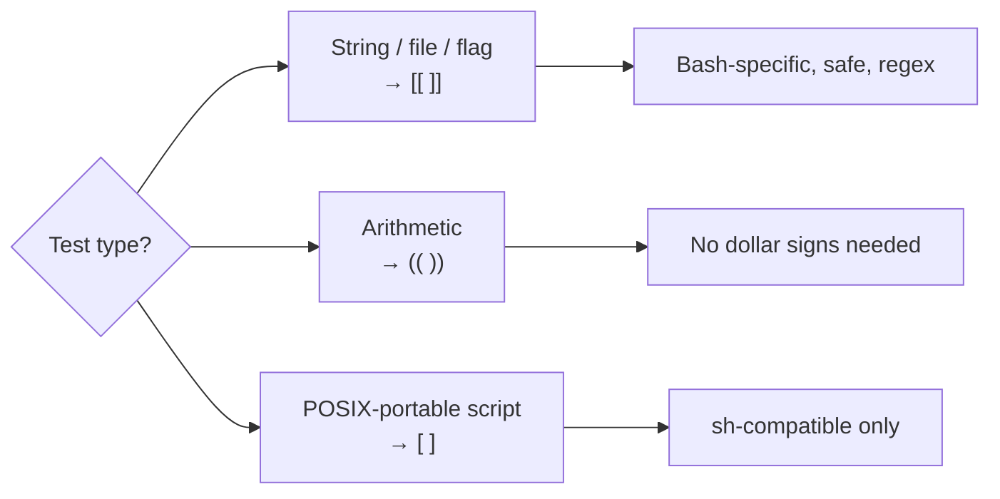

<span class="stage execution">Execution</span>
**Run it yourself.**

```bash
#!/usr/bin/env bash
set -euo pipefail

echo "=== [[ ]] — string and file tests ==="
NAME="deploy.sh"

# String comparison (no word splitting risk)
[[ "${NAME}" == "deploy.sh" ]] && echo "Match: exact"

# Regex match (=~ operator, POSIX ERE)
[[ "${NAME}" =~ ^deploy\.(sh|py)$ ]] && echo "Match: regex"

# File tests
TMPFILE=$(mktemp)
[[ -f "${TMPFILE}" ]] && echo "File exists: ${TMPFILE}"
[[ -w "${TMPFILE}" ]] && echo "File is writable"
rm "${TMPFILE}"

echo "=== (( )) — arithmetic ==="
COUNT=5
LIMIT=10

# No $ needed inside (( ))
(( COUNT < LIMIT )) && echo "Count ${COUNT} is below limit ${LIMIT}"

# Arithmetic with side effects
(( COUNT++ ))
echo "Incremented count: ${COUNT}"

# More complex arithmetic
TOTAL=$(( COUNT * 2 + 3 ))
echo "Total: ${TOTAL}"

echo "=== Compound conditions ==="
VERSION="1.23.4"
ENV="prod"

if [[ "${ENV}" == "prod" && "${VERSION}" =~ ^1\. ]]; then
    echo "Production v1.x deployment"
fi

# Negation
if [[ ! -d "/nonexistent" ]]; then
    echo "Directory does not exist (as expected)"
fi
```

<span class="stage simulation">Simulation — what you'll see</span>

<pre class="sim"><code><span class="prompt">$</span> bash /tmp/conditionals.sh
=== [[ ]] — string and file tests ===
Match: exact
Match: regex
File exists: /tmp/tmp.ABC123
File is writable

=== (( )) — arithmetic ===
Count 5 is below limit 10
Incremented count: 6
Total: 15

=== Compound conditions ===
Production v1.x deployment
Directory does not exist (as expected)
</code></pre>

<span class="stage output">Output — state change</span>

<div class="flow" markdown>
<div class="state before" markdown>
##### Before
<span class="diff-del">`[ $VERSION -gt 10 ]` crashes on non-integer strings; `[ $A == $B ]` does word splitting</span>
</div>
<div class="arrow">→</div>
<div class="state after" markdown>
##### After
<span class="diff-add">`[[ ]]` for strings/files, `(( ))` for math — safe, readable, correct</span>
</div>
</div>

<span class="stage usecase">Real-world use-case</span>

<div class="usecase-card" markdown>
**Scenario:** Version check script in a CI pipeline uses `[ $VERSION > 2.0 ]` — but `>` is file redirection in `[ ]`, not comparison. The check silently passes (creates a file named `2.0`).  
**Pain removed:** Misdeployments caused by version guards that always pass.  
**Production pattern:** `[[ "${VERSION}" > "2.0" ]]` or `(( MAJOR >= 2 ))` depending on the comparison type.
</div>

</div>

---

## Example 4 — Loops: for/while/until with Arrays { #example-4 }

<span class="level beginner">Beginner</span>

<div class="concept" markdown>

<span class="stage reason">Reason</span>
**Loops are the engine of automation.** Whether iterating over a list of servers, processing log files, or polling an API until it responds — bash loop forms differ in subtle ways that matter at scale. Using the wrong form can cause infinite loops, miss items, or process the same item twice.

<span class="stage thinking">Thinking</span>
**Mental model: match loop type to data source.**

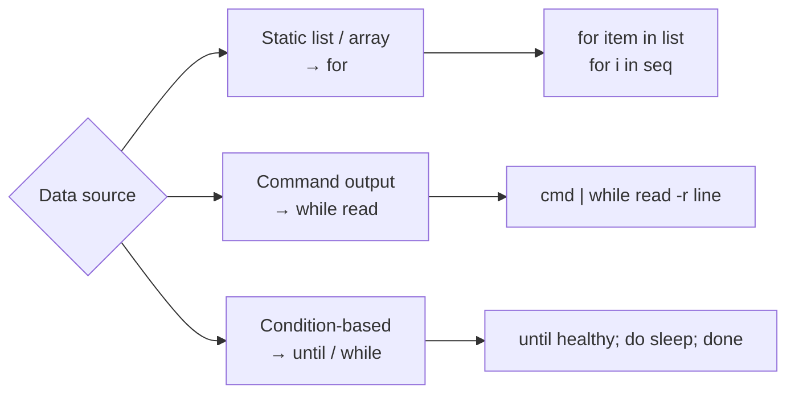

<span class="stage execution">Execution</span>
**Run it yourself.**

```bash
#!/usr/bin/env bash
set -euo pipefail

echo "=== 1. For loop over static array ==="
ENVIRONMENTS=("dev" "staging" "prod")
for env in "${ENVIRONMENTS[@]}"; do
    echo "  Deploying to: ${env}"
done

echo "=== 2. For loop with C-style (index-based) ==="
for (( i=0; i<3; i++ )); do
    echo "  Iteration: ${i}"
done

echo "=== 3. For loop with command substitution ==="
echo "  Log files in /var/log:"
for f in $(find /var/log -maxdepth 1 -name "*.log" 2>/dev/null | head -3); do
    echo "    ${f}"
done || echo "  (no .log files found)"

echo "=== 4. While with read — safe line-by-line processing ==="
# THIS is the correct way to process command output line by line
# Avoids word splitting; handles spaces in lines
find /tmp -maxdepth 1 -name "tmp.*" 2>/dev/null | head -3 | while IFS= read -r line; do
    echo "  Found: ${line}"
done

echo "=== 5. Until — poll until condition met ==="
MAX_TRIES=5
try=0
until [[ ${try} -ge ${MAX_TRIES} ]]; do
    (( try++ ))
    echo "  Attempt ${try}/${MAX_TRIES}"
    [[ ${try} -eq 3 ]] && { echo "  Condition met!"; break; }
    sleep 0.1
done

echo "=== 6. While with counter + break/continue ==="
count=0
while true; do
    (( count++ ))
    (( count % 2 == 0 )) && continue   # skip even numbers
    echo "  Odd: ${count}"
    (( count >= 9 )) && break
done
```

<span class="stage simulation">Simulation — what you'll see</span>

<pre class="sim"><code><span class="prompt">$</span> bash /tmp/loops.sh
=== 1. For loop over static array ===
  Deploying to: dev
  Deploying to: staging
  Deploying to: prod
=== 2. For loop with C-style (index-based) ===
  Iteration: 0
  Iteration: 1
  Iteration: 2
=== 3. For loop with command substitution ===
  Log files in /var/log:
  (no .log files found)
=== 4. While with read — safe line-by-line processing ===
  Found: /tmp/tmp.ABC
=== 5. Until — poll until condition met ===
  Attempt 1/5
  Attempt 2/5
  Attempt 3/5
  Condition met!
=== 6. While with counter + break/continue ===
  Odd: 1
  Odd: 3
  Odd: 5
  Odd: 7
  Odd: 9
</code></pre>

<span class="stage output">Output — state change</span>

<div class="flow" markdown>
<div class="state before" markdown>
##### Before
<span class="diff-del">Manual per-server commands; no iteration; errors in one server stop all others</span>
</div>
<div class="arrow">→</div>
<div class="state after" markdown>
##### After
<span class="diff-add">Automated loop over server list; each iteration independent; results collected</span>
</div>
</div>

<span class="stage usecase">Real-world use-case</span>

<div class="usecase-card" markdown>
**Scenario:** SRE team needs to drain and restart 20 Nginx workers one at a time during a config rollout.  
**Pain removed:** Manual SSH to each server; no record of which succeeded.  
**Production pattern:** `while IFS= read -r host; do ssh "${host}" 'nginx -s reload'; done < hosts.txt`
</div>

</div>

---

## Example 5 — Functions: Local Vars, Return Codes, stderr { #example-5 }

<span class="level beginner">Beginner</span>

<div class="concept" markdown>

<span class="stage reason">Reason</span>
**Without `local`, all bash function variables pollute the global scope.** This causes spooky action at a distance — a function modifying `COUNT` breaks a loop in the caller. Proper functions with return codes also allow callers to branch on success/failure, enabling composable script logic.

<span class="stage thinking">Thinking</span>
**Mental model: bash functions are mini-scripts with shared scope by default.**

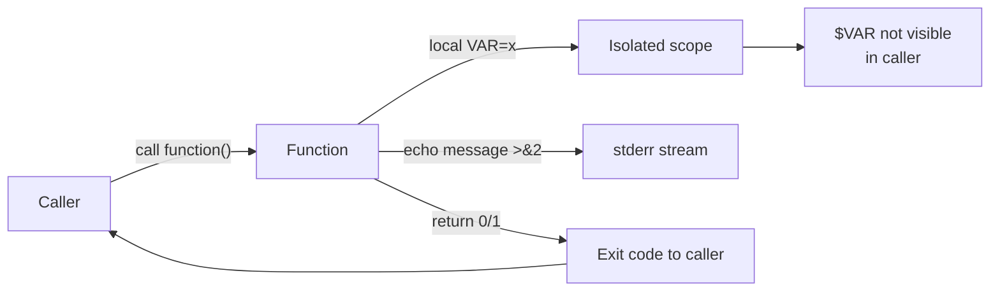

<span class="stage execution">Execution</span>
**Run it yourself.**

```bash
#!/usr/bin/env bash
set -euo pipefail

# --- Utility functions ---

log::info()  { echo "[INFO]  $*" >&2; }
log::error() { echo "[ERROR] $*" >&2; }
log::warn()  { echo "[WARN]  $*" >&2; }

# Function: validate_env
# Usage: validate_env ENV_VAR_NAME
# Returns: 0 if set and non-empty, 1 otherwise
validate_env() {
    local var_name="$1"
    local var_value="${!var_name:-}"   # indirect expansion

    if [[ -z "${var_value}" ]]; then
        log::error "Required env var '${var_name}' is not set"
        return 1
    fi
    log::info "Validated: ${var_name}=${var_value}"
    return 0
}

# Function: retry
# Usage: retry MAX_ATTEMPTS DELAY_SECONDS COMMAND [ARGS...]
retry() {
    local max_attempts="$1"
    local delay="$2"
    shift 2
    local cmd=("$@")
    local attempt=1

    while (( attempt <= max_attempts )); do
        log::info "Attempt ${attempt}/${max_attempts}: ${cmd[*]}"
        if "${cmd[@]}"; then
            return 0
        fi
        (( attempt++ ))
        [[ ${attempt} -le ${max_attempts} ]] && sleep "${delay}"
    done

    log::error "All ${max_attempts} attempts failed: ${cmd[*]}"
    return 1
}

# Function: get_pod_count (returns value via stdout capture)
get_pod_count() {
    local namespace="${1:-default}"
    # In real use: kubectl get pods -n "${namespace}" --no-headers | wc -l
    echo "3"   # simulated
}

# --- Main ---
main() {
    # Validate required environment variables
    export APP_ENV="production"
    validate_env "APP_ENV"

    # Test retry logic
    FAIL_COUNT=0
    flaky_command() {
        (( FAIL_COUNT++ ))
        (( FAIL_COUNT < 3 )) && { log::warn "Simulated failure ${FAIL_COUNT}"; return 1; }
        log::info "Command succeeded on attempt ${FAIL_COUNT}"
    }
    retry 5 0.1 flaky_command

    # Capture function output
    pod_count=$(get_pod_count "kube-system")
    log::info "Pod count: ${pod_count}"
}

main "$@"
```

<span class="stage simulation">Simulation — what you'll see</span>

<pre class="sim"><code><span class="prompt">$</span> bash /tmp/functions.sh
[INFO]  Validated: APP_ENV=production
[INFO]  Attempt 1/5: flaky_command
[WARN]  Simulated failure 1
[INFO]  Attempt 2/5: flaky_command
[WARN]  Simulated failure 2
[INFO]  Attempt 3/5: flaky_command
[INFO]  Command succeeded on attempt 3
[INFO]  Pod count: 3
</code></pre>

<span class="stage output">Output — state change</span>

<div class="flow" markdown>
<div class="state before" markdown>
##### Before
<span class="diff-del">Inline code, global variable collisions, no retry logic, all output to stdout mixed</span>
</div>
<div class="arrow">→</div>
<div class="state after" markdown>
##### After
<span class="diff-add">Reusable functions, isolated scope, structured logging to stderr, composable retry</span>
</div>
</div>

<span class="stage usecase">Real-world use-case</span>

<div class="usecase-card" markdown>
**Scenario:** Deploy script calls 8 functions — each one validates, deploys, and checks health. Failures in any function propagate back to `main()` with a clear error message on stderr, and the CI system captures exit code 1.  
**Pain removed:** Tangled spaghetti scripts where one failure causes subsequent broken state with no clear signal.  
**Production pattern:** `retry 3 5 kubectl rollout status deploy/myapp -n production`
</div>

</div>

---

## Example 6 — `trap` — Cleanup Handlers { #example-6 }

<span class="level intermediate">Intermediate</span>

<div class="concept" markdown>

<span class="stage reason">Reason</span>
**Scripts that create temporary files, hold locks, or start background processes must clean up — even when killed.** Without `trap`, a Ctrl-C leaves behind lock files, temp directories, and zombie processes. `trap` registers cleanup code that runs regardless of how the script exits.

<span class="stage thinking">Thinking</span>
**Mental model: signal handlers attached to script lifecycle events.**

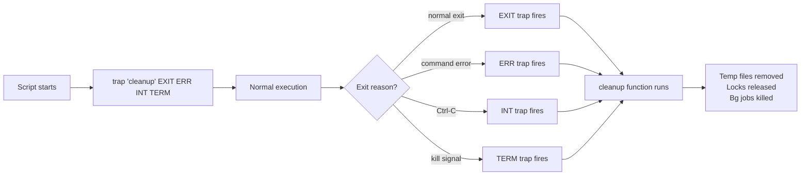

<span class="stage execution">Execution</span>
**Run it yourself.**

```bash
#!/usr/bin/env bash
set -euo pipefail

# ── Global cleanup registry ──────────────────────────────────────────────────
CLEANUP_DIRS=()
CLEANUP_FILES=()
LOCK_FILE=""
BG_PIDS=()

cleanup() {
    local exit_code=$?
    echo "[TRAP] Cleanup triggered (exit code: ${exit_code})" >&2

    # Kill background jobs
    for pid in "${BG_PIDS[@]:-}"; do
        kill "${pid}" 2>/dev/null && echo "[TRAP] Killed bg pid ${pid}" >&2 || true
    done

    # Remove temp files
    for f in "${CLEANUP_FILES[@]:-}"; do
        [[ -f "${f}" ]] && rm -f "${f}" && echo "[TRAP] Removed file: ${f}" >&2
    done

    # Remove temp dirs
    for d in "${CLEANUP_DIRS[@]:-}"; do
        [[ -d "${d}" ]] && rm -rf "${d}" && echo "[TRAP] Removed dir: ${d}" >&2
    done

    # Release lock
    [[ -n "${LOCK_FILE}" && -f "${LOCK_FILE}" ]] && {
        rm -f "${LOCK_FILE}"
        echo "[TRAP] Released lock: ${LOCK_FILE}" >&2
    }

    exit "${exit_code}"
}

# Register cleanup for all exit paths
trap cleanup EXIT ERR INT TERM

# ── Demo: create resources that need cleanup ─────────────────────────────────
WORK_DIR=$(mktemp -d)
CLEANUP_DIRS+=("${WORK_DIR}")
echo "[INFO] Work dir: ${WORK_DIR}" >&2

TEMP_FILE=$(mktemp)
CLEANUP_FILES+=("${TEMP_FILE}")
echo "[INFO] Temp file: ${TEMP_FILE}" >&2

LOCK_FILE="/tmp/deploy-$(date +%s).lock"
touch "${LOCK_FILE}"
echo "[INFO] Lock acquired: ${LOCK_FILE}" >&2

# Start a background job
sleep 60 &
BG_PIDS+=($!)
echo "[INFO] Started background job PID: ${BG_PIDS[-1]}" >&2

# Do some work
echo "doing work..." > "${TEMP_FILE}"
echo "[INFO] Work complete. Exiting normally." >&2

# cleanup runs automatically via EXIT trap
```

<span class="stage simulation">Simulation — what you'll see</span>

<pre class="sim"><code><span class="prompt">$</span> bash /tmp/trap-demo.sh
[INFO] Work dir: /tmp/tmp.XYZ
[INFO] Temp file: /tmp/tmp.ABC
[INFO] Lock acquired: /tmp/deploy-1700000000.lock
[INFO] Started background job PID: 12345
[INFO] Work complete. Exiting normally.
[TRAP] Cleanup triggered (exit code: 0)
[TRAP] Killed bg pid 12345
[TRAP] Removed file: /tmp/tmp.ABC
[TRAP] Removed dir: /tmp/tmp.XYZ
[TRAP] Released lock: /tmp/deploy-1700000000.lock
</code></pre>

<span class="stage output">Output — state change</span>

<div class="flow" markdown>
<div class="state before" markdown>
##### Before
<span class="diff-del">Lock files remain after Ctrl-C; temp dirs accumulate; next run fails to acquire lock</span>
</div>
<div class="arrow">→</div>
<div class="state after" markdown>
##### After
<span class="diff-add">All resources cleaned up on any exit path — normal, error, or signal</span>
</div>
</div>

<span class="stage usecase">Real-world use-case</span>

<div class="usecase-card" markdown>
**Scenario:** Database migration script acquires a lock file to prevent concurrent runs. Without `trap`, killing the script leaves the lock. The next run fails with "lock already held" until someone manually removes it at 3 AM.  
**Pain removed:** Stale lock files blocking automated operations.  
**Production pattern:** `trap 'rm -f "${LOCK_FILE}"' EXIT ERR INT TERM`
</div>

</div>

---

## Example 7 — `getopts` — CLI Argument Parsing { #example-7 }

<span class="level intermediate">Intermediate</span>

<div class="concept" markdown>

<span class="stage reason">Reason</span>
**Parsing `$1`, `$2`, `$3` by position breaks the moment someone adds a new flag.** `getopts` provides POSIX-standard short option parsing (`-e prod`, `-v`) with proper error handling. For production scripts that accept multiple flags, it's the only maintainable approach.

<span class="stage thinking">Thinking</span>
**Mental model: a while loop consuming flags from left to right.**

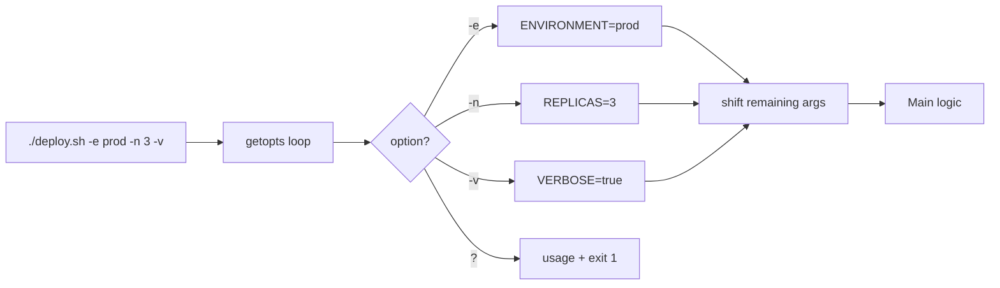

<span class="stage execution">Execution</span>
**Run it yourself.**

```bash
#!/usr/bin/env bash
set -euo pipefail

# ── Defaults ─────────────────────────────────────────────────────────────────
ENVIRONMENT="dev"
REPLICAS=1
VERBOSE=false
DRY_RUN=false

usage() {
    cat >&2 <<EOF
Usage: $(basename "$0") [OPTIONS]

Options:
  -e ENV      Environment (dev|staging|prod)  [default: dev]
  -n COUNT    Number of replicas              [default: 1]
  -v          Enable verbose output
  -d          Dry-run mode (no changes)
  -h          Show this help

Examples:
  $(basename "$0") -e prod -n 3 -v
  $(basename "$0") -e staging -d
EOF
    exit 1
}

# ── Parse options ─────────────────────────────────────────────────────────────
while getopts ":e:n:vdh" opt; do
    case "${opt}" in
        e) ENVIRONMENT="${OPTARG}" ;;
        n) REPLICAS="${OPTARG}" ;;
        v) VERBOSE=true ;;
        d) DRY_RUN=true ;;
        h) usage ;;
        :) echo "[ERROR] Option -${OPTARG} requires an argument" >&2; usage ;;
        ?) echo "[ERROR] Unknown option: -${OPTARG}" >&2; usage ;;
    esac
done
shift $(( OPTIND - 1 ))   # Remove parsed options, leave positional args

# ── Validate ─────────────────────────────────────────────────────────────────
case "${ENVIRONMENT}" in
    dev|staging|prod) ;;
    *) echo "[ERROR] Invalid environment: ${ENVIRONMENT}" >&2; usage ;;
esac

if ! [[ "${REPLICAS}" =~ ^[0-9]+$ ]]; then
    echo "[ERROR] Replicas must be a positive integer" >&2
    usage
fi

# ── Main ─────────────────────────────────────────────────────────────────────
echo "=== Deploy Configuration ==="
echo "  Environment: ${ENVIRONMENT}"
echo "  Replicas:    ${REPLICAS}"
echo "  Verbose:     ${VERBOSE}"
echo "  Dry-run:     ${DRY_RUN}"
[[ $# -gt 0 ]] && echo "  Positional:  $*"

if [[ "${DRY_RUN}" == "true" ]]; then
    echo "[DRY-RUN] Would deploy ${REPLICAS} replica(s) to ${ENVIRONMENT}"
else
    echo "[INFO] Deploying ${REPLICAS} replica(s) to ${ENVIRONMENT}"
fi
```

<span class="stage simulation">Simulation — what you'll see</span>

<pre class="sim"><code><span class="prompt">$</span> bash /tmp/getopts-demo.sh -e prod -n 3 -v
=== Deploy Configuration ===
  Environment: prod
  Replicas:    3
  Verbose:     true
  Dry-run:     false
[INFO] Deploying 3 replica(s) to prod

<span class="prompt">$</span> bash /tmp/getopts-demo.sh -e invalid
[ERROR] Invalid environment: invalid
Usage: getopts-demo.sh [OPTIONS]
...
</code></pre>

<span class="stage output">Output — state change</span>

<div class="flow" markdown>
<div class="state before" markdown>
##### Before
<span class="diff-del">`ENV=$1; COUNT=$2` — breaks on optional flags, no validation, no help text</span>
</div>
<div class="arrow">→</div>
<div class="state after" markdown>
##### After
<span class="diff-add">Flags in any order, validation, usage text, clear error messages</span>
</div>
</div>

<span class="stage usecase">Real-world use-case</span>

<div class="usecase-card" markdown>
**Scenario:** Platform team ships a `deploy.sh` used by 15 app teams. Each team calls it differently — some with dry-run, some verbose, some with environment flags. `getopts` makes all combinations work without positional order constraints.  
**Pain removed:** "Works on my machine" breakage from argument order differences across teams.  
**Production pattern:** `getopts ":e:n:vdh"` — note the leading `:` for silent error handling
</div>

</div>

---

## Example 8 — Here-docs and Here-strings { #example-8 }

<span class="level intermediate">Intermediate</span>

<div class="concept" markdown>

<span class="stage reason">Reason</span>
**Generating multi-line config files or SQL queries with string concatenation produces unreadable, fragile code.** Here-docs (`<<EOF`) let you embed multi-line text with variable substitution directly in scripts. Here-strings (`<<<`) pass single strings to commands without `echo |` pipes.

<span class="stage thinking">Thinking</span>
**Mental model: inline file content with optional variable expansion.**

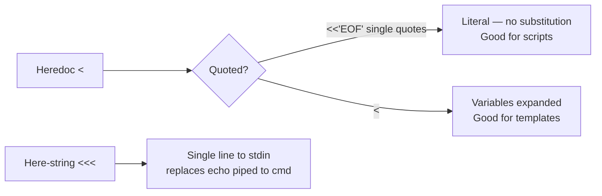

<span class="stage execution">Execution</span>
**Run it yourself.**

```bash
#!/usr/bin/env bash
set -euo pipefail

APP_NAME="myapp"
NAMESPACE="production"
IMAGE_TAG="v1.23.4"
REPLICAS=3

echo "=== 1. Generate K8s Deployment YAML ==="
cat > "/tmp/${APP_NAME}-deploy.yaml" <<EOF
apiVersion: apps/v1
kind: Deployment
metadata:
  name: ${APP_NAME}
  namespace: ${NAMESPACE}
  labels:
    app: ${APP_NAME}
    version: ${IMAGE_TAG}
spec:
  replicas: ${REPLICAS}
  selector:
    matchLabels:
      app: ${APP_NAME}
  template:
    metadata:
      labels:
        app: ${APP_NAME}
    spec:
      containers:
      - name: ${APP_NAME}
        image: registry.example.com/${APP_NAME}:${IMAGE_TAG}
        ports:
        - containerPort: 8080
EOF
echo "Generated: /tmp/${APP_NAME}-deploy.yaml"
head -5 "/tmp/${APP_NAME}-deploy.yaml"

echo ""
echo "=== 2. Literal heredoc (no substitution) — embed a script ==="
cat > /tmp/inner-script.sh <<'INNER'
#!/usr/bin/env bash
# This $VAR will NOT be expanded — it's literal
echo "Inner script: $HOME is literal here"
INNER
cat /tmp/inner-script.sh

echo ""
echo "=== 3. Here-string — send string to stdin ==="
# Without here-string: echo "hello world" | wc -w
# With here-string:
word_count=$(wc -w <<< "hello world from here-string")
echo "Word count: ${word_count}"

# Read config from here-string
while IFS='=' read -r key value; do
    echo "  Key: ${key}  Value: ${value}"
done <<< "HOST=localhost
PORT=5432
DB=myapp"

# Cleanup
rm -f "/tmp/${APP_NAME}-deploy.yaml" /tmp/inner-script.sh
```

<span class="stage simulation">Simulation — what you'll see</span>

<pre class="sim"><code><span class="prompt">$</span> bash /tmp/heredoc-demo.sh
=== 1. Generate K8s Deployment YAML ===
Generated: /tmp/myapp-deploy.yaml
apiVersion: apps/v1
kind: Deployment
metadata:
  name: myapp
  namespace: production

=== 2. Literal heredoc (no substitution) — embed a script ===
#!/usr/bin/env bash
# This $VAR will NOT be expanded — it's literal
echo "Inner script: $HOME is literal here"

=== 3. Here-string — send string to stdin ===
Word count:        3
  Key: HOST  Value: localhost
  Key: PORT  Value: 5432
  Key: DB  Value: myapp
</code></pre>

<span class="stage output">Output — state change</span>

<div class="flow" markdown>
<div class="state before" markdown>
##### Before
<span class="diff-del">YAML generated via `echo` concatenation with escaping hell and broken indentation</span>
</div>
<div class="arrow">→</div>
<div class="state after" markdown>
##### After
<span class="diff-add">Clean, readable heredoc template with variable substitution — identical to a real YAML file</span>
</div>
</div>

<span class="stage usecase">Real-world use-case</span>

<div class="usecase-card" markdown>
**Scenario:** Platform script generates per-environment K8s manifests from a template with 6 variable substitutions. Heredoc makes it look exactly like the final YAML, making review trivial.  
**Pain removed:** String concatenation bugs that produce invalid YAML only caught at `kubectl apply` time.  
**Production pattern:** `kubectl apply -f - <<EOF ... EOF` — pipe heredoc directly to kubectl
</div>

</div>

---

## Example 9 — Process Substitution `<()` vs Pipes { #example-9 }

<span class="level intermediate">Intermediate</span>

<div class="concept" markdown>

<span class="stage reason">Reason</span>
**Pipes run commands in subshells, which means variables set inside a pipe are lost after it ends.** Process substitution `<(cmd)` presents command output as a file path — letting you feed two command outputs to a `diff`, `join`, or `comm` without creating temp files, and without the subshell variable-loss problem.

<span class="stage thinking">Thinking</span>
**Mental model: `<(cmd)` is a named pipe that looks like a filename.**

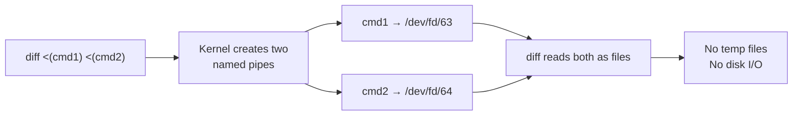

<span class="stage execution">Execution</span>
**Run it yourself.**

```bash
#!/usr/bin/env bash
set -euo pipefail

echo "=== 1. Pipe subshell variable loss problem ==="
COUNTER=0
echo -e "a\nb\nc" | while IFS= read -r line; do
    (( COUNTER++ ))
done
echo "Counter after pipe: ${COUNTER}"   # Prints 0 — subshell lost it!

echo "=== 2. Fix: process substitution preserves scope ==="
COUNTER=0
while IFS= read -r line; do
    (( COUNTER++ ))
done < <(echo -e "a\nb\nc")
echo "Counter after proc sub: ${COUNTER}"   # Prints 3 — correct!

echo "=== 3. diff two sorted command outputs — no temp files ==="
EXPECTED="app-v1.0\nnginx-v1.19\nredis-v6.2"
ACTUAL="app-v1.0\nnginx-v1.18\nredis-v6.2"

echo "Diff between expected and actual versions:"
diff \
    <(echo -e "${EXPECTED}" | sort) \
    <(echo -e "${ACTUAL}" | sort) \
    || true

echo "=== 4. Join two lists on a common field ==="
# Simulate two CSVs: users and roles
join -t, \
    <(printf "alice,eng\nbob,ops\n" | sort) \
    <(printf "alice,deploy\nbob,monitor\n" | sort) \
    2>/dev/null || true
echo "(join output above)"

echo "=== 5. tee to multiple destinations ==="
# Process output of a command twice simultaneously
echo "processing data..." | tee \
    >(grep -c "." > /tmp/linecount.txt) \
    >(wc -c > /tmp/bytecount.txt) \
    > /dev/null
echo "Lines: $(cat /tmp/linecount.txt)  Bytes: $(cat /tmp/bytecount.txt)"
rm -f /tmp/linecount.txt /tmp/bytecount.txt
```

<span class="stage simulation">Simulation — what you'll see</span>

<pre class="sim"><code><span class="prompt">$</span> bash /tmp/procsub-demo.sh
=== 1. Pipe subshell variable loss problem ===
Counter after pipe: 0
=== 2. Fix: process substitution preserves scope ===
Counter after proc sub: 3
=== 3. diff two sorted command outputs — no temp files ===
Diff between expected and actual versions:
< nginx-v1.19
> nginx-v1.18
=== 4. Join two lists on a common field ===
alice,eng,deploy
bob,ops,monitor
(join output above)
=== 5. tee to multiple destinations ===
Lines: 1  Bytes: 19
</code></pre>

<span class="stage output">Output — state change</span>

<div class="flow" markdown>
<div class="state before" markdown>
##### Before
<span class="diff-del">Temp files needed for `diff`; variables lost after pipe; two-pass processing requires re-running commands</span>
</div>
<div class="arrow">→</div>
<div class="state after" markdown>
##### After
<span class="diff-add">No temp files, scope preserved, single-pass processing with `tee >()`</span>
</div>
</div>

<span class="stage usecase">Real-world use-case</span>

<div class="usecase-card" markdown>
**Scenario:** Config drift checker compares `kubectl get configmap -o yaml` output against Git HEAD without writing temp files to `/tmp`.  
**Pain removed:** Temp file races in concurrent CI runs on shared agents.  
**Production pattern:** `diff <(kubectl get cm app-config -o yaml) <(cat config/app-config.yaml)`
</div>

</div>

---

## Example 10 — `xargs` and Parallel Processing with `-P` { #example-10 }

<span class="level intermediate">Intermediate</span>

<div class="concept" markdown>

<span class="stage reason">Reason</span>
**Sequential loops over 100 servers take 100× longer than parallel processing.** `xargs -P N` runs N instances of a command in parallel, acting as a built-in thread pool. Combined with `-n 1` and `-I{}`, it's a powerful tool for parallelizing I/O-bound operations like health checks, deployments, and file transfers.

<span class="stage thinking">Thinking</span>
**Mental model: xargs as a parallel worker pool.**

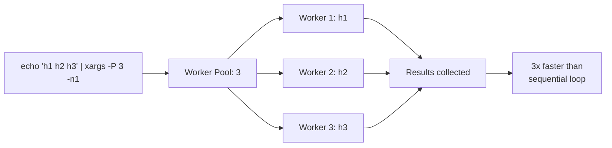

<span class="stage execution">Execution</span>
**Run it yourself.**

```bash
#!/usr/bin/env bash
set -euo pipefail

echo "=== 1. Basic xargs — transform input to arguments ==="
# Without xargs: loop
echo -e "web-01\nweb-02\ndb-01" | xargs -I{} echo "Checking server: {}"

echo ""
echo "=== 2. xargs -P parallel execution ==="
# Simulate health check (replace with real curl in production)
health_check() {
    local host="$1"
    sleep 0.1   # simulate network latency
    echo "OK: ${host} (PID $$)"
}
export -f health_check

# SEQUENTIAL: would take 0.5s
echo "Starting parallel health checks..."
START=$(date +%s%N)
echo -e "web-01\nweb-02\nweb-03\ndb-01\ncache-01" | \
    xargs -P 5 -n 1 bash -c 'health_check "$@"' _
END=$(date +%s%N)
echo "Elapsed: $(( (END - START) / 1000000 ))ms (parallel)"

echo ""
echo "=== 3. xargs with null delimiter (handles spaces in filenames) ==="
TMPDIR_D=$(mktemp -d)
touch "${TMPDIR_D}/file one.txt" "${TMPDIR_D}/file two.txt" "${TMPDIR_D}/file three.txt"

# find -print0 + xargs -0 handles spaces safely
find "${TMPDIR_D}" -name "*.txt" -print0 | \
    xargs -0 -I{} bash -c 'echo "Processing: {}"'
rm -rf "${TMPDIR_D}"

echo ""
echo "=== 4. xargs -P with max args per process ==="
# Process 2 items per worker, 3 workers max
seq 1 12 | xargs -P 3 -n 2 bash -c 'echo "Worker processing: $@"' _
```

<span class="stage simulation">Simulation — what you'll see</span>

<pre class="sim"><code><span class="prompt">$</span> bash /tmp/xargs-demo.sh
=== 1. Basic xargs ===
Checking server: web-01
Checking server: web-02
Checking server: db-01

=== 2. xargs -P parallel execution ===
Starting parallel health checks...
OK: web-02 (PID 45231)
OK: web-01 (PID 45230)
OK: db-01 (PID 45233)
OK: web-03 (PID 45232)
OK: cache-01 (PID 45234)
Elapsed: 112ms (parallel)

=== 3. xargs with null delimiter ===
Processing: /tmp/tmp.XYZ/file one.txt
Processing: /tmp/tmp.XYZ/file two.txt
Processing: /tmp/tmp.XYZ/file three.txt
</code></pre>

<span class="stage output">Output — state change</span>

<div class="flow" markdown>
<div class="state before" markdown>
##### Before
<span class="diff-del">Sequential health check of 20 servers: ~20 seconds; sequential `rm` of 1000 files: slow</span>
</div>
<div class="arrow">→</div>
<div class="state after" markdown>
##### After
<span class="diff-add">Parallel execution with `xargs -P 20`: ~1 second for 20 servers</span>
</div>
</div>

<span class="stage usecase">Real-world use-case</span>

<div class="usecase-card" markdown>
**Scenario:** Nightly certificate renewal script checks 50 domains — sequential check takes 3 minutes; parallel with `xargs -P 10` takes 18 seconds.  
**Pain removed:** Cron job timing out before checking all certificates.  
**Production pattern:** `cat domains.txt | xargs -P 10 -n 1 check-cert.sh`
</div>

</div>

---

## Example 11 — `awk` for Log Parsing { #example-11 }

<span class="level intermediate">Intermediate</span>

<div class="concept" markdown>

<span class="stage reason">Reason</span>
**`grep` finds lines; `awk` extracts, transforms, and aggregates them.** In production, you need to parse Nginx access logs for slow requests, extract specific fields from structured logs, or sum up request counts by status code. `awk` does all of this in a single pass without loading the entire file into memory.

<span class="stage thinking">Thinking</span>
**Mental model: `awk` = BEGIN block + per-line pattern/action + END block.**

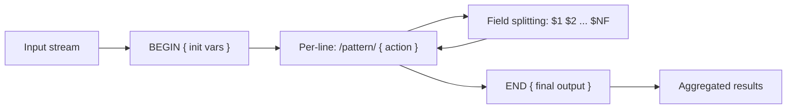

<span class="stage execution">Execution</span>
**Run it yourself.**

```bash
#!/usr/bin/env bash
set -euo pipefail

# Generate sample Nginx-style access log
cat > /tmp/access.log <<'EOF'
192.168.1.1 - - [28/Apr/2026:10:00:01 +0000] "GET /api/users HTTP/1.1" 200 1234 0.123
192.168.1.2 - - [28/Apr/2026:10:00:02 +0000] "POST /api/orders HTTP/1.1" 201 567 0.456
192.168.1.1 - - [28/Apr/2026:10:00:03 +0000] "GET /api/products HTTP/1.1" 500 89 2.301
192.168.1.3 - - [28/Apr/2026:10:00:04 +0000] "GET /health HTTP/1.1" 200 12 0.001
192.168.1.2 - - [28/Apr/2026:10:00:05 +0000] "DELETE /api/users/99 HTTP/1.1" 404 45 0.034
192.168.1.1 - - [28/Apr/2026:10:00:06 +0000] "GET /api/users HTTP/1.1" 200 1189 0.098
192.168.1.4 - - [28/Apr/2026:10:00:07 +0000] "POST /api/auth HTTP/1.1" 401 78 0.012
EOF

echo "=== 1. Extract specific fields ==="
awk '{print $1, $9, $NF}' /tmp/access.log

echo ""
echo "=== 2. Filter by pattern + extract ==="
awk '$9 >= 500 {print "ERROR:", $7, "status:", $9, "time:", $NF"s"}' /tmp/access.log

echo ""
echo "=== 3. Count by HTTP status code ==="
awk '{status[$9]++} END {for (s in status) print s, status[s]}' /tmp/access.log | sort

echo ""
echo "=== 4. Find slow requests (>1s) ==="
awk '$NF > 1.0 {printf "SLOW %s %s %.3fs\n", $7, $9, $NF}' /tmp/access.log

echo ""
echo "=== 5. Calculate average response time ==="
awk '{sum += $NF; count++} END {printf "Avg response: %.3fs over %d requests\n", sum/count, count}' /tmp/access.log

echo ""
echo "=== 6. Use custom field separator (CSV parsing) ==="
echo "alice,eng,3000
bob,ops,4500
carol,sre,5000" | awk -F',' 'NR > 0 {printf "%-10s %-5s $%s\n", $1, $2, $3}'

rm /tmp/access.log
```

<span class="stage simulation">Simulation — what you'll see</span>

<pre class="sim"><code><span class="prompt">$</span> bash /tmp/awk-demo.sh
=== 1. Extract specific fields ===
192.168.1.1 200 0.123
192.168.1.2 201 0.456
...
=== 2. Filter by pattern + extract ===
ERROR: /api/products status: 500 time: 2.301s
=== 3. Count by HTTP status code ===
200 3
201 1
401 1
404 1
500 1
=== 4. Find slow requests ===
SLOW /api/products 500 2.301s
=== 5. Calculate average response time ===
Avg response: 0.432s over 7 requests
=== 6. Use custom field separator ===
alice      eng   $3000
bob        ops   $4500
carol      sre   $5000
</code></pre>

<span class="stage output">Output — state change</span>

<div class="flow" markdown>
<div class="state before" markdown>
##### Before
<span class="diff-del">Manual log inspection, `grep` + `cut` chains that break on field changes</span>
</div>
<div class="arrow">→</div>
<div class="state after" markdown>
##### After
<span class="diff-add">Single-pass log analysis: counts, filters, aggregates — streaming, memory-efficient</span>
</div>
</div>

<span class="stage usecase">Real-world use-case</span>

<div class="usecase-card" markdown>
**Scenario:** Alerting script runs every 5 minutes, parses the last 1000 lines of Nginx logs, and pages on-call if the 5xx rate exceeds 5%.  
**Pain removed:** Manual log inspection during incidents; alerts that fire too late.  
**Production pattern:** `awk 'NR>NR-1000 && $9>=500{e++} NR>NR-1000{t++} END{if(t>0 && e/t>0.05) exit 1}' /var/log/nginx/access.log`
</div>

</div>

---

## Example 12 — `sed` for In-Place Config Editing { #example-12 }

<span class="level intermediate">Intermediate</span>

<div class="concept" markdown>

<span class="stage reason">Reason</span>
**Manually editing config files on 30 servers during a maintenance window is error-prone and slow.** `sed -i` edits files in-place with regex-based substitutions — enabling automated config management without a full Ansible/Puppet setup. It's the right tool for targeted, surgical config changes.

<span class="stage thinking">Thinking</span>
**Mental model: stream editor — reads line by line, applies operations, writes back.**

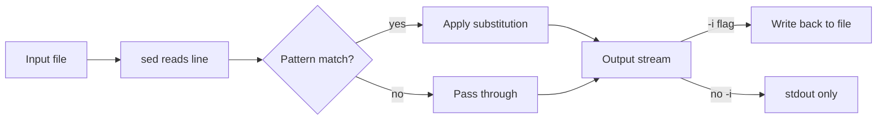

<span class="stage execution">Execution</span>
**Run it yourself.**

```bash
#!/usr/bin/env bash
set -euo pipefail

# Create a sample config file
cat > /tmp/app.conf <<'EOF'
# Application Configuration
database_host = old-db.internal
database_port = 5432
database_name = myapp_dev
max_connections = 10
log_level = debug
enable_ssl = false
workers = 4
EOF

echo "=== Original config ==="
cat /tmp/app.conf

echo ""
echo "=== 1. Simple value replacement ==="
# macOS: sed -i '' ; Linux: sed -i
SED_INPLACE=(-i)
[[ "$(uname)" == "Darwin" ]] && SED_INPLACE=(-i '')

sed "${SED_INPLACE[@]}" 's/old-db\.internal/new-db.internal/' /tmp/app.conf
echo "After DB host change:"
grep database_host /tmp/app.conf

echo ""
echo "=== 2. Replace only the first occurrence ==="
sed "${SED_INPLACE[@]}" '0,/database/s/database/DATABASE/' /tmp/app.conf || true

echo ""
echo "=== 3. Update value after = sign (key=value pattern) ==="
# Change log_level value without touching the key
sed "${SED_INPLACE[@]}" 's/^\(log_level\s*=\s*\).*/\1info/' /tmp/app.conf
sed "${SED_INPLACE[@]}" 's/^\(enable_ssl\s*=\s*\).*/\1true/' /tmp/app.conf
echo "After log/ssl changes:"
grep -E "log_level|enable_ssl" /tmp/app.conf

echo ""
echo "=== 4. Delete comment lines and blank lines ==="
sed "${SED_INPLACE[@]}" '/^#/d; /^$/d' /tmp/app.conf

echo ""
echo "=== 5. Add a line after a matching line ==="
sed "${SED_INPLACE[@]}" '/^workers/a connection_timeout = 30' /tmp/app.conf

echo ""
echo "=== Final config ==="
cat /tmp/app.conf
rm /tmp/app.conf
```

<span class="stage simulation">Simulation — what you'll see</span>

<pre class="sim"><code><span class="prompt">$</span> bash /tmp/sed-demo.sh
=== Original config ===
# Application Configuration
database_host = old-db.internal
...
=== 1. Simple value replacement ===
After DB host change:
database_host = new-db.internal

=== 3. Update value after = sign ===
After log/ssl changes:
log_level = info
enable_ssl = true

=== Final config ===
database_host = new-db.internal
database_port = 5432
database_name = myapp_dev
max_connections = 10
log_level = info
enable_ssl = true
workers = 4
connection_timeout = 30
</code></pre>

<span class="stage output">Output — state change</span>

<div class="flow" markdown>
<div class="state before" markdown>
##### Before
<span class="diff-del">Manual vi edits on each server; config drift between servers; no audit trail</span>
</div>
<div class="arrow">→</div>
<div class="state after" markdown>
##### After
<span class="diff-add">Scripted, repeatable, idempotent config updates across all servers</span>
</div>
</div>

<span class="stage usecase">Real-world use-case</span>

<div class="usecase-card" markdown>
**Scenario:** DB migration requires updating `database_host` in the app config on 40 servers during a 30-minute maintenance window.  
**Pain removed:** Typos in manual edits; inconsistent config across servers.  
**Production pattern:** `cat servers.txt | xargs -P 10 -I{} ssh {} "sed -i 's/old-db/new-db/' /etc/app/config.ini"`
</div>

</div>

---

## Example 13 — Named Pipes (FIFOs) for IPC { #example-13 }

<span class="level advanced">Advanced</span>

<div class="concept" markdown>

<span class="stage reason">Reason</span>
**When two processes need to communicate continuously without a shared file, named pipes (FIFOs) provide a kernel-buffered channel.** Unlike anonymous pipes (`|`), FIFOs persist in the filesystem, allowing unrelated processes to connect. This enables producer-consumer patterns, rate limiting, and progress tracking in bash.

<span class="stage thinking">Thinking</span>
**Mental model: a persistent pipe in the filesystem that blocks readers until data arrives.**

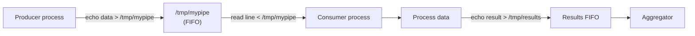

<span class="stage execution">Execution</span>
**Run it yourself.**

```bash
#!/usr/bin/env bash
set -euo pipefail

FIFO="/tmp/demo-fifo-$$"
RESULT_FIFO="/tmp/demo-result-$$"

# Cleanup on exit
trap 'rm -f "${FIFO}" "${RESULT_FIFO}"' EXIT

# Create named pipes
mkfifo "${FIFO}"
mkfifo "${RESULT_FIFO}"

echo "=== Producer → FIFO → Consumer pattern ==="

# Consumer: reads from FIFO, writes results to result FIFO
(
    while IFS= read -r item; do
        [[ "${item}" == "DONE" ]] && break
        result="processed:${item}"
        echo "${result}" > "${RESULT_FIFO}" &
        sleep 0.05
    done < "${FIFO}"
) &
CONSUMER_PID=$!

# Result collector: reads results asynchronously
RESULTS=()
(
    for _ in 1 2 3; do
        IFS= read -r r < "${RESULT_FIFO}"
        RESULTS+=("${r}")
    done
    printf '%s\n' "${RESULTS[@]}" > /tmp/demo-collected.txt
) &
COLLECTOR_PID=$!

# Producer: sends items
for item in "server-01" "server-02" "server-03"; do
    echo "${item}" > "${FIFO}"
    sleep 0.1
done
echo "DONE" > "${FIFO}"

wait "${CONSUMER_PID}" "${COLLECTOR_PID}"

echo "Collected results:"
cat /tmp/demo-collected.txt
rm -f /tmp/demo-collected.txt

echo ""
echo "=== Semaphore pattern using FIFO (max concurrency) ==="
# Load N tokens into the FIFO to act as semaphore slots
SEM_FIFO="/tmp/sem-$$"
mkfifo "${SEM_FIFO}"
trap 'rm -f "${FIFO}" "${RESULT_FIFO}" "${SEM_FIFO}"' EXIT

MAX_CONCURRENT=3
# Pre-fill semaphore with tokens
(for _ in $(seq 1 ${MAX_CONCURRENT}); do echo "token"; done > "${SEM_FIFO}") &

work_with_semaphore() {
    local item="$1"
    # Acquire token (blocks if no tokens available)
    read -r _token < "${SEM_FIFO}"
    # Do work
    sleep 0.05
    echo "  Completed: ${item}"
    # Release token
    echo "token" > "${SEM_FIFO}" &
}

echo "Processing 6 items with max ${MAX_CONCURRENT} concurrent:"
for i in $(seq 1 6); do
    work_with_semaphore "item-${i}" &
done
wait
echo "All items processed"
```

<span class="stage simulation">Simulation — what you'll see</span>

<pre class="sim"><code><span class="prompt">$</span> bash /tmp/fifo-demo.sh
=== Producer → FIFO → Consumer pattern ===
Collected results:
processed:server-01
processed:server-02
processed:server-03

=== Semaphore pattern using FIFO ===
Processing 6 items with max 3 concurrent:
  Completed: item-1
  Completed: item-2
  Completed: item-3
  Completed: item-4
  Completed: item-5
  Completed: item-6
All items processed
</code></pre>

<span class="stage output">Output — state change</span>

<div class="flow" markdown>
<div class="state before" markdown>
##### Before
<span class="diff-del">Unbounded parallelism overloads target system; temp files for IPC have race conditions</span>
</div>
<div class="arrow">→</div>
<div class="state after" markdown>
##### After
<span class="diff-add">FIFO semaphore limits concurrency; producer-consumer decoupled via named pipe</span>
</div>
</div>

<span class="stage usecase">Real-world use-case</span>

<div class="usecase-card" markdown>
**Scenario:** Bulk image processing script must not exceed 4 concurrent `ffmpeg` processes to avoid OOM. FIFO semaphore enforces the limit without external tooling.  
**Pain removed:** OOM kills on shared build agents from unbounded parallelism.  
**Production pattern:** FIFO semaphore with token count matching CPU count or rate limit.
</div>

</div>

---

## Example 14 — Signal Handling and Daemonizing { #example-14 }

<span class="level advanced">Advanced</span>

<div class="concept" markdown>

<span class="stage reason">Reason</span>
**Long-running bash scripts need to handle SIGTERM gracefully before Kubernetes kills them, and some monitoring agents need to run as daemons in the background.** Without signal handling, a `kubectl delete pod` sends SIGTERM to the script, which exits immediately — leaving mid-flight operations incomplete.

<span class="stage thinking">Thinking</span>
**Mental model: signals as asynchronous messages from the OS to a process.**

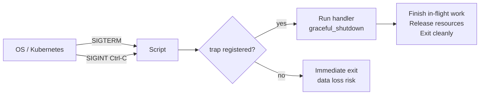

<span class="stage execution">Execution</span>
**Run it yourself.**

```bash
#!/usr/bin/env bash
set -euo pipefail

# ── Graceful shutdown handler ─────────────────────────────────────────────────
SHUTDOWN_REQUESTED=false
IN_PROGRESS=false

graceful_shutdown() {
    echo "[SIGNAL] Shutdown requested" >&2
    SHUTDOWN_REQUESTED=true
    if [[ "${IN_PROGRESS}" == "true" ]]; then
        echo "[SIGNAL] Waiting for in-progress work to complete..." >&2
    fi
}

trap graceful_shutdown SIGTERM SIGINT

# ── Main processing loop ──────────────────────────────────────────────────────
process_item() {
    local item="$1"
    IN_PROGRESS=true
    echo "[WORK] Processing: ${item}"
    sleep 0.2   # simulate work
    echo "[WORK] Completed: ${item}"
    IN_PROGRESS=false
}

echo "[INFO] Worker started (PID: $$)"
echo "[INFO] Send SIGTERM to test: kill -TERM $$"

ITEMS=("job-001" "job-002" "job-003" "job-004" "job-005")
for item in "${ITEMS[@]}"; do
    if [[ "${SHUTDOWN_REQUESTED}" == "true" ]]; then
        echo "[INFO] Shutdown: skipping remaining items" >&2
        break
    fi
    process_item "${item}"
done

echo "[INFO] Worker exited cleanly"

# ── Daemonize pattern (run in background, detach from terminal) ───────────────
echo ""
echo "=== Daemonize pattern ==="

daemon_process() {
    local pidfile="/tmp/demo-daemon-$$.pid"
    local logfile="/tmp/demo-daemon-$$.log"

    # Double-fork to detach from terminal
    (
        # Second fork — orphaned process adopted by init
        exec > "${logfile}" 2>&1
        echo "[DAEMON] Started, PID: $$"
        echo $$ > "${pidfile}"
        for i in 1 2 3; do
            echo "[DAEMON] Heartbeat ${i}"
            sleep 0.1
        done
        echo "[DAEMON] Exiting"
        rm -f "${pidfile}"
    ) &
    disown $!

    echo "Daemon launched (check ${logfile})"
    sleep 0.5
    echo "Daemon log:"
    cat "${logfile}" 2>/dev/null || echo "(log not found)"
    rm -f "${logfile}"
}

daemon_process
```

<span class="stage simulation">Simulation — what you'll see</span>

<pre class="sim"><code><span class="prompt">$</span> bash /tmp/signals-demo.sh
[INFO] Worker started (PID: 54321)
[INFO] Send SIGTERM to test: kill -TERM 54321
[WORK] Processing: job-001
[WORK] Completed: job-001
[WORK] Processing: job-002
[WORK] Completed: job-002
...
[INFO] Worker exited cleanly

=== Daemonize pattern ===
Daemon launched (check /tmp/demo-daemon-54321.log)
Daemon log:
[DAEMON] Started, PID: 54325
[DAEMON] Heartbeat 1
[DAEMON] Heartbeat 2
[DAEMON] Heartbeat 3
[DAEMON] Exiting
</code></pre>

<span class="stage output">Output — state change</span>

<div class="flow" markdown>
<div class="state before" markdown>
##### Before
<span class="diff-del">SIGTERM kills script mid-transaction; database writes incomplete; no pid file for management</span>
</div>
<div class="arrow">→</div>
<div class="state after" markdown>
##### After
<span class="diff-add">Graceful shutdown: completes in-flight work, then exits cleanly with exit code 0</span>
</div>
</div>

<span class="stage usecase">Real-world use-case</span>

<div class="usecase-card" markdown>
**Scenario:** Kubernetes `preStop` hook needs the sidecar to drain its queue before the pod terminates. Signal handler sets a flag; main loop checks the flag between items and exits cleanly before the 30-second `terminationGracePeriodSeconds` deadline.  
**Pain removed:** Partial message processing and data loss during rolling updates.  
**Production pattern:** `trap 'DRAIN=true' SIGTERM; while [[ "${DRAIN}" == "false" ]]; do process_next; done`
</div>

</div>

---

## Example 15 — Bash Strict Mode + Custom Error Framework { #example-15 }

<span class="level advanced">Advanced</span>

<div class="concept" markdown>

<span class="stage reason">Reason</span>
**`set -euo pipefail` is not enough for production scripts.** When a command fails, you need to know the file, line number, and call stack — not just "script exited with code 1." A custom error framework with ERR traps, stack traces, and structured error messages transforms debugging from guesswork into a 30-second investigation.

<span class="stage thinking">Thinking</span>
**Mental model: three layers of error defense.**

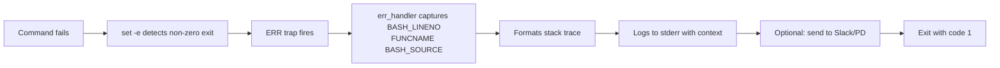

<span class="stage execution">Execution</span>
**Run it yourself.**

```bash
#!/usr/bin/env bash

# ============================================================
# Production Bash Error Framework
# Include this at the top of every production script
# ============================================================

set -euo pipefail
IFS=$'\n\t'

# ── Colours (graceful degradation if no tty) ────────────────
if [[ -t 2 ]]; then
    RED='\033[0;31m'; YELLOW='\033[1;33m'; CYAN='\033[0;36m'
    GREEN='\033[0;32m'; BOLD='\033[1m'; RESET='\033[0m'
else
    RED=''; YELLOW=''; CYAN=''; GREEN=''; BOLD=''; RESET=''
fi

# ── Logging functions ────────────────────────────────────────
log::info()  { echo -e "${GREEN}[INFO] ${RESET}$(date +%H:%M:%S) $*" >&2; }
log::warn()  { echo -e "${YELLOW}[WARN] ${RESET}$(date +%H:%M:%S) $*" >&2; }
log::error() { echo -e "${RED}[ERROR]${RESET}$(date +%H:%M:%S) $*" >&2; }
log::debug() { [[ "${DEBUG:-false}" == "true" ]] && echo -e "${CYAN}[DEBUG]${RESET}$(date +%H:%M:%S) $*" >&2; }

# ── Stack trace ──────────────────────────────────────────────
stack_trace() {
    local i=1
    echo -e "${RED}Stack trace:${RESET}" >&2
    while caller ${i} 2>/dev/null; do
        (( i++ ))
    done | while read -r lineno func file; do
        echo -e "  ${BOLD}at${RESET} ${func}() ${CYAN}${file}:${lineno}${RESET}" >&2
    done
}

# ── ERR trap ─────────────────────────────────────────────────
err_handler() {
    local exit_code=$?
    local line="${BASH_LINENO[0]}"
    local command="${BASH_COMMAND}"
    log::error "Command failed (exit ${exit_code}): ${command}"
    log::error "Location: ${BASH_SOURCE[1]:-unknown}:${line}"
    stack_trace
    # In production: send to Slack/PagerDuty here
    exit "${exit_code}"
}

trap err_handler ERR

# ── Main script logic ─────────────────────────────────────────
deploy_service() {
    local service="$1"
    log::info "Deploying: ${service}"
    validate_config "${service}"
    log::info "Deploy complete: ${service}"
}

validate_config() {
    local service="$1"
    log::debug "Validating config for: ${service}"
    # This will fail — triggering the error framework
    [[ "${service}" != "invalid" ]] || { log::error "Invalid service name"; return 1; }
    log::info "Config valid for: ${service}"
}

log::info "Script started"
deploy_service "myapp"
log::warn "This is just a warning — not fatal"
deploy_service "invalid"   # This will trigger ERR trap
log::info "This line will not be reached"
```

<span class="stage simulation">Simulation — what you'll see</span>

<pre class="sim"><code><span class="prompt">$</span> bash /tmp/error-framework.sh
[INFO] 10:00:01 Script started
[INFO] 10:00:01 Deploying: myapp
[INFO] 10:00:01 Config valid for: myapp
[INFO] 10:00:01 Deploy complete: myapp
[WARN] 10:00:01 This is just a warning — not fatal
[INFO] 10:00:01 Deploying: invalid
[ERROR] 10:00:01 Invalid service name
[ERROR] 10:00:01 Command failed (exit 1): ...
[ERROR] 10:00:01 Location: error-framework.sh:48
Stack trace:
  at validate_config() error-framework.sh:47
  at deploy_service() error-framework.sh:40
  at main script error-framework.sh:55
</code></pre>

<span class="stage output">Output — state change</span>

<div class="flow" markdown>
<div class="state before" markdown>
##### Before
<span class="diff-del">`Script exited with code 1` — no file, no line, no context — 30 minutes of log diving</span>
</div>
<div class="arrow">→</div>
<div class="state after" markdown>
##### After
<span class="diff-add">File + line + function + call stack + structured log entry — root cause in 30 seconds</span>
</div>
</div>

<span class="stage usecase">Real-world use-case</span>

<div class="usecase-card" markdown>
**Scenario:** On-call engineer wakes up at 2 AM to a failed CI/CD pipeline. With the error framework, the Slack alert shows the exact file, line, failed command, and call stack — root cause identified and fixed in 5 minutes instead of 45.  
**Pain removed:** Opaque `exit code 1` errors that require log archaeology.  
**Production pattern:** Package this as `source /opt/scripts/lib/error.sh` and source at the top of every production script.
</div>

</div>
