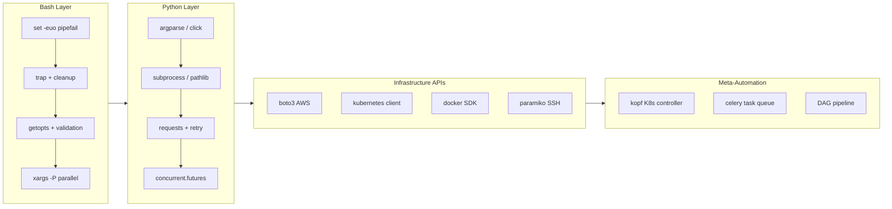

# 10 · Scripting Automations — Python & Bash

> **Stop clicking. Start scripting.**  
> From your first `#!/usr/bin/env bash` to a composable Python DAG that orchestrates infrastructure — this module covers the full scripting arc used by production engineering teams.

---

## Learning Path

```mermaid
flowchart LR
    A["Shell Survival<br/>set -euo pipefail"] --> B["Bash Fundamentals<br/>vars, loops, functions"]
    B --> C["Bash Automation<br/>traps, getopts, xargs"]
    C --> D["Bash Expert<br/>FIFOs, daemons, DSLs"]
    D --> E["Python Foundations<br/>subprocess, pathlib"]
    E --> F["Python CLI Tools<br/>click, requests, pydantic"]
    F --> G["Python DevOps Libs<br/>boto3, k8s, docker SDK"]
    G --> H["Meta-Automation<br/>DAG pipelines, kopf"]
```

---

## Module Roadmap

#### Shell Survival Kit
`set -euo pipefail` · variables · quoting · the traps newcomers fall into every day

#### Bash Control Flow
Conditionals, loops, arrays, functions with proper `local` scope and return codes

#### Bash I/O & Process Model
Here-docs, process substitution, pipes, `xargs -P`, named FIFOs

#### Bash Automation Patterns
Log rotation, health-check pollers, parallel job runners, bats-core unit tests

#### Python Foundations for DevOps
Script structure, `subprocess`, `pathlib`, `logging`, YAML/JSON/TOML config handling

#### Python CLI & Network Layer
`click` CLIs, `requests` with retry, `concurrent.futures`, `pydantic` config models

#### Python Infrastructure Libraries
`boto3`, kubernetes client, docker SDK, `paramiko`, `fabric`, `prometheus_client`

#### PhD-Level Meta-Automation
`asyncio` polling, custom Kubernetes controllers (kopf), composable DAG pipelines

---

## Hub

**01 · Bash Foundations**  
Examples 1–15 · `set -euo pipefail` through signal handling  
[Read →](01-bash-foundations.md)

**02 · Bash Advanced**  
Examples 16–25 · Heredoc templates to deployment wrappers  
[Read →](02-bash-advanced.md)

**03 · Python Foundations**  
Examples 26–35 · subprocess, pathlib, click, pydantic  
[Read →](03-python-foundations.md)

**04 · Python DevOps Libs**  
Examples 36–50 · boto3, k8s, docker SDK, kopf, DAGs  
[Read →](04-python-devops-libs.md)

**05 · Challenges & Q&A**  
50 real-world interview questions with full solutions  
[Read →](05-challenges-qna.md)

**Commands Reference**  
Bash + Python one-liners, test commands, library installs  
[Read →](commands.md)

---

## 50-Example Quick-Reference

| # | Example | Difficulty | Category | Page |
|---|---------|-----------|----------|------|
| 1 | `set -euo pipefail` — prod script header | Beginner | Bash Foundations | [01](01-bash-foundations.md#example-1) |
| 2 | Variables, quoting, word splitting | Beginner | Bash Foundations | [01](01-bash-foundations.md#example-2) |
| 3 | `[[ ]]` vs `[ ]` vs `(( ))` | Beginner | Bash Foundations | [01](01-bash-foundations.md#example-3) |
| 4 | Loops: for/while/until + arrays | Beginner | Bash Foundations | [01](01-bash-foundations.md#example-4) |
| 5 | Functions: local vars + return codes | Beginner | Bash Foundations | [01](01-bash-foundations.md#example-5) |
| 6 | `trap` — EXIT/ERR/INT cleanup | Intermediate | Bash Foundations | [01](01-bash-foundations.md#example-6) |
| 7 | `getopts` — CLI argument parsing | Intermediate | Bash Foundations | [01](01-bash-foundations.md#example-7) |
| 8 | Here-docs and here-strings | Intermediate | Bash Foundations | [01](01-bash-foundations.md#example-8) |
| 9 | Process substitution `<()` vs pipes | Intermediate | Bash Foundations | [01](01-bash-foundations.md#example-9) |
| 10 | `xargs` + parallel processing `-P` | Intermediate | Bash Foundations | [01](01-bash-foundations.md#example-10) |
| 11 | `awk` for log parsing | Intermediate | Bash Foundations | [01](01-bash-foundations.md#example-11) |
| 12 | `sed -i` in-place config editing | Intermediate | Bash Foundations | [01](01-bash-foundations.md#example-12) |
| 13 | Named pipes (FIFOs) for IPC | Advanced | Bash Foundations | [01](01-bash-foundations.md#example-13) |
| 14 | Signal handling + daemonizing | Advanced | Bash Foundations | [01](01-bash-foundations.md#example-14) |
| 15 | Bash strict mode framework | Advanced | Bash Foundations | [01](01-bash-foundations.md#example-15) |
| 16 | Heredoc K8s/Dockerfile generators | Advanced | Bash Advanced | [02](02-bash-advanced.md#example-16) |
| 17 | Log rotation with retention policy | Advanced | Bash Advanced | [02](02-bash-advanced.md#example-17) |
| 18 | Health check with exponential backoff | Advanced | Bash Advanced | [02](02-bash-advanced.md#example-18) |
| 19 | Parallel job runner with semaphore | Advanced | Bash Advanced | [02](02-bash-advanced.md#example-19) |
| 20 | Unit testing with bats-core | Advanced | Bash Advanced | [02](02-bash-advanced.md#example-20) |
| 21 | File watcher with `inotifywait` | Expert | Bash Advanced | [02](02-bash-advanced.md#example-21) |
| 22 | Self-updating script (git pull) | Expert | Bash Advanced | [02](02-bash-advanced.md#example-22) |
| 23 | Dynamic Ansible inventory generator | Expert | Bash Advanced | [02](02-bash-advanced.md#example-23) |
| 24 | Bash DSL — mini config language | Expert | Bash Advanced | [02](02-bash-advanced.md#example-24) |
| 25 | Deployment wrapper with rollback | Expert | Bash Advanced | [02](02-bash-advanced.md#example-25) |
| 26 | Python script structure + argparse | Beginner | Python Foundations | [03](03-python-foundations.md#example-26) |
| 27 | `subprocess` — safe shell commands | Beginner | Python Foundations | [03](03-python-foundations.md#example-27) |
| 28 | `pathlib` — filesystem operations | Beginner | Python Foundations | [03](03-python-foundations.md#example-28) |
| 29 | `logging` — structured levelled logs | Beginner | Python Foundations | [03](03-python-foundations.md#example-29) |
| 30 | YAML/JSON/TOML config files | Beginner | Python Foundations | [03](03-python-foundations.md#example-30) |
| 31 | `click` — production CLI tools | Intermediate | Python Foundations | [03](03-python-foundations.md#example-31) |
| 32 | `requests` + retry + backoff | Intermediate | Python Foundations | [03](03-python-foundations.md#example-32) |
| 33 | `concurrent.futures` parallel calls | Intermediate | Python Foundations | [03](03-python-foundations.md#example-33) |
| 34 | `dataclasses` + `pydantic` models | Intermediate | Python Foundations | [03](03-python-foundations.md#example-34) |
| 35 | Context managers for cleanup | Intermediate | Python Foundations | [03](03-python-foundations.md#example-35) |
| 36 | `boto3` — AWS automation | Intermediate | Python DevOps | [04](04-python-devops-libs.md#example-36) |
| 37 | Kubernetes Python client | Intermediate | Python DevOps | [04](04-python-devops-libs.md#example-37) |
| 38 | Docker SDK — build + run | Intermediate | Python DevOps | [04](04-python-devops-libs.md#example-38) |
| 39 | `paramiko` — SSH automation | Intermediate | Python DevOps | [04](04-python-devops-libs.md#example-39) |
| 40 | `fabric` — SSH cluster tasks | Advanced | Python DevOps | [04](04-python-devops-libs.md#example-40) |
| 41 | Ansible Python API | Advanced | Python DevOps | [04](04-python-devops-libs.md#example-41) |
| 42 | `prometheus_client` custom metrics | Advanced | Python DevOps | [04](04-python-devops-libs.md#example-42) |
| 43 | `hvac` — Vault secret rotation | Advanced | Python DevOps | [04](04-python-devops-libs.md#example-43) |
| 44 | `GitPython` — branch automation | Advanced | Python DevOps | [04](04-python-devops-libs.md#example-44) |
| 45 | `watchdog` — filesystem events | Expert | Python DevOps | [04](04-python-devops-libs.md#example-45) |
| 46 | `celery` — distributed task queue | Expert | Python DevOps | [04](04-python-devops-libs.md#example-46) |
| 47 | `asyncio` + `aiohttp` async polling | Expert | Python DevOps | [04](04-python-devops-libs.md#example-47) |
| 48 | Custom K8s controller with `kopf` | Expert | Python DevOps | [04](04-python-devops-libs.md#example-48) |
| 49 | Python meta-automation (script generator) | Expert | Python DevOps | [04](04-python-devops-libs.md#example-49) |
| 50 | Composable DAG pipeline | Expert | Python DevOps | [04](04-python-devops-libs.md#example-50) |

---

## Interview Q&A Index

| # | Question | One-line Answer |
|---|----------|-----------------|
| 1 | What does `set -euo pipefail` do? | Exit on error (`-e`), unset var error (`-u`), propagate pipe failures (`-o pipefail`) |
| 2 | When should you use `[[ ]]` vs `[ ]`? | Always `[[ ]]` in bash — no word splitting, regex support, no quoting bugs |
| 3 | How do you safely run shell commands from Python? | `subprocess.run(["cmd", "arg"], check=True)` — never `shell=True` with user input |
| 4 | What's the difference between `$()` and backticks? | `$()` is nestable and readable; backticks are legacy — always use `$()` |
| 5 | How do you pass secrets to scripts without env vars? | Named pipes, `/dev/stdin`, or a secrets manager SDK — never command-line args |
| 6 | What's the purpose of `local` in bash functions? | Prevents variable leakage into the global scope; without it all vars are global |
| 7 | How does `xargs -P` work? | Runs N processes in parallel; combine with `-n1` to process one arg per process |
| 8 | What is `trap` used for? | Registering cleanup handlers for signals: `trap 'cleanup' EXIT ERR INT TERM` |
| 9 | How do you do retries in Python? | `tenacity` library or manual exponential backoff with `time.sleep(2**attempt)` |
| 10 | What's a Kubernetes operator/controller? | A control loop watching CRDs and reconciling actual vs desired state — `kopf` in Python |

---

## Automation Architecture Overview

