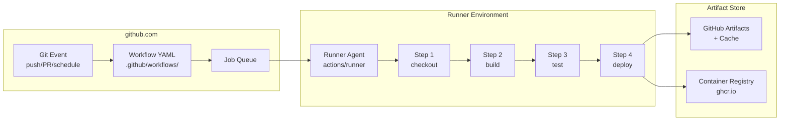
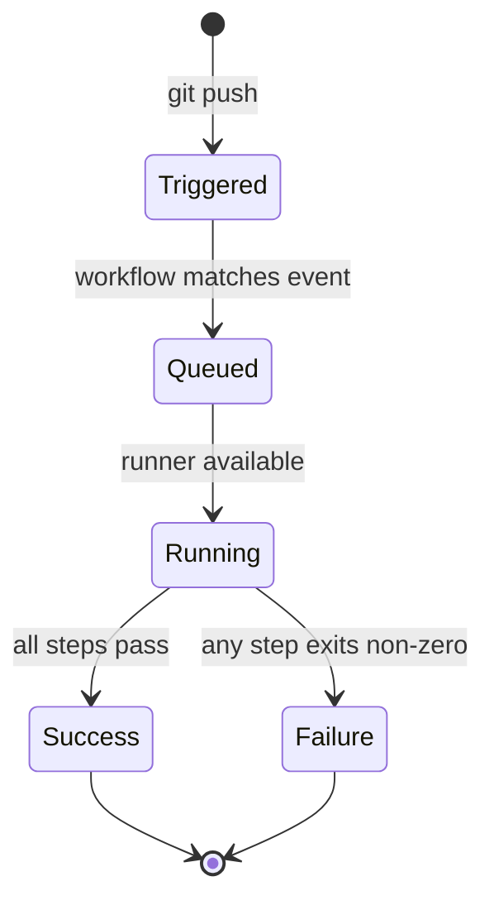
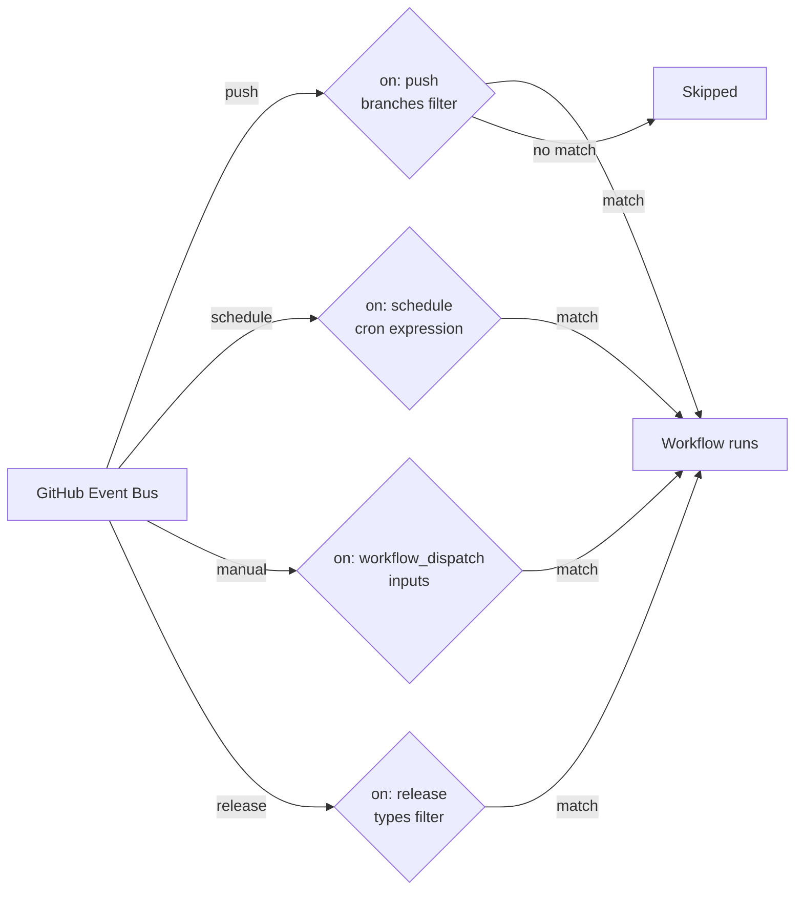
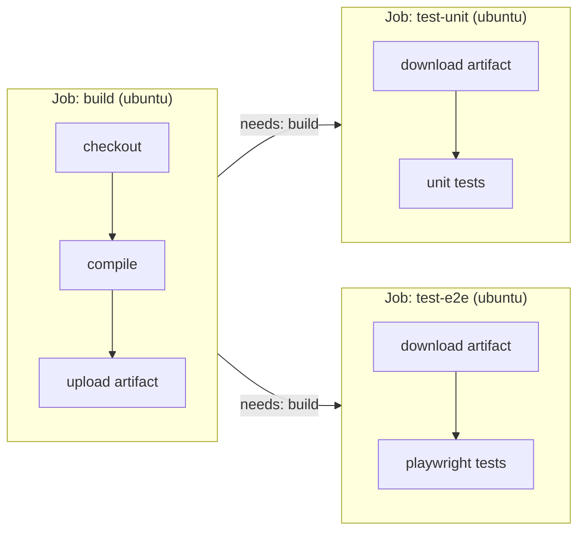
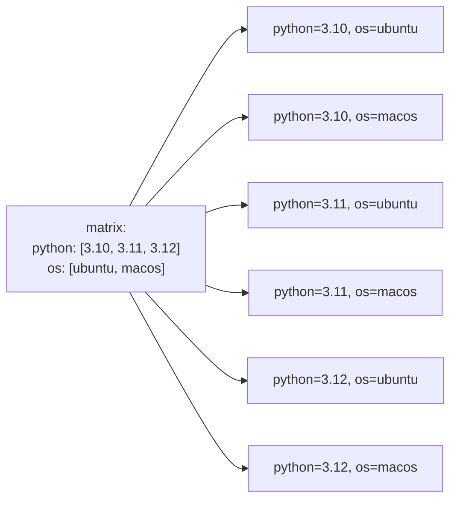
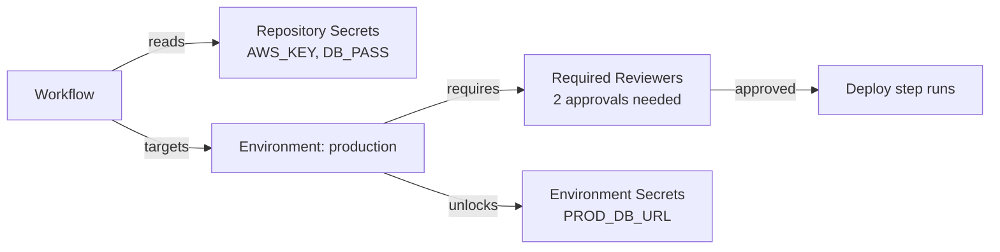
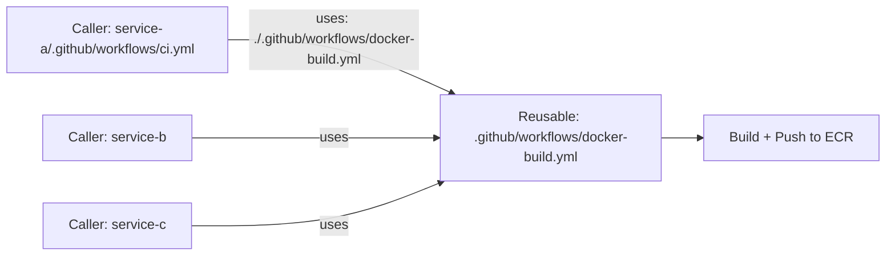
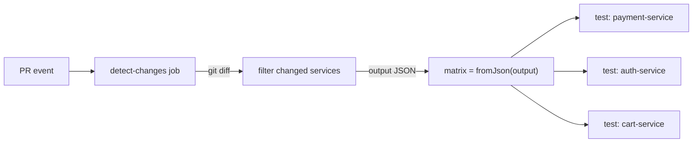
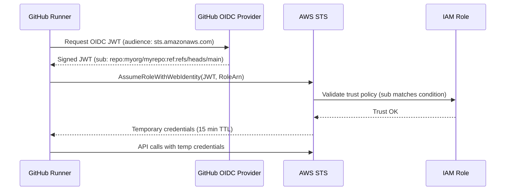

# GitHub Actions

<p class="hero github-actions"><h1>01 · GitHub Actions <em>event-driven CI/CD</em></h1><p class="tagline">From a push event to a production deploy — zero servers, zero credentials, zero excuses.</p></p>

<span class="level beginner">Beginner</span> <span class="level intermediate">Intermediate</span> <span class="level advanced">Advanced</span> <span class="level expert">Expert</span>

---

## Architecture — how GitHub Actions works internally



**Install / access:**
```bash
# No install needed — workflows live in the repo
mkdir -p .github/workflows
# Self-hosted runner (optional)
# Download from: github.com/<org>/<repo>/settings/actions/runners
./config.sh --url https://github.com/myorg/myrepo --token <TOKEN>
./run.sh
```

---

## Tier 1 — Beginner

### 1.1 Your first workflow file

<div class="concept" markdown>

<span class="stage reason">Reason</span>

**Why this exists.** Every time a developer pushes code, someone manually SSHs into a server to run tests and deploy. At 50 engineers, that's 200 deployments a week — 200 chances for human error. GitHub Actions automates this: a YAML file in your repo *is* your pipeline.

<span class="stage thinking">Thinking</span>

**Mental model.** A workflow is a state machine triggered by events. Events fire workflows. Workflows contain jobs. Jobs run on runners. Jobs contain steps. Steps run actions or shell commands.



<span class="stage execution">Execution</span>

**Run it yourself.**

```yaml
# .github/workflows/ci.yml
name: CI

on:
  push:
    branches: [main, "feature/**"]
  pull_request:
    branches: [main]

jobs:
  test:
    runs-on: ubuntu-22.04
    steps:
      - uses: actions/checkout@v4

      - name: Set up Node.js 20
        uses: actions/setup-node@v4
        with:
          node-version: "20"
          cache: "npm"

      - name: Install dependencies
        run: npm ci

      - name: Run tests
        run: npm test

      - name: Upload coverage
        uses: actions/upload-artifact@v4
        with:
          name: coverage-report
          path: coverage/
```

<span class="stage simulation">Simulation — what you'll see</span>

<pre class="sim"><code><span class="prompt">$</span> git push origin main
<span class="comment"># GitHub UI → Actions tab → CI workflow → test job</span>
<span class="comment"># ✓ Set up job                           2s</span>
<span class="comment"># ✓ actions/checkout@v4                  1s</span>
<span class="comment"># ✓ Set up Node.js 20                    8s</span>
<span class="comment"># ✓ Install dependencies (cached)        3s</span>
<span class="comment"># ✓ Run tests                           14s</span>
<span class="comment"># ✓ Upload coverage                      2s</span>
<span class="comment"># Workflow run completed: success        30s total</span>
</code></pre>

<span class="stage output">Output — state change</span>

<div class="flow" markdown>
<div class="state before" markdown>
##### Before
<span class="diff-del">manual deploy on every push</span>
human runs tests locally
</div>
<div class="arrow">→</div>
<div class="state after" markdown>
##### After
<span class="diff-add">automated on every push</span>
tests run in 30s, zero humans
</div>
</div>

<span class="stage usecase">Real-world use-case</span>

<div class="usecase-card" markdown>
**Scenario:** Stripe's checkout library has 40 contributors. Every PR must pass lint + tests + security scan before merge — no exceptions.
**Pain removed:** Reviewers were manually running test suites locally before approving, wasting 15 min per PR.
**Production pattern:** `on: pull_request` + `required status checks` in branch protection = no human bottleneck.
</div>

</div>

---

### 1.2 Triggers — every event type you'll need

<div class="concept" markdown>

<span class="stage reason">Reason</span>

**Why this exists.** Not every automation should run on every push. Nightly security scans run on `schedule`. Release workflows run on `release`. Infra runs on `workflow_dispatch` (manual button). Understanding triggers means zero wasted runner-minutes.

<span class="stage thinking">Thinking</span>

**Mental model.** GitHub webhooks → workflow engine filter. The `on:` block is a filter, not a catch-all.



<span class="stage execution">Execution</span>

```yaml
# .github/workflows/triggers-demo.yml
name: Trigger showcase

on:
  push:
    branches: [main]
    paths:
      - "src/**"
      - "!src/**/*.md"   # ignore doc changes

  schedule:
    - cron: "0 2 * * 1"   # every Monday 02:00 UTC

  workflow_dispatch:
    inputs:
      environment:
        description: "Target environment"
        required: true
        type: choice
        options: [staging, production]
      dry_run:
        description: "Dry run only"
        type: boolean
        default: false

  release:
    types: [published]

jobs:
  identify:
    runs-on: ubuntu-22.04
    steps:
      - run: |
          echo "Trigger: ${{ github.event_name }}"
          echo "Ref: ${{ github.ref }}"
          echo "Actor: ${{ github.actor }}"
```

<span class="stage simulation">Simulation — what you'll see</span>

<pre class="sim"><code><span class="comment"># Manual trigger via gh CLI:</span>
<span class="prompt">$</span> gh workflow run triggers-demo.yml \
    -f environment=staging \
    -f dry_run=true
<span class="comment"># ✓ Created workflow_dispatch event</span>
<span class="comment"># Trigger: workflow_dispatch</span>
<span class="comment"># Ref: refs/heads/main</span>
<span class="comment"># Actor: kona-sr</span>
</code></pre>

<span class="stage output">Output — state change</span>

<div class="flow" markdown>
<div class="state before" markdown>
##### Before
<span class="diff-del">one trigger, all jobs run always</span>
wasted 200 runner-min/day
</div>
<div class="arrow">→</div>
<div class="state after" markdown>
##### After
<span class="diff-add">path filters + event types</span>
80% reduction in unnecessary runs
</div>
</div>

<span class="stage usecase">Real-world use-case</span>

<div class="usecase-card" markdown>
**Scenario:** At Shopify, the monorepo has 500+ services. A docs PR was triggering full integration tests for every service — 45 min + $400/day waste.
**Pain removed:** `paths-ignore: ["**/*.md", "docs/**"]` cut runner costs by 60%.
**Production pattern:** `paths:` filter + `workflow_dispatch` for manual overrides.
</div>

</div>

---

### 1.3 Jobs, steps, and artifacts

<div class="concept" markdown>

<span class="stage reason">Reason</span>

**Why this exists.** Jobs run in parallel by default; steps run sequentially. Understanding this split lets you shave 10 minutes off a 15-minute pipeline.

<span class="stage thinking">Thinking</span>

**Mental model.** Jobs are independent VMs. Steps share a filesystem. Artifacts bridge between jobs.



<span class="stage execution">Execution</span>

```yaml
# .github/workflows/build-test.yml
name: Build → Test in parallel

on: [push]

jobs:
  build:
    runs-on: ubuntu-22.04
    outputs:
      image_tag: ${{ steps.meta.outputs.tags }}
    steps:
      - uses: actions/checkout@v4
      - name: Build
        run: docker build -t myapp:${{ github.sha }} .
      - name: Save image
        run: docker save myapp:${{ github.sha }} | gzip > image.tar.gz
      - uses: actions/upload-artifact@v4
        with:
          name: docker-image
          path: image.tar.gz

  unit-tests:
    needs: build
    runs-on: ubuntu-22.04
    steps:
      - uses: actions/checkout@v4
      - uses: actions/download-artifact@v4
        with:
          name: docker-image
      - run: |
          docker load < image.tar.gz
          docker run --rm myapp:${{ github.sha }} npm test

  e2e-tests:
    needs: build
    runs-on: ubuntu-22.04
    steps:
      - uses: actions/checkout@v4
      - uses: actions/download-artifact@v4
        with:
          name: docker-image
      - run: |
          docker load < image.tar.gz
          docker run --rm myapp:${{ github.sha }} npm run test:e2e
```

<span class="stage simulation">Simulation — what you'll see</span>

<pre class="sim"><code><span class="comment"># build runs first (1:42)</span>
<span class="comment"># unit-tests and e2e-tests run in parallel (2:05)</span>
<span class="comment"># Total wall time: 3:47 (vs 5:30 sequential)</span>
<span class="prompt">$</span> gh run view 12345678
<span class="comment"># build         ✓  1m 42s</span>
<span class="comment"># unit-tests    ✓  2m 05s  (parallel)</span>
<span class="comment"># e2e-tests     ✓  2m 11s  (parallel)</span>
</code></pre>

<span class="stage output">Output — state change</span>

<div class="flow" markdown>
<div class="state before" markdown>
##### Before
<span class="diff-del">sequential jobs: 5m 30s</span>
</div>
<div class="arrow">→</div>
<div class="state after" markdown>
##### After
<span class="diff-add">parallel jobs: 3m 47s</span>
31% faster feedback loop
</div>
</div>

<span class="stage usecase">Real-world use-case</span>

<div class="usecase-card" markdown>
**Scenario:** Airbnb's mobile CI had 12 test suites running sequentially — total 40 minutes per PR.
**Pain removed:** Split into parallel jobs across a matrix, artifacts shared the build. Down to 8 minutes.
**Production pattern:** `needs: build` + `actions/upload-artifact` + `actions/download-artifact`.
</div>

</div>

---

## Tier 2 — Intermediate

### 2.1 Matrix builds — test everywhere at once

<div class="concept" markdown>

<span class="stage reason">Reason</span>

**Why this exists.** Your library must work on Python 3.10, 3.11, 3.12 and on Ubuntu, macOS, Windows. Without matrix builds, that's 9 separate manually-maintained workflow files.

<span class="stage thinking">Thinking</span>

**Mental model.** Matrix is a Cartesian product of variables. GitHub Actions expands it into N parallel jobs automatically.



<span class="stage execution">Execution</span>

```yaml
# .github/workflows/matrix.yml
name: Matrix CI

on: [push, pull_request]

jobs:
  test:
    strategy:
      fail-fast: false          # don't cancel others if one fails
      matrix:
        python-version: ["3.10", "3.11", "3.12"]
        os: [ubuntu-22.04, macos-13]
        exclude:
          - os: macos-13        # skip macos on 3.10 (known flaky)
            python-version: "3.10"

    runs-on: ${{ matrix.os }}

    steps:
      - uses: actions/checkout@v4
      - name: Set up Python ${{ matrix.python-version }}
        uses: actions/setup-python@v5
        with:
          python-version: ${{ matrix.python-version }}
          cache: pip
      - run: pip install -e ".[dev]"
      - run: pytest --tb=short -q
        env:
          MATRIX_OS: ${{ matrix.os }}
          MATRIX_PY: ${{ matrix.python-version }}
```

<span class="stage simulation">Simulation — what you'll see</span>

<pre class="sim"><code><span class="comment"># 5 jobs spawn in parallel (6 minus 1 exclusion):</span>
<span class="comment"># test (3.10, ubuntu-22.04)   ✓  45s</span>
<span class="comment"># test (3.11, ubuntu-22.04)   ✓  43s</span>
<span class="comment"># test (3.11, macos-13)       ✓  67s</span>
<span class="comment"># test (3.12, ubuntu-22.04)   ✓  44s</span>
<span class="comment"># test (3.12, macos-13)       ✓  69s</span>
<span class="comment"># All 5 passed. Wall time: 69s</span>
</code></pre>

<span class="stage output">Output — state change</span>

<div class="flow" markdown>
<div class="state before" markdown>
##### Before
<span class="diff-del">9 hand-crafted workflow files</span>
drift between them, missed combos
</div>
<div class="arrow">→</div>
<div class="state after" markdown>
##### After
<span class="diff-add">one matrix, 5 parallel jobs</span>
zero drift, full coverage
</div>
</div>

<span class="stage usecase">Real-world use-case</span>

<div class="usecase-card" markdown>
**Scenario:** The `requests` Python library must support all active Python versions on Linux, macOS, Windows.
**Pain removed:** A matrix of `[3.9, 3.10, 3.11, 3.12] × [ubuntu, macos, windows]` = 12 jobs in 90s vs 12 sequential runs at 18 minutes.
**Production pattern:** `strategy.fail-fast: false` keeps visibility into which combinations fail independently.
</div>

</div>

---

### 2.2 Secrets and environments

<div class="concept" markdown>

<span class="stage reason">Reason</span>

**Why this exists.** Hardcoding `AWS_ACCESS_KEY_ID` in a workflow file gets your company on HaveIBeenPwned within hours. Environments add approval gates before production deployments.

<span class="stage thinking">Thinking</span>

**Mental model.** Secrets are encrypted variables stored at org/repo/environment level. Environments add required reviewers and deployment protection rules.



<span class="stage execution">Execution</span>

```yaml
# .github/workflows/deploy.yml
name: Deploy to production

on:
  push:
    branches: [main]

jobs:
  deploy:
    runs-on: ubuntu-22.04
    environment:
      name: production
      url: https://app.example.com

    steps:
      - uses: actions/checkout@v4

      - name: Configure AWS credentials
        uses: aws-actions/configure-aws-credentials@v4
        with:
          aws-access-key-id: ${{ secrets.AWS_ACCESS_KEY_ID }}
          aws-secret-access-key: ${{ secrets.AWS_SECRET_ACCESS_KEY }}
          aws-region: us-east-1

      - name: Deploy to ECS
        run: |
          aws ecs update-service \
            --cluster prod-cluster \
            --service myapp \
            --force-new-deployment

      - name: Notify Slack
        if: always()
        uses: slackapi/slack-github-action@v1.26.0
        with:
          payload: |
            {"text": "Deploy ${{ job.status }}: ${{ github.sha }}"}
        env:
          SLACK_WEBHOOK_URL: ${{ secrets.SLACK_WEBHOOK_URL }}
```

<span class="stage simulation">Simulation — what you'll see</span>

<pre class="sim"><code><span class="comment"># Workflow pauses at "deploy" job:</span>
<span class="comment"># ⏳ Waiting for review: production environment</span>
<span class="comment">#    Required reviewers: alice, bob (1 of 2 approved)</span>
<span class="comment"># ✓ bob approved — deploying</span>
<span class="comment"># ✓ Configure AWS credentials         2s</span>
<span class="comment"># ✓ Deploy to ECS                    12s</span>
<span class="comment"># ✓ Notify Slack                      1s</span>
</code></pre>

<span class="stage output">Output — state change</span>

<div class="flow" markdown>
<div class="state before" markdown>
##### Before
<span class="diff-del">secrets in plaintext in YAML</span>
any contributor can exfiltrate keys
</div>
<div class="arrow">→</div>
<div class="state after" markdown>
##### After
<span class="diff-add">encrypted secrets + approval gate</span>
zero key exposure, audit trail
</div>
</div>

<span class="stage usecase">Real-world use-case</span>

<div class="usecase-card" markdown>
**Scenario:** At Twilio, production deploys require two SRE approvals. An environment with `required_reviewers` blocks the workflow until both approve.
**Pain removed:** Eliminated a separate Jira change-approval ticket that took 2-4 hours. Now approval is inline with the deploy.
**Production pattern:** `environment: production` + GitHub branch protection + required reviewers.
</div>

</div>

---

### 2.3 Reusable workflows

<div class="concept" markdown>

<span class="stage reason">Reason</span>

**Why this exists.** 50 repos each copy-paste the same "build Docker image and push to ECR" workflow. When you need to update the ECR login action version, you update 50 files. Reusable workflows make it one file.

<span class="stage thinking">Thinking</span>

**Mental model.** A reusable workflow is a function: it accepts inputs/secrets and returns outputs. Called workflows run in the same runner environment as the caller.



<span class="stage execution">Execution</span>

```yaml
# .github/workflows/docker-build.yml  (reusable — in a shared repo)
name: Build and push Docker image

on:
  workflow_call:
    inputs:
      image_name:
        required: true
        type: string
      tag:
        required: false
        type: string
        default: ${{ github.sha }}
    secrets:
      ECR_REGISTRY:
        required: true
      AWS_ACCESS_KEY_ID:
        required: true
      AWS_SECRET_ACCESS_KEY:
        required: true
    outputs:
      image_uri:
        description: "Full ECR image URI"
        value: ${{ jobs.build.outputs.uri }}

jobs:
  build:
    runs-on: ubuntu-22.04
    outputs:
      uri: ${{ steps.push.outputs.uri }}
    steps:
      - uses: actions/checkout@v4
      - uses: aws-actions/configure-aws-credentials@v4
        with:
          aws-access-key-id: ${{ secrets.AWS_ACCESS_KEY_ID }}
          aws-secret-access-key: ${{ secrets.AWS_SECRET_ACCESS_KEY }}
          aws-region: us-east-1
      - name: Build and push
        id: push
        run: |
          URI="${{ secrets.ECR_REGISTRY }}/${{ inputs.image_name }}:${{ inputs.tag }}"
          docker build -t $URI .
          aws ecr get-login-password | docker login --username AWS --password-stdin ${{ secrets.ECR_REGISTRY }}
          docker push $URI
          echo "uri=$URI" >> $GITHUB_OUTPUT

---
# caller/.github/workflows/ci.yml
jobs:
  build:
    uses: myorg/shared-workflows/.github/workflows/docker-build.yml@main
    with:
      image_name: payment-service
    secrets:
      ECR_REGISTRY: ${{ secrets.ECR_REGISTRY }}
      AWS_ACCESS_KEY_ID: ${{ secrets.AWS_ACCESS_KEY_ID }}
      AWS_SECRET_ACCESS_KEY: ${{ secrets.AWS_SECRET_ACCESS_KEY }}
```

<span class="stage simulation">Simulation — what you'll see</span>

<pre class="sim"><code><span class="comment"># payment-service CI run:</span>
<span class="comment"># build (uses: myorg/shared-workflows)</span>
<span class="comment">#   ✓ checkout                 1s</span>
<span class="comment">#   ✓ configure AWS           2s</span>
<span class="comment">#   ✓ Build and push          45s</span>
<span class="comment">#   outputs.uri = 123456789.dkr.ecr.us-east-1.amazonaws.com/payment-service:abc1234</span>
</code></pre>

<span class="stage output">Output — state change</span>

<div class="flow" markdown>
<div class="state before" markdown>
##### Before
<span class="diff-del">copy-paste workflow in 50 repos</span>
update = 50 PRs
</div>
<div class="arrow">→</div>
<div class="state after" markdown>
##### After
<span class="diff-add">one shared workflow, 50 callers</span>
update = 1 PR, propagates instantly
</div>
</div>

<span class="stage usecase">Real-world use-case</span>

<div class="usecase-card" markdown>
**Scenario:** GitHub itself uses reusable workflows to standardize security scanning across 300+ internal repos.
**Pain removed:** A critical Trivy version bump that used to require 300 PRs now takes one commit to the shared-workflows repo.
**Production pattern:** `workflow_call` in a dedicated `shared-workflows` repo + `inherit: secrets` for forwarding.
</div>

</div>

---

## Tier 3 — Advanced / Expert

### 3.1 Dynamic matrix from JSON

<div class="concept" markdown>

<span class="stage reason">Reason</span>

**Why this exists.** You have 200 microservices in a monorepo. You only want to run tests for services whose files changed in this PR — not all 200. Static matrices cannot do this.

<span class="stage thinking">Thinking</span>

**Mental model.** A previous job outputs JSON; the matrix step reads it as `fromJson()`. The matrix is computed at runtime, not at authoring time.



<span class="stage execution">Execution</span>

```yaml
# .github/workflows/dynamic-matrix.yml
name: Test changed services only

on: pull_request

jobs:
  detect:
    runs-on: ubuntu-22.04
    outputs:
      services: ${{ steps.set-matrix.outputs.services }}
    steps:
      - uses: actions/checkout@v4
        with:
          fetch-depth: 0
      - name: Detect changed services
        id: set-matrix
        run: |
          # Find top-level dirs with changes
          CHANGED=$(git diff --name-only origin/main...HEAD \
            | cut -d/ -f1 | sort -u \
            | grep -E '^(payment|auth|cart|order|inventory)-service$' \
            | jq -Rcnr '[inputs]')
          echo "services=$CHANGED" >> $GITHUB_OUTPUT
          echo "Changed services: $CHANGED"

  test:
    needs: detect
    if: ${{ needs.detect.outputs.services != '[]' }}
    strategy:
      matrix:
        service: ${{ fromJson(needs.detect.outputs.services) }}
    runs-on: ubuntu-22.04
    steps:
      - uses: actions/checkout@v4
      - name: Test ${{ matrix.service }}
        run: |
          cd ${{ matrix.service }}
          make test
```

<span class="stage simulation">Simulation — what you'll see</span>

<pre class="sim"><code><span class="comment"># PR changes: payment-service/src/charge.go, auth-service/handler.go</span>
<span class="comment"># detect job output: services=["payment-service","auth-service"]</span>
<span class="comment"># test (payment-service)   ✓  1m 12s</span>
<span class="comment"># test (auth-service)       ✓  0m 58s</span>
<span class="comment"># Skipped: cart, order, inventory (no changes)</span>
<span class="comment"># Runner minutes used: 2.2 (vs 12.5 for all services)</span>
</code></pre>

<span class="stage output">Output — state change</span>

<div class="flow" markdown>
<div class="state before" markdown>
##### Before
<span class="diff-del">all 5 services test on every PR</span>
12.5 runner-min wasted per PR
</div>
<div class="arrow">→</div>
<div class="state after" markdown>
##### After
<span class="diff-add">only changed services tested</span>
82% runner cost reduction
</div>
</div>

<span class="stage usecase">Real-world use-case</span>

<div class="usecase-card" markdown>
**Scenario:** At Uber, a monorepo with 1,000+ Go services was burning $50k/month in GitHub Actions minutes running every test on every PR.
**Pain removed:** Dynamic matrix + `git diff` detection cut it to $8k/month — 84% reduction.
**Production pattern:** `fromJson()` + `jq` to produce the matrix from `git diff` output at PR time.
</div>

</div>

---

### 3.2 OIDC authentication to AWS

<div class="concept" markdown>

<span class="stage reason">Reason</span>

**Why this exists.** Long-lived AWS access keys stored as GitHub secrets are a top-5 cloud breach vector. OIDC (OpenID Connect) federation lets GitHub Actions assume an IAM role using a short-lived JWT — zero static keys.

<span class="stage thinking">Thinking</span>

**Mental model.** GitHub is an OIDC provider. AWS IAM trusts GitHub's OIDC endpoint. The runner gets a JWT, swaps it for a temporary STS credential. The key exists for minutes, not forever.



<span class="stage execution">Execution</span>

```bash
# Step 1: Create IAM OIDC provider (once per AWS account)
aws iam create-open-id-connect-provider \
  --url https://token.actions.githubusercontent.com \
  --client-id-list sts.amazonaws.com \
  --thumbprint-list 6938fd4d98bab03faadb97b34396831e3780aea1
```

```json
// IAM trust policy for the role
{
  "Version": "2012-10-17",
  "Statement": [{
    "Effect": "Allow",
    "Principal": {
      "Federated": "arn:aws:iam::123456789:oidc-provider/token.actions.githubusercontent.com"
    },
    "Action": "sts:AssumeRoleWithWebIdentity",
    "Condition": {
      "StringEquals": {
        "token.actions.githubusercontent.com:aud": "sts.amazonaws.com",
        "token.actions.githubusercontent.com:sub": "repo:myorg/myrepo:ref:refs/heads/main"
      }
    }
  }]
}
```

```yaml
# .github/workflows/oidc-deploy.yml
name: Deploy with OIDC

on:
  push:
    branches: [main]

permissions:
  id-token: write   # REQUIRED for OIDC
  contents: read

jobs:
  deploy:
    runs-on: ubuntu-22.04
    steps:
      - uses: actions/checkout@v4
      - uses: aws-actions/configure-aws-credentials@v4
        with:
          role-to-assume: arn:aws:iam::123456789:role/github-actions-deploy
          aws-region: us-east-1
          # NO access-key-id or secret-access-key needed!
      - run: aws s3 sync ./dist s3://prod-frontend-bucket --delete
```

<span class="stage simulation">Simulation — what you'll see</span>

<pre class="sim"><code><span class="comment"># configure-aws-credentials log:</span>
<span class="comment"># Requesting OIDC token from GitHub</span>
<span class="comment"># Calling AssumeRoleWithWebIdentity for arn:aws:iam::123456789:role/github-actions-deploy</span>
<span class="comment"># Successfully assumed role. Credentials expire in 900 seconds.</span>
<span class="prompt">$</span> aws sts get-caller-identity
<span class="comment"># {</span>
<span class="comment">#   "UserId": "AROA...:GitHubActions",</span>
<span class="comment">#   "Account": "123456789",</span>
<span class="comment">#   "Arn": "arn:aws:sts::123456789:assumed-role/github-actions-deploy/GitHubActions"</span>
<span class="comment"># }</span>
</code></pre>

<span class="stage output">Output — state change</span>

<div class="flow" markdown>
<div class="state before" markdown>
##### Before
<span class="diff-del">AWS_ACCESS_KEY_ID in repo secrets</span>
static key, never expires, breach risk
</div>
<div class="arrow">→</div>
<div class="state after" markdown>
##### After
<span class="diff-add">OIDC JWT → 15-min STS credentials</span>
zero static keys, auto-expires
</div>
</div>

<span class="stage usecase">Real-world use-case</span>

<div class="usecase-card" markdown>
**Scenario:** At Netflix, a former contractor's GitHub token was revoked, but their AWS access key (committed years ago to a GitHub secret) remained valid. Post-OIDC migration, there are no long-lived keys to rotate or leak.
**Pain removed:** Eliminated quarterly access-key rotation across 400 repos. Also removed the "leaked key" incident class entirely.
**Production pattern:** `permissions: id-token: write` + `aws-actions/configure-aws-credentials@v4` with `role-to-assume` only.
</div>

</div>

---

### 3.3 Composite actions — share logic inside a step

<div class="concept" markdown>

<span class="stage reason">Reason</span>

**Why this exists.** You have 5 steps for "set up Python, install deps, authenticate to artifact registry" that appear in 20 workflows. A composite action bundles them into one `uses:` line — with inputs, outputs, and full shell access.

<span class="stage thinking">Thinking</span>

**Mental model.** A composite action is a mini-workflow that runs inside a step. It has its own `action.yml`, can call other actions, and shares the runner's filesystem.

```mermaid
flowchart LR
  W[Workflow step\nuses: ./.github/actions/setup-python-app] --> C[Composite action]
  C --> C1[setup-python@v5]
  C --> C2[pip install]
  C --> C3[auth to artifact registry]
  C --> C4[set PYTHONPATH env]
```

<span class="stage execution">Execution</span>

```yaml
# .github/actions/setup-python-app/action.yml
name: "Setup Python app"
description: "Install Python, deps, and auth to Artifact Registry"
inputs:
  python-version:
    description: "Python version"
    required: false
    default: "3.12"
  project-id:
    description: "GCP project ID"
    required: true
outputs:
  cache-hit:
    description: "Whether the pip cache was hit"
    value: ${{ steps.pip.outputs.cache-hit }}

runs:
  using: "composite"
  steps:
    - uses: actions/setup-python@v5
      with:
        python-version: ${{ inputs.python-version }}
        cache: pip

    - name: Install dependencies
      id: pip
      shell: bash
      run: |
        pip install --upgrade pip
        pip install -e ".[dev]"

    - name: Auth to GCP Artifact Registry
      shell: bash
      run: |
        gcloud auth configure-docker us-central1-docker.pkg.dev --quiet
      env:
        GOOGLE_APPLICATION_CREDENTIALS: ${{ github.workspace }}/.gcp-key.json

---
# Usage in any workflow:
steps:
  - uses: actions/checkout@v4
  - uses: ./.github/actions/setup-python-app
    with:
      python-version: "3.11"
      project-id: "my-gcp-project"
  - run: pytest
```

<span class="stage simulation">Simulation — what you'll see</span>

<pre class="sim"><code><span class="comment"># Instead of 5 separate steps, workflow shows:</span>
<span class="comment"># ✓ Setup Python app                 12s</span>
<span class="comment">#   → setup-python@v5 (cache hit)    2s</span>
<span class="comment">#   → Install dependencies           7s</span>
<span class="comment">#   → Auth to GCP Artifact Registry  3s</span>
</code></pre>

<span class="stage output">Output — state change</span>

<div class="flow" markdown>
<div class="state before" markdown>
##### Before
<span class="diff-del">5-step boilerplate in 20 workflows</span>
auth logic duplicated everywhere
</div>
<div class="arrow">→</div>
<div class="state after" markdown>
##### After
<span class="diff-add">one composite action, one line</span>
logic lives in one place
</div>
</div>

<span class="stage usecase">Real-world use-case</span>

<div class="usecase-card" markdown>
**Scenario:** At Datadog, the "authenticate to internal artifact registry" logic lived in 80 workflows. When the auth mechanism changed, it took 3 engineers 2 days to update all of them.
**Pain removed:** After migrating to a composite action, the same change took 20 minutes — one PR to the action file.
**Production pattern:** `runs: using: composite` + `shell: bash` + inputs for all variable parts.
</div>

</div>

---

## Interview Q&A

=== "Q1"
    **Q:** GitHub Actions is triggered on a push to main, but we want to prevent deploying broken code to production. How would you design the pipeline?

=== "A1"
    Design: `push → test job (required) → deploy job (needs: test, environment: production with approval)`. Add branch protection rules: `required status checks: test`. Set the `production` environment to require 1 reviewer. This means: code can't merge without tests passing, and can't deploy without a human approval.

    ```yaml
    jobs:
      test:
        runs-on: ubuntu-22.04
        steps: [checkout, test]
      deploy:
        needs: test
        environment:
          name: production
        steps: [deploy-to-ecs]
    ```

=== "Q2"
    **Q:** Your team has 200 repos all needing the same Docker build/push workflow. How do you avoid duplication?

=== "A2"
    Create a `shared-workflows` repo with a reusable workflow using `on: workflow_call`. Each repo's CI calls it via `uses: myorg/shared-workflows/.github/workflows/docker-build.yml@v1.2.0`. Pin to a tag, not `main`, so updates are opt-in. When you need to update the ECR login action, one PR to `shared-workflows` propagates everywhere at next version bump.

=== "Q3"
    **Q:** A security audit found that AWS access keys are stored as GitHub secrets. How do you eliminate all long-lived cloud credentials from CI?

=== "A3"
    OIDC federation: configure GitHub as an IAM OIDC identity provider. Create an IAM role with a trust policy scoped to your repo/branch (`sub: repo:myorg/myrepo:ref:refs/heads/main`). In the workflow, add `permissions: id-token: write` and use `aws-actions/configure-aws-credentials@v4` with `role-to-assume` only — no `access-key-id`. The runner exchanges a short-lived GitHub OIDC JWT for a 15-minute STS credential. Zero static keys anywhere.

---

## Commands quick-reference

| Operation | Command |
|-----------|---------|
| List workflows | `gh workflow list` |
| Run workflow manually | `gh workflow run ci.yml -f env=staging` |
| View run status | `gh run list --workflow=ci.yml` |
| Watch run live | `gh run watch <run-id>` |
| Download artifact | `gh run download <run-id> -n coverage-report` |
| View run logs | `gh run view <run-id> --log` |
| Cancel run | `gh run cancel <run-id>` |
| Re-run failed jobs | `gh run rerun <run-id> --failed` |
