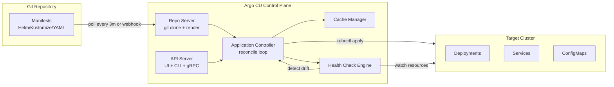
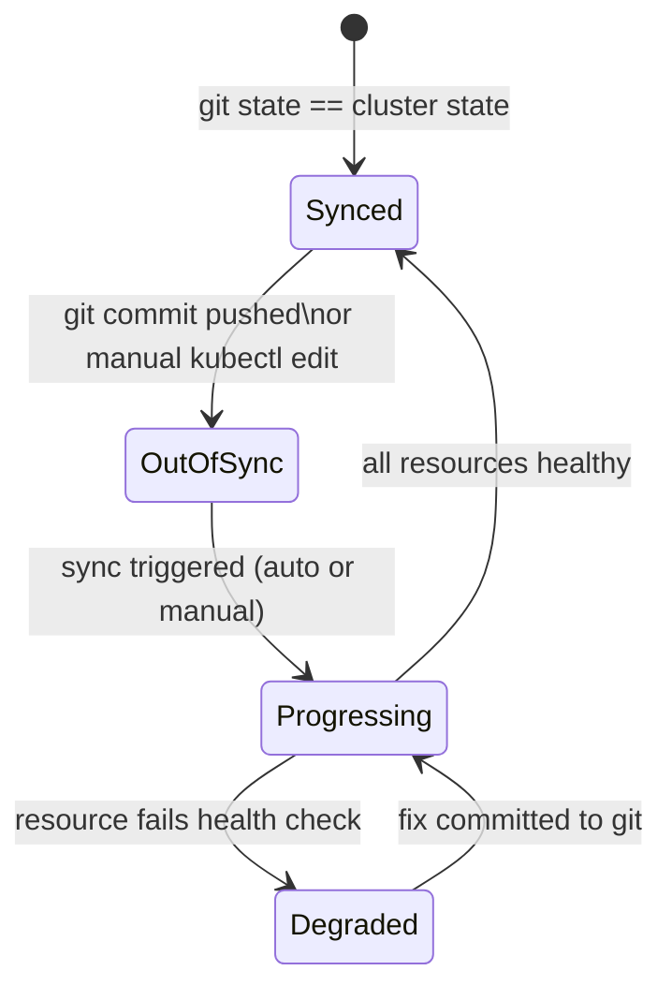
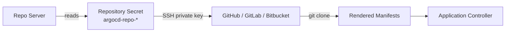
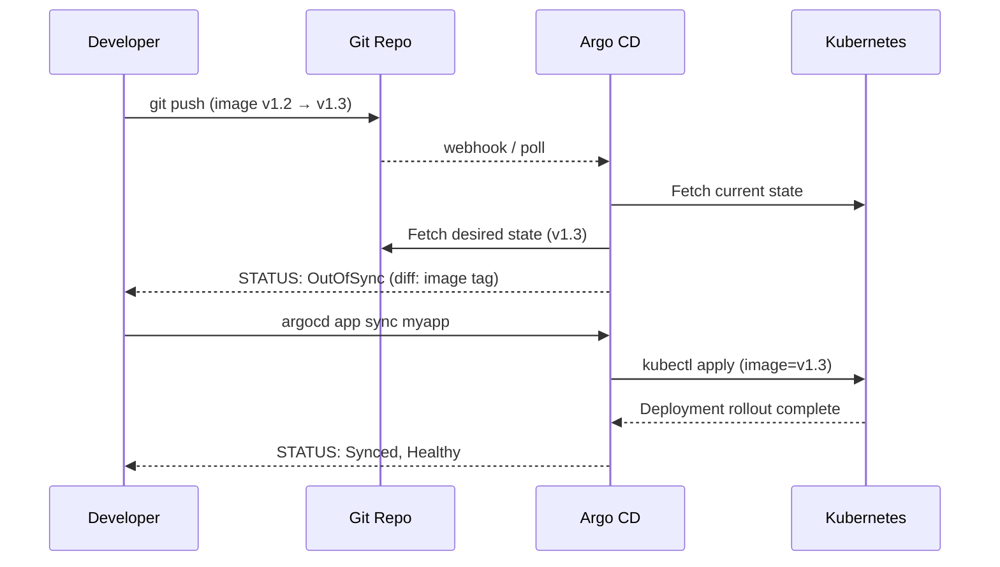
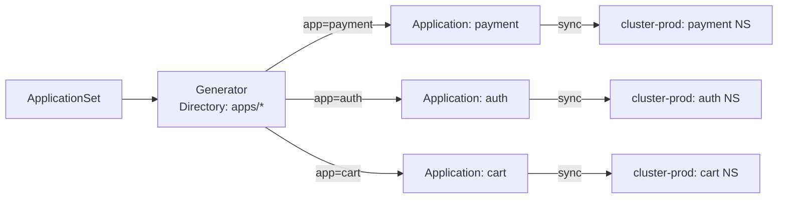
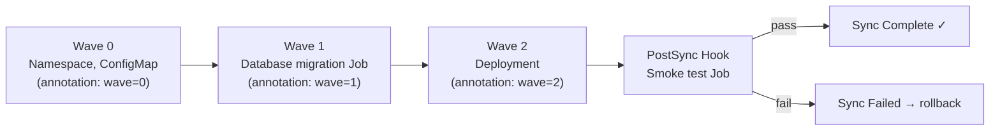
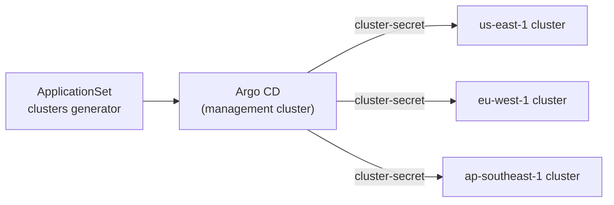
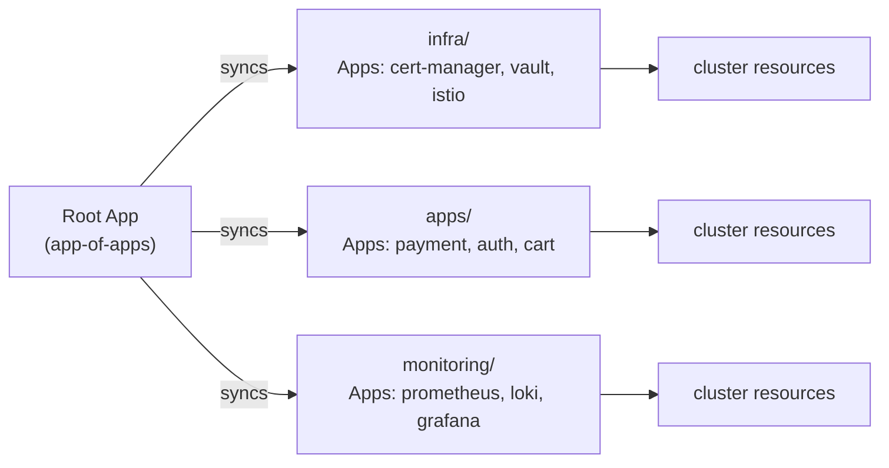
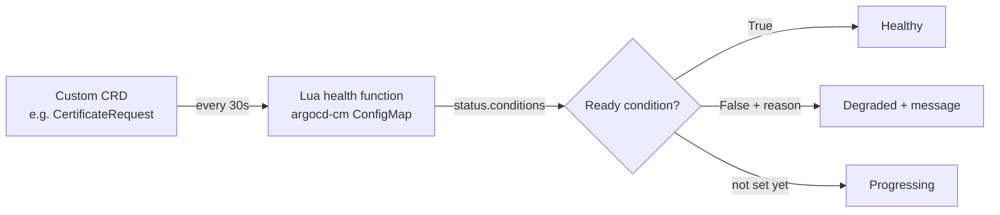
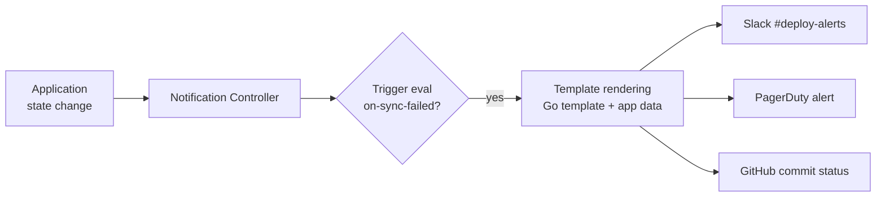

# Argo CD — GitOps for Kubernetes

<p class="hero argocd"><h1>03 · Argo CD <em>GitOps continuous delivery</em></h1><p class="tagline">Git is the source of truth. Argo CD is the enforcer — reconciling every drift, every minute, forever.</p></p>

<span class="level beginner">Beginner</span> <span class="level intermediate">Intermediate</span> <span class="level advanced">Advanced</span> <span class="level expert">Expert</span>

---

## Architecture — how Argo CD works internally



**Install (v2.10):**
```bash
kubectl create namespace argocd
kubectl apply -n argocd -f \
  https://raw.githubusercontent.com/argoproj/argo-cd/v2.10.0/manifests/install.yaml

# Get initial admin password
kubectl get secret argocd-initial-admin-secret -n argocd \
  -o jsonpath="{.data.password}" | base64 -d

# Port-forward UI
kubectl port-forward svc/argocd-server -n argocd 8080:443

# Install CLI
brew install argocd
argocd login localhost:8080 --username admin --insecure
```

---

## Tier 1 — Beginner

### 1.1 Your first Application

<div class="concept" markdown>

<span class="stage reason">Reason</span>

**Why this exists.** You deploy to Kubernetes with `kubectl apply -f` — from a laptop. Who deployed v1.3.2? When? Why is prod running a different config than staging? Argo CD answers all three: every deploy is a Git commit, every state is visible in the UI, drift is detected automatically.

<span class="stage thinking">Thinking</span>

**Mental model.** An Argo CD `Application` is a declarative mapping: *this Git path* → *this Kubernetes cluster/namespace*. The reconciler watches both sides and converges them.



<span class="stage execution">Execution</span>

```yaml
# application.yaml — the Argo CD Application CRD
apiVersion: argoproj.io/v1alpha1
kind: Application
metadata:
  name: guestbook
  namespace: argocd
spec:
  project: default
  source:
    repoURL: https://github.com/argoproj/argocd-example-apps.git
    targetRevision: HEAD
    path: guestbook
  destination:
    server: https://kubernetes.default.svc
    namespace: guestbook
  syncPolicy:
    automated:
      prune: true       # delete resources removed from git
      selfHeal: true    # re-apply if someone kubectl-edits
    syncOptions:
      - CreateNamespace=true
```

```bash
kubectl apply -f application.yaml

# Or via CLI:
argocd app create guestbook \
  --repo https://github.com/argoproj/argocd-example-apps.git \
  --path guestbook \
  --dest-server https://kubernetes.default.svc \
  --dest-namespace guestbook \
  --sync-policy automated \
  --auto-prune \
  --self-heal
```

<span class="stage simulation">Simulation — what you'll see</span>

<pre class="sim"><code><span class="prompt">$</span> argocd app get guestbook
<span class="comment"># Name:               argocd/guestbook</span>
<span class="comment"># Project:            default</span>
<span class="comment"># Server:             https://kubernetes.default.svc</span>
<span class="comment"># Namespace:          guestbook</span>
<span class="comment"># URL:                https://localhost:8080/applications/guestbook</span>
<span class="comment"># Repo:               https://github.com/argoproj/argocd-example-apps.git</span>
<span class="comment"># Target:             HEAD</span>
<span class="comment"># Path:               guestbook</span>
<span class="comment"># SyncWindow:         Sync Allowed</span>
<span class="comment"># Sync Policy:        Automated (Prune)</span>
<span class="comment"># Sync Status:        Synced to HEAD (53e28ff)</span>
<span class="comment"># Health Status:      Healthy</span>
<span class="comment">#</span>
<span class="comment"># GROUP  KIND        NAMESPACE  NAME          STATUS  HEALTH   MESSAGE</span>
<span class="comment">#        Service     guestbook  guestbook-ui  Synced  Healthy</span>
<span class="comment">#        Deployment  guestbook  guestbook-ui  Synced  Healthy</span>
</code></pre>

<span class="stage output">Output — state change</span>

<div class="flow" markdown>
<div class="state before" markdown>
##### Before
<span class="diff-del">kubectl apply from dev laptops</span>
no audit trail, drift undetected
</div>
<div class="arrow">→</div>
<div class="state after" markdown>
##### After
<span class="diff-add">git commit = deploy, drift auto-healed</span>
full audit trail, zero config rot
</div>
</div>

<span class="stage usecase">Real-world use-case</span>

<div class="usecase-card" markdown>
**Scenario:** At Adobe, a developer ran `kubectl edit deployment` in production to "quickly test something" and forgot to revert. Six months later, the deployment differed from git in 14 places. Nobody knew.
**Pain removed:** `selfHeal: true` reverts unauthorized kubectl edits within 3 minutes. The diff is visible in the Argo CD UI before it heals.
**Production pattern:** `syncPolicy.automated.selfHeal: true` + Slack notifications on OutOfSync events.
</div>

</div>

---

### 1.2 Connect a private Git repository

<div class="concept" markdown>

<span class="stage reason">Reason</span>

**Why this exists.** Your manifests are in a private GitHub repo. Argo CD needs credentials to clone it. You configure this once per repo — not per application.

<span class="stage thinking">Thinking</span>

**Mental model.** Argo CD's repo server stores credentials in a Kubernetes Secret (type `repository`). It supports HTTPS (token), SSH (private key), or GitHub App authentication.



<span class="stage execution">Execution</span>

```bash
# Option 1: HTTPS with token
argocd repo add https://github.com/myorg/k8s-manifests.git \
  --username git \
  --password ghp_xxxxxxxxxxxxxxxxxxxx

# Option 2: SSH key
argocd repo add git@github.com:myorg/k8s-manifests.git \
  --ssh-private-key-path ~/.ssh/argocd_ed25519

# Option 3: GitHub App (recommended for orgs)
argocd repo add https://github.com/myorg/k8s-manifests.git \
  --github-app-id 123456 \
  --github-app-installation-id 78901234 \
  --github-app-private-key-path app-private-key.pem

# Verify
argocd repo list
```

<span class="stage simulation">Simulation — what you'll see</span>

<pre class="sim"><code><span class="prompt">$</span> argocd repo list
<span class="comment"># TYPE  NAME  REPO                                        INSECURE  OCI    STATUS      MESSAGE</span>
<span class="comment"># git         https://github.com/myorg/k8s-manifests.git  false     false  Successful</span>
</code></pre>

<span class="stage output">Output — state change</span>

<div class="flow" markdown>
<div class="state before" markdown>
##### Before
<span class="diff-del">repo unreachable — connection refused</span>
</div>
<div class="arrow">→</div>
<div class="state after" markdown>
##### After
<span class="diff-add">STATUS: Successful — repo cloned</span>
</div>
</div>

<span class="stage usecase">Real-world use-case</span>

<div class="usecase-card" markdown>
**Scenario:** Intuit runs Argo CD across 15 clusters. Each cluster's Argo CD instance uses a dedicated GitHub App with minimal read-only permissions scoped to specific repos.
**Pain removed:** Personal access tokens expired every 90 days, breaking CI. GitHub App tokens auto-rotate hourly.
**Production pattern:** GitHub App auth — no rotation needed, no expiry issues.
</div>

</div>

---

### 1.3 Manual sync, diff, and rollback

<div class="concept" markdown>

<span class="stage reason">Reason</span>

**Why this exists.** You need to understand the state of your deployment before and after a sync. `argocd app diff` shows you exactly what will change — before it changes.

<span class="stage thinking">Thinking</span>

**Mental model.** Diff = git state minus cluster state. Sync = apply git state to cluster. Rollback = apply a previous git revision.



<span class="stage execution">Execution</span>

```bash
# See what will change before syncing
argocd app diff guestbook

# Sync (apply git state to cluster)
argocd app sync guestbook --timeout 120

# Check rollout status
argocd app wait guestbook --health --timeout 120

# Rollback to previous revision
argocd app history guestbook
argocd app rollback guestbook 3   # revision 3
```

<span class="stage simulation">Simulation — what you'll see</span>

<pre class="sim"><code><span class="prompt">$</span> argocd app diff guestbook
<span class="comment">====== apps/Deployment guestbook/guestbook-ui ======</span>
<span class="comment">  spec:</span>
<span class="comment">    template:</span>
<span class="comment">      spec:</span>
<span class="comment">        containers:</span>
<span class="comment">        - name: guestbook-ui</span>
<span class="comment">-         image: gcr.io/heptio-images/ks-guestbook-demo:0.1</span>
<span class="comment">+         image: gcr.io/heptio-images/ks-guestbook-demo:0.2</span>
</code></pre>

<span class="stage output">Output — state change</span>

<div class="flow" markdown>
<div class="state before" markdown>
##### Before
<span class="diff-del">OutOfSync — image 0.1 in cluster</span>
</div>
<div class="arrow">→</div>
<div class="state after" markdown>
##### After
<span class="diff-add">Synced — image 0.2 deployed</span>
</div>
</div>

<span class="stage usecase">Real-world use-case</span>

<div class="usecase-card" markdown>
**Scenario:** At Robinhood, an oncall engineer used `argocd app diff` during an incident to confirm that the cluster state matched git before concluding a "ghost deploy" was not the root cause.
**Pain removed:** Previously, engineers SSH'd into nodes to run `kubectl describe` across 30 resources. `app diff` gave the answer in 2 seconds.
**Production pattern:** `argocd app diff` as the first oncall command — before `argocd app sync`.
</div>

</div>

---

## Tier 2 — Intermediate

### 2.1 ApplicationSets — generate 100 apps from one template

<div class="concept" markdown>

<span class="stage reason">Reason</span>

**Why this exists.** You have 50 microservices. Creating 50 `Application` CRDs by hand is copy-paste hell. `ApplicationSet` generates all 50 from one template + a generator (directory listing, cluster list, git matrix).

<span class="stage thinking">Thinking</span>

**Mental model.** An ApplicationSet is a template + a generator. The generator produces parameters; the template consumes them. One ApplicationSet can manage N applications across M clusters.



<span class="stage execution">Execution</span>

```yaml
# applicationset.yaml
apiVersion: argoproj.io/v1alpha1
kind: ApplicationSet
metadata:
  name: microservices
  namespace: argocd
spec:
  goTemplate: true
  generators:
    - git:
        repoURL: https://github.com/myorg/k8s-manifests.git
        revision: HEAD
        directories:
          - path: apps/*

  template:
    metadata:
      name: "{{.path.basename}}"
      labels:
        app.kubernetes.io/name: "{{.path.basename}}"
    spec:
      project: default
      source:
        repoURL: https://github.com/myorg/k8s-manifests.git
        targetRevision: HEAD
        path: "{{.path.path}}"
      destination:
        server: https://kubernetes.default.svc
        namespace: "{{.path.basename}}"
      syncPolicy:
        automated:
          prune: true
          selfHeal: true
        syncOptions:
          - CreateNamespace=true
```

```bash
kubectl apply -f applicationset.yaml

# Verify all generated apps
argocd app list | grep -E "payment|auth|cart"
```

<span class="stage simulation">Simulation — what you'll see</span>

<pre class="sim"><code><span class="prompt">$</span> argocd app list
<span class="comment"># NAME      CLUSTER   NAMESPACE  PROJECT  STATUS  HEALTH   SYNCPOLICY</span>
<span class="comment"># auth      in-cluster auth       default  Synced  Healthy  Auto-Prune</span>
<span class="comment"># cart      in-cluster cart       default  Synced  Healthy  Auto-Prune</span>
<span class="comment"># payment   in-cluster payment    default  Synced  Healthy  Auto-Prune</span>
<span class="comment"># order     in-cluster order      default  Synced  Healthy  Auto-Prune</span>
<span class="comment"># inventory in-cluster inventory  default  Synced  Healthy  Auto-Prune</span>
</code></pre>

<span class="stage output">Output — state change</span>

<div class="flow" markdown>
<div class="state before" markdown>
##### Before
<span class="diff-del">50 hand-crafted Application manifests</span>
drift between them, missed updates
</div>
<div class="arrow">→</div>
<div class="state after" markdown>
##### After
<span class="diff-add">one ApplicationSet, 50 apps auto-generated</span>
add a new app = add a directory to git
</div>
</div>

<span class="stage usecase">Real-world use-case</span>

<div class="usecase-card" markdown>
**Scenario:** Spotify uses ApplicationSets to deploy 300+ squad services. New squads add their app directory to the manifests repo, and the ApplicationSet creates the Argo CD Application automatically — zero platform team intervention.
**Pain removed:** Platform team used to manually create Argo CD Applications on ticket. Now it's self-service: add a folder, get an app.
**Production pattern:** `generators.git.directories` + `goTemplate: true` for the `{{.path.basename}}` shorthand.
</div>

</div>

---

### 2.2 Sync policies, waves, and hooks

<div class="concept" markdown>

<span class="stage reason">Reason</span>

**Why this exists.** You cannot apply a `Deployment` before its `ConfigMap` exists, or run a database migration after the new pods are running. Sync waves and resource hooks give you ordering without writing a custom controller.

<span class="stage thinking">Thinking</span>

**Mental model.** Sync waves are integer priorities (lower = first). Hooks are Jobs that run at specific sync phases. Together they model: migrate → deploy → smoke-test.



<span class="stage execution">Execution</span>

```yaml
# configmap.yaml
apiVersion: v1
kind: ConfigMap
metadata:
  name: app-config
  annotations:
    argocd.argoproj.io/sync-wave: "0"   # apply first

---
# migration.yaml
apiVersion: batch/v1
kind: Job
metadata:
  name: db-migrate-v2
  annotations:
    argocd.argoproj.io/sync-wave: "1"
    argocd.argoproj.io/hook: PreSync       # run before main sync
    argocd.argoproj.io/hook-delete-policy: HookSucceeded
spec:
  template:
    spec:
      restartPolicy: Never
      containers:
        - name: migrate
          image: myapp:v2.0.0
          command: ["./migrate", "--up"]
          env:
            - name: DATABASE_URL
              valueFrom:
                secretKeyRef:
                  name: db-credentials
                  key: url

---
# deployment.yaml
apiVersion: apps/v1
kind: Deployment
metadata:
  name: myapp
  annotations:
    argocd.argoproj.io/sync-wave: "2"   # apply after migration
spec:
  replicas: 3
  selector:
    matchLabels:
      app: myapp
  template:
    metadata:
      labels:
        app: myapp
    spec:
      containers:
        - name: myapp
          image: myapp:v2.0.0
```

<span class="stage simulation">Simulation — what you'll see</span>

<pre class="sim"><code><span class="prompt">$</span> argocd app sync myapp --timeout 300
<span class="comment"># PHASE       GROUP  KIND        NAMESPACE  NAME          STATUS     MESSAGE</span>
<span class="comment"># PreSync            Job         default    db-migrate-v2 Succeeded  Job completed</span>
<span class="comment"># Sync               ConfigMap   default    app-config    Synced</span>
<span class="comment"># Sync        apps   Deployment  default    myapp         Synced</span>
<span class="comment"># Health check: Deployment myapp → Progressing → Healthy</span>
<span class="comment"># Sync Status: Synced</span>
</code></pre>

<span class="stage output">Output — state change</span>

<div class="flow" markdown>
<div class="state before" markdown>
##### Before
<span class="diff-del">deploy fails: DB schema mismatch</span>
v2 app, v1 schema = 500 errors
</div>
<div class="arrow">→</div>
<div class="state after" markdown>
##### After
<span class="diff-add">migration runs first, deploy follows</span>
zero downtime schema changes
</div>
</div>

<span class="stage usecase">Real-world use-case</span>

<div class="usecase-card" markdown>
**Scenario:** DoorDash runs database migrations as PreSync hooks before every deploy. If the migration fails, the deploy is blocked — the old version keeps running, users are unaffected.
**Pain removed:** Previously, a failed migration left the new pods in CrashLoopBackOff with the old schema. Now the hook failure shows in Argo CD before a single new pod starts.
**Production pattern:** `argocd.argoproj.io/hook: PreSync` + `hook-delete-policy: HookSucceeded` to clean up completed Jobs.
</div>

</div>

---

### 2.3 Multi-cluster deployments

<div class="concept" markdown>

<span class="stage reason">Reason</span>

**Why this exists.** You run clusters in `us-east-1`, `eu-west-1`, and `ap-southeast-1`. Argo CD can manage all three from a single control plane — one Application per cluster, or one ApplicationSet across all clusters.

<span class="stage thinking">Thinking</span>

**Mental model.** Argo CD holds a `Secret` for each target cluster (kubeconfig). An ApplicationSet with a `clusters` generator spawns one Application per cluster automatically.



<span class="stage execution">Execution</span>

```bash
# Register remote clusters
argocd cluster add eks-us-east-1 --name prod-us-east-1
argocd cluster add eks-eu-west-1 --name prod-eu-west-1
argocd cluster add eks-ap-southeast-1 --name prod-apac
```

```yaml
# multi-cluster-appset.yaml
apiVersion: argoproj.io/v1alpha1
kind: ApplicationSet
metadata:
  name: myapp-global
  namespace: argocd
spec:
  generators:
    - clusters:
        selector:
          matchLabels:
            env: production
  template:
    metadata:
      name: "myapp-{{name}}"
    spec:
      project: default
      source:
        repoURL: https://github.com/myorg/k8s-manifests.git
        targetRevision: HEAD
        path: "overlays/{{metadata.labels.region}}"
      destination:
        server: "{{server}}"
        namespace: myapp
      syncPolicy:
        automated:
          prune: true
          selfHeal: true
```

<span class="stage simulation">Simulation — what you'll see</span>

<pre class="sim"><code><span class="prompt">$</span> argocd app list
<span class="comment"># NAME                      CLUSTER          STATUS  HEALTH</span>
<span class="comment"># myapp-prod-us-east-1      prod-us-east-1   Synced  Healthy</span>
<span class="comment"># myapp-prod-eu-west-1      prod-eu-west-1   Synced  Healthy</span>
<span class="comment"># myapp-prod-apac           prod-apac        Synced  Healthy</span>
</code></pre>

<span class="stage output">Output — state change</span>

<div class="flow" markdown>
<div class="state before" markdown>
##### Before
<span class="diff-del">3 separate CI pipelines per cluster</span>
drift between regions, manual reconciliation
</div>
<div class="arrow">→</div>
<div class="state after" markdown>
##### After
<span class="diff-add">one ApplicationSet, 3 clusters managed</span>
drift impossible, one source of truth
</div>
</div>

<span class="stage usecase">Real-world use-case</span>

<div class="usecase-card" markdown>
**Scenario:** Zalando manages 100+ Kubernetes clusters across AWS regions. A single Argo CD hub deploys to all clusters using ApplicationSet cluster generators. Adding a new cluster = label it `env: production`, the hub auto-creates all Applications.
**Pain removed:** Eliminated per-cluster Jenkins pipelines that diverged over time. Now all clusters have identical configs within minutes of a git commit.
**Production pattern:** `clusters` generator + `matchLabels` selector for graduated rollout (staging → canary → production labels).
</div>

</div>

---

## Tier 3 — Advanced / Expert

### 3.1 App-of-apps pattern

<div class="concept" markdown>

<span class="stage reason">Reason</span>

**Why this exists.** You have 200 Applications. Managing 200 individual YAML files becomes unwieldy. App-of-apps is an Application that manages other Applications — a bootstrap hierarchy.

<span class="stage thinking">Thinking</span>

**Mental model.** A root Application points to a git directory containing other Application manifests. Argo CD recursively manages the tree.



<span class="stage execution">Execution</span>

```yaml
# root-app.yaml — bootstrap this first
apiVersion: argoproj.io/v1alpha1
kind: Application
metadata:
  name: root-app
  namespace: argocd
  finalizers:
    - resources-finalizer.argocd.argoproj.io
spec:
  project: default
  source:
    repoURL: https://github.com/myorg/k8s-manifests.git
    targetRevision: HEAD
    path: clusters/prod/apps   # this dir contains other Application YAMLs
  destination:
    server: https://kubernetes.default.svc
    namespace: argocd
  syncPolicy:
    automated:
      prune: true
      selfHeal: true

---
# clusters/prod/apps/cert-manager.yaml
apiVersion: argoproj.io/v1alpha1
kind: Application
metadata:
  name: cert-manager
  namespace: argocd
spec:
  project: infra
  source:
    repoURL: https://charts.jetstack.io
    chart: cert-manager
    targetRevision: v1.14.4
    helm:
      values: |
        installCRDs: true
        global:
          leaderElection:
            namespace: cert-manager
  destination:
    server: https://kubernetes.default.svc
    namespace: cert-manager
  syncPolicy:
    automated:
      prune: true
```

<span class="stage simulation">Simulation — what you'll see</span>

<pre class="sim"><code><span class="prompt">$</span> kubectl apply -f root-app.yaml
<span class="comment"># application.argoproj.io/root-app created</span>
<span class="comment"># (Argo CD syncs root-app, discovers child Application manifests)</span>
<span class="prompt">$</span> argocd app list
<span class="comment"># NAME           STATUS  HEALTH    PARENT</span>
<span class="comment"># root-app       Synced  Healthy</span>
<span class="comment"># cert-manager   Synced  Healthy   root-app</span>
<span class="comment"># vault          Synced  Healthy   root-app</span>
<span class="comment"># istio          Synced  Healthy   root-app</span>
<span class="comment"># payment        Synced  Healthy   root-app</span>
</code></pre>

<span class="stage output">Output — state change</span>

<div class="flow" markdown>
<div class="state before" markdown>
##### Before
<span class="diff-del">bootstrap script applying 20 YAMLs manually</span>
order matters, error-prone
</div>
<div class="arrow">→</div>
<div class="state after" markdown>
##### After
<span class="diff-add">one kubectl apply bootstraps entire cluster</span>
idempotent, wave-ordered, git-tracked
</div>
</div>

<span class="stage usecase">Real-world use-case</span>

<div class="usecase-card" markdown>
**Scenario:** At Box, provisioning a new EKS cluster used to take 4 hours of manual steps. App-of-apps reduced it to: create cluster → `kubectl apply -f root-app.yaml` → wait 15 minutes.
**Pain removed:** Human error in bootstrap order (deploy app before CRDs installed) caused 3 production incidents per quarter.
**Production pattern:** Root app in `argocd` namespace + child apps organized by `infra/`, `monitoring/`, `apps/` layers with sync waves.
</div>

</div>

---

### 3.2 Custom health checks

<div class="concept" markdown>

<span class="stage reason">Reason</span>

**Why this exists.** Argo CD knows how to check health for built-in Kubernetes resources. For custom CRDs (Flux HelmRelease, Crossplane XR, etc.) it doesn't. Custom health checks let you define "Healthy" for any resource type using Lua.

<span class="stage thinking">Thinking</span>

**Mental model.** A Lua health check function receives the resource object and returns `{status, message}`. It runs inside Argo CD's application controller.



<span class="stage execution">Execution</span>

```yaml
# argocd-cm patch — add custom health check for cert-manager CertificateRequest
apiVersion: v1
kind: ConfigMap
metadata:
  name: argocd-cm
  namespace: argocd
data:
  resource.customizations.health.cert-manager.io_CertificateRequest: |
    hs = {}
    if obj.status ~= nil then
      if obj.status.conditions ~= nil then
        for i, condition in ipairs(obj.status.conditions) do
          if condition.type == "Ready" then
            if condition.status == "True" then
              hs.status = "Healthy"
              hs.message = condition.message
              return hs
            elseif condition.status == "False" then
              hs.status = "Degraded"
              hs.message = condition.message
              return hs
            end
          end
        end
      end
    end
    hs.status = "Progressing"
    hs.message = "Waiting for CertificateRequest to be issued"
    return hs
```

```bash
kubectl patch configmap argocd-cm -n argocd --patch-file argocd-cm-patch.yaml
# Restart app controller to pick up changes
kubectl rollout restart deployment argocd-application-controller -n argocd
```

<span class="stage simulation">Simulation — what you'll see</span>

<pre class="sim"><code><span class="prompt">$</span> argocd app get myapp --show-operation
<span class="comment"># GROUP              KIND                NAMESPACE  NAME          STATUS  HEALTH    MESSAGE</span>
<span class="comment"># cert-manager.io    CertificateRequest  default    tls-cert-v1   Synced  Healthy   Certificate issued</span>
<span class="comment"># (Without the custom check it would show: Unknown)</span>
</code></pre>

<span class="stage output">Output — state change</span>

<div class="flow" markdown>
<div class="state before" markdown>
##### Before
<span class="diff-del">CertificateRequest health: Unknown</span>
sync always shows Progressing forever
</div>
<div class="arrow">→</div>
<div class="state after" markdown>
##### After
<span class="diff-add">CertificateRequest health: Healthy/Degraded</span>
accurate status, alerts on real failures
</div>
</div>

<span class="stage usecase">Real-world use-case</span>

<div class="usecase-card" markdown>
**Scenario:** At Lyft, Argo CD was showing the entire app as "Progressing" indefinitely because a Crossplane XR had an unknown health status. Oncall was paged for a "stuck sync" that was actually healthy.
**Pain removed:** Custom Lua health check for `XR` types reduced false-positive alerts by 40%.
**Production pattern:** `resource.customizations.health.<group>_<kind>` key in `argocd-cm` ConfigMap.
</div>

</div>

---

### 3.3 Notification controller and progressive delivery

<div class="concept" markdown>

<span class="stage reason">Reason</span>

**Why this exists.** You want Slack alerts when a sync fails, Jira tickets when drift is detected, and PagerDuty pages when health degrades. The Argo CD Notifications controller handles all of this declaratively.

<span class="stage thinking">Thinking</span>

**Mental model.** Triggers fire on state transitions. Templates define the message. Subscriptions bind applications to triggers and services.



<span class="stage execution">Execution</span>

```yaml
# argocd-notifications-cm.yaml
apiVersion: v1
kind: ConfigMap
metadata:
  name: argocd-notifications-cm
  namespace: argocd
data:
  trigger.on-sync-failed: |
    - when: app.status.operationState.phase in ['Error', 'Failed']
      send: [app-sync-failed]
  trigger.on-health-degraded: |
    - when: app.status.health.status == 'Degraded'
      send: [app-health-degraded]
  trigger.on-deployed: |
    - when: app.status.operationState.phase in ['Succeeded'] and app.status.health.status == 'Healthy'
      send: [app-deployed]

  template.app-sync-failed: |
    message: |
      :red_circle: *{{.app.metadata.name}}* sync failed
      *Revision:* `{{.app.status.sync.revision}}`
      *Message:* {{.app.status.operationState.message}}
      *Details:* {{.context.argocdUrl}}/applications/{{.app.metadata.name}}

  template.app-deployed: |
    message: |
      :white_check_mark: *{{.app.metadata.name}}* deployed successfully
      *Revision:* `{{.app.status.sync.revision}}`

  service.slack: |
    token: $slack-token
    username: ArgoCD
    icon: ":argo:"

---
# Annotate application to subscribe
# argocd app set myapp --annotation notifications.argoproj.io/subscribe.on-sync-failed.slack=deploy-alerts
# argocd app set myapp --annotation notifications.argoproj.io/subscribe.on-deployed.slack=deploy-success
```

<span class="stage simulation">Simulation — what you'll see</span>

<pre class="sim"><code><span class="comment"># In #deploy-alerts Slack channel:</span>
<span class="comment"># 🔴 payment-service sync failed</span>
<span class="comment"># Revision: `abc1234`</span>
<span class="comment"># Message: one or more objects failed to apply, reason: admission webhook denied</span>
<span class="comment"># Details: https://argocd.mycompany.com/applications/payment-service</span>
</code></pre>

<span class="stage output">Output — state change</span>

<div class="flow" markdown>
<div class="state before" markdown>
##### Before
<span class="diff-del">check Argo CD UI manually for failures</span>
failures go unnoticed for hours
</div>
<div class="arrow">→</div>
<div class="state after" markdown>
##### After
<span class="diff-add">Slack alert within 60s of sync failure</span>
MTTR from hours to minutes
</div>
</div>

<span class="stage usecase">Real-world use-case</span>

<div class="usecase-card" markdown>
**Scenario:** At Reddit, a sync failure in the ad-serving stack went unnoticed for 45 minutes because oncall was monitoring dashboards, not Argo CD. Revenue impact: ~$80k.
**Pain removed:** Notifications controller sends PagerDuty alert on `on-health-degraded` trigger. MTTR dropped to 4 minutes.
**Production pattern:** `on-health-degraded` → PagerDuty (P1), `on-sync-failed` → Slack (non-urgent), `on-deployed` → audit log webhook.
</div>

</div>

---

## Interview Q&A

=== "Q1"
    **Q:** What is the difference between Argo CD sync policy `automated` and manual? When would you use each?

=== "A1"
    Manual sync requires a human (or CI pipeline) to trigger `argocd app sync`. Automated sync watches git and applies changes as they arrive. Use automated with `prune: true` and `selfHeal: true` for stateless microservices. Use manual for databases, Helm releases with breaking changes, or anything requiring a change window/approval. Many teams use automated for staging and manual (with environment approval gates) for production.

=== "Q2"
    **Q:** Argo CD shows an application as "OutOfSync" even though no one pushed to git. What's happening?

=== "A2"
    Most likely causes: (1) Someone ran `kubectl edit` or `kubectl apply` directly — `selfHeal: true` will fix this within 3 minutes. (2) A controller mutated the resource (e.g., the HPA changed replica count) — use `ignoreDifferences` to exclude fields like `spec.replicas`. (3) Argo CD's comparison algorithm is being strict about ordering in a list — use `jqPathExpressions` in `ignoreDifferences` to normalize. Check `argocd app diff` for the exact fields causing drift.

=== "Q3"
    **Q:** How would you structure Argo CD for a 10-team company with 200 microservices across 5 clusters?

=== "A3"
    Use the app-of-apps pattern: one root Application per cluster bootstraps the cluster. Use ApplicationSets with `clusters` generator to deploy platform components (cert-manager, vault, istio) identically to all clusters. Use `projects` to enforce team isolation — each team's project has `sourceRepos`, `destinations`, and `clusterResourceWhitelist` restricted to their namespaces. Use `ApplicationSet` with `git.directories` generator per team's manifest directory. Notifications → PagerDuty for production, Slack for staging.

---

## Commands quick-reference

| Operation | Command |
|-----------|---------|
| Install Argo CD | `kubectl apply -n argocd -f https://raw.githubusercontent.com/argoproj/argo-cd/v2.10.0/manifests/install.yaml` |
| Login | `argocd login <host> --username admin` |
| List apps | `argocd app list` |
| Create app | `argocd app create myapp --repo <url> --path <path> --dest-server <cluster> --dest-namespace <ns>` |
| Sync app | `argocd app sync myapp` |
| Check diff | `argocd app diff myapp` |
| App history | `argocd app history myapp` |
| Rollback | `argocd app rollback myapp <revision>` |
| Add cluster | `argocd cluster add <context-name>` |
| Add repo | `argocd repo add <url> --ssh-private-key-path <path>` |
