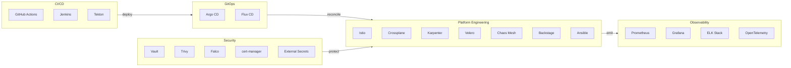

# 20 Trending DevOps Tools — From Zero to PhD

<h1>11 · 20 Trending DevOps Tools <em>from zero to PhD</em></h1>
The 20 tools every senior DevOps engineer knows cold — each taught from first principles to production mastery.

> You will not just "know" these tools. You will build the mental model, run the binary, read the output, and understand why Netflix, Google, and Amazon run these exact tools at planet scale. Each page: 9 concept blocks, 4 diagrams, 3 interview questions. No filler.

---

## Roadmap — your learning path

#### GitHub Actions
Event-driven CI/CD baked into GitHub. Workflows, matrix builds, OIDC auth to cloud providers.

#### Jenkins
The original CI server. Declarative pipelines, shared libraries, JCasC at enterprise scale.

#### Argo CD
GitOps for Kubernetes. Git is the source of truth; Argo enforces it continuously.

#### Ansible
Agentless infrastructure automation. Idempotent playbooks, roles, dynamic AWS inventory.

#### HashiCorp Vault
Secrets management done right. Dynamic creds, PKI, K8s auth, Raft HA.

#### Prometheus + Grafana
The de-facto observability stack. PromQL, alerting, Thanos for long-term storage.

#### ELK Stack
Elasticsearch + Logstash + Kibana. Log aggregation, ILM, ML anomaly detection.

#### Istio
Service mesh with mTLS, traffic shaping, circuit breaking, and WebAssembly extensions.

#### Trivy
Security scanner for images, filesystems, K8s clusters. SBOM, SARIF, Rego policies.

#### Crossplane
Platform engineering control plane. Manage cloud resources as Kubernetes CRDs.

#### Flux CD
CNCF GitOps toolkit. Source, Kustomize, Helm, image automation, OCI artifacts.

#### Tekton
Cloud-native CI/CD on Kubernetes. Tasks, Pipelines, Triggers, and SLSA provenance.

#### Falco
Runtime security with eBPF. Detect container escapes, privilege escalation in real-time.

#### Karpenter
Node autoscaler for Kubernetes. Bin-packing, spot, consolidation, multi-arch.

#### Velero
Kubernetes backup and disaster recovery. Cross-cluster migration, CSI snapshots.

#### cert-manager
TLS certificate lifecycle automation. Let's Encrypt, Vault PKI, wildcard certs.

#### External Secrets Operator
Sync secrets from Vault/AWS/GCP into Kubernetes Secrets automatically.

#### OpenTelemetry
Vendor-neutral observability SDK. Traces, metrics, logs unified under one standard.

#### Chaos Mesh
Chaos engineering platform. Pod, network, I/O, stress faults with workflow scheduling.

#### Backstage
Developer portal framework. Service catalog, TechDocs, scaffolder, K8s plugin.

---

## Tool landscape — where each fits in the CNCF ecosystem

---

## Summary table

| # | Tool | Category | CNCF Maturity | Difficulty |
|---|------|----------|---------------|------------|
| 01 | GitHub Actions | CI/CD | GitHub native | Beginner |
| 02 | Jenkins | CI/CD | OSS mature | Intermediate |
| 03 | Argo CD | GitOps | Graduated | Intermediate |
| 04 | Ansible | Automation | OSS mature | Beginner |
| 05 | HashiCorp Vault | Secrets | Enterprise | Advanced |
| 06 | Prometheus + Grafana | Observability | Graduated | Intermediate |
| 07 | ELK Stack | Logging | Elastic OSS | Intermediate |
| 08 | Istio | Service Mesh | Graduated | Advanced |
| 09 | Trivy | Security Scanning | Incubating | Beginner |
| 10 | Crossplane | Platform Eng | Graduated | Advanced |
| 11 | Flux CD | GitOps | Graduated | Intermediate |
| 12 | Tekton | CI/CD | Graduated | Intermediate |
| 13 | Falco | Runtime Security | Graduated | Advanced |
| 14 | Karpenter | Autoscaling | Incubating | Intermediate |
| 15 | Velero | Backup/DR | Incubating | Intermediate |
| 16 | cert-manager | TLS Automation | Graduated | Beginner |
| 17 | External Secrets | Secrets Sync | Incubating | Intermediate |
| 18 | OpenTelemetry | Observability | Graduated | Advanced |
| 19 | Chaos Mesh | Chaos Eng | Incubating | Advanced |
| 20 | Backstage | Dev Portal | Incubating | Advanced |

---

## Tool previews

**GitHub Actions** — Workflows live in `.github/workflows/` and trigger on any Git event. Matrix builds test across 12 OS/language combinations in parallel. OIDC federation means zero long-lived cloud credentials anywhere in CI.

**Jenkins** — 1,800+ plugins and a Groovy DSL that has survived a decade of enterprise abuse. Declarative pipelines with `agent { docker }` blocks give you reproducible builds without pet agents. JCasC (Jenkins Configuration as Code) replaces click-ops with YAML.

**Argo CD** — Watches a Git repo and compares its state to what's running in Kubernetes. If they diverge, it reconciles — automatically or after approval. ApplicationSets generate hundreds of Applications from a single template.

**Ansible** — SSH into a machine, run a Python task, assert idempotence, move on. No agent. No daemon. Dynamic inventory queries AWS/GCP APIs at runtime. Molecule runs your roles through a Docker test matrix before they touch prod.

**HashiCorp Vault** — Never hardcode a secret again. Vault issues short-lived dynamic database passwords, signs TLS certificates on demand, and injects secrets into pods via a sidecar. Raft consensus gives you HA without Consul.

**Prometheus + Grafana** — Prometheus scrapes `/metrics` endpoints every 15 seconds, stores them as time series, and evaluates alerting rules. Grafana queries Prometheus (and 50 other datasources) and renders dashboards that survive 03:00 oncall rotations.

**ELK Stack** — Filebeat tails your container logs, Logstash parses and enriches them, Elasticsearch indexes them, Kibana visualizes them. ILM rolls hot→warm→cold→delete automatically. ML anomaly detection spots log rate spikes before your users do.

**Istio** — Injects an Envoy sidecar into every pod. All traffic flows through the mesh: mTLS encrypted, authenticated, rate-limited, circuit-broken. VirtualService + DestinationRule give you 1%/99% traffic splits without changing app code.

**Trivy** — Scan an image in 3 seconds. Gets CVEs from 10 vulnerability databases, checks for misconfigurations, generates an SBOM. Integrates into GitHub Actions as a PR gate. Runs as a K8s admission webhook to block vulnerable images at deploy time.

**Crossplane** — Platform teams define XRDs (composite resource definitions); app teams provision cloud resources (RDS, S3, GKE) by applying YAML. No Terraform state files. No cloud console access needed. Everything GitOps-able.

**Flux CD** — Bootstrap with `flux bootstrap github` and your cluster self-manages. HelmRelease objects reconcile Helm charts from OCI registries. Image automation bumps image tags in Git when a new image is pushed — fully hands-free delivery.

**Tekton** — Everything is a Kubernetes CRD. A `Task` is a unit of work. A `Pipeline` chains tasks. An `EventListener` turns a GitHub push into a `PipelineRun`. Tekton Chains signs every artifact for SLSA Level 3 provenance.

**Falco** — Reads kernel syscalls via eBPF and matches them against rules. Rule fires when a process runs a shell inside a container, opens `/etc/shadow`, or makes an unexpected outbound connection. FalcoSidekick forwards alerts to Slack, PagerDuty, or Elasticsearch.

**Karpenter** — Watches for `Pending` pods, calculates the optimal node type to satisfy all pending workloads, calls the EC2 API, and has the node ready in 60 seconds. Consolidation runs every 30 seconds and replaces two half-full nodes with one full one.

**Velero** — Takes a snapshot of all Kubernetes resources (etcd objects + PVC snapshots) and uploads to S3. Scheduled backups every hour. Cross-cluster restore migrates a namespace from `us-east-1` to `eu-west-1` with one command.

**cert-manager** — Watches `Certificate` CRDs, talks to Let's Encrypt (or Vault), gets a signed cert, stores it in a `Secret`, and renews it 30 days before expiry. Works with any Ingress controller. Zero manual cert rotation ever again.

**External Secrets Operator** — A `SecretStore` points at AWS Secrets Manager. An `ExternalSecret` says "fetch key `prod/db/password` and create a K8s Secret named `db-credentials`." Refresh interval keeps it current. No more base64-encoded secrets committed to Git.

**OpenTelemetry** — One SDK for traces, metrics, and logs. The OTel Collector receives OTLP signals, processes them (sampling, enrichment, batching), and exports to Jaeger, Prometheus, Loki, or any backend. Context propagation connects a user request across 30 microservices.

**Chaos Mesh** — A `PodChaos` manifest kills a random pod in a namespace. A `NetworkChaos` manifest adds 200ms of latency to east-west traffic. A `Workflow` schedules a full GameDay: inject fault → measure → recover → report. No bash scripts, no SSH, fully declarative.

**Backstage** — A React app that aggregates your entire engineering ecosystem. The software catalog tracks ownership of every service, library, and API. The scaffolder creates new services from golden-path templates. The K8s plugin shows pod health inline with service docs.
