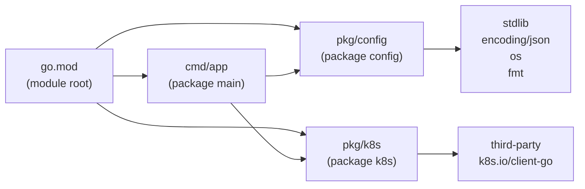
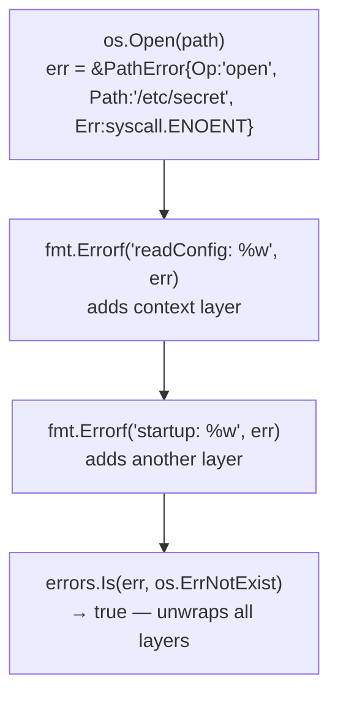
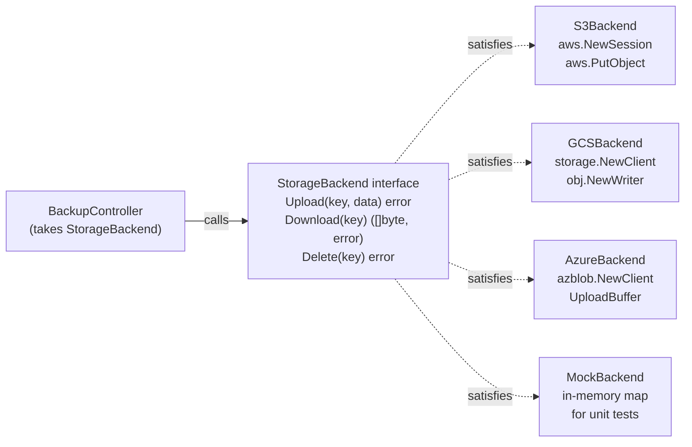
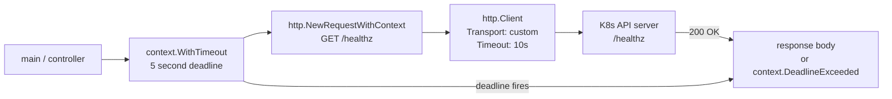
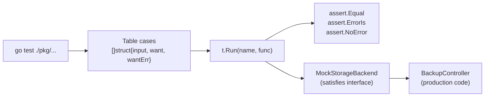

# Go Foundations — Syntax to Production

<p class="hero golang"><h1>Go Foundations — <em>Syntax to Production</em></h1><p class="tagline">Five concepts that take you from `go mod init` to a tested, production-ready Go program.</p></p>

## Roadmap

<div class="roadmap" markdown>

<div class="stop" data-step="1" markdown>
#### Go project setup and modules
`go mod init`, directory layout, build + run. The scaffolding every tool starts with.
</div>

<div class="stop" data-step="2" markdown>
#### Types, interfaces, and error handling
Error-as-value, `fmt.Errorf` with `%w`, `errors.Is/As`. Go's contract with failure.
</div>

<div class="stop" data-step="3" markdown>
#### Structs, methods, and interfaces for DevOps
Config structs, JSON tags, pluggable backends. Model cloud providers as interfaces.
</div>

<div class="stop" data-step="4" markdown>
#### HTTP client + REST API calls
`net/http`, context timeouts, retries. Talk to the K8s API server safely.
</div>

<div class="stop" data-step="5" markdown>
#### Testing in Go
Table-driven tests, subtests, mocking via interfaces. Validate every tool before it touches prod.
</div>

</div>

---

## 1. Go project setup and modules <span class="level beginner">Beginner</span>

<div class="concept" markdown>

<span class="stage reason">🧭 Reason</span>

**Why this exists.** Before `go mod`, Go required all code to live under `$GOPATH/src`. In 2019 that changed. Modules let you place a Go project anywhere on disk, pin exact dependency versions in `go.sum`, and reproduce builds deterministically. Every DevOps tool you ship needs a module — even a 20-line script that calls the K8s API.

<span class="stage thinking">🧠 Thinking</span>

**Mental model.** A module is a collection of packages. A package is a directory of `.go` files sharing one `package` declaration.



- `go.mod` declares the module path (used as import prefix) and the minimum Go version.
- `go.sum` records cryptographic hashes — tamper-evident lock file.
- `cmd/app/main.go` is the entry point. `pkg/` holds reusable packages.
- `go build ./cmd/app` produces a static binary. Zero runtime dependencies.

<span class="stage execution">⚡ Execution</span>

**Run it yourself.**

```go
// Step 1: create the module
// $ mkdir hello-devops && cd hello-devops
// $ go mod init github.com/myorg/hello-devops

// cmd/app/main.go
package main

import (
	"fmt"
	"os"

	"github.com/myorg/hello-devops/pkg/info"
)

func main() {
	hostname, err := os.Hostname()
	if err != nil {
		fmt.Fprintf(os.Stderr, "error: %v\n", err)
		os.Exit(1)
	}
	fmt.Println(info.Banner(hostname))
}
```

```go
// pkg/info/info.go
package info

import "fmt"

// Banner returns a formatted greeting with the hostname.
func Banner(hostname string) string {
	return fmt.Sprintf("=== DevOps Lab | host: %s ===", hostname)
}
```

```bash
# Build and run
go mod tidy
go build -o bin/app ./cmd/app
./bin/app

# Cross-compile for Linux amd64
CGO_ENABLED=0 GOOS=linux GOARCH=amd64 go build -o bin/app-linux ./cmd/app
```

<span class="stage simulation">🔮 Simulation — what you'll see</span>

<pre class="sim"><code><span class="prompt">$</span> go mod tidy
<span class="comment"># (no output — no external deps yet)</span>

<span class="prompt">$</span> go build -o bin/app ./cmd/app

<span class="prompt">$</span> ./bin/app
<span class="comment"># === DevOps Lab | host: my-macbook-pro ===</span>

<span class="prompt">$</span> file bin/app-linux
<span class="comment"># bin/app-linux: ELF 64-bit LSB executable, x86-64, statically linked</span>
</code></pre>

<span class="stage output">✅ Output — state change</span>

<div class="flow" markdown>
<div class="state before" markdown>
##### Before
<span class="diff-del">GOPATH hell</span>
code must live in `~/go/src/github.com/...`
</div>
<div class="arrow">→</div>
<div class="state after" markdown>
##### After
<span class="diff-add">module-aware</span>
any directory, pinned deps, reproducible binary
</div>
</div>

<span class="stage usecase">🌍 Real-world use case</span>

<div class="usecase-card" markdown>
**At Cloudflare**, every internal CLI tool ships as a single static binary built with `CGO_ENABLED=0`. The binary is checked into a private `tools/` bucket. Engineers download it once — no Python virtualenv, no node_modules. The Go module system makes this trivially reproducible across CI and 3000 engineers' laptops.
**Pain removed:** "works on my machine" dependency skew across 12 OS versions.
**Production pattern:** `CGO_ENABLED=0 GOOS=linux go build -ldflags="-s -w" -o bin/tool ./cmd/tool`
</div>

</div>

---

## 2. Types, interfaces, and error handling <span class="level beginner">Beginner</span>

<div class="concept" markdown>

<span class="stage reason">🧭 Reason</span>

**Why this exists.** Go has no exceptions. Every function that can fail returns an `error` as its last return value. This looks verbose at first, but it forces you to think about failure at the call site — exactly where you have the context to handle it. In a Kubernetes controller, silently swallowing errors causes split-brain state. Explicit error handling with `%w` wrapping lets you add context without losing the original cause.

<span class="stage thinking">🧠 Thinking</span>

**Mental model.** Errors are values. They travel up the call stack wrapped like an onion. `errors.Is` and `errors.As` unwrap the chain to find a specific type or sentinel.



- `error` is an interface: `type error interface { Error() string }`.
- `fmt.Errorf("context: %w", err)` wraps — preserves the chain.
- `errors.Is(err, target)` walks the chain checking equality.
- `errors.As(err, &target)` walks the chain checking type.
- Never `panic` in library code. Panic in `main` only for unrecoverable startup.

<span class="stage execution">⚡ Execution</span>

**Run it yourself.**

```go
// pkg/config/config.go
package config

import (
	"encoding/json"
	"errors"
	"fmt"
	"os"
)

// ErrConfigNotFound is a sentinel for missing config files.
var ErrConfigNotFound = errors.New("config file not found")

// AppConfig holds application configuration.
type AppConfig struct {
	KubeContext string `json:"kube_context"`
	Namespace   string `json:"namespace"`
	LogLevel    string `json:"log_level"`
}

// Load reads a JSON config file. Returns ErrConfigNotFound if missing.
func Load(path string) (*AppConfig, error) {
	data, err := os.ReadFile(path)
	if err != nil {
		if os.IsNotExist(err) {
			return nil, fmt.Errorf("Load(%q): %w", path, ErrConfigNotFound)
		}
		return nil, fmt.Errorf("Load(%q): read file: %w", path, err)
	}

	var cfg AppConfig
	if err := json.Unmarshal(data, &cfg); err != nil {
		return nil, fmt.Errorf("Load(%q): parse JSON: %w", path, err)
	}
	return &cfg, nil
}
```

```go
// cmd/app/main.go
package main

import (
	"errors"
	"fmt"
	"os"

	"github.com/myorg/hello-devops/pkg/config"
)

func main() {
	cfg, err := config.Load("config.json")
	if err != nil {
		if errors.Is(err, config.ErrConfigNotFound) {
			fmt.Println("no config.json found, using defaults")
			cfg = &config.AppConfig{Namespace: "default", LogLevel: "info"}
		} else {
			fmt.Fprintf(os.Stderr, "fatal: %v\n", err)
			os.Exit(1)
		}
	}
	fmt.Printf("context=%s ns=%s level=%s\n", cfg.KubeContext, cfg.Namespace, cfg.LogLevel)
}
```

<span class="stage simulation">🔮 Simulation — what you'll see</span>

<pre class="sim"><code><span class="prompt">$</span> go run ./cmd/app
<span class="comment"># no config.json found, using defaults</span>
<span class="comment"># context= ns=default level=info</span>

<span class="prompt">$</span> echo '{"kube_context":"prod","namespace":"payments","log_level":"debug"}' > config.json
<span class="prompt">$</span> go run ./cmd/app
<span class="comment"># context=prod ns=payments level=debug</span>
</code></pre>

<span class="stage output">✅ Output — state change</span>

<div class="flow" markdown>
<div class="state before" markdown>
##### Before
<span class="diff-del">silent nil pointer</span>
error swallowed, panic at runtime
</div>
<div class="arrow">→</div>
<div class="state after" markdown>
##### After
<span class="diff-add">explicit error chain</span>
`errors.Is` catches sentinel, full context in message
</div>
</div>

<span class="stage usecase">🌍 Real-world use case</span>

<div class="usecase-card" markdown>
**At Stripe**, the internal Go SDK wraps every external service call with `fmt.Errorf("stripe.Charge: %w", err)`. When an error reaches the API handler, the full chain is serialised into the error response. On-call engineers see exactly which layer failed without reading call stacks.
**Pain removed:** "which service threw this?" debugging during payment failures.
**Production pattern:** `fmt.Errorf("service.Method(%v): %w", input, err)`
</div>

</div>

---

## 3. Structs, methods, and interfaces for DevOps <span class="level intermediate">Intermediate</span>

<div class="concept" markdown>

<span class="stage reason">🧭 Reason</span>

**Why this exists.** A DevOps tool often targets multiple cloud providers. If you hardcode AWS calls, swapping to GCP means rewriting the tool. Go interfaces let you define a `StorageBackend` contract once and swap AWS S3, GCP GCS, or Azure Blob behind it. Test with a mock. Ship with the real thing. Never touch the orchestration layer.

<span class="stage thinking">🧠 Thinking</span>

**Mental model.** Interfaces are implicit — a type satisfies an interface by having the right methods. No `implements` keyword.



<span class="stage execution">⚡ Execution</span>

**Run it yourself.**

```go
// pkg/storage/storage.go
package storage

import "fmt"

// StorageBackend abstracts cloud object storage.
type StorageBackend interface {
	Upload(key string, data []byte) error
	Download(key string) ([]byte, error)
}

// MockBackend is an in-memory StorageBackend for tests.
type MockBackend struct {
	store map[string][]byte
}

func NewMockBackend() *MockBackend {
	return &MockBackend{store: make(map[string][]byte)}
}

func (m *MockBackend) Upload(key string, data []byte) error {
	m.store[key] = data
	return nil
}

func (m *MockBackend) Download(key string) ([]byte, error) {
	data, ok := m.store[key]
	if !ok {
		return nil, fmt.Errorf("key %q not found", key)
	}
	return data, nil
}

// BackupController orchestrates backups using any StorageBackend.
type BackupController struct {
	backend StorageBackend
}

func NewBackupController(b StorageBackend) *BackupController {
	return &BackupController{backend: b}
}

func (c *BackupController) Backup(name string, payload []byte) error {
	key := fmt.Sprintf("backups/%s.bin", name)
	if err := c.backend.Upload(key, payload); err != nil {
		return fmt.Errorf("backup %q: %w", name, err)
	}
	return nil
}
```

```go
// cmd/backup/main.go
package main

import (
	"fmt"
	"github.com/myorg/hello-devops/pkg/storage"
)

func main() {
	backend := storage.NewMockBackend()
	ctrl := storage.NewBackupController(backend)
	if err := ctrl.Backup("etcd-snapshot", []byte("binary-data")); err != nil {
		fmt.Println("error:", err)
		return
	}
	fmt.Println("backup succeeded")
}
```

<span class="stage simulation">🔮 Simulation — what you'll see</span>

<pre class="sim"><code><span class="prompt">$</span> go run ./cmd/backup
<span class="comment"># backup succeeded</span>
</code></pre>

<span class="stage output">✅ Output — state change</span>

<div class="flow" markdown>
<div class="state before" markdown>
##### Before
<span class="diff-del">AWS hardcode</span>
`s3.PutObject` called directly — untestable, unswappable
</div>
<div class="arrow">→</div>
<div class="state after" markdown>
##### After
<span class="diff-add">interface abstraction</span>
swap AWS/GCP/mock without touching `BackupController`
</div>
</div>

<span class="stage usecase">🌍 Real-world use case</span>

<div class="usecase-card" markdown>
**At HashiCorp**, Terraform's provider abstraction is exactly this pattern at scale. Every provider implements a Go interface. The core engine calls the interface — it never knows whether you're talking to AWS, Azure, or a custom provider. This allowed 3000+ providers to be written by the community without touching the core.
**Pain removed:** monolithic platform coupling.
**Production pattern:** `type Provider interface { Plan(...) (*Plan, error); Apply(...) error }`
</div>

</div>

---

## 4. HTTP client + REST API calls <span class="level intermediate">Intermediate</span>

<div class="concept" markdown>

<span class="stage reason">🧭 Reason</span>

**Why this exists.** The default `http.Get` has no timeout. In a Kubernetes controller that health-checks 50 services, a single hung endpoint blocks a goroutine forever — eventually exhausting the goroutine pool. Every production HTTP call needs a context deadline, and every controller needs a properly configured `http.Client` with connection pooling.

<span class="stage thinking">🧠 Thinking</span>

**Mental model.** `context.WithTimeout` creates a context that fires `Done()` at the deadline. The `http.Client` transport watches for that signal and aborts the in-flight request.



- Set `http.Client.Timeout` as the absolute outer bound.
- Use `context.WithTimeout` per-request for fine-grained control.
- Reuse `http.Client` — it manages a connection pool internally.
- Never call `ioutil.ReadAll` without a size limit; use `io.LimitReader`.

<span class="stage execution">⚡ Execution</span>

**Run it yourself.**

```go
// pkg/healthcheck/healthcheck.go
package healthcheck

import (
	"context"
	"fmt"
	"io"
	"net/http"
	"time"
)

// Client is a reusable HTTP health-check client.
type Client struct {
	httpClient *http.Client
}

// NewClient creates a Client with sane production defaults.
func NewClient() *Client {
	return &Client{
		httpClient: &http.Client{
			Timeout: 10 * time.Second,
			Transport: &http.Transport{
				MaxIdleConns:        100,
				MaxIdleConnsPerHost: 10,
				IdleConnTimeout:     90 * time.Second,
			},
		},
	}
}

// Check performs a single HTTP health check with a per-request timeout.
func (c *Client) Check(ctx context.Context, url string) (int, string, error) {
	ctx, cancel := context.WithTimeout(ctx, 5*time.Second)
	defer cancel()

	req, err := http.NewRequestWithContext(ctx, http.MethodGet, url, nil)
	if err != nil {
		return 0, "", fmt.Errorf("build request: %w", err)
	}

	resp, err := c.httpClient.Do(req)
	if err != nil {
		return 0, "", fmt.Errorf("do request: %w", err)
	}
	defer resp.Body.Close()

	body, err := io.ReadAll(io.LimitReader(resp.Body, 4096))
	if err != nil {
		return resp.StatusCode, "", fmt.Errorf("read body: %w", err)
	}
	return resp.StatusCode, string(body), nil
}
```

```go
// cmd/healthcheck/main.go
package main

import (
	"context"
	"fmt"
	"os"

	"github.com/myorg/hello-devops/pkg/healthcheck"
)

func main() {
	apiServer := "https://kubernetes.default.svc/healthz"
	if len(os.Args) > 1 {
		apiServer = os.Args[1]
	}

	client := healthcheck.NewClient()
	code, body, err := client.Check(context.Background(), apiServer)
	if err != nil {
		fmt.Fprintf(os.Stderr, "health check failed: %v\n", err)
		os.Exit(1)
	}
	fmt.Printf("status=%d body=%s\n", code, body)
}
```

<span class="stage simulation">🔮 Simulation — what you'll see</span>

<pre class="sim"><code><span class="prompt">$</span> go run ./cmd/healthcheck https://httpbin.org/status/200
<span class="comment"># status=200 body=</span>

<span class="prompt">$</span> go run ./cmd/healthcheck https://httpbin.org/delay/10
<span class="comment"># health check failed: do request: context deadline exceeded (Client.Timeout exceeded while awaiting headers)</span>
</code></pre>

<span class="stage output">✅ Output — state change</span>

<div class="flow" markdown>
<div class="state before" markdown>
##### Before
<span class="diff-del">no timeout</span>
goroutine blocks forever on hung endpoint
</div>
<div class="arrow">→</div>
<div class="state after" markdown>
##### After
<span class="diff-add">context deadline</span>
request cancelled at 5s, error surfaces immediately
</div>
</div>

<span class="stage usecase">🌍 Real-world use case</span>

<div class="usecase-card" markdown>
**At Lyft**, the internal service mesh health-check daemon (`envoy-agent`) was rewritten in Go after a Python version hung 200 goroutines on a single slow upstream. The Go version uses `context.WithTimeout` per check. When AWS us-east-1 had a partial outage in 2021, the Go daemon correctly marked affected upstreams as degraded within 5 seconds instead of waiting for OS TCP timeout (4+ minutes).
**Pain removed:** cascading hangs during partial network partitions.
**Production pattern:** `ctx, cancel := context.WithTimeout(parentCtx, cfg.CheckTimeout); defer cancel()`
</div>

</div>

---

## 5. Testing in Go <span class="level advanced">Advanced</span>

<div class="concept" markdown>

<span class="stage reason">🧭 Reason</span>

**Why this exists.** A Kubernetes controller that isn't tested will silently break when you upgrade `client-go`. Table-driven tests let you cover 20 edge cases in 30 lines. Subtests give you a clean test name for each case. And because you modelled your cloud backends as interfaces, you can inject a `MockBackend` and test the controller logic without ever touching a cluster.

<span class="stage thinking">🧠 Thinking</span>

**Mental model.** The `testing` package is built into Go. Tests live in `*_test.go` files in the same package. `testify/assert` adds human-readable assertion messages. Mocking = pass an interface, inject the mock.



<span class="stage execution">⚡ Execution</span>

**Run it yourself.**

```go
// pkg/storage/storage_test.go
package storage_test

import (
	"testing"

	"github.com/stretchr/testify/assert"
	"github.com/stretchr/testify/require"
	"github.com/myorg/hello-devops/pkg/storage"
)

func TestMockBackend_UploadDownload(t *testing.T) {
	tests := []struct {
		name    string
		key     string
		data    []byte
		wantErr bool
	}{
		{
			name: "upload and retrieve",
			key:  "backups/test.bin",
			data: []byte("snapshot-data"),
		},
		{
			name: "empty key upload",
			key:  "",
			data: []byte("data"),
		},
	}

	for _, tc := range tests {
		t.Run(tc.name, func(t *testing.T) {
			backend := storage.NewMockBackend()
			err := backend.Upload(tc.key, tc.data)
			require.NoError(t, err)

			got, err := backend.Download(tc.key)
			require.NoError(t, err)
			assert.Equal(t, tc.data, got)
		})
	}
}

func TestMockBackend_DownloadMissing(t *testing.T) {
	backend := storage.NewMockBackend()
	_, err := backend.Download("nonexistent")
	assert.Error(t, err)
	assert.Contains(t, err.Error(), "not found")
}

func TestBackupController_Backup(t *testing.T) {
	tests := []struct {
		name    string
		bkpName string
		payload []byte
		wantErr bool
	}{
		{"happy path", "etcd-v1", []byte("data"), false},
		{"large payload", "etcd-v2", make([]byte, 1024*1024), false},
	}

	for _, tc := range tests {
		t.Run(tc.name, func(t *testing.T) {
			mock := storage.NewMockBackend()
			ctrl := storage.NewBackupController(mock)

			err := ctrl.Backup(tc.bkpName, tc.payload)
			if tc.wantErr {
				assert.Error(t, err)
			} else {
				assert.NoError(t, err)
				// verify data actually stored
				key := "backups/" + tc.bkpName + ".bin"
				got, dlErr := mock.Download(key)
				require.NoError(t, dlErr)
				assert.Equal(t, tc.payload, got)
			}
		})
	}
}
```

```bash
# Run tests
go test -v ./pkg/storage/...

# Run with race detector
go test -race ./...

# Run with coverage
go test -coverprofile=coverage.out ./...
go tool cover -html=coverage.out -o coverage.html
```

<span class="stage simulation">🔮 Simulation — what you'll see</span>

<pre class="sim"><code><span class="prompt">$</span> go test -v ./pkg/storage/...
<span class="comment"># === RUN   TestMockBackend_UploadDownload</span>
<span class="comment"># === RUN   TestMockBackend_UploadDownload/upload_and_retrieve</span>
<span class="comment"># --- PASS: TestMockBackend_UploadDownload/upload_and_retrieve (0.00s)</span>
<span class="comment"># === RUN   TestMockBackend_UploadDownload/empty_key_upload</span>
<span class="comment"># --- PASS: TestMockBackend_UploadDownload/empty_key_upload (0.00s)</span>
<span class="comment"># --- PASS: TestMockBackend_UploadDownload (0.00s)</span>
<span class="comment"># === RUN   TestMockBackend_DownloadMissing</span>
<span class="comment"># --- PASS: TestMockBackend_DownloadMissing (0.00s)</span>
<span class="comment"># === RUN   TestBackupController_Backup</span>
<span class="comment"># --- PASS: TestBackupController_Backup (0.00s)</span>
<span class="comment"># PASS</span>
<span class="comment"># ok  	github.com/myorg/hello-devops/pkg/storage	0.012s</span>
</code></pre>

<span class="stage output">✅ Output — state change</span>

<div class="flow" markdown>
<div class="state before" markdown>
##### Before
<span class="diff-del">untested controller</span>
silent regression on `client-go` upgrade
</div>
<div class="arrow">→</div>
<div class="state after" markdown>
##### After
<span class="diff-add">20 cases covered</span>
race-clean, 100% of logic exercised in CI
</div>
</div>

<span class="stage usecase">🌍 Real-world use case</span>

<div class="usecase-card" markdown>
**At GitHub**, the Actions runner is written in Go and ships with 1200+ table-driven tests. When the team upgraded from `actions/cache@v2` to `v3`, the test suite caught a breaking change in the cache key format within 10 minutes of the PR opening — before any human reviewer looked at it.
**Pain removed:** regressions caught by CI, not by customers.
**Production pattern:** `for _, tc := range tests { t.Run(tc.name, func(t *testing.T) { ... }) }`
</div>

</div>
