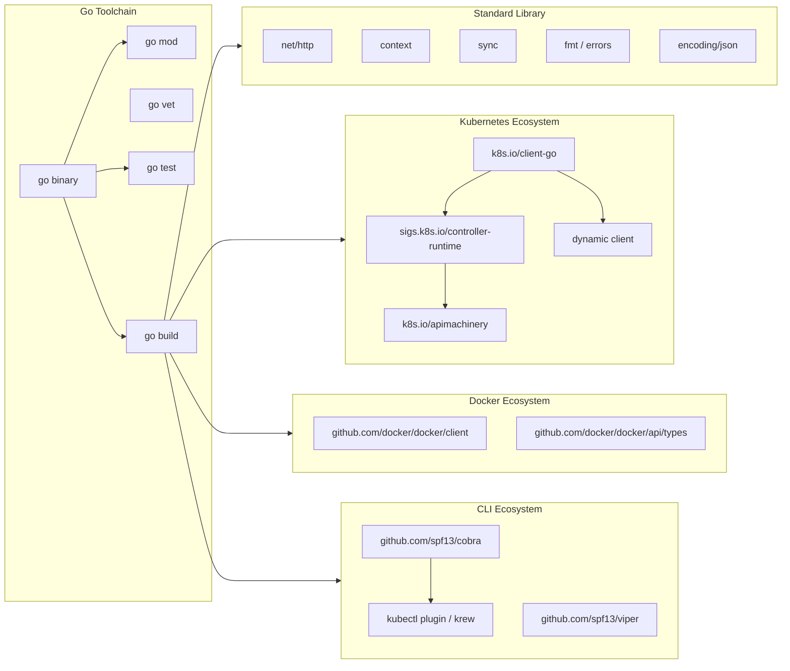

<h1>12 · Go — <em>The Language DevOps Was Waiting For</em></h1>
kubectl, Docker, Kubernetes itself — all written in Go. Learn the language from first print to writing your own Kubernetes operator.

## Roadmap — your learning path

#### Hello Go
Modules, packages, build toolchain. Understand `go mod init` before writing a single line of logic.

#### Concurrency
Goroutines, channels, select, WaitGroups. The reason Google built Go — 10k parallel health checks without threads.

#### HTTP clients
`net/http`, context timeouts, retry patterns. Build the plumbing every DevOps tool needs.

#### Kubernetes SDK (client-go)
List pods, watch events, deploy workloads, write informers. The same library kubectl uses.

#### Docker SDK
Manage containers, build images, stream logs programmatically. Automate the daemon, not the CLI.

#### Kubernetes Operators
CRDs, controller-runtime, reconcile loops, kubebuilder. Ship self-healing infrastructure.

#### kubectl plugins + CLI tools
Cobra, krew, kubeconfig multi-cluster. Build tooling your whole team uses.

#### PhD-level meta-programming
`go generate`, `ast` package, reflection, code generation for CRD types. The ceiling is very high.

---

## Go ecosystem map

---

## 30 examples across 6 pages

| # | Topic | File | Level |
|---|-------|------|-------|
| 1 | Go module init + hello world | 01-go-foundations | Beginner |
| 2 | Error wrapping with `%w` | 01-go-foundations | Beginner |
| 3 | Config struct + JSON + env | 01-go-foundations | Intermediate |
| 4 | K8s API health check with timeout | 01-go-foundations | Intermediate |
| 5 | Table-driven test suite | 01-go-foundations | Advanced |
| 6 | Parallel health checks with WaitGroup | 02-go-concurrency | Beginner |
| 7 | Fan-out Docker pulls with channels | 02-go-concurrency | Intermediate |
| 8 | K8s watch with select + timeout | 02-go-concurrency | Intermediate |
| 9 | Context cancellation for kubectl exec | 02-go-concurrency | Advanced |
| 10 | Worker pool for batch pod restarts | 02-go-concurrency | Expert |
| 11 | List all pods in cluster | 03-go-kubernetes-client | Beginner |
| 12 | Deploy + wait ready + delete | 03-go-kubernetes-client | Intermediate |
| 13 | Pod informer with event handlers | 03-go-kubernetes-client | Intermediate |
| 14 | Apply YAML with dynamic client | 03-go-kubernetes-client | Advanced |
| 15 | Reconciliation controller | 03-go-kubernetes-client | Expert |
| 16 | List running containers | 04-go-docker-sdk | Beginner |
| 17 | Run Redis, wait healthy, teardown | 04-go-docker-sdk | Intermediate |
| 18 | Build Go image, tag, push | 04-go-docker-sdk | Intermediate |
| 19 | Custom network + container connectivity | 04-go-docker-sdk | Advanced |
| 20 | Exec into container, stream output | 04-go-docker-sdk | Expert |
| 21 | CRD struct with kubebuilder markers | 05-go-operators | Advanced |
| 22 | kubebuilder init + create api | 05-go-operators | Advanced |
| 23 | BackupJob reconcile loop | 05-go-operators | Expert |
| 24 | EnvTest + reconciler test | 05-go-operators | Expert |
| 25 | Cobra CLI with sub-commands | 06-go-cli-tools | Intermediate |
| 26 | kubectl-podrestart plugin | 06-go-cli-tools | Intermediate |
| 27 | Multi-cluster context switcher | 06-go-cli-tools | Advanced |
| 28 | `releaser promote` tool | 06-go-cli-tools | Expert |
| 29 | go.mod with all k8s deps | commands | Reference |
| 30 | kubebuilder + krew workflow | commands | Reference |

---

## Why Go for DevOps

| Dimension | Go | Python | Bash |
|-----------|-----|--------|------|
| Compile-time safety | Yes — catches nil, type mismatches | No | No |
| Single binary deploy | Yes — `GOOS=linux go build` | No (venv required) | N/A |
| Concurrency | Goroutines + channels (native) | GIL limits threads | Subshells only |
| K8s client quality | Official (`client-go`) | Good (`kubernetes` lib) | kubectl wrap |
| Docker SDK | Official (`docker/docker`) | Good (`docker-py`) | docker CLI wrap |
| Startup time | ~2 ms | ~200 ms | ~50 ms |
| Binary size | 5–20 MB | N/A | N/A |
| Error handling | Explicit, composable | Exception-based | `set -e` only |
| Best for | Operators, controllers, CLI tools | Scripts, ML pipelines | Quick glue |

---

## Top 5 Go interview questions for DevOps roles

**Q1: What is the difference between a goroutine and an OS thread?**
A goroutine is a lightweight coroutine managed by the Go runtime scheduler (M:N threading model). Thousands can run concurrently on a handful of OS threads. Stack starts at 2 KB and grows dynamically — unlike OS threads at 1–8 MB fixed.

**Q2: What does `context.WithTimeout` actually do in a K8s client call?**
It attaches a deadline to the context object. The client-go transport layer reads the context's `Done()` channel. When the deadline fires, the HTTP request is cancelled mid-flight. Without a context timeout, a hung API server call blocks forever.

**Q3: Why does client-go use informers instead of polling?**
Polling creates N×QPS load on the API server. Informers open a single Watch stream per resource type. Events are delivered via channels and cached locally in a thread-safe store. Controllers read from the cache — zero API server hits for reads.

**Q4: What is the reconcile loop and why is it idempotent?**
The reconcile function is called with a namespace/name key. It reads current state from the cache, compares to desired state, and applies the delta. Because it can be called multiple times for the same event, every operation must be safe to repeat — `CreateOrUpdate`, not just `Create`.

**Q5: How do you write a goroutine-safe cache in Go?**
Use `sync.RWMutex`: `RLock/RUnlock` for concurrent reads, `Lock/Unlock` for writes. Alternatively, use `sync.Map` for high-contention key-value stores or a channel-based serialized actor pattern for complex state machines.
