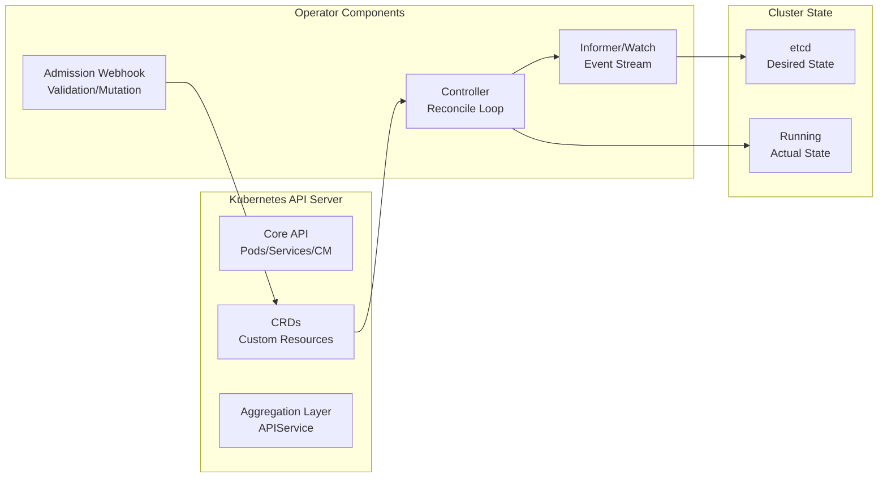
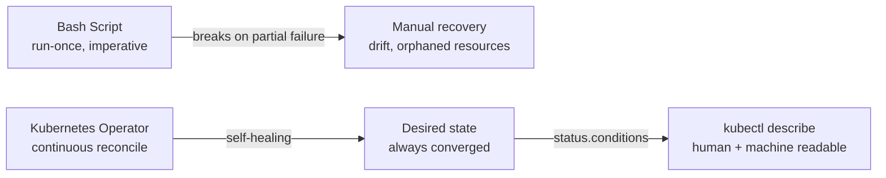

# 13 · Kubernetes Operators — Extend the Control Plane

<p class="hero"><h1>13 · Kubernetes <em>Operators</em></h1>
<p class="tagline">Build the automation that builds your automation — Operators codify operations into the cluster itself.</p></p>

---

## What you will build

By the end of this module you will write a production-grade Kubernetes Operator from scratch: a custom CRD, a reconcile loop, admission webhooks, finalizers, RBAC, and a full test suite. You will understand every layer — from how CRDs register new API endpoints to how controller-runtime wires up caches, watches, and work queues.

---

## Learning roadmap

<div class="roadmap" markdown>

<div class="stop" data-step="1" markdown>
#### What is an Operator?
The extension pattern — why operators exist, the control loop philosophy, and how they differ from Helm charts and raw scripts.
</div>

<div class="stop" data-step="2" markdown>
#### CRD Fundamentals
API groups, versioning, structural schemas, CEL validation, printer columns, and the full CRD lifecycle from alpha to stable.
</div>

<div class="stop" data-step="3" markdown>
#### Controller Reconcile Loop
The observe-diff-act loop: informers, work queues, idempotent reconcile functions, and requeue strategies.
</div>

<div class="stop" data-step="4" markdown>
#### RBAC + Security Model
ServiceAccount, ClusterRole, RoleBinding for operators; admission webhooks; pod security contexts; audit logging.
</div>

<div class="stop" data-step="5" markdown>
#### controller-runtime Deep Dive
Manager, Scheme, Reconciler, Predicates, Finalizers, Owner References — the full controller-runtime API surface.
</div>

<div class="stop" data-step="6" markdown>
#### Status Conditions and Events
metav1.Condition, meta.SetStatusCondition, EventRecorder — communicating operator state to users and automation.
</div>

<div class="stop" data-step="7" markdown>
#### Finalizers and Ownership
Safe deletion with finalizers; garbage collection with owner references; avoiding orphaned resources.
</div>

<div class="stop" data-step="8" markdown>
#### Advanced Patterns
Admission webhooks, leader election, hub-and-spoke conversion, operator sharding at scale.
</div>

<div class="stop" data-step="9" markdown>
#### Testing Operators
envtest in-process API server, table-driven reconciler tests, integration test patterns with real YAML fixtures.
</div>

<div class="stop" data-step="10" markdown>
#### 10 Real-World Projects
BackupJob, AppConfig, DatabaseProvisioner, CertificateRotator, ScalingPolicy, TenantProvisioner, GitOpsDeployment, ChaosSchedule, NetworkTopology, OperatorOfOperators.
</div>

</div>

---

## The Kubernetes extension API landscape



---

## Why operators beat scripts



---

## Module pages

| # | Topic | File | Level |
|---|-------|------|-------|
| 01 | CRD Fundamentals | [01-crd-fundamentals.md](01-crd-fundamentals.md) | Beginner → Advanced |
| 02 | Operator Foundations | [02-operator-foundations.md](02-operator-foundations.md) | Beginner → Advanced |
| 03 | RBAC & Security | [03-rbac-and-security.md](03-rbac-and-security.md) | Beginner → Expert |
| 04 | controller-runtime | [04-controller-runtime.md](04-controller-runtime.md) | Intermediate → Advanced |
| 05 | Advanced Patterns | [05-operator-patterns.md](05-operator-patterns.md) | Advanced → Expert |
| 06 | 10 Real-World Projects | [06-operator-projects.md](06-operator-projects.md) | Beginner → Expert |
| Ref | Commands Cheatsheet | [commands.md](commands.md) | Quick reference |

---

## 10 operator projects at a glance

| # | Name | CRD Kind | Use Case | Difficulty | Page |
|---|------|----------|----------|------------|------|
| P01 | BackupJob Operator | `BackupJob` | Schedule PVC backups to S3 | <span class="level beginner">Beginner</span> | [06-operator-projects.md#project-1](06-operator-projects.md) |
| P02 | AppConfig Operator | `AppConfig` | Sync config from Git into ConfigMaps | <span class="level beginner">Beginner</span> | [06-operator-projects.md#project-2](06-operator-projects.md) |
| P03 | DatabaseProvisioner | `DatabaseInstance` | Provision RDS/CloudSQL via cloud API | <span class="level intermediate">Intermediate</span> | [06-operator-projects.md#project-3](06-operator-projects.md) |
| P04 | CertificateRotator | `ManagedCert` | Rotate TLS certs before expiry | <span class="level intermediate">Intermediate</span> | [06-operator-projects.md#project-4](06-operator-projects.md) |
| P05 | ScalingPolicy | `ScalingPolicy` | Custom HPA with business metrics | <span class="level intermediate">Intermediate</span> | [06-operator-projects.md#project-5](06-operator-projects.md) |
| P06 | TenantProvisioner | `Tenant` | Full namespace with RBAC + quotas | <span class="level advanced">Advanced</span> | [06-operator-projects.md#project-6](06-operator-projects.md) |
| P07 | GitOpsDeployment | `GitOpsDeployment` | Lightweight Argo CD-like operator | <span class="level advanced">Advanced</span> | [06-operator-projects.md#project-7](06-operator-projects.md) |
| P08 | ChaosSchedule | `ChaosSchedule` | Schedule chaos experiments | <span class="level advanced">Advanced</span> | [06-operator-projects.md#project-8](06-operator-projects.md) |
| P09 | NetworkTopology | `NetworkTopology` | Cilium policy abstractions | <span class="level expert">Expert</span> | [06-operator-projects.md#project-9](06-operator-projects.md) |
| P10 | OperatorOfOperators | `OperatorBundle` | Manage operators via OLM | <span class="level expert">Expert</span> | [06-operator-projects.md#project-10](06-operator-projects.md) |

---

## Pre-requisites

Before starting this module, ensure you have completed:

- **Module 03** — Kubernetes core concepts (Pods, Deployments, Services, RBAC)
- **Module 04** — Helm (you will see parallels with chart templating)
- **Module 06** — Security (RBAC, PSA, network policies will be applied here)

Tools needed:

```bash
# Verify your toolchain
kubectl version --client
go version                    # need >= 1.21
kubebuilder version           # brew install kubebuilder  OR  go install
operator-sdk version          # optional, alternative scaffold
kind create cluster           # for local testing
```

---

## Quick start — BackupJob operator in 5 minutes

```bash
# 1. Clone the companion repo (or follow the module)
mkdir backup-operator && cd backup-operator

# 2. Scaffold with kubebuilder
kubebuilder init --domain ops.example.com --repo github.com/myorg/backup-operator
kubebuilder create api --group ops --version v1alpha1 --kind BackupJob --resource --controller

# 3. Apply CRD
make install

# 4. Run controller locally
make run

# 5. In another terminal — create a BackupJob CR
kubectl apply -f - <<EOF
apiVersion: ops.example.com/v1alpha1
kind: BackupJob
metadata:
  name: daily-postgres
spec:
  schedule: "0 2 * * *"
  target: "postgresql://postgres:5432/app"
  retentionDays: 30
EOF

kubectl get backupjobs
kubectl describe backupjob daily-postgres
```
