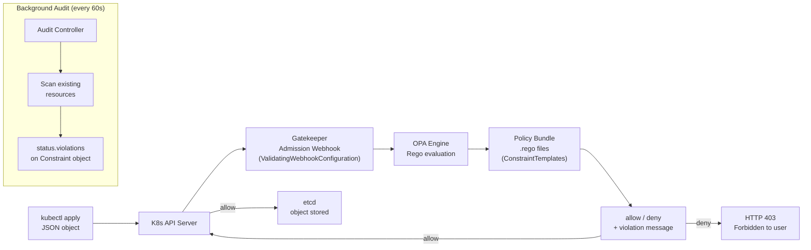
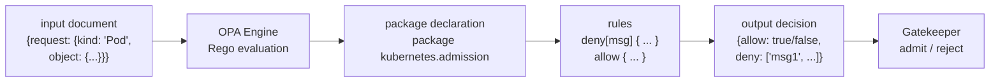
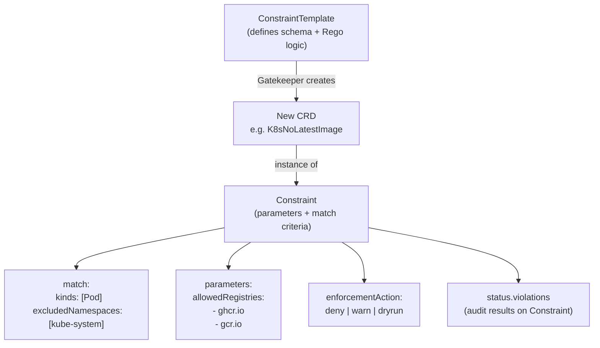
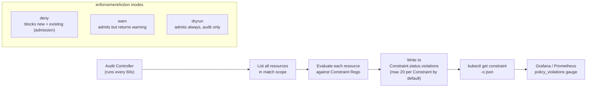
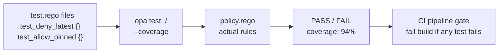

# OPA Foundations — Rego Language from Zero

OPA (Open Policy Agent) is a general-purpose policy engine. Gatekeeper embeds it as a Kubernetes admission webhook. Learn the engine first, then the integration.

---

## 1. What is OPA and where it fits <span class="level beginner">Beginner</span>

<div class="concept" markdown>

<span class="stage reason">Reason</span>

**Why this exists.** A fintech team deploys a container running as `root` with `hostNetwork: true`. Their security scanner found it three weeks later during a quarterly audit. By then it had been running in production for 21 days. OPA Gatekeeper acts as a real-time admission controller — every `kubectl apply` is evaluated against your policy rules before the object is stored in etcd. Violations are rejected at the gate, not discovered in post-incident reviews. Shopify, Pinterest, and Spotify all run Gatekeeper as their primary admission control plane.

<span class="stage thinking">Thinking</span>

**Mental model.** OPA is a standalone policy engine that evaluates JSON/YAML documents against Rego policies. Gatekeeper wires it into the Kubernetes admission webhook chain so every API request is policy-checked before persistence.



Key concepts:
- **OPA** — the policy engine; evaluates `input` (the JSON request) against `.rego` files.
- **Gatekeeper** — a K8s operator that installs OPA, registers webhooks, and manages ConstraintTemplates/Constraints as CRDs.
- **ConstraintTemplate** — defines the policy logic (Rego) and the CRD schema for parameters.
- **Constraint** — an instance of a ConstraintTemplate with specific parameters and match criteria.
- **Audit** — Gatekeeper's background controller re-evaluates all existing objects every 60 seconds and writes violations to `status.violations`.

<span class="stage execution">Execution</span>

**Run it yourself.**

```bash
# Install OPA CLI (macOS)
brew install opa

# Install OPA CLI (Linux)
curl -L -o opa https://openpolicyagent.org/downloads/v0.64.1/opa_linux_amd64_static
chmod 755 opa && sudo mv opa /usr/local/bin/

# Verify OPA CLI
opa version

# Install Gatekeeper on cluster (requires K8s 1.25+)
kubectl apply -f https://raw.githubusercontent.com/open-policy-agent/gatekeeper/v3.15.0/deploy/gatekeeper.yaml

# Watch Gatekeeper pods come up
kubectl get pods -n gatekeeper-system -w

# Verify webhook registration
kubectl get validatingwebhookconfigurations | grep gatekeeper

# Check Gatekeeper audit status
kubectl get constrainttemplate
kubectl get constraints -A
```

<span class="stage simulation">Simulation — what you'll see</span>

<pre class="sim"><code><span class="prompt">$</span> opa version
<span class="comment"># OPA 0.64.1 (commit ..., built ...)</span>

<span class="prompt">$</span> kubectl get pods -n gatekeeper-system
<span class="comment"># NAME                                             READY   STATUS    RESTARTS   AGE</span>
<span class="comment"># gatekeeper-audit-6c8b9b9b8-xkp2m               1/1     Running   0          45s</span>
<span class="comment"># gatekeeper-controller-manager-d77c5b99c-8t5wv  1/1     Running   0          45s</span>
<span class="comment"># gatekeeper-controller-manager-d77c5b99c-q9rfp  1/1     Running   0          45s</span>

<span class="prompt">$</span> kubectl get validatingwebhookconfigurations | grep gatekeeper
<span class="comment"># gatekeeper-validating-webhook-configuration   7 webhooks   45s</span>
</code></pre>

<span class="stage output">Output — state change</span>

<div class="flow" markdown>
<div class="state before" markdown>
##### Before
<span class="diff-del">no admission control</span>
any manifest deploys to cluster
violations found weeks later
</div>
<div class="arrow">→</div>
<div class="state after" markdown>
##### After
<span class="diff-add">Gatekeeper webhook active</span>
every apply evaluated at gate
violations rejected immediately
</div>
</div>

<span class="stage usecase">Real-world use-case</span>

<div class="usecase-card" markdown>
**Scenario:** An e-commerce platform enforces 47 security policies across 6 teams, 3 environments, and 200+ microservices.
**Pain removed:** Manual security reviews before every deploy — replaced by automated admission control that rejects non-compliant manifests in under 50ms.
**Production pattern:** `kubectl get constraint -A -o json | jq '[.items[] | {name: .metadata.name, violations: (.status.totalViolations // 0)}] | sort_by(-.violations)'`
</div>

</div>

---

## 2. Rego language basics <span class="level beginner">Beginner</span>

<div class="concept" markdown>

<span class="stage reason">Reason</span>

**Why this exists.** Most policy systems use imperative if/else logic that becomes unmaintainable as rules multiply. Rego is declarative — you describe what must be true, not the steps to check it. This makes policies composable, testable, and auditable. A Rego policy file is a specification, not a script. Rego is used by OPA, Conftest, Styra DAS, and dozens of policy platforms because of this property.

<span class="stage thinking">Thinking</span>

**Mental model.** Rego evaluates an `input` document (the JSON admission request) and produces output decisions (`allow`, `deny`, `violation`). Rules are logical statements — they are true when all conditions in the body are true.



Rego fundamentals:
- **Package** — namespaces rules: `package kubernetes.admission`
- **Rule** — a statement that evaluates to true/false or produces a set of values
- **`_` wildcard** — iterates over all elements of an array/set
- **`not`** — logical negation (if the condition is false, the rule body is true)
- **Set comprehension** — `{x | x := array[_]; condition}`
- **`input`** — the JSON document being evaluated (the admission review object)
- **`data`** — stored data loaded from files or the OPA bundle

<span class="stage execution">Execution</span>

**Run it yourself.** Create and test a Rego policy locally before deploying to Gatekeeper.

```bash
# Create a policy file
cat > no_root.rego << 'EOF'
package kubernetes.admission

# Deny containers that run as root (no runAsNonRoot: true)
deny[msg] {
    input.request.kind.kind == "Pod"
    container := input.request.object.spec.containers[_]
    not container.securityContext.runAsNonRoot
    msg := sprintf("Container '%v' must set securityContext.runAsNonRoot: true", [container.name])
}

# Helper: check if init containers also comply
deny[msg] {
    input.request.kind.kind == "Pod"
    container := input.request.object.spec.initContainers[_]
    not container.securityContext.runAsNonRoot
    msg := sprintf("InitContainer '%v' must set securityContext.runAsNonRoot: true", [container.name])
}

# Allow only when there are no denials
allow {
    count(deny) == 0
}
EOF

# Create a test input (non-compliant pod)
cat > input_bad.json << 'EOF'
{
  "request": {
    "kind": {"kind": "Pod"},
    "object": {
      "spec": {
        "containers": [
          {"name": "app", "image": "nginx:1.25"},
          {"name": "sidecar", "image": "envoy:v1.28", "securityContext": {"runAsNonRoot": true}}
        ],
        "initContainers": []
      }
    }
  }
}
EOF

# Evaluate: which containers violate the policy?
opa eval --input input_bad.json --data no_root.rego "data.kubernetes.admission.deny"

# Evaluate the allow decision
opa eval --input input_bad.json --data no_root.rego "data.kubernetes.admission.allow"

# Test with a compliant pod
cat > input_good.json << 'EOF'
{
  "request": {
    "kind": {"kind": "Pod"},
    "object": {
      "spec": {
        "containers": [
          {"name": "app", "image": "nginx:1.25", "securityContext": {"runAsNonRoot": true}}
        ],
        "initContainers": []
      }
    }
  }
}
EOF

opa eval --input input_good.json --data no_root.rego "data.kubernetes.admission.allow"
```

<span class="stage simulation">Simulation — what you'll see</span>

<pre class="sim"><code><span class="prompt">$</span> opa eval --input input_bad.json --data no_root.rego "data.kubernetes.admission.deny"
<span class="comment"># {</span>
<span class="comment">#   "result": [</span>
<span class="comment">#     {</span>
<span class="comment">#       "expressions": [</span>
<span class="comment">#         {</span>
<span class="comment">#           "value": ["Container 'app' must set securityContext.runAsNonRoot: true"],</span>
<span class="comment">#           "text": "data.kubernetes.admission.deny",</span>
<span class="comment">#           "location": {"row": 1, "col": 1}</span>
<span class="comment">#         }</span>
<span class="comment">#       ]</span>
<span class="comment">#     }</span>
<span class="comment">#   ]</span>
<span class="comment"># }</span>

<span class="prompt">$</span> opa eval --input input_good.json --data no_root.rego "data.kubernetes.admission.allow"
<span class="comment"># {"result": [{"expressions": [{"value": true, ...}]}]}</span>
</code></pre>

<span class="stage output">Output — state change</span>

<div class="flow" markdown>
<div class="state before" markdown>
##### Before
<span class="diff-del">no policy evaluation</span>
root containers deployed freely
violations caught in pen-tests
</div>
<div class="arrow">→</div>
<div class="state after" markdown>
##### After
<span class="diff-add">Rego policy enforced</span>
non-root violations denied at apply
compliant pods pass through
</div>
</div>

<span class="stage usecase">Real-world use-case</span>

<div class="usecase-card" markdown>
**Scenario:** A platform team needs to onboard 15 application teams to security policies without blocking development velocity.
**Pain removed:** Writing custom admission webhooks in Go for every new policy — replaced by declarative Rego files that non-security engineers can read and contribute to.
**Production pattern:** `opa test ./policies/ --coverage --threshold 80`
</div>

</div>

---

## 3. OPA Gatekeeper — ConstraintTemplate + Constraint <span class="level intermediate">Intermediate</span>

<div class="concept" markdown>

<span class="stage reason">Reason</span>

**Why this exists.** Raw OPA requires you to manage bundle distribution, webhook configuration, and policy reloading yourself. Gatekeeper packages this into a Kubernetes operator: you declare policy schemas as `ConstraintTemplate` CRDs and policy instances as `Constraint` CRDs, and Gatekeeper handles everything else. The two-step model separates _policy definition_ (owned by the platform team) from _policy configuration_ (owned by individual team policy owners).

<span class="stage thinking">Thinking</span>

**Mental model.** ConstraintTemplate creates a new CRD; Constraint is an instance of that CRD with parameters.



- **ConstraintTemplate** — one per policy type. Contains the Rego `violation[{"msg": msg}]` rule and the CRD validation schema for parameters.
- **Constraint** — one per enforcement point. References the template, sets `match` criteria and `parameters`, and chooses `enforcementAction`.
- **`violation[{"msg": msg}]`** — the Gatekeeper-specific rule name (different from raw OPA's `deny`).
- **`input.review.object`** — the K8s object under evaluation (not `input.request.object` as in raw OPA).

<span class="stage execution">Execution</span>

**Run it yourself.** Deploy a no-latest-image policy.

```bash
# Step 1: create the ConstraintTemplate (defines Rego + CRD schema)
kubectl apply -f - << 'EOF'
apiVersion: templates.gatekeeper.sh/v1
kind: ConstraintTemplate
metadata:
  name: k8snolatestimage
  annotations:
    description: "Requires container images to specify a version tag (not :latest)"
spec:
  crd:
    spec:
      names:
        kind: K8sNoLatestImage
  targets:
    - target: admission.k8s.gatekeeper.sh
      rego: |
        package k8snolatestimage

        violation[{"msg": msg}] {
            container := input.review.object.spec.containers[_]
            endswith(container.image, ":latest")
            msg := sprintf("Container '%v' uses ':latest' tag — pin to a digest or version", [container.name])
        }

        violation[{"msg": msg}] {
            container := input.review.object.spec.containers[_]
            not contains(container.image, ":")
            msg := sprintf("Container '%v' has no image tag — must pin to a version", [container.name])
        }
EOF

# Wait for the CRD to be ready
kubectl wait --for=condition=established crd/k8snolatestimages.constraints.gatekeeper.sh --timeout=60s

# Step 2: create a Constraint instance
kubectl apply -f - << 'EOF'
apiVersion: constraints.gatekeeper.sh/v1beta1
kind: K8sNoLatestImage
metadata:
  name: no-latest-image
spec:
  enforcementAction: deny
  match:
    kinds:
      - apiGroups: [""]
        kinds: ["Pod"]
    excludedNamespaces: ["kube-system", "gatekeeper-system", "cert-manager"]
EOF

# Test: try to deploy a pod with :latest tag
kubectl run test-bad --image=nginx:latest --restart=Never --dry-run=server

# Test: compliant pod should be allowed
kubectl run test-good --image=nginx:1.25.3 --restart=Never

# Check audit violations on existing resources
kubectl get k8snolatestimage no-latest-image -o json | jq '.status.violations'
```

<span class="stage simulation">Simulation — what you'll see</span>

<pre class="sim"><code><span class="prompt">$</span> kubectl run test-bad --image=nginx:latest --restart=Never --dry-run=server
<span class="comment"># Error from server (Forbidden): admission webhook "validation.gatekeeper.sh" denied the request:</span>
<span class="comment"># [no-latest-image] Container 'test-bad' uses ':latest' tag — pin to a digest or version</span>

<span class="prompt">$</span> kubectl run test-good --image=nginx:1.25.3 --restart=Never
<span class="comment"># pod/test-good created</span>

<span class="prompt">$</span> kubectl get k8snolatestimage no-latest-image -o json | jq '.status.violations'
<span class="comment"># [</span>
<span class="comment">#   {"enforcementAction": "deny", "kind": "Pod", "message": "Container 'stale-job' uses ':latest' tag...",</span>
<span class="comment">#    "name": "stale-job", "namespace": "legacy"},</span>
<span class="comment">#   ...</span>
<span class="comment"># ]</span>
</code></pre>

<span class="stage output">Output — state change</span>

<div class="flow" markdown>
<div class="state before" markdown>
##### Before
<span class="diff-del">`:latest` images running in prod</span>
unpinned deployments, silent rollbacks
no registry of non-compliant resources
</div>
<div class="arrow">→</div>
<div class="state after" markdown>
##### After
<span class="diff-add">all new Pods must use pinned tags</span>
legacy violations visible in `status.violations`
compliance % trackable over time
</div>
</div>

<span class="stage usecase">Real-world use-case</span>

<div class="usecase-card" markdown>
**Scenario:** An incident is caused by `nginx:latest` pulling a breaking change overnight via a scheduled deployment restart.
**Pain removed:** Unpinned image deployments causing silent production changes — blocked at admission, tracked in audit for existing resources.
**Production pattern:** `kubectl get constraints -A -o json | jq '[.items[] | {name: .metadata.name, total: (.status.totalViolations // 0)}]'`
</div>

</div>

---

## 4. OPA audit mode and reporting <span class="level intermediate">Intermediate</span>

<div class="concept" markdown>

<span class="stage reason">Reason</span>

**Why this exists.** You cannot enforce policies on a cluster with hundreds of existing resources without first understanding the blast radius. Switching directly to `enforcementAction: deny` on an existing cluster breaks running workloads. The audit controller gives you a safe path: deploy in `dryrun` mode, observe violations, fix them team-by-team, then promote to `warn`, then to `deny`. This is the standard enterprise rollout pattern.

<span class="stage thinking">Thinking</span>

**Mental model.** The Gatekeeper audit controller runs on a configurable interval (default 60s) and re-evaluates all existing cluster resources against active Constraints. Violations are written to `status.violations` on the Constraint object — no separate audit resource needed.



Rollout strategy:
1. Deploy with `enforcementAction: dryrun` — zero impact, pure audit
2. Review `status.violations` — identify owners, file issues
3. Promote to `enforcementAction: warn` — developers see warnings, nothing blocked
4. After remediation, promote to `enforcementAction: deny` — fully enforced

<span class="stage execution">Execution</span>

**Run it yourself.**

```bash
# Deploy a constraint in dryrun mode first
kubectl apply -f - << 'EOF'
apiVersion: constraints.gatekeeper.sh/v1beta1
kind: K8sNoLatestImage
metadata:
  name: no-latest-image-audit
spec:
  enforcementAction: dryrun
  match:
    kinds:
      - apiGroups: [""]
        kinds: ["Pod"]
EOF

# Wait for audit cycle to complete (default 60s)
kubectl wait --for=condition=AuditSucceeded constraint/no-latest-image-audit --timeout=90s

# View violations from the audit scan
kubectl get k8snolatestimage no-latest-image-audit -o json \
  | jq '.status | {totalViolations, violations: (.violations // []) | length}'

# View each violation with full details
kubectl get k8snolatestimage no-latest-image-audit -o jsonpath='{.status.violations}' \
  | jq -r '.[] | [.namespace, .name, .message] | @tsv'

# Promote to warn mode (no blocking, but warnings in apply output)
kubectl patch k8snolatestimage no-latest-image-audit \
  --type=merge -p '{"spec":{"enforcementAction":"warn"}}'

# Get total violations across ALL constraints
kubectl get constraints -A -o json \
  | jq '[.items[] | {name: .metadata.name, kind: .kind, violations: (.status.totalViolations // 0)}] | sort_by(-.violations)'

# Trigger manual audit run immediately
kubectl annotate constrainttemplate k8snolatestimage \
  gatekeeper.sh/force-audit="$(date +%s)" --overwrite
```

<span class="stage simulation">Simulation — what you'll see</span>

<pre class="sim"><code><span class="prompt">$</span> kubectl get k8snolatestimage no-latest-image-audit -o json | jq '.status | {totalViolations, violations: (.violations // []) | length}'
<span class="comment"># {</span>
<span class="comment">#   "totalViolations": 14,</span>
<span class="comment">#   "violations": 14</span>
<span class="comment"># }</span>

<span class="prompt">$</span> kubectl get k8snolatestimage no-latest-image-audit -o jsonpath='{.status.violations}' | jq -r '.[] | [.namespace, .name, .message] | @tsv'
<span class="comment"># legacy   stale-worker-7b9d4   Container 'worker' uses ':latest' tag...</span>
<span class="comment"># staging  api-old-7f8c9-k4rp   Container 'api' has no image tag...</span>
<span class="comment"># default  debug-pod            Container 'debug' uses ':latest' tag...</span>
<span class="comment"># ...</span>
</code></pre>

<span class="stage output">Output — state change</span>

<div class="flow" markdown>
<div class="state before" markdown>
##### Before
<span class="diff-del">unknown compliance state</span>
no visibility into existing violations
risky to enforce immediately
</div>
<div class="arrow">→</div>
<div class="state after" markdown>
##### After
<span class="diff-add">14 violations catalogued</span>
owners identified, tickets filed
safe rollout path to `deny` planned
</div>
</div>

<span class="stage usecase">Real-world use-case</span>

<div class="usecase-card" markdown>
**Scenario:** A financial services firm must demonstrate CIS Kubernetes Benchmark compliance to auditors within 30 days.
**Pain removed:** Manual spreadsheet audits replaced by `kubectl get constraints -A` producing a machine-readable violation report in seconds, exportable to compliance dashboards.
**Production pattern:** `kubectl get constraints -A -o json | jq '[.items[] | select(.status.totalViolations > 0) | {constraint: .metadata.name, violations: .status.totalViolations}]'`
</div>

</div>

---

## 5. Rego testing with `opa test` <span class="level advanced">Advanced</span>

<div class="concept" markdown>

<span class="stage reason">Reason</span>

**Why this exists.** A policy with a bug is worse than no policy: it either blocks legitimate workloads (false positives, killing developer velocity) or misses violations (false negatives, creating false confidence). `opa test` is the unit testing framework for Rego — test functions run against synthetic input documents and assert expected violation sets. A policy with 80%+ test coverage and explicit allow/deny test cases can be deployed with confidence.

<span class="stage thinking">Thinking</span>

**Mental model.** OPA test files use the same Rego language. Test functions begin with `test_` and use the `with` keyword to inject synthetic `input` documents. The test runner reports PASS/FAIL and optionally generates coverage reports.



Test structure:
- File naming: `<policy>_test.rego` in same directory as policy
- Import: `import data.<package_name>` to test specific rules
- Inject input: `with input as { ... }` overrides `input` for that test
- Assert violations: `count(violations) == N`
- Assert messages: `violations[_].msg == "expected message"`

<span class="stage execution">Execution</span>

**Run it yourself.**

```bash
# Create the policy under test
cat > no_latest_image.rego << 'EOF'
package k8snolatestimage

violation[{"msg": msg}] {
    container := input.review.object.spec.containers[_]
    endswith(container.image, ":latest")
    msg := sprintf("Container '%v' uses ':latest' tag — pin to a digest or version", [container.name])
}

violation[{"msg": msg}] {
    container := input.review.object.spec.containers[_]
    not contains(container.image, ":")
    msg := sprintf("Container '%v' has no image tag — must pin to a version", [container.name])
}

violation[{"msg": msg}] {
    container := input.review.object.spec.initContainers[_]
    endswith(container.image, ":latest")
    msg := sprintf("InitContainer '%v' uses ':latest' tag", [container.name])
}
EOF

# Create the test file
cat > no_latest_image_test.rego << 'EOF'
package k8snolatestimage_test

import data.k8snolatestimage

# DENY: container uses :latest tag
test_deny_latest_tag {
    violations := k8snolatestimage.violation with input as {
        "review": {
            "object": {
                "spec": {
                    "containers": [{"name": "app", "image": "nginx:latest"}],
                    "initContainers": []
                }
            }
        }
    }
    count(violations) == 1
    violations[_].msg == "Container 'app' uses ':latest' tag — pin to a digest or version"
}

# DENY: container has no tag at all
test_deny_no_tag {
    violations := k8snolatestimage.violation with input as {
        "review": {
            "object": {
                "spec": {
                    "containers": [{"name": "app", "image": "nginx"}],
                    "initContainers": []
                }
            }
        }
    }
    count(violations) == 1
}

# ALLOW: container uses a pinned version
test_allow_pinned_version {
    violations := k8snolatestimage.violation with input as {
        "review": {
            "object": {
                "spec": {
                    "containers": [{"name": "app", "image": "nginx:1.25.3"}],
                    "initContainers": []
                }
            }
        }
    }
    count(violations) == 0
}

# ALLOW: container uses a digest
test_allow_digest {
    violations := k8snolatestimage.violation with input as {
        "review": {
            "object": {
                "spec": {
                    "containers": [{"name": "app", "image": "nginx@sha256:abc123def456"}],
                    "initContainers": []
                }
            }
        }
    }
    count(violations) == 0
}

# DENY: multiple containers, one violates
test_deny_mixed_containers {
    violations := k8snolatestimage.violation with input as {
        "review": {
            "object": {
                "spec": {
                    "containers": [
                        {"name": "app", "image": "myapp:1.2.3"},
                        {"name": "sidecar", "image": "envoy:latest"}
                    ],
                    "initContainers": []
                }
            }
        }
    }
    count(violations) == 1
}

# DENY: init container uses :latest
test_deny_init_container_latest {
    violations := k8snolatestimage.violation with input as {
        "review": {
            "object": {
                "spec": {
                    "containers": [{"name": "app", "image": "myapp:1.0"}],
                    "initContainers": [{"name": "init-db", "image": "migrate:latest"}]
                }
            }
        }
    }
    count(violations) == 1
}
EOF

# Run all tests
opa test no_latest_image.rego no_latest_image_test.rego -v

# Run with coverage report
opa test no_latest_image.rego no_latest_image_test.rego --coverage

# Run tests matching a pattern
opa test no_latest_image.rego no_latest_image_test.rego -v -r "test_deny"
```

<span class="stage simulation">Simulation — what you'll see</span>

<pre class="sim"><code><span class="prompt">$</span> opa test no_latest_image.rego no_latest_image_test.rego -v
<span class="comment"># data.k8snolatestimage_test.test_deny_latest_tag: PASS (1.234ms)</span>
<span class="comment"># data.k8snolatestimage_test.test_deny_no_tag: PASS (0.891ms)</span>
<span class="comment"># data.k8snolatestimage_test.test_allow_pinned_version: PASS (0.743ms)</span>
<span class="comment"># data.k8snolatestimage_test.test_allow_digest: PASS (0.612ms)</span>
<span class="comment"># data.k8snolatestimage_test.test_deny_mixed_containers: PASS (1.102ms)</span>
<span class="comment"># data.k8snolatestimage_test.test_deny_init_container_latest: PASS (0.889ms)</span>
<span class="comment"># --------------------------------------------------------------------------------</span>
<span class="comment"># PASS: 6/6</span>

<span class="prompt">$</span> opa test no_latest_image.rego no_latest_image_test.rego --coverage
<span class="comment"># Coverage: 94.7%</span>
<span class="comment"># Lines not covered: no_latest_image.rego:10</span>
</code></pre>

<span class="stage output">Output — state change</span>

<div class="flow" markdown>
<div class="state before" markdown>
##### Before
<span class="diff-del">policies deployed untested</span>
false positives block valid deploys
false negatives create compliance gaps
</div>
<div class="arrow">→</div>
<div class="state after" markdown>
##### After
<span class="diff-add">6/6 tests passing, 94% coverage</span>
CI gate rejects policy regressions
safe to deploy to production cluster
</div>
</div>

<span class="stage usecase">Real-world use-case</span>

<div class="usecase-card" markdown>
**Scenario:** A platform team manages 30 OPA policies across 5 clusters. A Rego refactor silently breaks the no-privileged-containers policy.
**Pain removed:** Silent policy regression caught in CI before deployment — `opa test` runs in 2 seconds and fails the PR, preventing the regression from reaching production.
**Production pattern:** `opa test ./policies/ --coverage --threshold 80 --format json | jq '.coverage'`
</div>

</div>
