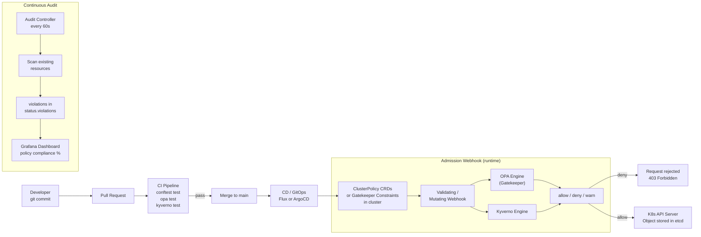

# 14 · Policy as Code — OPA & Kyverno

<h1>14 · Policy as Code — <em>OPA & Kyverno</em></h1>
Shift compliance left — enforce security, cost control, and governance as Kubernetes admission policies, not post-incident runbooks.

## Roadmap — your learning path

#### What is Policy-as-Code?
Treat compliance rules like application code — versioned, tested, reviewed, deployed. Stop writing post-incident runbooks and start failing fast at admission time.

#### Rego Language Fundamentals
OPA's declarative, logic-based policy language. Learn packages, rules, input documents, `deny`, `allow`, and set comprehensions from zero.

#### OPA Gatekeeper
ConstraintTemplate + Constraint two-step model. Webhook installation, audit mode, enforcement actions: `deny` / `warn` / `dryrun`.

#### OPA Advanced Patterns
Complex Rego (joins, comprehensions, aggregates), mutation policies, Conftest in CI, OPA bundle distribution from S3.

#### Kyverno Basics
Native Kubernetes policies as CRDs — no Rego needed. Validate, Mutate, Generate, and VerifyImage policy types.

#### Kyverno Advanced
JMESPath context variables, `kyverno test` with test suites, PolicyExceptions, Chainsaw e2e testing framework.

#### Policy Testing
Unit test with `opa test`, integration test with `kyverno test`, pipeline gate with `conftest`. Test-driven policy development.

#### 10 Policy Projects
Baseline security suite, cost controls, naming conventions, network policy automation, image supply chain, multi-tenancy, compliance mapping, GitOps pipeline, custom webhook, governance framework.

---

## Architecture — how policies flow from Git to cluster

---

## OPA vs Kyverno — choose your weapon

| | OPA / Gatekeeper | Kyverno |
|---|---|---|
| **Policy language** | Rego (logic-based, Datalog-inspired) | YAML / JMESPath (K8s-native) |
| **Installation** | Helm chart, separate control plane | Helm chart, K8s-native CRDs |
| **Policy CRDs** | `ConstraintTemplate` + `Constraint` | `ClusterPolicy` / `Policy` |
| **Mutation** | `AssignImage`, `Assign`, `AssignMetadata` | `patchStrategicMerge`, `patchesJson6902` |
| **Image verification** | External (manual webhook) | Built-in `verifyImages` + cosign |
| **Resource generation** | Not natively supported | `generate` rule type built-in |
| **Testing** | `opa test`, `conftest` | `kyverno test`, Chainsaw |
| **Learning curve** | Steeper (Rego is unique) | Gentler (YAML-first) |
| **Ecosystem** | Gatekeeper Policy Library, Conftest | Kyverno Policy Library, Chainsaw |
| **Use when** | Complex cross-resource logic, multi-system (Terraform, Helm CI) | K8s-only, faster onboarding, image signing |

---

## Policy categories

| Category | Examples | Tool preference |
|---|---|---|
| **Security** | No privileged pods, no root containers, read-only root FS | Both — OPA for complexity |
| **Cost control** | Require CPU/memory limits, deny oversized requests | Kyverno (mutate defaults) |
| **Compliance** | CIS Benchmark controls, PCI-DSS, SOC2 controls | OPA (audit mode + reports) |
| **Networking** | Require NetworkPolicy, deny host networking | Kyverno (generate companion resources) |
| **Naming conventions** | Namespace pattern `<team>-<env>-<app>`, label taxonomy | Either |
| **Image supply chain** | Registry allowlist, no `:latest`, cosign signatures | Kyverno (verifyImages built-in) |
| **Multi-tenancy** | ResourceQuota per team, cross-namespace restrictions | Both |

---

## Module pages

| Page | Content |
|---|---|
| [01 — OPA Foundations](01-opa-foundations.md) | Rego language from zero, Gatekeeper install, ConstraintTemplate pattern, audit mode, testing |
| [02 — OPA Kubernetes](02-opa-kubernetes.md) | Policy library: required labels, resource limits, privileged prevention, registry allowlist, external data |
| [03 — OPA Advanced](03-opa-advanced.md) | Complex Rego, mutation, Conftest in CI, bundle server |
| [04 — Kyverno Foundations](04-kyverno-foundations.md) | Architecture, validate, mutate, generate, verifyImages |
| [05 — Kyverno Advanced](05-kyverno-advanced.md) | JMESPath, kyverno test, PolicyExceptions, Chainsaw |
| [06 — Policy Projects](06-policy-projects.md) | 10 hands-on projects from beginner to expert |
| [commands.md](commands.md) | Quick-reference command cheatsheet |
