<!-- markdownlint-disable MD033 MD041 -->
<div align="center">

```
   ____             ___              _                          _              _          _      
  |  _ \  _____   _/ _ \ _ __  ___  | |    ___  __ _ _ __ _ __ (_)_ __   __ _ | |    __ _| |__   
  | | | |/ _ \ \ / / | | | '_ \/ __| | |   / _ \/ _` | '__| '_ \| | '_ \ / _` || |   / _` | '_ \  
  | |_| |  __/\ V /| |_| | |_) \__ \ | |__|  __/ (_| | |  | | | | | | | | (_| || |__| (_| | |_) | 
  |____/ \___| \_/  \___/| .__/|___/ |_____\___|\__,_|_|  |_| |_|_|_| |_|\__, ||_____\__,_|_.__/  
                         |_|                                             |___/                    
```

# DevOps Learning Lab

[](./01-linux)
[](./02-docker)
[](./03-kubernetes-core)
[](./06-helm)
[](./09-terraform)
[](./LICENSE)

</div>

---

## Mission

Learn-by-doing DevOps repo — **Linux -> Docker -> Kubernetes -> Helm -> Monitoring -> Security -> Terraform**. Each folder is a self-contained module with theory, runnable labs, and a checkpoint exercise. Progress sequentially or jump in anywhere.

## Learning Journey

```mermaid
flowchart LR
    A[01 Linux] --> B[02 Docker]
    B --> C[03 K8s Core]
    C --> D[04 K8s Strategies]
    D --> E[05 K8s Advanced]
    E --> F[06 Helm]
    F --> G[07 Monitoring]
    G --> H[08 Security]
    H --> I[09 Terraform]
    I --> J[10 Projects]
    style A fill:#FCC624,stroke:#333,color:#000
    style B fill:#2496ED,stroke:#333,color:#fff
    style C fill:#326CE5,stroke:#333,color:#fff
    style D fill:#326CE5,stroke:#333,color:#fff
    style E fill:#326CE5,stroke:#333,color:#fff
    style F fill:#0F1689,stroke:#333,color:#fff
    style G fill:#E6522C,stroke:#333,color:#fff
    style H fill:#C0392B,stroke:#333,color:#fff
    style I fill:#7B42BC,stroke:#333,color:#fff
    style J fill:#27AE60,stroke:#333,color:#fff
```



## Folder Index

| # | Folder | Topic | Skill Level | Est. Hours |
|---|--------|-------|-------------|-----------|
| 01 | [`01-linux`](./01-linux) | Linux fundamentals, bash, systemd, networking | Beginner | 12 |
| 02 | [`02-docker`](./02-docker) | Containers, images, Compose, registries | Beginner | 10 |
| 03 | [`03-kubernetes-core`](./03-kubernetes-core) | Pods, Deployments, Services, ConfigMaps | Intermediate | 16 |
| 04 | [`04-kubernetes-strategies`](./04-kubernetes-strategies) | Rolling, blue/green, canary, GitOps | Intermediate | 12 |
| 05 | [`05-kubernetes-advanced`](./05-kubernetes-advanced) | Operators, CRDs, HPA/VPA, networking | Advanced | 18 |
| 06 | [`06-helm`](./06-helm) | Charts, templating, releases, repos | Intermediate | 8 |
| 07 | [`07-monitoring`](./07-monitoring) | Prometheus, Grafana, Loki, OpenTelemetry | Intermediate | 12 |
| 08 | [`08-security`](./08-security) | RBAC, NetworkPolicy, Pod Security, secrets | Advanced | 10 |
| 09 | [`09-terraform`](./09-terraform) | IaC, modules, state, providers | Intermediate | 14 |
| 10 | [`10-projects`](./10-projects) | End-to-end capstone projects | Advanced | 20+ |

**Total: ~130 hours of structured learning**

## How to Use This Repo

```bash
# 1. Clone the repo
git clone https://github.com/<your-org>/Devops-learning.git
cd Devops-learning

# 2. Pick a folder (start at 01-linux if new)
cd 01-linux

# 3. Read its README and follow the labs in order
$EDITOR README.md

# 4. Run the labs in your local environment
#    Each lab is self-contained with setup + teardown
```

## Prerequisites

Install the core toolchain for your OS before starting module 02.

### macOS (Homebrew)

```bash
brew install --cask docker
brew install kind minikube kubectl helm terraform
```

### Linux (Debian/Ubuntu)

```bash
# Docker
curl -fsSL https://get.docker.com | sh
# kubectl
curl -LO "https://dl.k8s.io/release/$(curl -L -s https://dl.k8s.io/release/stable.txt)/bin/linux/amd64/kubectl"
sudo install -o root -g root -m 0755 kubectl /usr/local/bin/kubectl
# kind
go install sigs.k8s.io/kind@latest
# minikube
curl -LO https://storage.googleapis.com/minikube/releases/latest/minikube-linux-amd64
sudo install minikube-linux-amd64 /usr/local/bin/minikube
# helm
curl https://raw.githubusercontent.com/helm/helm/main/scripts/get-helm-3 | bash
# terraform
sudo apt-get install -y gnupg software-properties-common
wget -O- https://apt.releases.hashicorp.com/gpg | sudo gpg --dearmor -o /usr/share/keyrings/hashicorp-archive-keyring.gpg
echo "deb [signed-by=/usr/share/keyrings/hashicorp-archive-keyring.gpg] https://apt.releases.hashicorp.com $(lsb_release -cs) main" | sudo tee /etc/apt/sources.list.d/hashicorp.list
sudo apt update && sudo apt install terraform
```

### Windows (winget / Chocolatey)

```powershell
winget install -e --id Docker.DockerDesktop
winget install -e --id Kubernetes.kubectl
winget install -e --id Helm.Helm
winget install -e --id Hashicorp.Terraform
choco install kind minikube
```

### Verify

```bash
docker --version && kubectl version --client && helm version && terraform version && kind --version
```

## Documentation Site

This repo publishes a full docs site via **MkDocs Material** at `https://<your-org>.github.io/Devops-learning/`.

Build locally:

```bash
pip install -r requirements.txt
mkdocs serve     # http://localhost:8000
mkdocs build     # static output to ./site
```

## Contributing

PRs welcome. See [CONTRIBUTING.md](./CONTRIBUTING.md) for the lab format and folder convention. TL;DR: add labs as numbered subfolders, include a Mermaid diagram for any concept over 50 LOC, and keep examples runnable in kind/minikube.

## License

[MIT](./LICENSE) (c) 2026 DevOps Learning Lab Contributors.
