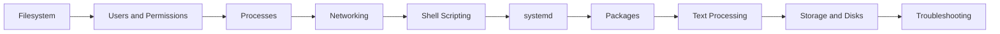

---
hide:
  - toc
---

# Linux Foundations

<div class="hero hero--linux" markdown>

## The OS every container, pod, and pipeline runs on

Linux is the substrate of modern infra. Master the filesystem, the process tree, the network stack, and the shell, and every layer above (Docker, Kubernetes, Helm, observability) suddenly stops feeling like magic. This track is hands-on, terminal-first, and tuned for SREs who need to debug at 2am.

[Start the labs](#start) · [Quick reference](#quick-reference) · [Pickup state](#pickup)

</div>

## :material-map-marker-path: Roadmap



## :material-grid: Modules { #start }

<div class="grid cards" markdown>

-   :material-folder-outline:{ .lg .middle } **01 — Filesystem**

    ---

    FHS layout, inodes, mounts, links, and how to navigate without getting lost.

    [:octicons-arrow-right-24: Open module](../01-linux/01-filesystem/README.md)

-   :material-folder-outline:{ .lg .middle } **02 — Users and Permissions**

    ---

    UID/GID model, sudo, ACLs, capabilities, SUID traps.

    [:octicons-arrow-right-24: Open module](../01-linux/02-users-permissions/README.md)

-   :material-folder-outline:{ .lg .middle } **03 — Processes**

    ---

    PID tree, signals, cgroups, namespaces — the foundation of containers.

    [:octicons-arrow-right-24: Open module](../01-linux/03-processes/README.md)

-   :material-folder-outline:{ .lg .middle } **04 — Networking**

    ---

    Interfaces, routes, iptables/nftables, DNS, sockets, packet capture.

    [:octicons-arrow-right-24: Open module](../01-linux/04-networking/README.md)

-   :material-folder-outline:{ .lg .middle } **05 — Shell Scripting**

    ---

    Bash patterns, trap, set -euo pipefail, robust automation.

    [:octicons-arrow-right-24: Open module](../01-linux/05-shell-scripting/README.md)

-   :material-folder-outline:{ .lg .middle } **06 — systemd**

    ---

    Units, targets, timers, journald — the modern init system.

    [:octicons-arrow-right-24: Open module](../01-linux/06-systemd/README.md)

-   :material-folder-outline:{ .lg .middle } **07 — Package Management**

    ---

    apt, dnf, rpm, dpkg — install, pin, audit, build.

    [:octicons-arrow-right-24: Open module](../01-linux/07-package-management/README.md)

-   :material-folder-outline:{ .lg .middle } **08 — Text Processing**

    ---

    grep, sed, awk, jq, cut — slice logs and JSON like a surgeon.

    [:octicons-arrow-right-24: Open module](../01-linux/08-text-processing/README.md)

-   :material-folder-outline:{ .lg .middle } **09 — Storage and Disks**

    ---

    LVM, mounts, filesystems, quotas, performance tuning.

    [:octicons-arrow-right-24: Open module](../01-linux/09-storage-disks/README.md)

-   :material-folder-outline:{ .lg .middle } **10 — Troubleshooting**

    ---

    The on-call playbook: load, memory, disk, network, latency.

    [:octicons-arrow-right-24: Open module](../01-linux/10-troubleshooting/README.md)

</div>

## :material-flash: Quick reference { #quick-reference }

=== ":material-magnify: I need to find something"

    ```bash
    find / -name "*.conf" -type f 2>/dev/null
    grep -rni "error" /var/log
    locate nginx.conf
    which kubectl && readlink -f $(which kubectl)
    ```

=== ":material-chart-line: I need to see what's running"

    ```bash
    ps auxf
    top -c        # or htop
    systemctl list-units --type=service --state=running
    ss -tulnp
    ```

=== ":material-lan: I need network info"

    ```bash
    ip a; ip r
    ss -tulnp
    dig +short example.com
    curl -v https://example.com
    tcpdump -ni any port 443
    ```

=== ":material-harddisk: I need disk info"

    ```bash
    df -hT
    du -sh /var/* | sort -h
    lsblk -f
    iostat -xz 1
    ```

## :material-bookmark-outline: Pickup state { #pickup }

Each subfolder ships a `commands.md` for fast resumption. Drop into any folder, scan it, dive deeper as needed.

## :material-link: Cross-references

- Earlier: [Docs home](index.md)
- Next: [Docker](02-docker.md)
- Deep dive: [Interview prep — Linux section](../09-interview-prep/01-linux/README.md)
