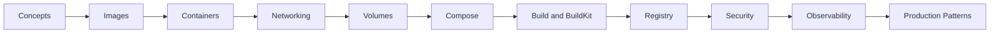

---
hide:
  - toc
---

# Docker Mastery

<div class="hero hero--docker" markdown>

## Containers without the cargo cult

Docker is the unit of deployment for the modern stack. This track goes from `docker run` to multi-stage builds, BuildKit, rootless daemons, image signing, and production patterns that survive a real workload. No copy-paste Dockerfiles — you'll understand every layer.

[Start the labs](#start) · [Quick reference](#quick-reference) · [Pickup state](#pickup)

</div>

## :material-map-marker-path: Roadmap



## :material-grid: Modules { #start }

<div class="grid cards" markdown>

-   :material-folder-outline:{ .lg .middle } **01 — Concepts**

    ---

    Namespaces, cgroups, OCI runtime — what a container actually is.

    [:octicons-arrow-right-24: Open module](../02-docker/01-concepts/README.md)

-   :material-folder-outline:{ .lg .middle } **02 — Images**

    ---

    Layers, manifests, digests, tags, base image hygiene.

    [:octicons-arrow-right-24: Open module](../02-docker/02-images/README.md)

-   :material-folder-outline:{ .lg .middle } **03 — Containers**

    ---

    Lifecycle, exec, logs, restart policies, init.

    [:octicons-arrow-right-24: Open module](../02-docker/03-containers/README.md)

-   :material-folder-outline:{ .lg .middle } **04 — Networking**

    ---

    Bridge, host, overlay, macvlan, DNS, port publishing.

    [:octicons-arrow-right-24: Open module](../02-docker/04-networking/README.md)

-   :material-folder-outline:{ .lg .middle } **05 — Volumes**

    ---

    Bind mounts, named volumes, tmpfs, drivers, backup patterns.

    [:octicons-arrow-right-24: Open module](../02-docker/05-volumes/README.md)

-   :material-folder-outline:{ .lg .middle } **06 — Compose**

    ---

    Multi-service local stacks, profiles, healthchecks, depends_on.

    [:octicons-arrow-right-24: Open module](../02-docker/06-compose/README.md)

-   :material-folder-outline:{ .lg .middle } **07 — Build and BuildKit**

    ---

    Multi-stage, cache mounts, secrets, cross-arch with buildx.

    [:octicons-arrow-right-24: Open module](../02-docker/07-build-and-buildkit/README.md)

-   :material-folder-outline:{ .lg .middle } **08 — Registry**

    ---

    Push/pull, private registries, signing with cosign, SBOMs.

    [:octicons-arrow-right-24: Open module](../02-docker/08-registry/README.md)

-   :material-folder-outline:{ .lg .middle } **09 — Security**

    ---

    Rootless, capabilities, seccomp, AppArmor, image scanning.

    [:octicons-arrow-right-24: Open module](../02-docker/09-security/README.md)

-   :material-folder-outline:{ .lg .middle } **10 — Observability**

    ---

    Logs, stats, events, OpenTelemetry sidecars.

    [:octicons-arrow-right-24: Open module](../02-docker/10-observability/README.md)

-   :material-folder-outline:{ .lg .middle } **11 — Production Patterns**

    ---

    Read-only roots, distroless, healthchecks, graceful shutdown, PID 1.

    [:octicons-arrow-right-24: Open module](../02-docker/11-production-patterns/README.md)

</div>

## :material-flash: Quick reference { #quick-reference }

=== ":material-cube: I just need to run something"

    ```bash
    docker run --rm -it --name dev -p 8080:80 nginx:alpine
    docker exec -it dev sh
    docker logs -f dev
    docker stop dev
    ```

=== ":material-hammer-wrench: I need to build an image"

    ```bash
    docker build -t myapp:dev --target prod .
    docker buildx build --platform linux/amd64,linux/arm64 -t myapp:multi --push .
    docker history myapp:dev
    ```

=== ":material-broom: I need to clean up"

    ```bash
    docker ps -a
    docker system df
    docker system prune -af --volumes
    docker image prune -af
    ```

=== ":material-shield-check: I need to inspect or scan"

    ```bash
    docker inspect myapp:dev | jq .
    docker scout cves myapp:dev
    docker sbom myapp:dev
    ```

## :material-bookmark-outline: Pickup state { #pickup }

Each subfolder ships a `commands.md` for fast resumption. Drop into any folder, scan it, dive deeper as needed.

## :material-link: Cross-references

- Earlier: [Linux](01-linux.md)
- Next: [Kubernetes](03-kubernetes.md)
- Deep dive: [Interview prep — Docker section](../09-interview-prep/02-docker/README.md)
