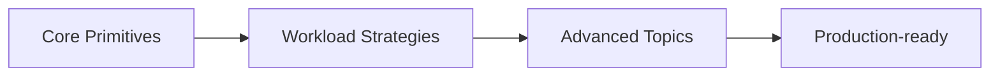

---
hide:
  - toc
---

# Kubernetes

<div class="hero hero--k8s" markdown>

## The control plane that runs the world

Kubernetes is not a container orchestrator — it's a declarative API for compute, networking, and storage. This track is grouped into three arcs: core primitives (the building blocks), strategies (how to actually run workloads), and advanced (the parts that separate operators from users).

[Start the labs](#start) · [Quick reference](#quick-reference) · [Pickup state](#pickup)

</div>

## :material-map-marker-path: Roadmap

<!-- mermaid:rendered -->
<p align="center"></p>

<details><summary>Mermaid source</summary>



</details>

## :material-grid: Modules { #start }

<div class="grid cards" markdown>

-   :material-folder-outline:{ .lg .middle } **01 — Core**

    ---

    The 14 primitives that make up Kubernetes: Pods, Deployments, Services, Ingress, ConfigMaps, Secrets, Volumes, PVCs, StatefulSets, DaemonSets, Jobs, CronJobs, Namespaces, RBAC.

    [:octicons-arrow-right-24: Open module](../03-kubernetes/01-core/README.md)

-   :material-folder-outline:{ .lg .middle } **02 — Strategies**

    ---

    9 deployment and operations strategies: rolling, blue/green, canary, A/B, autoscaling (HPA/VPA/KEDA), pod disruption budgets, affinity, taints/tolerations, multi-tenancy.

    [:octicons-arrow-right-24: Open module](../03-kubernetes/02-strategies/README.md)

-   :material-folder-outline:{ .lg .middle } **03 — Advanced**

    ---

    11 deep topics: CRDs, operators, admission controllers, scheduler tuning, networking (CNI/Cilium), service mesh, multi-cluster, GitOps, policy (OPA/Kyverno), backup/DR, capacity planning.

    [:octicons-arrow-right-24: Open module](../03-kubernetes/03-advanced/README.md)

</div>

## :material-flash: Quick reference { #quick-reference }

=== ":material-eye: I need to see what's happening"

    ```bash
    kubectl get pods -A -o wide
    kubectl describe pod <pod> -n <ns>
    kubectl logs -f <pod> -n <ns> --previous
    kubectl get events -A --sort-by=.lastTimestamp
    ```

=== ":material-bug: I need to debug a pod"

    ```bash
    kubectl exec -it <pod> -n <ns> -- sh
    kubectl debug <pod> -n <ns> -it --image=busybox --target=<container>
    kubectl port-forward svc/<svc> 8080:80 -n <ns>
    kubectl get pod <pod> -n <ns> -o yaml | less
    ```

=== ":material-deploy: I need to deploy or roll back"

    ```bash
    kubectl apply -f manifest.yaml
    kubectl rollout status deploy/<name> -n <ns>
    kubectl rollout undo deploy/<name> -n <ns>
    kubectl scale deploy/<name> --replicas=5 -n <ns>
    ```

=== ":material-shield-key: I need RBAC or context info"

    ```bash
    kubectl config get-contexts
    kubectl auth can-i list pods -n <ns>
    kubectl get clusterrolebindings -o wide
    kubectl get sa -A
    ```

## :material-bookmark-outline: Pickup state { #pickup }

Each subfolder ships a `commands.md` for fast resumption. Drop into any folder, scan it, dive deeper as needed.

## :material-link: Cross-references

- Earlier: [Docker](02-docker.md)
- Next: [Helm](04-helm.md)
- Deep dive: [Interview prep — Kubernetes section](../09-interview-prep/03-kubernetes/README.md)
