---
hide:
  - toc
---

# Helm

<div class="hero hero--helm" markdown>

## The package manager Kubernetes deserved

Helm turns a sprawling pile of YAML into versioned, parameterized, reusable releases. This track walks from your first chart to umbrella charts, library charts, hooks, tests, OCI registries, and full GitOps with Helmfile + Argo CD. By the end you'll author charts you'd actually ship.

[Start the labs](#start) · [Quick reference](#quick-reference) · [Pickup state](#pickup)

</div>

## :material-map-marker-path: Roadmap

```mermaid
flowchart LR
    A[Concepts] --> B[Chart Anatomy]
    B --> C[Templating]
    C --> D[Values and Schemas]
    D --> E[Dependencies]
    E --> F[Hooks and Tests]
    F --> G[Library Charts]
    G --> H[Releases and Upgrades]
    H --> I[OCI Registries]
    I --> J[Security and Signing]
    J --> K[Helmfile]
    K --> L[Argo CD GitOps]
```



## :material-grid: Modules { #start }

<div class="grid cards" markdown>

-   :material-folder-outline:{ .lg .middle } **01 — Concepts**

    ---

    What Helm is, why it exists, the release model, Helm 3 architecture.

    [:octicons-arrow-right-24: Open module](../04-helm/01-concepts/README.md)

-   :material-folder-outline:{ .lg .middle } **02 — Chart Anatomy**

    ---

    Chart.yaml, templates/, values.yaml, _helpers.tpl, NOTES.txt.

    [:octicons-arrow-right-24: Open module](../04-helm/02-chart-anatomy/README.md)

-   :material-folder-outline:{ .lg .middle } **03 — Templating**

    ---

    Go templates, sprig functions, control flow, named templates.

    [:octicons-arrow-right-24: Open module](../04-helm/03-templating/README.md)

-   :material-folder-outline:{ .lg .middle } **04 — Values and Schemas**

    ---

    values.schema.json, layered overrides, secrets injection.

    [:octicons-arrow-right-24: Open module](../04-helm/04-values-and-schemas/README.md)

-   :material-folder-outline:{ .lg .middle } **05 — Dependencies**

    ---

    Subcharts, conditions, aliases, umbrella patterns.

    [:octicons-arrow-right-24: Open module](../04-helm/05-dependencies/README.md)

-   :material-folder-outline:{ .lg .middle } **06 — Hooks and Tests**

    ---

    pre-install, post-upgrade, helm test, weight ordering.

    [:octicons-arrow-right-24: Open module](../04-helm/06-hooks-and-tests/README.md)

-   :material-folder-outline:{ .lg .middle } **07 — Library Charts**

    ---

    Reusable template libraries, no rendered output, shared helpers.

    [:octicons-arrow-right-24: Open module](../04-helm/07-library-charts/README.md)

-   :material-folder-outline:{ .lg .middle } **08 — Releases and Upgrades**

    ---

    History, rollback, atomic upgrades, force, three-way merge.

    [:octicons-arrow-right-24: Open module](../04-helm/08-releases-and-upgrades/README.md)

-   :material-folder-outline:{ .lg .middle } **09 — OCI Registries**

    ---

    Push/pull charts as OCI artifacts, cosign, Harbor, ECR, GHCR.

    [:octicons-arrow-right-24: Open module](../04-helm/09-oci-registries/README.md)

-   :material-folder-outline:{ .lg .middle } **10 — Security and Signing**

    ---

    Provenance files, signing keys, SBOMs, supply-chain hardening.

    [:octicons-arrow-right-24: Open module](../04-helm/10-security-and-signing/README.md)

-   :material-folder-outline:{ .lg .middle } **11 — Helmfile**

    ---

    Declarative multi-release orchestration, environments, layering.

    [:octicons-arrow-right-24: Open module](../04-helm/11-helmfile/README.md)

-   :material-folder-outline:{ .lg .middle } **12 — Helmfile and Argo CD**

    ---

    GitOps with Argo CD ApplicationSets, Helm value sources, sync waves.

    [:octicons-arrow-right-24: Open module](../04-helm/12-helmfile-and-argocd/README.md)

</div>

## :material-flash: Quick reference { #quick-reference }

=== ":material-package-variant: I need to install or upgrade"

    ```bash
    helm repo add bitnami https://charts.bitnami.com/bitnami
    helm repo update
    helm install myrel bitnami/nginx -n web --create-namespace
    helm upgrade --install myrel bitnami/nginx -n web -f values.yaml
    ```

=== ":material-magnify: I need to inspect a chart or release"

    ```bash
    helm list -A
    helm history myrel -n web
    helm get values myrel -n web
    helm get manifest myrel -n web
    helm show values bitnami/nginx
    ```

=== ":material-test-tube: I need to debug templates"

    ```bash
    helm template myrel ./mychart -f values.yaml --debug
    helm lint ./mychart
    helm install myrel ./mychart --dry-run --debug
    helm test myrel -n web
    ```

=== ":material-cloud-upload: I need OCI registry ops"

    ```bash
    helm package ./mychart
    helm push mychart-0.1.0.tgz oci://ghcr.io/org/charts
    helm pull oci://ghcr.io/org/charts/mychart --version 0.1.0
    ```

## :material-bookmark-outline: Pickup state { #pickup }

Each subfolder ships a `commands.md` for fast resumption. Drop into any folder, scan it, dive deeper as needed.

## :material-link: Cross-references

- Earlier: [Kubernetes](03-kubernetes.md)
- Next: [Monitoring](05-monitoring.md)
- Deep dive: [Interview prep — Helm section](../09-interview-prep/04-helm/README.md)
