---
hide:
  - toc
---

# Monitoring and Observability

<div class="hero hero--monitoring" markdown>

## You can't fix what you can't see

Observability is not three dashboards — it's the discipline of asking arbitrary questions about your system at runtime and getting fast answers. This track covers the three pillars (metrics, logs, traces), the modern stack (Prometheus, Loki, Tempo, Grafana, OpenTelemetry), SLOs, alerting that doesn't burn out the on-call, and the cardinality and cost traps everyone hits.

[Start the labs](#start) · [Quick reference](#quick-reference) · [Pickup state](#pickup)

</div>

## :material-map-marker-path: Roadmap

```mermaid
flowchart LR
    A[Three Pillars] --> B[Metrics with Prometheus]
    B --> C[Logs with Loki]
    C --> D[Traces with Tempo]
    D --> E[OpenTelemetry]
    E --> F[Grafana Dashboards]
    F --> G[Alerting]
    G --> H[SLOs and Error Budgets]
    H --> I[Incident Response]
    I --> J[Cost and Cardinality]
```



## :material-grid: Modules { #start }

<div class="grid cards" markdown>

-   :material-folder-outline:{ .lg .middle } **01 — Three Pillars**

    ---

    Metrics, logs, traces — what each is good at, where they overlap.

    [:octicons-arrow-right-24: Open module](../05-monitoring/01-three-pillars/README.md)

-   :material-folder-outline:{ .lg .middle } **02 — Metrics with Prometheus**

    ---

    Scrape model, PromQL, recording rules, federation, remote write.

    [:octicons-arrow-right-24: Open module](../05-monitoring/02-metrics-prometheus/README.md)

-   :material-folder-outline:{ .lg .middle } **03 — Logs with Loki**

    ---

    Label-based indexing, LogQL, Promtail/Alloy, retention.

    [:octicons-arrow-right-24: Open module](../05-monitoring/03-logs-loki/README.md)

-   :material-folder-outline:{ .lg .middle } **04 — Traces with Tempo**

    ---

    Span model, sampling, exemplars, trace-to-logs correlation.

    [:octicons-arrow-right-24: Open module](../05-monitoring/04-traces-tempo/README.md)

-   :material-folder-outline:{ .lg .middle } **05 — OpenTelemetry**

    ---

    SDK, collector, processors, exporters, semantic conventions.

    [:octicons-arrow-right-24: Open module](../05-monitoring/05-opentelemetry/README.md)

-   :material-folder-outline:{ .lg .middle } **06 — Grafana Dashboards**

    ---

    Variables, panels, transforms, dashboards-as-code.

    [:octicons-arrow-right-24: Open module](../05-monitoring/06-grafana-dashboards/README.md)

-   :material-folder-outline:{ .lg .middle } **07 — Alerting**

    ---

    Alertmanager, routes, silences, multi-burn-rate alerts.

    [:octicons-arrow-right-24: Open module](../05-monitoring/07-alerting/README.md)

-   :material-folder-outline:{ .lg .middle } **08 — SLOs and Error Budgets**

    ---

    SLI definition, SLO targets, error budget policy, burn rates.

    [:octicons-arrow-right-24: Open module](../05-monitoring/08-slos-and-error-budgets/README.md)

-   :material-folder-outline:{ .lg .middle } **09 — Incident Response**

    ---

    On-call runbooks, postmortems, blameless culture, MTTR.

    [:octicons-arrow-right-24: Open module](../05-monitoring/09-incident-response/README.md)

-   :material-folder-outline:{ .lg .middle } **10 — Cost and Cardinality**

    ---

    The cardinality bomb, retention tiers, sampling, downsampling.

    [:octicons-arrow-right-24: Open module](../05-monitoring/10-cost-and-cardinality/README.md)

</div>

## :material-flash: Quick reference { #quick-reference }

=== ":material-chart-line: PromQL essentials"

    ```promql
    rate(http_requests_total{job="api"}[5m])
    sum by (status) (rate(http_requests_total[5m]))
    histogram_quantile(0.95, sum by (le) (rate(http_request_duration_seconds_bucket[5m])))
    (1 - rate(node_cpu_seconds_total{mode="idle"}[5m])) * 100
    ```

=== ":material-text-search: LogQL essentials"

    ```logql
    {namespace="prod", app="api"} |= "error"
    {namespace="prod"} | json | status >= 500
    sum by (level) (rate({app="api"}[5m]))
    {app="api"} |~ "(?i)timeout|refused"
    ```

=== ":material-bell-alert: Alert rule pattern"

    ```yaml
    - alert: HighErrorRate
      expr: |
        sum(rate(http_requests_total{status=~"5.."}[5m]))
        / sum(rate(http_requests_total[5m])) > 0.02
      for: 10m
      labels: { severity: page }
      annotations:
        summary: "5xx rate above 2% for 10m"
    ```

=== ":material-target: SLO math"

    ```text
    Target: 99.9% over 30d
    Budget: 0.1% of 30d = 43m 12s of allowed badness
    Burn rate alert: short window 1h burns >14.4x = page
    ```

## :material-bookmark-outline: Pickup state { #pickup }

Each subfolder ships a `commands.md` for fast resumption. Drop into any folder, scan it, dive deeper as needed.

## :material-link: Cross-references

- Earlier: [Helm](04-helm.md)
- Next: Continue to the next track in the docs index
- Deep dive: [Interview prep — Monitoring section](../09-interview-prep/05-monitoring/README.md)
