---
hide:
  - toc
---

# 06 — Security

<div class="hero hero--security" markdown>

## Lock it down. Prove it. Sleep at night.

Security in modern infrastructure is layered: identity, network, workload, supply chain, data, and audit. This module walks every layer with hands-on labs — RBAC drills, network policy enforcement, image signing, runtime detection, secrets management, and compliance scanning — wired into a real cluster from day one.

[Start the labs](#start) · [Quick reference](#quick-reference) · [Pickup state](#pickup)

</div>

## :material-map-marker-path: Roadmap

```mermaid
flowchart LR
    A[01 RBAC Deep Dive] --> B[02 Pod Security]
    B --> C[03 Network Policies]
    C --> D[04 Secrets Management]
    D --> E[05 Image Signing]
    E --> F[06 Supply Chain]
    F --> G[07 Runtime Security]
    G --> H[08 Admission Control]
    H --> I[09 Audit Logging]
    I --> J[10 Zero Trust]
    J --> K[11 Threat Modeling]
    K --> L[12 Compliance]
    classDef sec fill:#fef2f2,stroke:#b91c1c,color:#1f2330,rx:8,ry:8;
    class A,B,C,D,E,F,G,H,I,J,K,L sec;
```

<!-- mermaid:rendered -->
<p align="center"></p>

<details><summary>Mermaid source</summary>



</details>

## :material-grid: Modules { #start }

<div class="grid cards" markdown>

-   :material-account-key:{ .lg .middle } **01 — RBAC Deep Dive**

    ---

    Roles, ClusterRoles, bindings, aggregation, impersonation, audit.

    [:octicons-arrow-right-24: Open module](../06-security/01-rbac-deep-dive/README.md)

-   :material-shield-account:{ .lg .middle } **02 — Pod Security**

    ---

    PSA labels, restricted profile, seccomp, AppArmor, capabilities.

    [:octicons-arrow-right-24: Open module](../06-security/02-pod-security/README.md)

-   :material-lan-disconnect:{ .lg .middle } **03 — Network Policies**

    ---

    Default deny, namespace isolation, egress control, Cilium L7.

    [:octicons-arrow-right-24: Open module](../06-security/03-network-policies/README.md)

-   :material-key-variant:{ .lg .middle } **04 — Secrets Management**

    ---

    Sealed Secrets, External Secrets, Vault, KMS envelope encryption.

    [:octicons-arrow-right-24: Open module](../06-security/04-secrets-management/README.md)

-   :material-certificate:{ .lg .middle } **05 — Image Signing**

    ---

    Cosign, keyless signing, policy enforcement with policy-controller.

    [:octicons-arrow-right-24: Open module](../06-security/05-image-signing/README.md)

-   :material-source-branch-check:{ .lg .middle } **06 — Supply Chain**

    ---

    SLSA levels, SBOMs with Syft, vulnerability scanning with Grype/Trivy.

    [:octicons-arrow-right-24: Open module](../06-security/06-supply-chain/README.md)

-   :material-radar:{ .lg .middle } **07 — Runtime Security**

    ---

    Falco, Tetragon, syscall monitoring, behavioral baselines.

    [:octicons-arrow-right-24: Open module](../06-security/07-runtime-security/README.md)

-   :material-gavel:{ .lg .middle } **08 — Admission Control**

    ---

    OPA Gatekeeper, Kyverno, ValidatingAdmissionPolicy (CEL).

    [:octicons-arrow-right-24: Open module](../06-security/08-admission-control/README.md)

-   :material-file-document-check:{ .lg .middle } **09 — Audit Logging**

    ---

    Kubernetes audit policies, log forwarding, anomaly detection.

    [:octicons-arrow-right-24: Open module](../06-security/09-audit-logging/README.md)

-   :material-shield-lock:{ .lg .middle } **10 — Zero Trust**

    ---

    SPIFFE/SPIRE, mTLS everywhere, identity-aware proxies.

    [:octicons-arrow-right-24: Open module](../06-security/10-zero-trust/README.md)

-   :material-target:{ .lg .middle } **11 — Threat Modeling**

    ---

    STRIDE, attack trees, kube-hunter, kube-bench, threat matrices.

    [:octicons-arrow-right-24: Open module](../06-security/11-threat-modeling/README.md)

-   :material-clipboard-check:{ .lg .middle } **12 — Compliance**

    ---

    CIS Benchmarks, NIST 800-53, PCI-DSS, SOC2 evidence collection.

    [:octicons-arrow-right-24: Open module](../06-security/12-compliance/README.md)

</div>

## :material-flash: Quick reference { #quick-reference }

=== ":material-account-key: RBAC"

    ```bash
    kubectl auth can-i --list --as=system:serviceaccount:default:app
    kubectl auth can-i create pods --namespace=prod
    kubectl get clusterrolebindings -o wide | grep cluster-admin
    ```

=== ":material-lan-disconnect: NetworkPolicy"

    ```yaml
    apiVersion: networking.k8s.io/v1
    kind: NetworkPolicy
    metadata: { name: default-deny, namespace: prod }
    spec:
      podSelector: {}
      policyTypes: [Ingress, Egress]
    ```

=== ":material-certificate: Cosign"

    ```bash
    cosign sign --yes ghcr.io/me/app:v1
    cosign verify ghcr.io/me/app:v1 \
      --certificate-identity-regexp='.*@github.com'
    ```

=== ":material-clipboard-check: kube-bench"

    ```bash
    kube-bench run --targets master,node,etcd,policies
    trivy k8s --report summary cluster
    ```

## :material-bookmark-outline: Pickup state { #pickup }

Every subfolder ships a `commands.md`. Drop in, scan, continue.

## :material-link: Cross-references

- Earlier: [05 — Monitoring](05-monitoring.md) (audit logs feed your stack)
- Next: [07 — Terraform](07-terraform.md) (provision IAM and KMS as code)
- Deep dive: [Interview Prep — Kubernetes Internals](09-interview-prep/03-kubernetes-internals/README.md)
