---
hide:
  - toc
---

# 07 — Terraform

<div class="hero hero--terraform" markdown>

## Infrastructure that ships itself.

Terraform is the lingua franca of cloud provisioning. This module covers the full lifecycle: install, providers, state, modules, workspaces, multi-cloud, Kubernetes provisioning, CI/CD pipelines, drift detection, testing, and the patterns real platform teams use to keep hundreds of stacks healthy.

[Start the labs](#start) · [Quick reference](#quick-reference) · [Pickup state](#pickup)

</div>

## :material-map-marker-path: Roadmap

```mermaid
flowchart LR
    A[01 Install] --> B[02 Providers]
    B --> C[03 State]
    C --> D[04 Variables]
    D --> E[05 Modules]
    E --> F[06 Workspaces]
    F --> G[07 Remote Backends]
    G --> H[08 AWS Provider]
    H --> I[09 GCP Provider]
    I --> J[10 K8s Provider]
    J --> K[11 CI/CD]
    K --> L[12 Testing]
    L --> M[13 Drift Detection]
    M --> N[14 Best Practices]
    classDef tf fill:#f5f3ff,stroke:#7c3aed,color:#1f2330,rx:8,ry:8;
    class A,B,C,D,E,F,G,H,I,J,K,L,M,N tf;
```



## :material-grid: Modules { #start }

<div class="grid cards" markdown>

-   :material-download:{ .lg .middle } **01 — Install**

    ---

    tfenv, version pinning, plugin cache, shell completions.

    [:octicons-arrow-right-24: Open module](../07-terraform/01-install/README.md)

-   :material-power-plug:{ .lg .middle } **02 — Providers**

    ---

    Provider blocks, version constraints, aliases, required_providers.

    [:octicons-arrow-right-24: Open module](../07-terraform/02-providers/README.md)

-   :material-database:{ .lg .middle } **03 — State**

    ---

    State file anatomy, locking, import, mv, rm, taint.

    [:octicons-arrow-right-24: Open module](../07-terraform/03-state/README.md)

-   :material-variable:{ .lg .middle } **04 — Variables**

    ---

    Input/output, locals, tfvars, validation, sensitive values.

    [:octicons-arrow-right-24: Open module](../07-terraform/04-variables/README.md)

-   :material-package-variant:{ .lg .middle } **05 — Modules**

    ---

    Module structure, registry, composition, versioning.

    [:octicons-arrow-right-24: Open module](../07-terraform/05-modules/README.md)

-   :material-folder-multiple:{ .lg .middle } **06 — Workspaces**

    ---

    CLI workspaces vs Terragrunt, env separation patterns.

    [:octicons-arrow-right-24: Open module](../07-terraform/06-workspaces/README.md)

-   :material-cloud-upload:{ .lg .middle } **07 — Remote Backends**

    ---

    S3+DynamoDB, GCS, Azure blob, HCP Terraform, encryption.

    [:octicons-arrow-right-24: Open module](../07-terraform/07-remote-backends/README.md)

-   :material-aws:{ .lg .middle } **08 — AWS Provider**

    ---

    VPC, EKS, IAM, RDS, S3 — opinionated production templates.

    [:octicons-arrow-right-24: Open module](../07-terraform/08-aws-provider/README.md)

-   :material-google-cloud:{ .lg .middle } **09 — GCP Provider**

    ---

    GKE Autopilot, IAM, Cloud SQL, VPC Service Controls.

    [:octicons-arrow-right-24: Open module](../07-terraform/09-gcp-provider/README.md)

-   :material-kubernetes:{ .lg .middle } **10 — K8s Provider**

    ---

    helm_release, kubernetes_manifest, namespace bootstrap.

    [:octicons-arrow-right-24: Open module](../07-terraform/10-k8s-provider/README.md)

-   :material-source-pull:{ .lg .middle } **11 — CI/CD**

    ---

    Atlantis, GitHub Actions, plan/apply gating, OIDC auth.

    [:octicons-arrow-right-24: Open module](../07-terraform/11-cicd/README.md)

-   :material-test-tube:{ .lg .middle } **12 — Testing**

    ---

    terraform test, Terratest, OPA/Conftest policy as code.

    [:octicons-arrow-right-24: Open module](../07-terraform/12-testing/README.md)

-   :material-radar:{ .lg .middle } **13 — Drift Detection**

    ---

    Plan diffs in CI, driftctl, refresh-only, reconciliation loops.

    [:octicons-arrow-right-24: Open module](../07-terraform/13-drift-detection/README.md)

-   :material-trophy-award:{ .lg .middle } **14 — Best Practices**

    ---

    Repo layout, naming, blast radius, secret handling, upgrades.

    [:octicons-arrow-right-24: Open module](../07-terraform/14-best-practices/README.md)

</div>

## :material-flash: Quick reference { #quick-reference }

=== ":material-rocket-launch: Bootstrap"

    ```bash
    terraform init -upgrade -backend-config=backend.hcl
    terraform plan -out=tfplan
    terraform apply tfplan
    ```

=== ":material-database: State ops"

    ```bash
    terraform state list
    terraform state mv aws_instance.old aws_instance.new
    terraform import aws_s3_bucket.logs my-logs-bucket
    ```

=== ":material-package-variant: Module pin"

    ```hcl
    module "vpc" {
      source  = "terraform-aws-modules/vpc/aws"
      version = "~> 5.5"
      name    = "prod"
      cidr    = "10.0.0.0/16"
    }
    ```

=== ":material-test-tube: Policy"

    ```bash
    terraform plan -out=tfplan && terraform show -json tfplan > plan.json
    conftest test plan.json --policy ./policies
    ```

## :material-bookmark-outline: Pickup state { #pickup }

Every subfolder ships a `commands.md`. Drop in, scan, continue.

## :material-link: Cross-references

- Earlier: [06 — Security](06-security.md) (provision IAM/KMS the secure way)
- Next: [08 — Projects](08-projects.md) (multi-region Terraform lab)
- Deep dive: [Interview Prep — System Design](09-interview-prep/04-system-design/README.md)
