---
hide:
  - toc
---

# 08 — Projects

<div class="hero hero--projects" markdown>

## Where the theory meets the production cluster.

Eight end-to-end projects that stitch every prior module together. Build a hello-world all the way to a multi-region GitOps platform with progressive delivery, full observability, security hardening, and a chaos game day. Each project ships infra, app code, manifests, and an after-action report template.

[Start the labs](#start) · [Quick reference](#quick-reference) · [Pickup state](#pickup)

</div>

## :material-map-marker-path: Roadmap

```mermaid
flowchart LR
    A[01 Hello World E2E] --> B[02 GitOps ArgoCD]
    B --> C[03 Observability Stack]
    C --> D[04 Progressive Delivery]
    D --> E[05 Multi-Region]
    E --> F[06 Disaster Recovery]
    F --> G[07 Chaos Game Day]
    G --> H[08 Security Hardening]
    classDef p fill:#ecfdf5,stroke:#059669,color:#1f2330,rx:8,ry:8;
    class A,B,C,D,E,F,G,H p;
```

<!-- mermaid:rendered -->
<p align="center"></p>

<details><summary>Mermaid source</summary>



</details>

## :material-grid: Modules { #start }

<div class="grid cards" markdown>

-   :material-rocket-launch:{ .lg .middle } **01 — Hello World End-to-End**

    ---

    Code, container, chart, deploy, expose, monitor — in one sitting.

    [:octicons-arrow-right-24: Open module](../08-projects/01-hello-world-end-to-end/README.md)

-   :material-source-branch-sync:{ .lg .middle } **02 — GitOps with ArgoCD**

    ---

    App-of-apps, sync waves, drift remediation, multi-cluster.

    [:octicons-arrow-right-24: Open module](../08-projects/02-gitops-argocd/README.md)

-   :material-chart-multiline:{ .lg .middle } **03 — Observability Stack**

    ---

    Prometheus + Grafana + Loki + Tempo + OTel collector wiring.

    [:octicons-arrow-right-24: Open module](../08-projects/03-observability-stack/README.md)

-   :material-progress-upload:{ .lg .middle } **04 — Progressive Delivery**

    ---

    Argo Rollouts canary + Flagger blue-green with metric analysis.

    [:octicons-arrow-right-24: Open module](../08-projects/04-progressive-delivery/README.md)

-   :material-earth:{ .lg .middle } **05 — Multi-Region**

    ---

    Active-active across two regions, global LB, data replication.

    [:octicons-arrow-right-24: Open module](../08-projects/05-multi-region/README.md)

-   :material-backup-restore:{ .lg .middle } **06 — Disaster Recovery**

    ---

    Velero backups, RPO/RTO drills, region failover runbook.

    [:octicons-arrow-right-24: Open module](../08-projects/06-disaster-recovery/README.md)

-   :material-skull-outline:{ .lg .middle } **07 — Chaos Game Day**

    ---

    LitmusChaos experiments, hypothesis-driven failure testing.

    [:octicons-arrow-right-24: Open module](../08-projects/07-chaos-game-day/README.md)

-   :material-shield-lock-outline:{ .lg .middle } **08 — Security Hardening Lab**

    ---

    Take a vulnerable cluster to CIS-compliant. Measured before/after.

    [:octicons-arrow-right-24: Open module](../08-projects/08-security-hardening-lab/README.md)

</div>

## :material-flash: Quick reference { #quick-reference }

=== ":material-source-branch-sync: ArgoCD"

    ```bash
    argocd app create hello \
      --repo https://github.com/me/manifests \
      --path apps/hello --dest-namespace default \
      --dest-server https://kubernetes.default.svc --sync-policy auto
    ```

=== ":material-progress-upload: Rollout"

    ```bash
    kubectl argo rollouts get rollout my-app --watch
    kubectl argo rollouts promote my-app
    kubectl argo rollouts abort my-app
    ```

=== ":material-backup-restore: Velero"

    ```bash
    velero backup create prod-daily --include-namespaces prod
    velero restore create --from-backup prod-daily
    ```

=== ":material-skull-outline: Chaos"

    ```bash
    kubectl apply -f chaos/pod-delete.yaml
    kubectl get chaosresult -n litmus
    ```

## :material-bookmark-outline: Pickup state { #pickup }

Every subfolder ships a `commands.md`. Drop in, scan, continue.

## :material-link: Cross-references

- Earlier: [07 — Terraform](07-terraform.md) (provisions the project clusters)
- Next: [09 — Interview Prep](interview-prep.md) (turn projects into stories)
- Deep dive: [Interview Prep — Troubleshooting Scenarios](09-interview-prep/05-troubleshooting-scenarios/README.md)
