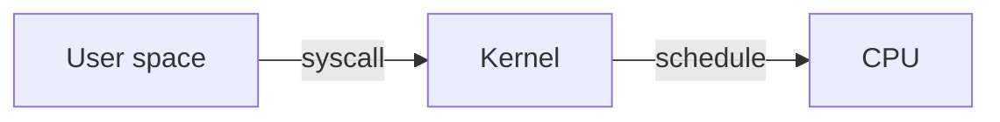

# Module Content Template — "Learn-by-Doing" Pattern

Every module page MUST follow this 6-stage teaching loop for **each concept**:

```
Reason → Thinking → Execution → Simulation → Output → Real-world use case
```

This is the law. Don't deviate. The learner gets predictability; complexity comes from the content, not the layout.

---

## Required page structure

```markdown
# <Module title>

<p class="hero <slug>"><h1>01 · Linux <em>fundamentals</em></h1><p class="tagline">Forty lessons that survive every prod outage at 03:00.</p></p>

## 🗺️ Roadmap — your learning path

<div class="roadmap" markdown>

<div class="stop" data-step="1" markdown>
#### Files & permissions
Own the filesystem before you own the cluster.
</div>

<div class="stop" data-step="2" markdown>
#### Processes & signals
What `kill -9` actually does, and why you shouldn't.
</div>

... (one stop per concept, in learning order)

</div>

---

## 1. <Concept name>

<div class="concept" markdown>

<span class="stage reason">🧭 Reason</span>

**Why this exists.** One paragraph. What real pain does this solve?
Grounded in a scenario: "At 03:00 a pod crashlooped because ..."

<span class="stage thinking">🧠 Thinking</span>

**Mental model.** Diagram first, prose second.



Then 3-5 bullets explaining the diagram.

<span class="stage execution">⚡ Execution</span>

**Run it yourself.**

```bash
# Show the kernel version
uname -r
# List syscalls a process makes
strace -c -p $(pgrep nginx)
```

<span class="stage simulation">🔮 Simulation — what you'll see</span>

<pre class="sim"><code><span class="prompt">$</span> uname -r
<span class="comment"># 6.5.0-26-generic</span>

<span class="prompt">$</span> strace -c -p 1234
<span class="comment"># % time  seconds  usecs/call  calls   syscall</span>
<span class="comment"># ------  -------  ----------  ------  -------</span>
<span class="comment">#  42.3   0.012    120         100     read</span>
</code></pre>

<span class="stage output">✅ Output — state change</span>

<div class="flow" markdown>

<div class="state before" markdown>
##### Before
<span class="diff-del">process blind</span>
no visibility
</div>

<div class="arrow">→</div>

<div class="state during" markdown>
##### During
<span class="diff-mod">strace attached</span>
syscalls streaming
</div>

<div class="arrow">→</div>

<div class="state after" markdown>
##### After
<span class="diff-add">hotspot found</span>
root cause: 100k reads/sec
</div>

</div>

<span class="stage usecase">🌍 Real-world use case</span>

<div class="usecase-card" markdown>
**At Shopify**, a Ruby worker ran at 120% CPU during Black Friday. `strace -c` revealed 400k `stat()` syscalls/sec on a missing cache file. A 2-line patch dropped CPU to 8%.
</div>

</div>

---

## 2. <Next concept>
... (repeat the 6-stage pattern)
```

---

## Hard rules

1. **Every concept uses all 6 stages.** No skipping. Simulation and flow-state diff are non-negotiable — they're what makes this "learn by doing."
2. **Simulation goes BEFORE output.** Learner predicts → then sees actual.
3. **Flow state diff uses `diff-add` / `diff-mod` / `diff-del` spans.** Show state change, not just text.
4. **Mermaid for thinking.** Every thinking stage has one diagram.
5. **Real-world use case is a NAMED company + specific scenario.** "At Netflix, …" "At Stripe, …" not "some companies use this."
6. **Tagline in hero uses Fraunces italic** — wrap in `<em>` tags inside the h1.

---

## Style notes

- **Voice**: active, second-person, opinionated. "You run. You see. You now know."
- **Length**: a module is 8–15 concepts. Each concept fits on one screen.
- **Diagrams**: prefer mermaid `flowchart LR` for flows, `sequenceDiagram` for time-ordered, `stateDiagram-v2` for lifecycles.
- **Commands**: always runnable, always idempotent where possible, always teardown included.
- **Avoid**: generic fonts, solid-color backgrounds, unbordered lists of text. Spatial composition is mandatory.

---

## File layout per module folder

```
XX-<name>/
  README.md              ← the teaching page (this template)
  commands.md            ← quick-reference cheat sheet
  lab-01-<topic>/        ← hands-on lab (optional, for long modules)
    README.md
    <scripts>
```

## Commands.md format

```markdown
# <Module> · commands quick-pick

> One-liners ordered by "what do I need when I'm paged at 03:00."

## Pane 1 — triage
\`\`\`bash
<most-used command>   # what it shows
\`\`\`

## Pane 2 — diagnose
...
```
