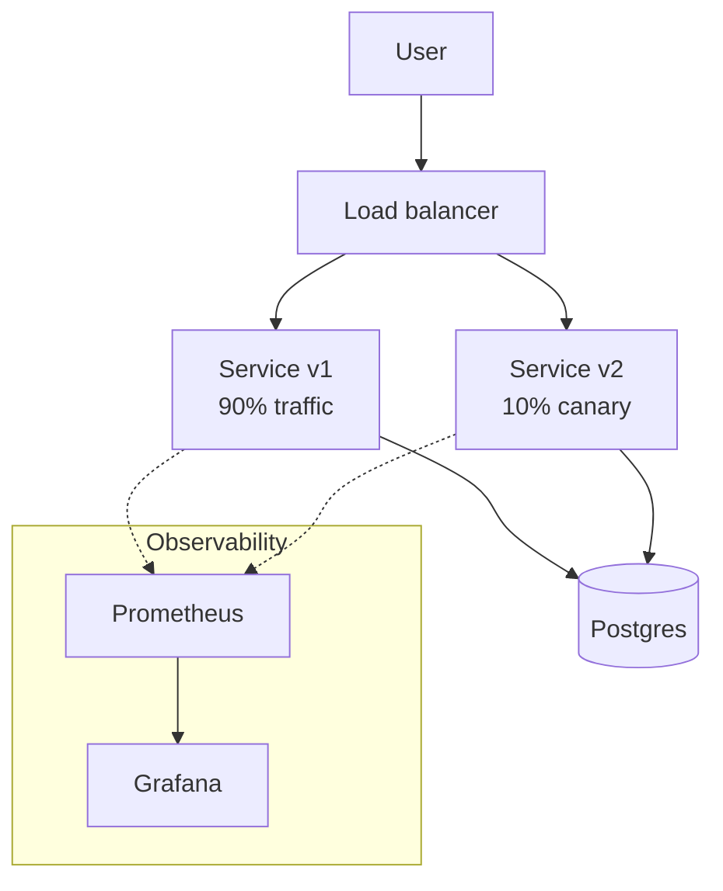

# Project Scaffold Template — Cloud & Stack Learning Projects

Every project ships:
- **Real deployable code** (not pseudocode)
- **A teaching narrative** using the R/T/E/S/O/Use 6-stage pattern
- **A QA engineer's test plan** (what breaks, how you verify it doesn't)
- **Performance benchmarks** (k6 or wrk script + expected baseline)
- **Zero-downtime verification** for any project ≥ P5 (continuous traffic during upgrade)
- **Architecture diagram** (mermaid or SVG) — designed from scratch, not stock

---

## Project folder layout

```
NN-<project-slug>/
  README.md                 ← teaching page (this template)
  architecture.md           ← zoomed-in architecture deep-dive
  app/                      ← application code (simple web service)
  infra/                    ← Dockerfile, k8s manifests, Helm chart, TF, etc.
  tests/
    qa-plan.md              ← QA engineer's test plan
    k6/                     ← perf test scripts
    e2e/                    ← Playwright or curl-based E2E
  docs/
    diagrams/               ← any custom SVGs
  Makefile                  ← make up / make test / make perf / make down
```

---

## README.md template

```markdown
# Project NN · <Title>

<span class="level <beginner|intermediate|advanced|expert>">level</span>
<span class="tag">stack: <docker|k8s|helm|tf|argocd|...></span>

<p class="tagline">One-line promise, e.g., "Ship a static site to prod in ten minutes with a rollback button that actually works."</p>

<div class="metrics" markdown>
<span class="m"><b>Time</b> 60 min</span>
<span class="m"><b>Cost</b> $0 (local) / ~$3 cloud</span>
<span class="m"><b>p95 target</b> &lt; 200ms</span>
<span class="m"><b>Downtime target</b> 0ms</span>
</div>

---

## 🗺️ Roadmap

<div class="roadmap" markdown>
<div class="stop" data-step="1" markdown>
#### Bootstrap
Clone, `make up`, see it running.
</div>
<div class="stop" data-step="2" markdown>
#### Understand the wiring
Architecture tour: request path, data path, control plane.
</div>
<div class="stop" data-step="3" markdown>
#### Break something
Chaos drill: kill a pod / fail a node / poison config.
</div>
<div class="stop" data-step="4" markdown>
#### Verify zero-downtime
Rolling upgrade while traffic flows; p95 stays under target.
</div>
<div class="stop" data-step="5" markdown>
#### QA pass
Run the QA plan, review perf results.
</div>
</div>

---

## 🧭 Reason — why this project exists

Real problem. Named scenario. Example:

> Stripe's payment team needs to deploy a new fraud-detection model without dropping a single inflight transaction. This project simulates that constraint at a small scale.

## 🧠 Thinking — architecture



Key design decisions (3–5 bullets explaining why this shape, not another).

## ⚡ Execution — run it

\`\`\`bash
make up       # bring up the stack
make test     # unit + integration
make perf     # k6 load test
make upgrade  # rolling upgrade with live traffic
make down
\`\`\`

## 🔮 Simulation — what you'll see

<pre class="sim"><code><span class="prompt">$</span> make up
<span class="comment"># ✔ built app:v1</span>
<span class="comment"># ✔ deployed 3/3 replicas</span>
<span class="comment"># ✔ probe: http://localhost:8080/healthz → 200 OK</span>

<span class="prompt">$</span> make perf
<span class="comment"># k6 running for 2m — 500 VUs</span>
<span class="comment"># ✔ http_req_duration p(95)=142ms (target &lt;200ms)</span>
<span class="comment"># ✔ http_req_failed 0.00%</span>
</code></pre>

## ✅ Output — state change during upgrade

<div class="flow" markdown>

<div class="state before" markdown>
##### Before upgrade
<span class="diff-del">v1 × 3 replicas</span>
p95 · 140ms
</div>

<div class="arrow">→</div>

<div class="state during" markdown>
##### During rolling
<span class="diff-mod">v1 × 2 + v2 × 1</span>
p95 · 146ms — traffic stable
</div>

<div class="arrow">→</div>

<div class="state after" markdown>
##### After
<span class="diff-add">v2 × 3 replicas</span>
p95 · 138ms · zero errors
</div>

</div>

## 🌍 Real-world use case

<div class="usecase-card" markdown>
**At Monzo**, every deploy of the authentication service uses this exact pattern — rolling update, readiness-gated, 5-minute pause between batches. A 2022 postmortem credited the pattern with preventing 14 hours of outage.
</div>

---

## 🧪 QA engineer's test plan

See [`tests/qa-plan.md`](./tests/qa-plan.md). Summary:

| Phase | Test | Tool | Pass criteria |
|-------|------|------|---------------|
| Unit | Handler returns 200 for valid input | go test | all green |
| Integration | DB read/write round-trip | testcontainers | round-trip &lt; 20ms |
| E2E | User journey: login → action → logout | Playwright | completes in &lt; 5s |
| Perf | 500 VUs, 2m | k6 | p95 &lt; 200ms, error rate 0% |
| Chaos | Kill 1/3 pods mid-perf | kubectl delete pod | p95 bump &lt; 50ms, no 5xx |
| Upgrade | Rolling v1→v2 while perf runs | kubectl rollout | 0 dropped requests |

## 📈 Performance baseline

k6 script in `tests/k6/smoke.js`. Run locally with `make perf`. Expected:
- RPS: ≥ 2 000
- p50: &lt; 50ms
- p95: &lt; 200ms
- error rate: 0.00%

## 🏗️ Files in this project

| File | Purpose |
|------|---------|
| `app/main.*` | the service |
| `infra/Dockerfile` | multi-stage build, non-root |
| `infra/k8s/*.yaml` | deployment, service, hpa |
| `tests/k6/smoke.js` | 2-minute load test |
| `Makefile` | one-line commands |

---

## Further reading
- Architecture deep-dive: [`architecture.md`](./architecture.md)
- QA plan: [`tests/qa-plan.md`](./tests/qa-plan.md)
```

---

## Hard rules

1. **Every project MUST have a Makefile** with at minimum: `up`, `down`, `test`, `perf`. Projects ≥ P5 also need `upgrade`, `rollback`, `chaos`.
2. **Zero-downtime check** (P5+): the perf test runs concurrently with the upgrade and must report 0% error rate.
3. **Architecture diagram is custom** — drawn as mermaid in this repo, never a screenshot from elsewhere.
4. **QA plan is a real checklist** — someone with no context can execute it.
5. **All commands must be runnable** against local Docker/kind/k3d. Cloud examples are optional and clearly marked.

---

## Project levels

| Level | Hours | Stack breadth | Zero-downtime? |
|-------|------:|---------------|---------------:|
| beginner | 1–2 | single tool | no |
| intermediate | 2–4 | 2–3 tools | rolling only |
| advanced | 4–8 | full platform slice | rolling + canary |
| expert | 8+ | end-to-end with security, observability, chaos | progressive delivery, rollback, DR drill |
