<div class="hero hero--main" markdown>

# DevOps Learning Lab

<p class="tagline">A hands-on, opinionated curriculum for engineers who want to <strong>operate production systems</strong> — not just talk about them. Eight modules. Real labs. Interview-ready.</p>

<a class="cta primary" href="01-linux/README.md">:material-rocket-launch-outline: Start at Linux</a>
<a class="cta secondary" href="#folders">:material-map-outline: Browse topics</a>

</div>

## :material-lightbulb-on-outline: Why this repo

<div class="grid cards" markdown>

-   :material-source-repository:{ .lg .middle } **Open source, opinionated**

    ---

    Every lab is reproducible on a laptop or a real cluster. No vendor lock-in, no "it works on my SaaS."

-   :material-account-tie:{ .lg .middle } **Interview prep wired in**

    ---

    Every module ends with internals, gotchas, and a Q&A bank. Walk into senior interviews with stories, not slides.

-   :material-progress-check:{ .lg .middle } **Production patterns by default**

    ---

    RBAC, network policies, SLOs, supply-chain provenance — all wired in from module one. Not a bolt-on.

</div>

## :material-timeline-clock-outline: Learning path

```mermaid
flowchart LR
    A([01 Linux]) --> B([02 Docker])
    B --> C([03 Kubernetes])
    C --> D([04 Helm])
    D --> E([05 Monitoring])
    E --> F([06 Security])
    F --> G([07 Terraform])
    G --> H([08 Projects])
    H --> I([09 Interview Prep])
    classDef base fill:#eef2ff,stroke:#6366f1,color:#1f2330,rx:10,ry:10;
    classDef cap  fill:#ecfdf5,stroke:#10b981,color:#1f2330,rx:10,ry:10;
    class A,B,C,D,E,F,G base;
    class H,I cap;
```

<!-- mermaid:rendered -->
<p align="center"></p>

<details><summary>Mermaid source</summary>



</details>

## :material-folder-multiple-outline: The Intelligent Learning Navigator { #folders }

<div class="bento-grid">
  <a href="01-linux.md" class="bento-item wide">
    <div class="badge">:material-console:</div>
    <div>
      <h3>01 — Linux Foundations</h3>
      <p>Master the kernel, processes, and networking fundamentals that power the cloud.</p>
    </div>
  </a>
  <a href="02-docker.md" class="bento-item">
    <div class="badge">:material-docker:</div>
    <div>
      <h3>02 — Docker</h3>
      <p>Hardened containerization strategies.</p>
    </div>
  </a>
  <a href="03-kubernetes.md" class="bento-item large">
    <div class="badge">:material-kubernetes:</div>
    <div>
      <h3>03 — Kubernetes Mastery</h3>
      <p>Scale production workloads with advanced controllers, RBAC, and scheduling logic.</p>
    </div>
  </a>
  <a href="04-helm.md" class="bento-item">
    <div class="badge">:material-ship-wheel:</div>
    <div>
      <h3>04 — Helm</h3>
      <p>Packaging & GitOps flows.</p>
    </div>
  </a>
  <a href="06-security.md" class="bento-item wide">
    <div class="badge">:material-shield-lock-outline:</div>
    <div>
      <h3>06 — DevSecOps</h3>
      <p>Zero-trust architectures, supply-chain security, and Falco runtime monitoring.</p>
    </div>
  </a>
  <a href="05-monitoring.md" class="bento-item">
    <div class="badge">:material-chart-line:</div>
    <div>
      <h3>05 — Observability</h3>
      <p>Prometheus & OTel stack.</p>
    </div>
  </a>
  <a href="07-terraform.md" class="bento-item">
    <div class="badge">:material-cloud-cog-outline:</div>
    <div>
      <h3>07 — IaC</h3>
      <p>Multi-cloud Terraform.</p>
    </div>
  </a>
  <a href="08-projects.md" class="bento-item wide">
    <div class="badge">:material-flag-checkered:</div>
    <div>
      <h3>08 — Production Projects</h3>
      <p>Real-world multi-region deployments with ArgoCD and Rollouts.</p>
    </div>
  </a>
  <a href="interview-prep.md" class="bento-item tall">
    <div class="badge">:material-account-tie:</div>
    <div>
      <h3>09 — Interview Drill</h3>
      <p>Internals, system design, and senior troubleshooting drills.</p>
    </div>
  </a>
</div>

## :material-account-group-outline: By role

<div class="grid cards" markdown>

-   :material-seedling:{ .lg .middle } **Beginner**

    ---

    New to ops? Start with **Linux**, then **Docker** basics, then ship the [hello-world end-to-end](08-projects.md) project.

    [:octicons-arrow-right-24: Beginner path](01-linux.md)

-   :material-server-network:{ .lg .middle } **Platform Engineer**

    ---

    Already shipping? Jump to **Kubernetes**, **Helm**, **Terraform**, then [GitOps with ArgoCD](08-projects.md).

    [:octicons-arrow-right-24: Platform path](03-kubernetes.md)

-   :material-clipboard-text-search-outline:{ .lg .middle } **SRE — interview prep**

    ---

    Targeted drill on internals, troubleshooting, system design, and a curated Q&A bank.

    [:octicons-arrow-right-24: Interview prep](interview-prep.md)

</div>

## :material-tools: Tools you'll master

<div class="tool-grid" markdown>
<a class="tool" href="01-linux.md"><span class="badge">:material-console:</span>Linux</a>
<a class="tool" href="02-docker.md"><span class="badge">:material-docker:</span>Docker</a>
<a class="tool" href="03-kubernetes.md"><span class="badge">:material-kubernetes:</span>Kubernetes</a>
<a class="tool" href="04-helm.md"><span class="badge">:material-ship-wheel:</span>Helm</a>
<a class="tool" href="05-monitoring.md"><span class="badge">:material-fire:</span>Prometheus</a>
<a class="tool" href="05-monitoring.md"><span class="badge">:material-chart-areaspline:</span>Grafana</a>
<a class="tool" href="05-monitoring.md"><span class="badge">:material-vector-polyline:</span>OpenTelemetry</a>
<a class="tool" href="06-security.md"><span class="badge">:material-shield-lock-outline:</span>OPA / Kyverno</a>
<a class="tool" href="06-security.md"><span class="badge">:material-certificate:</span>Cosign</a>
<a class="tool" href="07-terraform.md"><span class="badge">:material-cloud-cog-outline:</span>Terraform</a>
<a class="tool" href="08-projects.md"><span class="badge">:material-source-branch-sync:</span>ArgoCD</a>
<a class="tool" href="08-projects.md"><span class="badge">:material-progress-upload:</span>Argo Rollouts</a>
</div>

!!! tip "Local docs build"
    ```bash
    pip install -r requirements.txt
    mkdocs serve   # http://localhost:8000
    ```
