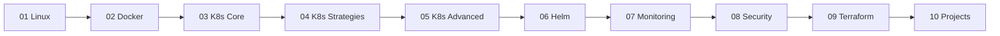

# DevOps Learning Lab

!!! tip "Mission"
    Learn-by-doing DevOps — **Linux -> Docker -> Kubernetes -> Helm -> Monitoring -> Security -> Terraform**.
    Each module is self-contained: theory, runnable labs, and a checkpoint exercise.

## Learning Journey

<!-- mermaid:rendered -->
<p align="center"></p>

<details><summary>Mermaid source</summary>

<!-- mermaid:rendered -->
<p align="center"></p>

<details><summary>Mermaid source</summary>

<!-- mermaid:rendered -->
<p align="center"></p>

<details><summary>Mermaid source</summary>



</details>

</details>

</details>

## Modules

| # | Module | Skill Level | Hours |
|---|--------|-------------|-------|
| 01 | Linux | Beginner | 12 |
| 02 | Docker | Beginner | 10 |
| 03 | Kubernetes Core | Intermediate | 16 |
| 04 | K8s Strategies | Intermediate | 12 |
| 05 | K8s Advanced | Advanced | 18 |
| 06 | Helm | Intermediate | 8 |
| 07 | Monitoring | Intermediate | 12 |
| 08 | Security | Advanced | 10 |
| 09 | Terraform | Intermediate | 14 |
| 10 | Projects | Advanced | 20+ |

!!! note "How to use this site"
    Use the top navigation to jump into any module. Each module page has its own labs, diagrams, and checkpoint exercises.

!!! warning "Prerequisites"
    Install Docker, kubectl, kind/minikube, helm, and terraform before starting module 02. See the [README](https://github.com/example/Devops-learning#prerequisites) for OS-specific install commands.

!!! example "Quick start"
    ```bash
    git clone https://github.com/example/Devops-learning.git
    cd Devops-learning/01-linux
    $EDITOR README.md
    ```

## Local docs build

```bash
pip install -r requirements.txt
mkdocs serve   # http://localhost:8000
```
